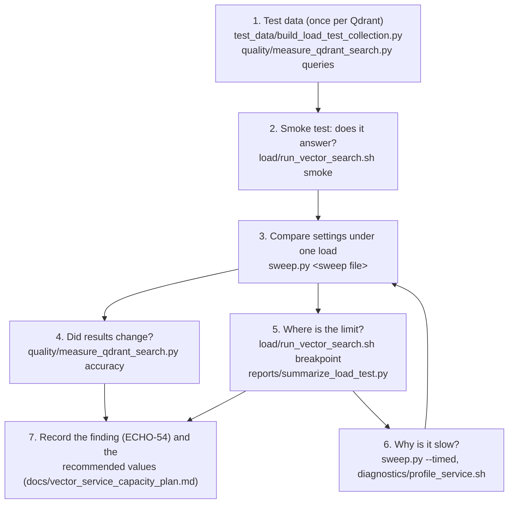
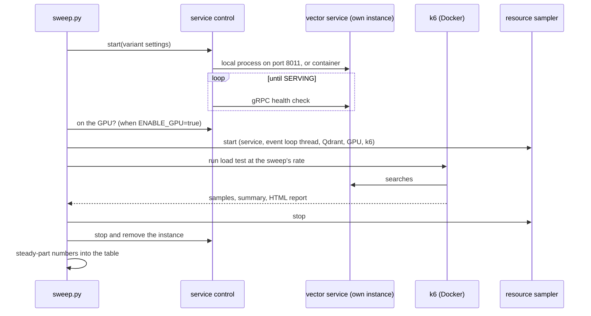

# Vector service benchmarks

Tools that measure how many searches one vector service instance handles, at
what latency and with what search accuracy, and that find where the time
goes. Findings are recorded in Linear ECHO-54; the plan and the recommended
settings are in `docs/vector_service_capacity_plan.md`.

| Folder | Contents |
| -- | -- |
| `environments/` | One settings file per environment (`laptop.toml`, ...) |
| `sweeps/` | Sweep definitions: service settings to compare under one load |
| `sweep.py` | Runs a sweep and writes one comparison table |
| `load/` | k6 load test (`vector_search.js`, `run_load_test.py`, `run_vector_search.sh`), its queries, and `results/` (git-ignored) |
| `test_data/` | Builds the test collections and the query file |
| `quality/` | Search accuracy against exact search, and Qdrant's cost per search |
| `diagnostics/` | Profiling and per-stage timing of a running service |
| `reports/` | Turns a load test's raw samples into per-window numbers |
| `toolkit/` | Shared modules: settings, k6 runner, resource readers, service control, result readers |
| `tests/` | Tests of these tools (`./pants test benchmarks/vector_service/tests::`) |

The tests of the service's own code stay in `tests/`; these tools measure it.

Run the tools from the repository root. Tools that use only `toolkit/` run
with `uv run python -m benchmarks.vector_service.<module>`; tools that import
the service's libraries (`quality/measure_qdrant_search.py`, `test_data/*`,
`diagnostics/run_timed_vector_service.py`) run with `./pants run <file> --`.

## Quick start

The usual order when measuring a change:



1. **Test data**, once per Qdrant: build `anime_load_test` (1.3M points, for
   speed) and `anime_accuracy_test` (real points only, for accuracy), and
   embed the fixed accuracy queries. See "Test data" below.
2. **Smoke test**: 30 s at 1 search/s against a running service.
3. **Sweep**: write a sweep file with the variants to compare (copy
   `sweeps/embed_concurrency.toml`), then
   `uv run python -m benchmarks.vector_service.sweep <file>`. It starts and
   stops the service itself and prints one table.
4. **Accuracy**: any change to Qdrant search settings also gets
   `accuracy` against exact search.
5. **Limit**: a breakpoint test finds the highest rate; read it per window,
   never from the Prometheus percentiles.
6. **Diagnose**: `--timed` shows where searches wait; profiling shows which
   code runs.
7. **Record** every result in ECHO-54, and the chosen values in the plan's
   configuration table.

What a sweep does for each variant:



## Test data

The tools need two collections in the Qdrant they measure. Build them once;
this needs the provider cache in Redis and the text model:

```bash
# Records from the Redis cache only (no network access)
./pants run benchmarks/vector_service/test_data/build_load_test_collection.py -- records
# anime_load_test: every anime, real characters and episodes, topped up with copies to ~1.3M points
./pants run benchmarks/vector_service/test_data/build_load_test_collection.py -- collection
# anime_accuracy_test: real points only (no copies)
./pants run benchmarks/vector_service/test_data/build_load_test_collection.py -- \
  collection --name anime_accuracy_test --characters 0 --episodes 0
# The fixed, embedded query sample for accuracy runs
./pants run benchmarks/vector_service/quality/measure_qdrant_search.py -- queries
```

The collections get the service's collection settings (4 segments). The
numbers in ECHO-54 from finding 20 on were measured after merging segments
through Qdrant's API (`default_segment_number: 2` with `max_segment_size`);
see finding 20 before comparing against them. The load test's query file,
`load/search_queries.json`, is in the repository.

## Environments

The logic is written once; what differs between machines lives in an
environment file (`environments/<name>.toml`, default `laptop`):

| Section | Holds |
| -- | -- |
| `service_target` | Address the load test searches, TLS |
| `service_start` | How the benchmark starts its own service instance: `kind` (`local_process` or `docker`), port, Python, Docker image / network / `docker_cpus` / `docker_memory` / `docker_gpus`, and `env`: service settings every instance gets |
| `qdrant` | Qdrant address, the name of the variable holding its API key (`api_key_env`; the key is never stored in the file), container for CPU readings |
| `collections` | Test collections; `protected` ones (`anime_database`) are refused |
| `resources` | Where to read the service's CPU (`process`, `container`, `none`), Qdrant and GPU on/off, sample interval |
| `k6` | Image, Prometheus address, HTML report, CSV time format |

Any value can be changed for one run with `--set section.field=value`, and a
service setting with `--set service_start.env.NAME=value`. The tools never
edit `docker/*.yml`, `.env` or the service's settings code, and never touch
the dev stack: the benchmark's service is a separate local process on its own
port, or its own container (`echora-bench-vector-service`). The Docker kind
runs the dev image, so rebuild it to benchmark current code.

## Settings sweep

Compares service settings under the same load. For each variant the sweep
starts a service instance with the variant's settings, waits for its gRPC
health check to report SERVING, checks it is on the GPU when `ENABLE_GPU` is
true, runs k6 while sampling resources, and stops the service:

```bash
uv run python -m benchmarks.vector_service.sweep embed_concurrency
uv run python -m benchmarks.vector_service.sweep embed_concurrency --set service_start.kind=docker \
  --set service_start.qdrant_url=http://qdrant:6333 --set service_start.docker_cpus=2 \
  --set service_start.env.ENABLE_GPU=false
```

A sweep file names the load (`[load]`: test type and k6 settings), settings
every variant gets (`[service_env]`), and the variants (`[[variant]]`: name,
their own `service_env`, and optionally `k6_env` to change k6 settings such
as `WITH_PAYLOAD` for that variant). Examples in `sweeps/`:

| Sweep | Compares |
| -- | -- |
| `embed_concurrency` | One against two model calls at a time, at 500/s (ECHO-54 finding 24) |
| `grpc_and_payloads` | gRPC against HTTP to Qdrant, with and without payloads, at 300/s (finding 25) |

The results folder gets `sweep-<name>-<time>.md` with one table (completed searches/s and
p50/p95/p99 over the steady part, failures, drops, service CPU, event loop
thread CPU, Qdrant CPU, GPU) and a `.json` with every variant's settings and
numbers; each variant's service log and k6 console output are kept too. For a
`load` test the steady part runs from 135 s (after the 2 min ramp and 15 s to
settle) to the end of `HOLD`. `--timed` runs each service through
`diagnostics/run_timed_vector_service.py`, so its log shows where searches wait.

## Load test

A k6 test for `VectorSearchService/Search`. Every test type starts searches on
a schedule (arrival rate), whether or not earlier searches have answered. A
test that waits for answers before sending more would slow down with the
service and hide its slowdown.

### Running

Needs Docker; k6 runs from the pinned `grafana/k6` image. The shell script
passes everything to `load/run_load_test.py`, which takes the same arguments
plus `--environment`, `--set`, `--target`, `--service-pid`,
`--service-container` and `--no-resources`.

```bash
benchmarks/vector_service/load/run_vector_search.sh smoke
benchmarks/vector_service/load/run_vector_search.sh load -e RATE=40 -e HOLD=5m
benchmarks/vector_service/load/run_vector_search.sh breakpoint -e RATE=4 -e MAX_RATE=40 -e BREAKPOINT_DURATION=10m
```

Against a service running outside Docker, point at it and name its process:

```bash
SERVICE_PID=$(pgrep -f vector_service.main) \
  benchmarks/vector_service/load/run_vector_search.sh breakpoint -e TARGET=localhost:8001 -e MAX_RATE=200
```

### Running against cloud infrastructure

The same script runs against a deployed service:

```bash
SAMPLE_RESOURCES=false K6_PROMETHEUS_URL=https://<prometheus>/api/v1/write \
  benchmarks/vector_service/load/run_vector_search.sh load -e TARGET=<host>:443 -e TLS=true -e RATE=200
```

- Run k6 on a machine in the same region as the service, so network distance
  is not counted as service latency.
- `SAMPLE_RESOURCES=false` skips the local CPU/GPU sampling; read the
  service's resources from its own monitoring.
- One k6 instance is enough to test one service instance. For the full
  10,000–20,000 searches/s target, split the load across several k6 machines
  (for example with the k6 Kubernetes operator) and keep each machine's CPU
  under ~70%.
- Turn off autoscaling on the service while running a breakpoint test, or the
  test finds the account's limit instead of the instance's.

### Test types

Run them in this order; each assumes the one before passed.

| Type | Load | Length | Answers |
| -- | -- | -- | -- |
| `smoke` | 1 search/s | 30 s | Does the test work and the service answer? |
| `load` | `RATE` | 2 min ramp, `HOLD` (10 min), 1 min down | Does one instance hold its target rate? |
| `stress` | `STRESS_RATE` (RATE × 1.5) | 5 min ramp, `HOLD`, 2 min down | How far does latency degrade above the target? |
| `spike` | `SPIKE_RATE` (RATE × 3) | 30 s jump, 1 min hold, 30 s drop, 2 min recovery | Does it survive a sudden rush and recover? |
| `soak` | `RATE` | `SOAK_HOLD` (3 h) | Does latency or memory creep up over time? |
| `breakpoint` | ramps to `MAX_RATE` (RATE × 10) | `BREAKPOINT_DURATION` (20 min) | Where is the limit? Stops once p95 passes `ABORT_P95_MS` (2 s) or more than 5% of searches fail |

All settings are listed at the top of `vector_search.js`. The most used:

| Setting | Default | Meaning |
| -- | -- | -- |
| `TARGET` | `localhost:8001` | Service address |
| `RATE` | 20 | Searches/s one instance should sustain |
| `P95_MS` | not set | Fail the run when p95 exceeds this |
| `QUERY_MIX` | `40,40,20` | Weights of short, title and long queries |
| `UNIQUE` | `false` | Append a counter to every query, so no cache can answer it |
| `WITH_PAYLOAD` | `true` | `false` asks for IDs and scores only |

### Queries

`search_queries.json` holds real queries in three kinds, since query length
drives embedding cost: short tag phrases, titles, and synopsis sentences.
Rebuild it with `uv run python benchmarks/vector_service/test_data/build_load_test_queries.py`.

### Results

- Summary per run in `benchmarks/vector_service/load/results/<run_id>.json`, with latency per query kind.
- k6's HTML report with time-series graphs in `<run_id>-report.html`.
- CPU and memory of the service and of k6, GPU use, Qdrant's CPU and the
  service's event loop (main) thread CPU in `<run_id>-resources.csv`. If k6's
  CPU is near its limit, k6 is the bottleneck, not the service.
- Every sample in `benchmarks/vector_service/load/results/<run_id>-samples.csv.gz`. For completed
  searches and latency per 20 s window (the way to read a breakpoint test):

  ```bash
  uv run python -m benchmarks.vector_service.reports.summarize_load_test <run_id>
  ```

- Live in Prometheus as `k6_*` metrics, tagged with `run_id` and `test_type`,
  next to the service's own metrics. The latency percentiles there
  (`k6_grpc_req_duration_p95` and the others) cover every search since the run
  started, not the last few seconds, so late in a ramp they read low. Use the
  summary script for latency at a given rate.

## Profiling the service

`profile_service.sh` holds a steady rate with the `load` test and, once the
ramp is over, records 25 s of py-spy samples from the service process:

```bash
SERVICE_PID=<pid> benchmarks/vector_service/diagnostics/profile_service.sh 150 localhost:8001
```

The service must run outside Docker so py-spy can attach to it. Options after
the target go to k6 (for example `-e WITH_PAYLOAD=false`). The profile is
written as folded stacks to `benchmarks/vector_service/load/results/profile-<rate>-<time>.txt`;
open it in speedscope.app, or summarize it by thread and area of the code:

```bash
uv run python -m benchmarks.vector_service.diagnostics.summarize_profile \
  benchmarks/vector_service/load/results/profile-<rate>-<time>.txt
```

py-spy's non-blocking mode drops samples under load, so its busy
percentages read low; the split between areas is still usable. The load
runner's resource CSV has the exact CPU of the service's event loop thread.
`RAMP_SECONDS` and `SETTLE_SECONDS` change when profiling starts.

## Where searches wait

`benchmarks/vector_service/diagnostics/run_timed_vector_service.py` runs the service with timing around
each stage and prints, every 10 s, how long searches wait for the model and
for Qdrant, each batch call's duration and size, and event loop lag. Run it
outside Docker with the service's usual environment variables, then load it
with the `load` test at a steady rate. It wraps the service's own functions,
so it is for diagnosis only.

## Search accuracy and Qdrant cost

Changes to Qdrant's search settings can change results, so each one is
measured for accuracy as well as speed with `benchmarks/vector_service/quality/measure_qdrant_search.py`:

```bash
./pants run benchmarks/vector_service/quality/measure_qdrant_search.py -- queries
./pants run benchmarks/vector_service/quality/measure_qdrant_search.py -- accuracy today rescore ef512_rescore
./pants run benchmarks/vector_service/quality/measure_qdrant_search.py -- cost today rescore --environment laptop
```

- `queries` embeds a fixed sample of `search_queries.json` (327 queries) once,
  into `data/search_quality/queries.json`. It needs the text model; the other
  steps do not.
- `accuracy` scores each setting against an exact search with ranx: recall@10
  and NDCG@10, for the dense vector alone and for the service's hybrid query,
  overall and per query kind. Run it against a collection of real points
  (default `anime_accuracy_test`); the noisy copies in `anime_load_test` lower
  recall on their own.
- `cost` runs the hybrid query in batches of 32, 4 in flight, and reports
  Qdrant's time per query, queries/s and, for a local Qdrant container, its CPU
  per query.
- The settings are named in `SEARCH_SETTINGS` at the top of the script.
- With `--environment`, Qdrant's address, key, collections and container come
  from that environment (`accuracy` defaults to its accuracy collection,
  `cost` to its load collection); without it, from `QDRANT_URL` and
  `QDRANT_API_KEY`. Protected collections are refused either way.
- `--batch-size` (32), `--in-flight` (4, cost only), and for `queries`
  `--sample-size` (150) and `--seed` (54) change the defaults.
- `--candidates` sets how many candidates each hybrid branch fetches (100, as
  the service does).

The embedding model's output is checked against FlagEmbedding's own `encode`
by `tests/libs/vector_processing/integration/test_flagembedding_parity.py`
(`./pants test tests/libs/vector_processing/integration::`), since the service
runs the model itself in one pass.
