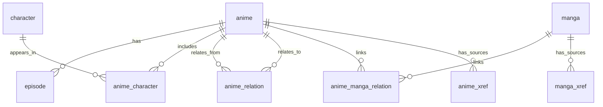

# Database Schema

Complete PostgreSQL schema design for Echora anime database.

> [!info] Design Approach
> **Hybrid strategy**: Normalized core entities and relationships + JSONB for evolving metadata and raw source payloads.

## Entity Relationship Diagram



## Design Principles

### 1. Canonical Identity + Cross-References

Each entity stored **once** with canonical UUID:
- `anime`: 1 row per anime
- `manga`: 1 row per manga
- `character`: 1 row per character
- `episode`: 1 row per episode

External platform identifiers stored separately:
- `anime_xref`: Links to MAL, AniList, Kitsu, AniDB, etc.
- `manga_xref`: Links to manga sources

**Example**: "One Piece" = 1 anime row + multiple xref rows (one per platform)

---

### 2. Unresolved Edge Pattern

**Problem**: When ingesting Anime A, related Anime B may not exist yet.

**Solution**: Store relationship immediately with nullable FK
- Insert edge with `to_anime_id = NULL`
- Store external reference (`to_ref_source`, `to_ref_external_id`)
- Resolve FK later when target is ingested

```sql
-- Unresolved edge
INSERT INTO anime_relation (from_anime_id, relation_type, to_ref_source, to_ref_external_id)
VALUES ('uuid-a', 'SEQUEL', 'anilist', '141902');

-- Later: resolve when Anime B is ingested
UPDATE anime_relation
SET to_anime_id = 'uuid-b'
WHERE to_ref_source = 'anilist' AND to_ref_external_id = '141902';
```

**Benefits**:
- Ingest anime in any order
- Display stub relationships before resolution
- Graph queries use only resolved edges (`WHERE to_anime_id IS NOT NULL`)

---

### 3. Hybrid Data Model

| Strategy | Usage |
|----------|-------|
| **Normalized Tables** | Core entities, relationships, FKs |
| **JSONB Columns** | Evolving metadata, raw source payloads, staff data |

**Why Hybrid?**
- ✅ Integrity for critical relationships (FKs, unique constraints)
- ✅ Flexibility for fast-changing upstream schemas
- ✅ Performance for relationship queries (indexed joins)
- ✅ Easy ingestion without constant migrations

---

## Complete DDL

### Core Entities

```sql
-- ============================================================================
-- Anime
-- ============================================================================

CREATE TABLE anime (
  id uuid PRIMARY KEY,
  title text NOT NULL,
  title_english text,
  title_japanese text,
  type text NOT NULL,              -- TV, Movie, OVA, Special, ONA, Music
  status text NOT NULL,             -- Airing, Finished, Not Yet Aired, Cancelled
  rating text,                      -- G, PG, PG-13, R, R+, Rx
  season text,                      -- Winter, Spring, Summer, Fall
  year int,
  episode_count int NOT NULL DEFAULT 0,
  duration_seconds int,
  nsfw boolean,
  synopsis text,
  background text,
  meta jsonb NOT NULL DEFAULT '{}'::jsonb,
  raw_by_source jsonb NOT NULL DEFAULT '{}'::jsonb,
  created_at timestamptz NOT NULL DEFAULT now(),
  updated_at timestamptz NOT NULL DEFAULT now()
);

-- ============================================================================
-- Manga
-- ============================================================================

CREATE TABLE manga (
  id uuid PRIMARY KEY,
  title text NOT NULL,
  title_english text,
  title_japanese text,
  meta jsonb NOT NULL DEFAULT '{}'::jsonb,
  raw_by_source jsonb NOT NULL DEFAULT '{}'::jsonb,
  created_at timestamptz NOT NULL DEFAULT now(),
  updated_at timestamptz NOT NULL DEFAULT now()
);

-- ============================================================================
-- Episode
-- ============================================================================

CREATE TABLE episode (
  id uuid PRIMARY KEY,
  anime_id uuid NOT NULL REFERENCES anime(id) ON DELETE CASCADE,
  episode_number int NOT NULL,
  season_number int,
  title text NOT NULL,
  title_japanese text,
  title_romaji text,
  synopsis text,
  aired_at timestamptz,
  duration_seconds int,
  filler boolean NOT NULL DEFAULT false,
  recap boolean NOT NULL DEFAULT false,
  score numeric,
  meta jsonb NOT NULL DEFAULT '{}'::jsonb,
  raw_by_source jsonb NOT NULL DEFAULT '{}'::jsonb,
  created_at timestamptz NOT NULL DEFAULT now(),
  updated_at timestamptz NOT NULL DEFAULT now(),
  UNIQUE (anime_id, episode_number)
);

CREATE INDEX episode_anime_id_idx ON episode(anime_id);

-- ============================================================================
-- Character
-- ============================================================================

CREATE TABLE character (
  id uuid PRIMARY KEY,
  name text NOT NULL,
  name_native text,
  description text,
  gender text,
  age text,
  favorites int,
  meta jsonb NOT NULL DEFAULT '{}'::jsonb,
  raw_by_source jsonb NOT NULL DEFAULT '{}'::jsonb,
  created_at timestamptz NOT NULL DEFAULT now(),
  updated_at timestamptz NOT NULL DEFAULT now()
);

CREATE TABLE character_alias (
  character_id uuid NOT NULL REFERENCES character(id) ON DELETE CASCADE,
  alias text NOT NULL,
  PRIMARY KEY (character_id, alias)
);
```

---

### Relationship Tables

```sql
-- ============================================================================
-- Anime ↔ Character (Many-to-Many)
-- ============================================================================

CREATE TABLE anime_character (
  anime_id uuid NOT NULL REFERENCES anime(id) ON DELETE CASCADE,
  character_id uuid NOT NULL REFERENCES character(id) ON DELETE RESTRICT,
  role text,                        -- Main, Supporting, Background
  billing_order int,
  meta jsonb NOT NULL DEFAULT '{}'::jsonb,
  PRIMARY KEY (anime_id, character_id)
);

CREATE INDEX anime_character_character_id_idx ON anime_character(character_id);

-- ============================================================================
-- Anime ↔ Anime (Relationship Graph)
-- ============================================================================

CREATE TABLE anime_relation (
  id bigserial PRIMARY KEY,
  from_anime_id uuid NOT NULL REFERENCES anime(id) ON DELETE CASCADE,
  relation_type text NOT NULL,      -- SEQUEL, PREQUEL, SIDE_STORY, etc.

  -- Resolved FK (nullable until target exists)
  to_anime_id uuid REFERENCES anime(id) ON DELETE CASCADE,

  -- Unresolved reference (from URL parsing)
  to_ref_source text,               -- 'anilist', 'mal', 'kitsu', 'anidb', 'url'
  to_ref_external_id text,          -- '141902'

  -- Compatibility with enriched relation payloads
  to_title text,
  to_urls text[],                   -- Consolidated URL list
  to_anime_type text,               -- MOVIE, TV_SPECIAL, etc.
  source_relation_type text,        -- Original relation type before normalization

  meta jsonb NOT NULL DEFAULT '{}'::jsonb,
  CHECK (from_anime_id <> to_anime_id)
);

-- Unique constraint: no duplicate resolved edges
CREATE UNIQUE INDEX anime_relation_resolved_uniq
  ON anime_relation(from_anime_id, relation_type, to_anime_id)
  WHERE to_anime_id IS NOT NULL;

-- Unique constraint: no duplicate unresolved edges
CREATE UNIQUE INDEX anime_relation_unresolved_uniq
  ON anime_relation(from_anime_id, relation_type, to_ref_source, to_ref_external_id)
  WHERE to_anime_id IS NULL AND to_ref_source IS NOT NULL AND to_ref_external_id IS NOT NULL;

CREATE INDEX anime_relation_from_idx ON anime_relation(from_anime_id);
CREATE INDEX anime_relation_to_idx ON anime_relation(to_anime_id);

-- ============================================================================
-- Anime ↔ Manga (Relationship Graph)
-- ============================================================================

CREATE TABLE anime_manga_relation (
  id bigserial PRIMARY KEY,
  anime_id uuid NOT NULL REFERENCES anime(id) ON DELETE CASCADE,
  relation_type text NOT NULL,

  -- Resolved FK (nullable until target exists)
  manga_id uuid REFERENCES manga(id) ON DELETE CASCADE,

  -- Unresolved reference
  manga_ref_source text,
  manga_ref_external_id text,

  manga_title text,
  manga_urls text[],
  source_relation_type text,

  meta jsonb NOT NULL DEFAULT '{}'::jsonb
);

CREATE UNIQUE INDEX anime_manga_relation_resolved_uniq
  ON anime_manga_relation(anime_id, relation_type, manga_id)
  WHERE manga_id IS NOT NULL;

CREATE UNIQUE INDEX anime_manga_relation_unresolved_uniq
  ON anime_manga_relation(anime_id, relation_type, manga_ref_source, manga_ref_external_id)
  WHERE manga_id IS NULL AND manga_ref_source IS NOT NULL AND manga_ref_external_id IS NOT NULL;

CREATE INDEX anime_manga_relation_anime_idx ON anime_manga_relation(anime_id);
CREATE INDEX anime_manga_relation_manga_idx ON anime_manga_relation(manga_id);
```

---

### Cross-Reference Tables

```sql
-- ============================================================================
-- External ID / URL Crosswalk (for relationship resolution)
-- ============================================================================

CREATE TABLE anime_xref (
  anime_id uuid NOT NULL REFERENCES anime(id) ON DELETE CASCADE,
  source text NOT NULL,             -- 'anilist', 'mal', 'kitsu', 'anidb'
  external_id text NOT NULL,        -- '141902'
  url text,
  meta jsonb NOT NULL DEFAULT '{}'::jsonb,
  PRIMARY KEY (source, external_id),
  UNIQUE (anime_id, source)
);

CREATE INDEX anime_xref_anime_id_idx ON anime_xref(anime_id);

CREATE TABLE manga_xref (
  manga_id uuid NOT NULL REFERENCES manga(id) ON DELETE CASCADE,
  source text NOT NULL,
  external_id text NOT NULL,
  url text,
  meta jsonb NOT NULL DEFAULT '{}'::jsonb,
  PRIMARY KEY (source, external_id),
  UNIQUE (manga_id, source)
);

CREATE INDEX manga_xref_manga_id_idx ON manga_xref(manga_id);
```

> [!tip] Cross-Reference Usage
> - **Relationship Resolution**: Match unresolved edges to canonical IDs
> - **Incremental Ingestion**: Look up existing anime by external ID
> - **Deduplication**: Ensure same external entity = same UUID

---

### Ingestion & Sync Tables

```sql
-- ============================================================================
-- Ingestion State (PostgreSQL-authoritative)
-- ============================================================================

CREATE TABLE ingestion_runs (
  id bigserial PRIMARY KEY,
  artifact_uri text NOT NULL,
  artifact_sha256 text NOT NULL,
  source_commit_sha text,
  started_at timestamptz NOT NULL DEFAULT now(),
  finished_at timestamptz,
  status text NOT NULL DEFAULT 'running',
  error text
);

CREATE TABLE anime_ingestion_state (
  anime_id uuid PRIMARY KEY REFERENCES anime(id) ON DELETE CASCADE,
  last_run_id bigint REFERENCES ingestion_runs(id) ON DELETE SET NULL,
  last_enriched_at timestamptz,
  last_ingested_at timestamptz,
  last_payload_sha256 text,
  ingestion_status text NOT NULL DEFAULT 'pending'
);

-- ============================================================================
-- Qdrant Sync (Outbox Pattern)
-- ============================================================================

CREATE TABLE qdrant_outbox (
  id bigserial PRIMARY KEY,
  entity_type text NOT NULL,        -- 'anime', 'character', 'episode'
  entity_id uuid NOT NULL,
  op text NOT NULL,                 -- 'upsert', 'delete'
  version bigint NOT NULL,
  queued_at timestamptz NOT NULL DEFAULT now(),
  processed_at timestamptz
);

CREATE INDEX qdrant_outbox_pending_idx ON qdrant_outbox(queued_at)
  WHERE processed_at IS NULL;
```

> [!info] Outbox Pattern
> See [[event_driven_architecture#Qdrant Sync]] for sync worker implementation.

---

## Deduplication Strategy

### Exact Deduplication

**Assumption**: Enrichment pipeline assigns stable, canonical UUIDs for all entities.

**Mechanism**:
- `anime_xref` / `manga_xref` enforce `UNIQUE (source, external_id)`
- Same external entity always maps to same UUID

---

### Fuzzy Deduplication (Characters)

**Problem**: Sources without stable IDs, name-only matches, partial records.

**Solution**:
1. Use Qdrant similarity search to find candidate duplicates
2. Confirm via heuristics:
   - Name variants (nicknames, native names)
   - Shared anime overlap
   - Role/language consistency
3. Record canonical merges with redirect tables

**Future**: Add `character_redirect` table for merge history

---

## Update Policy (Incremental Ingestion)

### Auto-Apply (Safe Changes)
- ✅ Status forward transitions (`ONGOING` → `FINISHED`)
- ✅ `episode_count` increases
- ✅ New episodes appended (new `(anime_id, episode_number)` rows)

### Flag for Review
- ⚠️ Title / type / source_material changes
- ⚠️ `episode_count` decreases
- ⚠️ Large missing fields vs prior snapshot

---

## Query Patterns

### Common Relationship Queries

```sql
-- All characters in an anime
SELECT c.* FROM character c
JOIN anime_character ac ON c.id = ac.character_id
WHERE ac.anime_id = $1
ORDER BY ac.billing_order;

-- All anime sharing a character
SELECT a.* FROM anime a
JOIN anime_character ac ON a.id = ac.anime_id
WHERE ac.character_id = $1;

-- Related anime (resolved edges only)
SELECT to_anime.* FROM anime_relation r
JOIN anime to_anime ON r.to_anime_id = to_anime.id
WHERE r.from_anime_id = $1
  AND r.to_anime_id IS NOT NULL
  AND r.relation_type = 'SEQUEL';

-- K-hop traversal (using recursive CTE)
WITH RECURSIVE related AS (
  SELECT to_anime_id, 1 as depth
  FROM anime_relation
  WHERE from_anime_id = $1 AND to_anime_id IS NOT NULL

  UNION

  SELECT r.to_anime_id, related.depth + 1
  FROM anime_relation r
  JOIN related ON r.from_anime_id = related.to_anime_id
  WHERE related.depth < $2 AND r.to_anime_id IS NOT NULL
)
SELECT DISTINCT a.* FROM related
JOIN anime a ON related.to_anime_id = a.id;
```

---

## JSONB Usage Guidelines

### What Goes in `meta`?

**Good candidates**:
- Evolving fields (genres, tags, themes, demographics)
- Staff data (until normalized)
- Images (covers, posters, banners)
- Statistics per platform
- Broadcast schedules
- Streaming info

**Bad candidates** (use relational columns):
- Core identity fields (title, type, status)
- Foreign keys (anime_id, character_id)
- Frequently filtered fields (year, episode_count)

### JSONB Indexing

```sql
-- Index specific JSONB keys for filtering
CREATE INDEX anime_meta_genres_idx ON anime USING GIN ((meta->'genres'));
CREATE INDEX anime_meta_year_idx ON anime ((meta->>'year'));

-- Full-text search on JSONB
CREATE INDEX anime_meta_fulltext_idx ON anime USING GIN (to_tsvector('english', meta::text));
```

> [!warning] JSONB Performance
> Only create JSONB indexes after identifying actual filter patterns. Over-indexing hurts write performance.

---

## Migration Strategy

### Version Control

Use **sqlx migrations** (Rust) or **Alembic** (Python):
- Timestamped migration files
- Up/down migrations
- Version tracking in database

### Schema Evolution

**Adding columns**: Safe, non-breaking
```sql
ALTER TABLE anime ADD COLUMN source_material text;
```

**Adding indexes**: Build concurrently
```sql
CREATE INDEX CONCURRENTLY anime_year_idx ON anime(year);
```

**Modifying JSONB**: No migration needed (schema-less)

---

## Related Documentation

- [[postgres_integration_architecture_decision|PostgreSQL Architecture]] - Service design
- [[event_driven_architecture|Event-Driven Architecture]] - Ingestion & sync patterns
- [[event_schema_specification|Event Schemas]] - Protobuf definitions

---

**Status**: Active | **Last Updated**: 2026-02-16 | **Schema Version**: 1.0
