# Database Schema

Complete PostgreSQL schema design for Echora anime database.

> [!info] Design Approach
> **Hybrid strategy**: Normalized core entities and relationships + JSONB for evolving metadata and raw source payloads.

## Entity Relationship Diagram

```mermaid
erDiagram
  anime ||--o{ episode : "has"
  anime ||--o{ anime_character : "includes"
  character ||--o{ anime_character : "appears in"
  character ||--o{ character_alias : "known as"
  character ||--o{ character_relation : "relates from"
  character ||--o{ character_relation : "relates to (target)"
  character_relation }o--|| character_relation_type : "relation_type"

  anime ||--o{ anime_relation : "relates from"
  anime ||--o{ anime_relation : "relates to (resolved)"

  anime ||--o{ anime_source_material_relation : "adapts from"
  source_material ||--o{ anime_source_material_relation : "source of (resolved)"

  anime ||--o{ anime_image : "has images"
  character ||--o{ character_image : "has images"
  episode ||--o{ episode_image : "has images"

  anime ||--o| anime_broadcast : "has schedule"
  anime ||--o{ anime_hiatus : "has hiatus history"
  episode ||--o{ episode_airing : "airs as"

  anime ||--o{ anime_xref : "identified by"
  source_material ||--o{ source_material_xref : "identified by"
  character ||--o{ character_xref : "identified by"
  episode ||--o{ episode_xref : "identified by"

  anime ||--o{ anime_company : "produced/animated by"
  company ||--o{ anime_company : "associated with"
  company ||--o{ company_xref : "identified by"

  anime ||--|| anime_ingestion_state : "tracks state of"
  ingestion_runs ||--o{ anime_ingestion_state : "recorded in"

  anime }o--|| anime_type : "type"
  anime }o--|| anime_status : "status"
  anime }o--o| anime_rating : "rating"
  anime }o--o| anime_season : "season"
  anime }o--o| source_material_type : "source_material"
  source_material }o--o| source_material_type : "type"
  anime_character }o--o| character_role : "role"
  anime_relation }o--|| anime_relation_type : "relation_type"
  anime_source_material_relation }o--|| source_material_relation_type : "relation_type"
  anime_image }o--|| anime_image_type : "type"
  episode_airing }o--|| episode_version : "version"
  anime_company }o--|| company_role : "role"
  ingestion_runs }o--|| ingestion_run_status : "status"
  anime_ingestion_state }o--|| ingestion_state_status : "ingestion_status"
  qdrant_outbox }o--|| outbox_entity_type : "entity_type"
  qdrant_outbox }o--|| outbox_op : "op"

  graph_edge }o--|| graph_node_type : "from_type"
  graph_edge }o--|| graph_node_type : "to_type"

  anime {
    uuid id PK
    text title
    text type FK
    text status FK
    text rating FK
    text season FK
    text source_material FK
    int year
    text month
    int episode_count
    numeric score_agm
    numeric score_mean
    numeric score_median
  }
  character {
    uuid id PK
    text name
    text eye_color
    text hair_color
  }
  character_relation {
    bigint id PK
    uuid from_character_id FK
    text relation_type FK
    uuid to_character_id FK
  }
  character_relation_type { text value PK }
  episode {
    uuid id PK
    uuid anime_id FK
    int episode_number
    text description
  }
  anime_character {
    uuid anime_id FK
    uuid character_id FK
    text role FK
  }
  anime_relation {
    bigint id PK
    uuid from_anime_id FK
    text relation_type FK
    uuid to_anime_id FK
    text to_ref_source
    text to_ref_external_id
  }
  source_material {
    uuid id PK
    text title
    text type FK
  }
  anime_source_material_relation {
    bigint id PK
    uuid anime_id FK
    text relation_type FK
    uuid source_material_id FK
    text source_material_ref_source
    text source_material_ref_external_id
  }
  anime_xref {
    uuid anime_id FK
    text source
    text external_id
  }
  source_material_xref {
    uuid source_material_id FK
    text source
    text external_id
  }
  character_xref {
    uuid character_id FK
    text source
    text url
  }
  episode_xref {
    uuid episode_id FK
    text source
    text url
  }
  company {
    uuid id PK
    text name
    text description
  }
  company_xref {
    uuid company_id FK
    text source
    text url
  }
  anime_company {
    uuid anime_id FK
    uuid company_id FK
    text role FK
  }
  ingestion_runs {
    bigint id PK
    text status FK
    timestamptz started_at
  }
  anime_ingestion_state {
    uuid anime_id PK
    text ingestion_status FK
  }
  qdrant_outbox {
    bigint id PK
    text entity_type FK
    uuid entity_id
    text op FK
    timestamptz processed_at
  }
  anime_image {
    bigint id PK
    uuid anime_id FK
    text type
    text url
    text source
  }
  character_image {
    bigint id PK
    uuid character_id FK
    text url
    text source
  }
  episode_image {
    bigint id PK
    uuid episode_id FK
    text url
    text source
  }
  anime_broadcast {
    uuid anime_id PK
    text day
    text timezone
    time jp_time
    time sub_time
    time dub_time
    int sub_delay_days
    int dub_delay_days
    timestamptz premiere_jp
    timestamptz premiere_sub
    timestamptz premiere_dub
  }
  anime_hiatus {
    uuid id PK
    uuid anime_id FK
    text reason
    timestamptz hiatus_from
    timestamptz hiatus_until
  }
  episode_airing {
    uuid episode_id FK
    text version
    timestamptz aired_at
    boolean is_delayed
    text delay_reason
  }
  anime_type { text value PK }
  anime_status { text value PK }
  anime_rating { text value PK }
  anime_season { text value PK }
  source_material_type { text value PK }
  character_role { text value PK }
  anime_relation_type { text value PK }
  source_material_relation_type { text value PK }
  ingestion_run_status { text value PK }
  ingestion_state_status { text value PK }
  outbox_op { text value PK }
  outbox_entity_type { text value PK }
  anime_image_type { text value PK }
  episode_version { text value PK }
  company_role { text value PK }
  graph_node_type { text value PK }
  graph_edge {
    uuid from_id FK
    text from_type FK
    uuid to_id FK
    text to_type FK
    text edge_type
  }
```



## Design Principles

### 1. Canonical Identity + Cross-References

Each entity stored **once** with canonical UUID:
- `anime`: 1 row per anime
- `source_material`: 1 row per source work (manga, light novel, visual novel, game, etc.)
- `character`: 1 row per character
- `episode`: 1 row per episode

External platform identifiers stored separately:
- `anime_xref`: Links to MAL, AniList, Kitsu, AniDB, etc.
- `source_material_xref`: Links to original work sources

**Example**: "One Piece" = 1 anime row + multiple xref rows (one per platform)

---

### 2. Unresolved Edge Pattern

**Problem**: When ingesting Anime A, related Anime B may not exist yet.

**Solution**: Store relationship immediately with nullable FK
- Insert edge with `to_anime_id = NULL`
- Store external reference (`to_ref_source`, `to_ref_external_id`)
- Resolve FK later when target is ingested

```sql
-- Unresolved edge
INSERT INTO anime_relation (from_anime_id, relation_type, to_ref_source, to_ref_external_id)
VALUES ('uuid-a', 'SEQUEL', 'anilist', '141902');

-- Later: resolve when Anime B is ingested
UPDATE anime_relation
SET to_anime_id = 'uuid-b'
WHERE to_ref_source = 'anilist' AND to_ref_external_id = '141902';
```

**Benefits**:
- Ingest anime in any order
- Display stub relationships before resolution
- Graph queries use only resolved edges (`WHERE to_anime_id IS NOT NULL`)

---

### 3. Normalization Decisions

| Decision | Rationale |
|----------|-----------|
| **No array columns** (`to_urls`, `original_work_urls` removed) | Arrays violate 4NF — URLs for resolved edges are derived from `anime_xref`/`source_material_xref`; unresolved edges already carry `to_ref_source` + `to_ref_external_id` |
| **No denormalized title/type copies** (`to_title`, `to_anime_type`, `original_work_title` removed) | These were attributes of the target entity, not the relationship — derive via join on resolved FK |
| **Lookup tables instead of CHECK constraints** | Enum-like columns (`type`, `status`, `rating`, `season`, `source_material`, `role`, `op`, `entity_type`, `ingestion_status`, relation types) use dedicated single-column FK tables. This makes all valid values introspectable via SQL, keeps domain changes to one place, and avoids DDL migrations to add/rename values. |
| **`episode_count` kept as denormalized cache** | Computable as `COUNT(episode)`, but retained on `anime` for read performance and Qdrant payload filtering; PostgreSQL Service keeps it in sync on episode insert/delete |
| **No `source_relation_type` column** | Normalization is a hard pre-ingestion gate — every relation type is canonical before it reaches the DB. If a source returns an unknown type, the team decides to add a new value to the `anime_relation_type` / `source_material_relation_type` lookup table (single `INSERT`, no DDL migration) or merge it into an existing one. Nothing raw ever lands in these tables. |
| **`anime_image.type` uses `anime_image_type` lookup table** | Same rationale as all other lookup tables: valid image types (`cover`, `poster`, `banner`, `background`) are introspectable via SQL and extensible without DDL. |
| **`episode_airing.version` uses `episode_version` lookup table** | `'jp'`, `'sub'`, `'dub'` are enum-like — lookup table makes valid values explicit and enforces consistency at the DB level. |
| **`company_xref`-only dedup (URL-first)** | Studio/producer dedup relies solely on URL lookup via `company_xref`. If a source URL matches an existing row, reuse it; otherwise insert a new company. Name-based normalization is deliberately excluded — similar names across sources risk false merges (two distinct companies collapsing into one). Duplicates from name-only entries can be resolved manually if needed. |
| **Hiatus extracted to `anime_hiatus`** | `anime_broadcast` captures the recurring schedule (1:1, static-ish). Hiatus events are independent facts with a temporal dimension — an anime can resume and go on hiatus multiple times. Separate table gives full history; current state = row with `hiatus_until IS NULL`. |
| **`episode.sources` → `episode_xref`** | Same rationale as `character_xref`: episode page URLs are cross-reference data. `episode_xref` follows the same `PRIMARY KEY (source, url)` pattern, enabling lookup of episodes by external ID and consistent deduplication across ingestion runs. |
| **`character.sources` → `character_xref`** | Profile URLs are cross-reference data, not character attributes. Normalizing them into `character_xref` enables O(1) exact deduplication at ingestion time (same lookup-before-insert pattern as `anime_xref`). `PRIMARY KEY (source, url)` where `url` is the canonical profile URL — no slug for numeric-ID sources (MAL/AniList/AniDB), full URL for slug-only sources (AnimePlanet). The `sources` field remains on the Pydantic `Character` model as enrichment output; the ingestion service reads it to populate `character_xref` but does not persist it to JSONB. |
| **`anime.studios` / `anime.producers` → `company` + `company_xref` + `anime_company`** | Studios and producers are shared entities (MAPPA, Bones, Toei) appearing across hundreds of anime — normalizing eliminates duplication and enables relational queries ("all MAPPA anime"). `company_xref` follows the same `PRIMARY KEY (source, url)` dedup pattern. `anime_company.role` distinguishes `'studio'` from `'producer'`. `CompanyEntry.sources` on the Pydantic model is enrichment transport only; the ingestion service upserts into `company`/`company_xref` and inserts into `anime_company` but does not persist these fields to JSONB. |

---

### 4. Hybrid Data Model

| Strategy | Usage |
|----------|-------|
| **Normalized Tables** | Core entities, relationships, FKs |
| **JSONB Columns** | Evolving metadata, raw source payloads, staff data |

**Why Hybrid?**
- ✅ Integrity for critical relationships (FKs, unique constraints)
- ✅ Flexibility for fast-changing upstream schemas
- ✅ Performance for relationship queries (indexed joins)
- ✅ Easy ingestion without constant migrations

---

## Complete DDL

> [!info] PostgreSQL Version Requirement
> This schema requires **PostgreSQL 17+**. `uuidv7()` (time-ordered UUIDs) is used for
> DB-generated primary keys (`company`, `anime_hiatus`). For application-assigned UUIDs
> (all other entities), generate UUIDv7 in the application layer — do not rely on the DB default.

### Lookup Tables

```sql
-- ============================================================================
-- Domain / Lookup Tables (replace CHECK constraints)
-- All enum-like columns reference these single-column FK tables.
-- Values are aligned to the Pydantic enums in libs/common/src/common/models/anime.py
-- ============================================================================

-- 1. Anime type domain
CREATE TABLE anime_type (value text PRIMARY KEY);
INSERT INTO anime_type VALUES
  ('TV'), ('ONA'), ('OVA'), ('SPECIAL'), ('MOVIE'), ('UNKNOWN'), ('MUSIC'), ('PV');

-- 2. Anime status domain
CREATE TABLE anime_status (value text PRIMARY KEY);
INSERT INTO anime_status VALUES
  ('FINISHED'), ('UPCOMING'), ('ONGOING'), ('UNKNOWN');

-- 3. Anime rating domain (full label strings from AnimeRating enum)
CREATE TABLE anime_rating (value text PRIMARY KEY);
INSERT INTO anime_rating VALUES
  ('G - All Ages'),
  ('PG - Children'),
  ('PG-13 - Teens 13 or older'),
  ('R - 17+ (violence & profanity)'),
  ('R+ - Mild Nudity'),
  ('Rx - Hentai');

-- 4. Anime season domain
CREATE TABLE anime_season (value text PRIMARY KEY);
INSERT INTO anime_season VALUES
  ('SPRING'), ('SUMMER'), ('FALL'), ('WINTER');

-- 5. Source material type domain (shared by anime.source_material and source_material.type)
CREATE TABLE source_material_type (value text PRIMARY KEY);
INSERT INTO source_material_type VALUES
  ('MANGA'), ('LIGHT_NOVEL'), ('NOVEL'), ('VISUAL_NOVEL'),
  ('GAME'), ('WEB_MANGA'), ('WEB_NOVEL'), ('OTHER'),
  ('ORIGINAL'), ('MIXED_MEDIA'), ('UNKNOWN');

-- 6. Character role domain
CREATE TABLE character_role (value text PRIMARY KEY);
INSERT INTO character_role VALUES
  ('MAIN'), ('SUPPORTING'), ('BACKGROUND');

-- 7. Anime-to-anime relation type domain
--    NOTE: docs/anime_relationship_and_format_type_mappings.md proposes a richer
--    22-type enum with title case values — that will be adopted here once finalized in anime.py
CREATE TABLE anime_relation_type (value text PRIMARY KEY);
INSERT INTO anime_relation_type VALUES
  ('SEQUEL'), ('PREQUEL'), ('SIDE_STORY'), ('ALTERNATIVE'), ('SUMMARY'),
  ('FULL_STORY'), ('CHARACTER'), ('SPIN_OFF'), ('ADAPTATION'), ('OTHER');

-- 8. Anime-to-original-work relation type domain
CREATE TABLE source_material_relation_type (value text PRIMARY KEY);
INSERT INTO source_material_relation_type VALUES
  ('ADAPTATION'), ('SOURCE'), ('ALTERNATIVE'), ('SPIN_OFF'), ('OTHER');


-- 9. Ingestion run status domain
CREATE TABLE ingestion_run_status (value text PRIMARY KEY);
INSERT INTO ingestion_run_status VALUES
  ('running'), ('success'), ('failed');

-- 10. Anime ingestion state status domain
CREATE TABLE ingestion_state_status (value text PRIMARY KEY);
INSERT INTO ingestion_state_status VALUES
  ('pending'), ('ingested'), ('failed'), ('skipped');

-- 11. Qdrant outbox operation domain
CREATE TABLE outbox_op (value text PRIMARY KEY);
INSERT INTO outbox_op VALUES
  ('upsert'), ('delete');

-- 12. Qdrant outbox entity type domain
CREATE TABLE outbox_entity_type (value text PRIMARY KEY);
INSERT INTO outbox_entity_type VALUES
  ('anime'), ('character'), ('episode');

-- 13. Anime image type domain
CREATE TABLE anime_image_type (value text PRIMARY KEY);
INSERT INTO anime_image_type VALUES
  ('cover'), ('poster'), ('banner'), ('background');

-- 14. Episode version domain
CREATE TABLE episode_version (value text PRIMARY KEY);
INSERT INTO episode_version VALUES
  ('jp'), ('sub'), ('dub');

-- 15. Company role domain
CREATE TABLE company_role (value text PRIMARY KEY);
INSERT INTO company_role VALUES
  ('studio'), ('producer');

-- 16. Character relation type domain
CREATE TABLE character_relation_type (value text PRIMARY KEY);
INSERT INTO character_relation_type VALUES
  ('rivals'), ('siblings'), ('friends'), ('lovers'),
  ('parent_child'), ('mentor_student'), ('enemies'), ('allies');

-- 17. Graph node type domain
--     Used by graph_edge.from_type / graph_edge.to_type to enforce valid entity types.
--     'person' is listed here for future staff/VA tables even though person entity does not exist yet.
CREATE TABLE graph_node_type (value text PRIMARY KEY);
INSERT INTO graph_node_type VALUES
  ('anime'), ('character'), ('source_material'), ('company'), ('person');
```

---

### Core Entities

```sql
-- ============================================================================
-- Anime
-- ============================================================================

CREATE TABLE anime (
  id uuid PRIMARY KEY,
  title text NOT NULL,
  title_english text,
  title_japanese text,
  type text NOT NULL REFERENCES anime_type(value),
  status text NOT NULL REFERENCES anime_status(value),
  rating text REFERENCES anime_rating(value),
  season text REFERENCES anime_season(value),
  source_material text REFERENCES source_material_type(value),
  year int,
  month text,                                  -- premiere month from AnimeSchedule
  episode_count int NOT NULL DEFAULT 0,        -- denormalized cache; kept in sync by PostgreSQL Service
  duration_seconds int,
  nsfw boolean,
  synopsis text,
  background text,
  score_agm numeric,                           -- ScoreCalculations.arithmetic_geometric_mean
  score_mean numeric,                          -- ScoreCalculations.arithmetic_mean
  score_median numeric,                        -- ScoreCalculations.median
  aired_from timestamptz,                      -- series start date (future = upcoming)
  aired_to   timestamptz,                      -- series end date (null = ongoing or upcoming)
  meta jsonb NOT NULL DEFAULT '{}'::jsonb,
  raw_by_source jsonb NOT NULL DEFAULT '{}'::jsonb,
  created_at timestamptz NOT NULL DEFAULT now(),
  updated_at timestamptz NOT NULL DEFAULT now()
) WITH (fillfactor = 80);

-- ============================================================================
-- Original Work (source material: manga, light novel, visual novel, game, etc.)
-- ============================================================================

CREATE TABLE source_material (
  id uuid PRIMARY KEY,
  title text NOT NULL,
  title_english text,
  title_japanese text,
  type text REFERENCES source_material_type(value),
  meta jsonb NOT NULL DEFAULT '{}'::jsonb,
  raw_by_source jsonb NOT NULL DEFAULT '{}'::jsonb,
  created_at timestamptz NOT NULL DEFAULT now(),
  updated_at timestamptz NOT NULL DEFAULT now()
);

-- ============================================================================
-- Episode
-- ============================================================================

CREATE TABLE episode (
  id uuid PRIMARY KEY,
  anime_id uuid NOT NULL REFERENCES anime(id) ON DELETE CASCADE,
  episode_number int NOT NULL,
  season_number int,
  title text NOT NULL,
  title_japanese text,
  title_romaji text,
  synopsis text,
  description text,                            -- episode description from Kitsu (distinct from synopsis)
  aired_at timestamptz,
  duration_seconds int,
  filler boolean NOT NULL DEFAULT false,
  recap boolean NOT NULL DEFAULT false,
  score numeric,
  meta jsonb NOT NULL DEFAULT '{}'::jsonb,
  raw_by_source jsonb NOT NULL DEFAULT '{}'::jsonb,
  created_at timestamptz NOT NULL DEFAULT now(),
  updated_at timestamptz NOT NULL DEFAULT now(),
  UNIQUE (anime_id, episode_number)
);

-- CREATE INDEX episode_anime_id_idx ON episode(anime_id) -- INTENTIONALLY OMITTED:
-- The UNIQUE (anime_id, episode_number) constraint creates a composite index with
-- anime_id as the leftmost column, which PostgreSQL uses for single-column anime_id
-- filter queries. Adding episode_anime_id_idx on top would be redundant.

-- ============================================================================
-- Character
-- ============================================================================

CREATE TABLE character (
  id uuid PRIMARY KEY,
  name text NOT NULL,
  name_native text,
  description text,
  gender text,
  age text,
  eye_color text,
  hair_color text,
  favorites int,
  meta jsonb NOT NULL DEFAULT '{}'::jsonb,
  raw_by_source jsonb NOT NULL DEFAULT '{}'::jsonb,
  created_at timestamptz NOT NULL DEFAULT now(),
  updated_at timestamptz NOT NULL DEFAULT now()
);

CREATE TABLE character_alias (
  character_id uuid NOT NULL REFERENCES character(id) ON DELETE CASCADE,
  alias text NOT NULL,
  PRIMARY KEY (character_id, alias)
);

-- ============================================================================
-- updated_at Trigger (shared by all entity tables)
-- DEFAULT now() only fires on INSERT; this trigger keeps updated_at current on UPDATE.
-- ============================================================================

CREATE OR REPLACE FUNCTION set_updated_at()
RETURNS TRIGGER LANGUAGE plpgsql AS $$
BEGIN
  NEW.updated_at = now();
  RETURN NEW;
END;
$$;

CREATE TRIGGER anime_set_updated_at
  BEFORE UPDATE ON anime
  FOR EACH ROW EXECUTE FUNCTION set_updated_at();

CREATE TRIGGER source_material_set_updated_at
  BEFORE UPDATE ON source_material
  FOR EACH ROW EXECUTE FUNCTION set_updated_at();

CREATE TRIGGER episode_set_updated_at
  BEFORE UPDATE ON episode
  FOR EACH ROW EXECUTE FUNCTION set_updated_at();

CREATE TRIGGER character_set_updated_at
  BEFORE UPDATE ON character
  FOR EACH ROW EXECUTE FUNCTION set_updated_at();

-- ============================================================================
-- JSONB GIN Indexes (meta is queried for genres, tags, themes, demographics, etc.)
-- raw_by_source is a raw audit store — not indexed (not a query target)
-- ============================================================================

CREATE INDEX anime_meta_gin     ON anime     USING GIN (meta);
CREATE INDEX character_meta_gin ON character USING GIN (meta);
CREATE INDEX episode_meta_gin   ON episode   USING GIN (meta);

-- ============================================================================
-- Images
-- ============================================================================

CREATE TABLE anime_image (
  id BIGINT GENERATED ALWAYS AS IDENTITY PRIMARY KEY,
  anime_id uuid NOT NULL REFERENCES anime(id) ON DELETE CASCADE,
  type text NOT NULL REFERENCES anime_image_type(value),
  url text NOT NULL,
  source text,              -- 'anilist', 'mal', 'kitsu'
  UNIQUE (anime_id, url)
);

CREATE INDEX anime_image_anime_id_idx ON anime_image(anime_id);

CREATE TABLE character_image (
  id BIGINT GENERATED ALWAYS AS IDENTITY PRIMARY KEY,
  character_id uuid NOT NULL REFERENCES character(id) ON DELETE CASCADE,
  url text NOT NULL,
  source text,
  UNIQUE (character_id, url)
);

CREATE INDEX character_image_character_id_idx ON character_image(character_id);

CREATE TABLE episode_image (
  id BIGINT GENERATED ALWAYS AS IDENTITY PRIMARY KEY,
  episode_id uuid NOT NULL REFERENCES episode(id) ON DELETE CASCADE,
  url text NOT NULL,
  source text,
  UNIQUE (episode_id, url)
);

CREATE INDEX episode_image_episode_id_idx ON episode_image(episode_id);

-- ============================================================================
-- Broadcast Schedule (anime-level recurring slot + premiere dates)
-- ============================================================================

CREATE TABLE anime_broadcast (
  anime_id          uuid PRIMARY KEY REFERENCES anime(id) ON DELETE CASCADE,

  -- Weekly recurring slot
  day               text,             -- 'Sunday'
  timezone          text,             -- 'Asia/Tokyo'
  jp_time           time,             -- 20:00 JST (original JP slot)
  sub_time          time,             -- 20:30 JST (simulcast sub slot)
  dub_time          time,             -- NULL if no simulcast dub
  sub_delay_days    int,              -- days after JP that sub drops
  dub_delay_days    int,              -- days after JP that dub drops

  -- Per-version premiere dates
  premiere_jp       timestamptz,      -- first JP episode ever
  premiere_sub      timestamptz,      -- first sub episode ever
  premiere_dub      timestamptz       -- first dub episode ever
);

-- ============================================================================
-- Anime Hiatus History
-- ============================================================================

CREATE TABLE anime_hiatus (
  id            uuid PRIMARY KEY DEFAULT uuidv7(),
  anime_id      uuid NOT NULL REFERENCES anime(id) ON DELETE CASCADE,
  reason        text,
  hiatus_from   timestamptz,
  hiatus_until  timestamptz           -- NULL = currently on hiatus
);

CREATE INDEX anime_hiatus_anime_id_idx ON anime_hiatus(anime_id);

-- Fast lookup: "is this anime currently on hiatus?"
CREATE INDEX anime_hiatus_active_idx ON anime_hiatus(anime_id)
  WHERE hiatus_until IS NULL;

-- ============================================================================
-- Episode Airing (per-episode actual times per version)
-- ============================================================================

CREATE TABLE episode_airing (
  episode_id    uuid NOT NULL REFERENCES episode(id) ON DELETE CASCADE,
  version       text NOT NULL REFERENCES episode_version(value),  -- 'jp', 'sub', 'dub'
  aired_at      timestamptz,
  is_delayed    boolean NOT NULL DEFAULT false,
  delay_reason  text,
  PRIMARY KEY (episode_id, version)
);

CREATE INDEX episode_airing_aired_at_idx ON episode_airing(aired_at)
  WHERE aired_at IS NOT NULL;
```

---

### Relationship Tables

```sql
-- ============================================================================
-- Anime ↔ Character (Many-to-Many)
-- ============================================================================

CREATE TABLE anime_character (
  anime_id uuid NOT NULL REFERENCES anime(id) ON DELETE CASCADE,
  character_id uuid NOT NULL REFERENCES character(id) ON DELETE RESTRICT,
  role text REFERENCES character_role(value),
  billing_order int,
  meta jsonb NOT NULL DEFAULT '{}'::jsonb,
  PRIMARY KEY (anime_id, character_id)
);

CREATE INDEX anime_character_character_id_idx ON anime_character(character_id);

-- ============================================================================
-- Anime ↔ Anime (Relationship Graph)
-- ============================================================================

CREATE TABLE anime_relation (
  id BIGINT GENERATED ALWAYS AS IDENTITY PRIMARY KEY,
  from_anime_id uuid NOT NULL REFERENCES anime(id) ON DELETE CASCADE,
  relation_type text NOT NULL REFERENCES anime_relation_type(value),

  -- Resolved FK (nullable until target is ingested)
  to_anime_id uuid REFERENCES anime(id) ON DELETE CASCADE,

  -- Unresolved reference — retained until resolution; lookup via anime_xref
  to_ref_source text,               -- 'anilist', 'mal', 'kitsu', 'anidb'
  to_ref_external_id text,          -- '141902'

  meta jsonb NOT NULL DEFAULT '{}'::jsonb,
  CHECK (from_anime_id <> to_anime_id)
);

-- Unique constraint: no duplicate resolved edges
CREATE UNIQUE INDEX anime_relation_resolved_uniq
  ON anime_relation(from_anime_id, relation_type, to_anime_id)
  WHERE to_anime_id IS NOT NULL;

-- Unique constraint: no duplicate unresolved edges
CREATE UNIQUE INDEX anime_relation_unresolved_uniq
  ON anime_relation(from_anime_id, relation_type, to_ref_source, to_ref_external_id)
  WHERE to_anime_id IS NULL AND to_ref_source IS NOT NULL AND to_ref_external_id IS NOT NULL;

CREATE INDEX anime_relation_from_idx ON anime_relation(from_anime_id);
CREATE INDEX anime_relation_to_idx ON anime_relation(to_anime_id);

-- ============================================================================
-- Anime ↔ Original Work (Relationship Graph)
-- ============================================================================

CREATE TABLE anime_source_material_relation (
  id BIGINT GENERATED ALWAYS AS IDENTITY PRIMARY KEY,
  anime_id uuid NOT NULL REFERENCES anime(id) ON DELETE CASCADE,
  relation_type text NOT NULL REFERENCES source_material_relation_type(value),

  -- Resolved FK (nullable until target is ingested)
  source_material_id uuid REFERENCES source_material(id) ON DELETE CASCADE,

  -- Unresolved reference — retained until resolution; lookup via source_material_xref
  source_material_ref_source text,
  source_material_ref_external_id text,

  meta jsonb NOT NULL DEFAULT '{}'::jsonb
);

CREATE UNIQUE INDEX anime_source_material_relation_resolved_uniq
  ON anime_source_material_relation(anime_id, relation_type, source_material_id)
  WHERE source_material_id IS NOT NULL;

CREATE UNIQUE INDEX anime_source_material_relation_unresolved_uniq
  ON anime_source_material_relation(anime_id, relation_type, source_material_ref_source, source_material_ref_external_id)
  WHERE source_material_id IS NULL AND source_material_ref_source IS NOT NULL AND source_material_ref_external_id IS NOT NULL;

CREATE INDEX anime_source_material_relation_anime_idx ON anime_source_material_relation(anime_id);
CREATE INDEX anime_source_material_relation_work_idx ON anime_source_material_relation(source_material_id);

-- ============================================================================
-- Character ↔ Character (Direct Relationship Graph)
-- ============================================================================

CREATE TABLE character_relation (
  id                  BIGINT GENERATED ALWAYS AS IDENTITY PRIMARY KEY,
  from_character_id   uuid NOT NULL REFERENCES character(id) ON DELETE CASCADE,
  relation_type       text NOT NULL REFERENCES character_relation_type(value),
  to_character_id     uuid NOT NULL REFERENCES character(id) ON DELETE CASCADE,
  meta                jsonb NOT NULL DEFAULT '{}'::jsonb,
  CHECK (from_character_id <> to_character_id)
);

CREATE UNIQUE INDEX character_relation_uniq
  ON character_relation(from_character_id, relation_type, to_character_id);

CREATE INDEX character_relation_from_idx ON character_relation(from_character_id);
CREATE INDEX character_relation_to_idx   ON character_relation(to_character_id);
```

---

### Cross-Reference Tables

```sql
-- ============================================================================
-- External ID / URL Crosswalk (for relationship resolution)
-- ============================================================================

CREATE TABLE anime_xref (
  anime_id uuid NOT NULL REFERENCES anime(id) ON DELETE CASCADE,
  source text NOT NULL,             -- 'anilist', 'mal', 'kitsu', 'anidb'
  external_id text NOT NULL,        -- '141902'
  url text,
  meta jsonb NOT NULL DEFAULT '{}'::jsonb,
  PRIMARY KEY (source, external_id),
  UNIQUE (anime_id, source)
);

CREATE INDEX anime_xref_anime_id_idx ON anime_xref(anime_id);

CREATE TABLE source_material_xref (
  source_material_id uuid NOT NULL REFERENCES source_material(id) ON DELETE CASCADE,
  source text NOT NULL,
  external_id text NOT NULL,
  url text,
  meta jsonb NOT NULL DEFAULT '{}'::jsonb,
  PRIMARY KEY (source, external_id),
  UNIQUE (source_material_id, source)
);

CREATE INDEX source_material_xref_id_idx ON source_material_xref(source_material_id);

CREATE TABLE character_xref (
  character_id  uuid NOT NULL REFERENCES character(id) ON DELETE CASCADE,
  source        text NOT NULL,   -- 'mal', 'anilist', 'anidb', 'anime_planet', etc.
  url           text NOT NULL,   -- canonical profile URL (no slug for numeric-ID sources)
  meta          jsonb NOT NULL DEFAULT '{}'::jsonb,
  PRIMARY KEY (source, url),
  UNIQUE (character_id, source)
);

CREATE INDEX character_xref_character_id_idx ON character_xref(character_id);

CREATE TABLE episode_xref (
  episode_id    uuid NOT NULL REFERENCES episode(id) ON DELETE CASCADE,
  source        text NOT NULL,   -- 'mal', 'kitsu', 'anilist', etc.
  url           text NOT NULL,   -- canonical episode page URL
  meta          jsonb NOT NULL DEFAULT '{}'::jsonb,
  PRIMARY KEY (source, url),
  UNIQUE (episode_id, source)
);

CREATE INDEX episode_xref_episode_id_idx ON episode_xref(episode_id);

-- ============================================================================
-- Company (studios / producers)
-- ============================================================================

CREATE TABLE company (
  id           uuid  PRIMARY KEY DEFAULT uuidv7(),
  name         text  NOT NULL,
  description  text
);

CREATE TABLE company_xref (
  company_id  uuid  NOT NULL REFERENCES company(id) ON DELETE CASCADE,
  source      text  NOT NULL,   -- 'mal', 'anilist', etc.
  url         text  NOT NULL,   -- canonical company page URL
  PRIMARY KEY (source, url),
  UNIQUE (company_id, source)
);

CREATE INDEX company_xref_company_id_idx ON company_xref(company_id);

CREATE TABLE anime_company (
  anime_id    uuid  NOT NULL REFERENCES anime(id) ON DELETE CASCADE,
  company_id  uuid  NOT NULL REFERENCES company(id) ON DELETE RESTRICT,
  role        text  NOT NULL REFERENCES company_role(value),
  PRIMARY KEY (anime_id, company_id, role)
);

CREATE INDEX anime_company_company_id_idx ON anime_company(company_id);

-- ============================================================================
-- Graph Projection Layer (read-optimized unified graph)
-- ============================================================================
-- graph_edge is NOT the source of truth — junction tables remain authoritative.
-- It is a dual-write projection: the PostgreSQL service writes to junction tables
-- AND graph_edge in the same transaction. No triggers; explicit dual-write in Rust.
--
-- All four graph primitives (neighbors, k_hop, path, compare) query graph_edge only.
-- Junction tables are used for CRUD, hydration, and integrity; graph_edge for traversal.
-- See: Database Schema#WIP: Open Graph Query Discussions, points 3 and 4.
-- ============================================================================

CREATE TABLE graph_edge (
  from_id    uuid NOT NULL,
  from_type  text NOT NULL REFERENCES graph_node_type(value),
  to_id      uuid NOT NULL,
  to_type    text NOT NULL REFERENCES graph_node_type(value),
  edge_type  text NOT NULL,
  PRIMARY KEY (from_id, to_id, edge_type)
);

CREATE INDEX graph_edge_from_idx ON graph_edge(from_id, from_type, edge_type);
CREATE INDEX graph_edge_to_idx   ON graph_edge(to_id,   to_type,   edge_type);
```

> [!tip] Cross-Reference Usage
> - **Relationship Resolution**: Match unresolved edges to canonical IDs
> - **Incremental Ingestion**: Look up existing anime by external ID
> - **Deduplication**: Ensure same external entity = same UUID

---

### Ingestion & Sync Tables

```sql
-- ============================================================================
-- Ingestion State (PostgreSQL-authoritative)
-- ============================================================================

CREATE TABLE ingestion_runs (
  id BIGINT GENERATED ALWAYS AS IDENTITY PRIMARY KEY,
  artifact_uri text NOT NULL,
  artifact_sha256 text NOT NULL,
  source_commit_sha text,
  started_at timestamptz NOT NULL DEFAULT now(),
  finished_at timestamptz,
  status text NOT NULL DEFAULT 'running' REFERENCES ingestion_run_status(value),
  error text
);

CREATE TABLE anime_ingestion_state (
  anime_id uuid PRIMARY KEY REFERENCES anime(id) ON DELETE CASCADE,
  last_run_id bigint REFERENCES ingestion_runs(id) ON DELETE SET NULL,
  last_enriched_at timestamptz,
  last_ingested_at timestamptz,
  last_payload_sha256 text,
  ingestion_status text NOT NULL DEFAULT 'pending' REFERENCES ingestion_state_status(value)
);

-- FK column — PostgreSQL does not auto-index FK columns
CREATE INDEX anime_ingestion_state_last_run_id_idx ON anime_ingestion_state(last_run_id);

-- ============================================================================
-- Qdrant Sync (Outbox Pattern)
-- ============================================================================

CREATE TABLE qdrant_outbox (
  id BIGINT GENERATED ALWAYS AS IDENTITY PRIMARY KEY,
  entity_type text NOT NULL REFERENCES outbox_entity_type(value),
  entity_id uuid NOT NULL,
  op text NOT NULL REFERENCES outbox_op(value),
  version bigint NOT NULL,
  queued_at timestamptz NOT NULL DEFAULT now(),
  processed_at timestamptz
);

CREATE INDEX qdrant_outbox_pending_idx ON qdrant_outbox(queued_at)
  WHERE processed_at IS NULL;

-- Deduplication lookup: "is there already a pending entry for entity X?"
CREATE INDEX qdrant_outbox_entity_pending_idx
  ON qdrant_outbox(entity_type, entity_id)
  WHERE processed_at IS NULL;
```

> [!info] Outbox Pattern
> See [[event_driven_architecture#Qdrant Sync]] for sync worker implementation.

---

## Deduplication Strategy

### Exact Deduplication

**Assumption**: Enrichment pipeline assigns stable, canonical UUIDs for all entities.

**Mechanism**:
- `anime_xref` / `source_material_xref` enforce `UNIQUE (source, external_id)`
- Same external entity always maps to same UUID

---

### Fuzzy Deduplication (Characters)

**Problem**: Sources without stable IDs, name-only matches, partial records.

**Solution**:
1. Use Qdrant similarity search to find candidate duplicates
2. Confirm via heuristics:
   - Name variants (nicknames, native names)
   - Shared anime overlap
   - Role/language consistency
3. Record canonical merges with redirect tables

**Future**: Add `character_redirect` table for merge history

---

## Update Policy (Incremental Ingestion)

### Auto-Apply (Safe Changes)
- ✅ Status forward transitions (`ONGOING` → `FINISHED`)
- ✅ `episode_count` increases
- ✅ New episodes appended (new `(anime_id, episode_number)` rows)

### Flag for Review
- ⚠️ Title / type / source_material changes
- ⚠️ `episode_count` decreases
- ⚠️ Large missing fields vs prior snapshot

---

## Query Patterns

### Temporal / Scheduling Queries

```sql
-- Premiering this week
SELECT title, aired_from FROM anime
WHERE status = 'UPCOMING'
  AND aired_from BETWEEN now() AND now() + interval '7 days'
ORDER BY aired_from;

-- What's airing on Sunday (ongoing shows)
SELECT a.title, ab.jp_time, ab.sub_time, ab.timezone
FROM anime a
JOIN anime_broadcast ab ON a.id = ab.anime_id
WHERE a.status = 'ONGOING' AND ab.day = 'Sunday';

-- Countdown to next sub episode for a specific anime
SELECT e.episode_number, ea.aired_at, ea.aired_at - now() AS countdown
FROM episode_airing ea
JOIN episode e ON ea.episode_id = e.id
WHERE e.anime_id = $1
  AND ea.version = 'sub'
  AND ea.aired_at > now()
ORDER BY ea.aired_at ASC
LIMIT 1;

-- All episodes airing this week across all anime
SELECT a.title, e.episode_number, ea.version, ea.aired_at
FROM episode_airing ea
JOIN episode e ON ea.episode_id = e.id
JOIN anime a ON e.anime_id = a.id
WHERE ea.aired_at BETWEEN date_trunc('week', now())
                      AND date_trunc('week', now()) + interval '7 days'
ORDER BY ea.aired_at;
```

---

### Common Relationship Queries

```sql
-- All characters in an anime
SELECT c.* FROM character c
JOIN anime_character ac ON c.id = ac.character_id
WHERE ac.anime_id = $1
ORDER BY ac.billing_order;

-- All anime sharing a character
SELECT a.* FROM anime a
JOIN anime_character ac ON a.id = ac.anime_id
WHERE ac.character_id = $1;

-- Related anime (resolved edges only)
SELECT to_anime.* FROM anime_relation r
JOIN anime to_anime ON r.to_anime_id = to_anime.id
WHERE r.from_anime_id = $1
  AND r.to_anime_id IS NOT NULL
  AND r.relation_type = 'SEQUEL';

-- K-hop traversal (using recursive CTE)
WITH RECURSIVE related AS (
  SELECT to_anime_id, 1 as depth
  FROM anime_relation
  WHERE from_anime_id = $1 AND to_anime_id IS NOT NULL

  UNION

  SELECT r.to_anime_id, related.depth + 1
  FROM anime_relation r
  JOIN related ON r.from_anime_id = related.to_anime_id
  WHERE related.depth < $2 AND r.to_anime_id IS NOT NULL
)
SELECT DISTINCT a.* FROM related
JOIN anime a ON related.to_anime_id = a.id;
```

---

## Graph Query Primitives

> [!important] These are not regular queries
> Graph primitives use recursive CTEs and are called exclusively by the **Agent Service** (`PostgresGraphService` gRPC) during natural-language `search_ai` queries. They are PostgreSQL's replacement for Neo4j — relationship traversal, path-finding, and comparison. Regular CRUD queries and entity hydration live in `PostgresWriteService` and the GraphQL API respectively.

All primitives share these safety invariants:
- SQL is parameterized — no string interpolation from agent output
- Hard caps enforced server-side: `max_hops ≤ 5`, `max_results ≤ 50`, `max_fanout_per_hop ≤ 50`
- `statement_timeout` applied per query (2 seconds) as the hard backstop
- Cycle prevention via `visited` array in all recursive CTEs

### Edge Vocabulary (Allowlist)

The `edge_types` field in `GraphIntent` accepts only values from this allowlist. The executor routes to the correct table based on type.

| Edge type | Category | Source table |
|-----------|----------|-------------|
| `SEQUEL` | Direct | `anime_relation` |
| `PREQUEL` | Direct | `anime_relation` |
| `SIDE_STORY` | Direct | `anime_relation` |
| `ALTERNATIVE` | Direct | `anime_relation` |
| `SUMMARY` | Direct | `anime_relation` |
| `FULL_STORY` | Direct | `anime_relation` |
| `CHARACTER` | Direct | `anime_relation` |
| `SPIN_OFF` | Direct | `anime_relation` |
| `ADAPTATION` | Direct | `anime_relation` |
| `OTHER` | Direct | `anime_relation` |
| `same_studio` | Derived | `anime_company` (role = 'studio') |
| `co_appears` | Derived | `anime_character` |
| `adapted_from` | Derived | `anime_source_material_relation` |

---

### Primitive 1: `neighbors`

One-hop adjacency from a start node. No recursion.

```sql
-- neighbors(start, edge_types, max_results)
SELECT
  ar.to_anime_id AS node_id,
  a.title,
  ar.relation_type
FROM anime_relation ar
JOIN anime a ON ar.to_anime_id = a.id
WHERE ar.from_anime_id = $1
  AND ar.to_anime_id IS NOT NULL
  AND (cardinality($2::text[]) = 0 OR ar.relation_type = ANY($2))
LIMIT $3;
```

**Returns:** `GraphResult.node_ids` — immediate neighbors with relation type.

---

### Primitive 2: `k_hop`

Multi-hop expansion from a start node with depth and result caps.

```sql
-- k_hop(start, edge_types, max_hops, max_results)
WITH RECURSIVE frontier(node_id, visited, depth) AS (
  -- Base: direct neighbors
  SELECT
    to_anime_id,
    ARRAY[from_anime_id],
    1
  FROM anime_relation
  WHERE from_anime_id = $1
    AND to_anime_id IS NOT NULL
    AND (cardinality($2::text[]) = 0 OR relation_type = ANY($2))

  UNION ALL

  -- Recursive: expand each frontier node
  SELECT
    ar.to_anime_id,
    f.visited || ar.from_anime_id,
    f.depth + 1
  FROM anime_relation ar
  JOIN frontier f ON ar.from_anime_id = f.node_id
  WHERE ar.to_anime_id IS NOT NULL
    AND NOT (ar.to_anime_id = ANY(f.visited))   -- cycle prevention
    AND f.depth < $3                             -- max_hops cap
    AND (cardinality($2::text[]) = 0 OR ar.relation_type = ANY($2))
)
SELECT DISTINCT
  node_id,
  min(depth) AS min_depth
FROM frontier
GROUP BY node_id
ORDER BY min_depth
LIMIT $4;  -- max_results cap
```

**Returns:** `GraphResult.node_ids` — all reachable nodes within `max_hops`, deduplicated, ordered by shallowest depth first.

> [!warning] Fanout safety
> `LIMIT $max_results` + `statement_timeout` (2s) are the hard fanout backstops. The recursive CTE itself cannot efficiently enforce per-hop fanout limits without significant added complexity; rely on the DB-level timeout.

---

### Primitive 3: `path`

Find the shortest explanation chain between two nodes.

```sql
-- path(start, end, edge_types, max_hops)
WITH RECURSIVE paths(node_id, visited, edge_path, depth) AS (
  -- Base: one-hop neighbors of start
  SELECT
    to_anime_id,
    ARRAY[from_anime_id]::uuid[],
    ARRAY[relation_type],
    1
  FROM anime_relation
  WHERE from_anime_id = $1
    AND to_anime_id IS NOT NULL
    AND (cardinality($3::text[]) = 0 OR relation_type = ANY($3))

  UNION ALL

  -- Recursive: extend each path one hop
  SELECT
    ar.to_anime_id,
    p.visited || ar.from_anime_id,
    p.edge_path || ar.relation_type,
    p.depth + 1
  FROM anime_relation ar
  JOIN paths p ON ar.from_anime_id = p.node_id
  WHERE ar.to_anime_id IS NOT NULL
    AND NOT (ar.from_anime_id = ANY(p.visited))  -- cycle prevention
    AND p.depth < $4                              -- max_hops cap
    AND (cardinality($3::text[]) = 0 OR ar.relation_type = ANY($3))
)
SELECT
  visited || node_id AS full_path,
  edge_path,
  depth
FROM paths
WHERE node_id = $2   -- terminates at end node
ORDER BY depth
LIMIT 10;            -- return up to 10 shortest paths
```

**Returns:** `GraphResult.paths` — ordered node/edge chains from start to end, shortest first.

**Example:** "How is Attack on Titan related to Attack on Titan: Junior High?"
→ `path(start=AoT, end=Junior_High, edge_types=[], max_hops=3)`
→ `full_path=[AoT_uuid, Junior_High_uuid]`, `edge_path=["SIDE_STORY"]`

---

### Primitive 4: `compare`

Structured diff between two entities. Three sub-queries composed by the executor.

```sql
-- compare(start, end)

-- Query 1: scalar field diff
SELECT
  a1.id, a1.title, a1.type, a1.status, a1.year,
  a1.score_agm, a1.episode_count, a1.source_material, a1.rating,
  a2.id, a2.title, a2.type, a2.status, a2.year,
  a2.score_agm, a2.episode_count, a2.source_material, a2.rating
FROM anime a1, anime a2
WHERE a1.id = $1 AND a2.id = $2;

-- Query 2: shared characters
SELECT c.id, c.name, ac1.role AS role_in_a, ac2.role AS role_in_b
FROM anime_character ac1
JOIN anime_character ac2
  ON ac1.character_id = ac2.character_id
  AND ac2.anime_id = $2
JOIN character c ON c.id = ac1.character_id
WHERE ac1.anime_id = $1;

-- Query 3: shared studios
SELECT co.id, co.name
FROM anime_company acp1
JOIN anime_company acp2
  ON acp1.company_id = acp2.company_id
  AND acp2.anime_id = $2
JOIN company co ON co.id = acp1.company_id
WHERE acp1.anime_id = $1 AND acp1.role = 'studio';
```

**Returns:** `GraphResult.meta` — structured diff map (scalar differences, shared characters, shared studios) + `GraphResult.summary` — human-readable comparison for the Answer Agent.

---

### `character_relation` in Graph Traversal

The `path` and `k_hop` primitives can traverse `character_relation` edges for direct character-to-character queries (e.g. "how is Luffy related to Nami?"). Edge types from `character_relation_type` (`rivals`, `siblings`, `friends`, etc.) are part of the graph executor's allowlist alongside `anime_relation` types.

---

## JSONB Usage Guidelines

### What Goes in `meta`?

**Good candidates**:
- Evolving fields (genres, tags, themes, demographics)
- Staff data (until normalized)
- Images (covers, posters, banners)
- Statistics per platform
- Broadcast schedules
- Streaming info

**Bad candidates** (use relational columns):
- Core identity fields (title, type, status)
- Foreign keys (anime_id, character_id)
- Frequently filtered fields (year, episode_count)

### Fields by Entity

**`anime.meta`** stores all non-scalar Pydantic `Anime` fields:
- Arrays: `genres`, `tags`, `synonyms`, `themes`, `opening_themes`, `ending_themes`, `trailers`, `streaming_info`, `streaming_licenses`, `content_warnings`, `demographics`
- Objects/dicts: `external_links`, `popularity_trends`, `staff_data`, `statistics`, `enrichment_metadata`
  - Note: `staff_data` JSONB contains only `production_staff`, `licensors`, `voice_actors` — `studios` and `producers` are extracted to dedicated tables
- Images → dedicated `anime_image` table
- Not in meta: `sources` → `anime_xref`; `relations`/`related_anime` → `anime_relation`
- Not in meta: `aired_dates` → `anime.aired_from`/`anime.aired_to`
- Not in meta: `broadcast` weekly slot + premiere dates → `anime_broadcast`; hiatus events → `anime_hiatus`
- Not in meta: `studios`/`producers` → `company` + `company_xref` + `anime_company` (role='studio'/'producer')

**`character.meta`** stores all non-scalar Pydantic `Character` fields:
- Arrays: `character_traits`, `name_variations`, `nicknames`, `voice_actors`
- Images → dedicated `character_image` table
- Not in meta: `anime_ids` → `anime_character`
- Not in meta: `sources` → `character_xref` (profile URLs are cross-reference data, not character attributes)
- Not in meta: `role` → `anime_character.role` (junction table; role is context of anime appearance, not a character attribute)

**`episode.meta`** stores all non-scalar Pydantic `Episode` fields:
- Objects/dicts: `streaming`
- Images → dedicated `episode_image` table
- Not in meta: `sources` → `episode_xref` (same cross-reference pattern as `character_xref`)

### JSONB Indexing

Full-document GIN indexes for `anime.meta`, `character.meta`, and `episode.meta` are already
defined in the DDL above. They cover all containment (`@>`), key existence (`?`), and nested
path queries against those columns. **Do not add path-specific GIN indexes on top of them —
they are redundant when a full-document GIN index exists.**

Legitimate additions beyond what is already defined:

```sql
-- Full-text search across all meta fields (additive — different index type from GIN containment)
CREATE INDEX anime_meta_fulltext_idx ON anime USING GIN (to_tsvector('english', meta::text));

-- Scalar extraction for high-cardinality fields not in relational columns
-- (e.g. a JSONB field you filter by range or equality that has no corresponding column)
-- Example: if demographics were stored only in meta and frequently filtered:
-- CREATE INDEX anime_meta_demographics_idx ON anime USING GIN ((meta->'demographics'));
```

> [!warning] JSONB Performance
> Only add indexes beyond the base GIN indexes after identifying actual query patterns.
> `year`, `status`, `type`, `season`, `rating`, `score_agm`, `episode_count` — these are all
> relational columns with standard B-tree indexes. Never index these via `meta->>'field'`.

---

## Migration Strategy

### Version Control

Use **sqlx migrations** (Rust) or **Alembic** (Python):
- Timestamped migration files
- Up/down migrations
- Version tracking in database

### Schema Evolution

**Adding columns**: Safe, non-breaking
```sql
ALTER TABLE anime ADD COLUMN source_material text REFERENCES source_material_type(value);
```

**Adding indexes**: Build concurrently
```sql
CREATE INDEX CONCURRENTLY anime_year_idx ON anime(year);
```

**Modifying JSONB**: No migration needed (schema-less)

---

## WIP: Open Graph Query Discussions

These topics are unresolved design questions for the PostgreSQL graph layer. Ordered from most foundational to most expansive.

---

### 1. Edge Directionality — DECIDED ✅

**Decision: Store both directions at ingestion time.**

When the ingestion pipeline writes `A → SEQUEL → B`, it also writes `B → PREQUEL → A` in the same transaction. Every graph hop is always a forward lookup: `WHERE from_anime_id = $node` — no union with reverse direction, no dual-branch CTE logic in the executor.

**Rationale:**
- Uniform query pattern across all four graph primitives (`neighbors`, `k_hop`, `path`, `compare`)
- `anime_relation` is not a large table; ~2× row count is acceptable
- Avoids complexity in the executor: no need to route by direction per edge type

**Inversion map** (lives in the Rust application layer of the PostgreSQL service — not a DB trigger, not in the ingestion pipeline):

| Category | Relation types | Behaviour |
|---|---|---|
| Strict inverses | `SEQUEL ↔ PREQUEL`, `SIDE_STORY ↔ PARENT_STORY`, `SUMMARY ↔ FULL_STORY` | Write both edges; each gets the other's type |
| Symmetric | `CROSSOVER`, `SHARED_UNIVERSE`, `ALTERNATIVE_VERSION`, `ALTERNATIVE_SETTING`, `ALTERNATE_UNIVERSE`, `SAME_FRANCHISE`, `OTHER_FRANCHISE` | Write both edges; same type in both directions |
| No inverse | `ADAPTATION`, `CHARACTER`, `CONDENSED_VERSION`, `RECAP`, `OTHER`, `UNKNOWN` | Write single directed edge only |
| TBD | `SPIN_OFF` | Inverse unclear — separate ticket to decide (`PARENT_STORY` or unidirectional) |

> [!note] Future tickets
> - Implement `inverse_relation()` in PostgreSQL service (Rust) once `AnimeRelationType` is expanded to all 22 types
> - Finalize `SPIN_OFF` inverse decision before implementation
> - Expand `AnimeRelationType` enum (Python + proto) from current 10 → 22 types

---

### 2. Derived Edge CTE Implementations — DECIDED ✅

**Decision: Derived edges support `neighbors` (1-hop) only. Multi-hop mixing is composed at the executor application layer.**

| Edge | Returns | Useful depth | SQL pattern |
|---|---|---|---|
| `same_studio` | anime → anime | 1-hop only | JOIN `anime_company` on `company_id` where `role = 'studio'` |
| `co_appears` | anime → anime | 1-hop only | JOIN `anime_character` on `character_id` |
| `adapted_from` | anime → source_material | cross-entity — **moved to point 4** | — |

**Why 1-hop only:** Both `same_studio` and `co_appears` expand rapidly at 2+ hops — most of the catalogue shares studios or characters transitively. Semantic value drops off immediately; all useful agent queries are 1-hop ("what else did this studio make?", "what other anime features this character?").

**Multi-hop mixing** (e.g. "anime related to X that share a studio with Y") is handled at the `PostgresGraphExecutor` Rust layer — two separate queries chained:
1. `k_hop` on `anime_relation` → set of anime IDs
2. `same_studio` / `co_appears` JOIN against that set

No unified recursive CTE is needed or appropriate here.

**`adapted_from`** crosses entity types (anime → source_material) and belongs in point 4 (cross-entity traversal).

> [!note] Future ticket
> Implement `neighbors` SQL templates for `same_studio` and `co_appears` in the PostgreSQL service; remove `adapted_from` from the direct-edge allowlist and handle it via cross-entity routing (point 4).

---

### 3. `character_relation` Table — IN DISCUSSION 🔄

Character-to-character relationships (rivals, crewmates, siblings, mentor/student, etc.) for path queries like "find the connection between Character X and Character Y".

**Core challenge: relationships are not static**

Character relationships evolve across episodes and arcs — Naruto and Sasuke are rivals early on, enemies mid-series, and reconcile by the end. A simple `relation_type` column captures a canonical snapshot but loses the temporal dimension entirely. Fully modelling evolution would require episode/arc-scoped rows and continuous re-evaluation as new episodes air.

**Data availability:**
- MAL/Jikan: no character relationship data exposed
- AniList: basic types only (PARENT, SIBLING) — very limited coverage
- AniDB: inconsistent coverage
- Richer data (crewmate, rival, etc.) lives in fan wikis, not structured APIs

**Two-layer approach under consideration:**

| Layer | Technology | Scope |
|---|---|---|
| Structural (static) | PostgreSQL `character_relation` | One canonical relationship per pair, LLM-extracted from character descriptions or episode summaries at ingestion time |
| Semantic/temporal | Qdrant vector search | Relationship evolution and narrative queries ("rivals who reconcile", "enemies who become allies") — embedded character + relationship descriptions |

**LLM-assisted extraction** is the proposed mechanism for populating the static layer — LLM reads character descriptions or synopses and extracts the dominant/canonical relationship type. The temporal evolution layer (how the relationship changes across arcs) is an open question: whether LLM can reliably extract and maintain this continuously is to be validated.

> [!note] Ongoing discussion
> Decision deferred. Key open questions before DDL can be defined:
> 1. Scope: static canonical only, or arc-scoped temporal rows?
> 2. LLM extraction: validate feasibility for both static and temporal cases
> 3. Schema: does `character_relation` need `episode_start`/`episode_end` or `arc_id` for temporal tracking?
> 4. ERD addition: once schema is decided, add to ERD and DDL

---

### 4. Cross-Entity Traversal (Non-Anime Start Nodes) — DECIDED ✅

**Decision: Introduce a unified `graph_edge` table as a read-optimized graph projection layer.**

All four primitives currently assume the start node is an anime UUID. The solution is not to write separate CTE variants per entity type — that explodes into an unmaintainable matrix of (entity type × primitive × edge type) combinations. Instead, all edges from all junction tables are materialized into a single `graph_edge` table, and all four primitives query that table exclusively.

**No existing tables change.** Junction tables and entity tables remain the source of truth for writes, CRUD, and data integrity. `graph_edge` is additive — populated by the PostgreSQL service in the same transaction as junction table writes.

```
Writes:  ingestion → junction tables (unchanged)
                   → graph_edge (new, same transaction)

Reads:   agent graph queries  → graph_edge only
         GraphQL hydration     → entity tables (unchanged)
```

**Schema:** See [Complete DDL → Graph Projection Layer](#complete-ddl) above.

> [!note] `from_type` and `to_type` reference the `graph_node_type` lookup table (value #17),
> consistent with all other enum-like columns in this schema. Invalid node type strings are
> rejected at the DB level. `'person'` is pre-seeded even though the `person` entity table
> doesn't exist yet — `graph_edge` rows with `from_type = 'person'` will be inserted once
> staff/VA tables are added (see point 6 below).

**Populated from all junction tables — both directions:**

| Junction table | Forward edge | Reverse edge |
|---|---|---|
| `anime_relation` | anime → anime (relation_type) | handled by inversion map at ingestion (point 1) |
| `anime_character` | anime → character (`features`) | character → anime (`appears_in`) |
| `anime_company` | anime → company (role) | company → anime (`produced`) |
| `anime_source_material_relation` | anime → source_material (`adapted_from`) | source_material → anime (`was_adapted_to`) |
| `anime_staff` *(future)* | anime → person (role) | person → anime (`worked_on`) |
| `character_voice` *(future)* | character → person (`voiced_by`) | person → character (`voices`) |
| `character_relation` *(future)* | character → character (relation_type) | handled by inversion map |
| `source_material_creator` *(future)* | source_material → person (`created_by`) | person → source_material (`authored`) |

**Full traversal matrix this enables:**

| From | To | Hops |
|---|---|---|
| anime | anime / character / company / source_material / person | 1 |
| character | anime / person (VA) / character | 1 |
| company | anime | 1 — person / company | 2 via anime |
| person | anime / character | 1 — person / company | 2 via anime |
| source_material | anime / person (author) | 1 |

All four primitives (`neighbors`, `k_hop`, `path`, `compare`) use the same generic CTE against `graph_edge` regardless of start node type. The executor passes `(node_id, node_type, edge_types)` — no per-entity CTE variants needed.

**Sync strategy — application layer dual write:**

The PostgreSQL service is the single writer to all tables. Every junction table write happens inside a transaction that also writes the corresponding `graph_edge` rows. Either both commit or neither does — `graph_edge` is never out of sync with the junction tables.

Each repository function writes to its junction table AND `graph_edge` in the same transaction:
- `upsert_anime_relation` → writes `anime_relation` + forward edge + inverse edge (via inversion map from point 1)
- `upsert_anime_character` → writes `anime_character` + `anime→character (features)` + `character→anime (appears_in)`
- `upsert_anime_company` → writes `anime_company` + both directions
- Same pattern for all future junction tables (`anime_staff`, `character_voice`, etc.)

DB triggers were considered and rejected — same reason the inversion map lives in Rust, not in a trigger: logic stays in the application layer, explicit and testable.

**Reconciliation job (safety net):** Runs periodically. Compares each junction table against `graph_edge` and inserts any missing rows. Handles edge cases where a migration or script wrote directly to a junction table bypassing the service.

**Sample — ingestion flow for a single anime (Attack on Titan):**

When the ingestion pipeline sends an `AnimeEnrichedEvent`, the PostgreSQL service writes to junction tables and `graph_edge` in one transaction:

```
AnimeEnrichedEvent (uuid-aot):
  related_anime:    [ { uuid-aot-s2, SEQUEL } ]
  characters:       [ { uuid-eren, MAIN }, { uuid-levi, SUPPORTING } ]
  companies:        [ { uuid-mappa, studio }, { uuid-kodansha, producer } ]
  source_material:  [ { uuid-aot-manga, ADAPTATION } ]
```

Junction tables written (source of truth, unchanged):
```
anime_relation:               uuid-aot → uuid-aot-s2      (SEQUEL)
anime_character:              uuid-aot → uuid-eren         (MAIN)
                              uuid-aot → uuid-levi         (SUPPORTING)
anime_company:                uuid-aot → uuid-mappa        (studio)
                              uuid-aot → uuid-kodansha     (producer)
anime_source_material_relation: uuid-aot → uuid-aot-manga (ADAPTATION)
```

`graph_edge` rows written in same transaction:
```
FROM             FROM_TYPE        TO               TO_TYPE          EDGE_TYPE
uuid-aot         anime            uuid-aot-s2      anime            SEQUEL
uuid-aot-s2      anime            uuid-aot         anime            PREQUEL          ← inverse (point 1)
uuid-aot         anime            uuid-eren        character        features
uuid-eren        character        uuid-aot         anime            appears_in       ← reverse
uuid-aot         anime            uuid-levi        character        features
uuid-levi        character        uuid-aot         anime            appears_in       ← reverse
uuid-aot         anime            uuid-mappa       company          studio
uuid-mappa       company          uuid-aot         anime            produced         ← reverse
uuid-aot         anime            uuid-kodansha    company          producer
uuid-kodansha    company          uuid-aot         anime            produced         ← reverse
uuid-aot         anime            uuid-aot-manga   source_material  adapted_from
uuid-aot-manga   source_material  uuid-aot         anime            was_adapted_to   ← reverse
```

Sample agent queries now resolvable from `graph_edge` alone (all are simple `WHERE from_id = $node` lookups):
```sql
-- "What are AoT's sequels?"
SELECT to_id FROM graph_edge WHERE from_id = 'uuid-aot' AND edge_type = 'SEQUEL';

-- "Which anime does Levi appear in?"
SELECT to_id FROM graph_edge WHERE from_id = 'uuid-levi' AND edge_type = 'appears_in';

-- "What else did MAPPA produce?"
SELECT to_id FROM graph_edge WHERE from_id = 'uuid-mappa' AND edge_type = 'produced';

-- "What anime share characters with AoT?" (2-hop via k_hop primitive)
SELECT DISTINCT g2.to_id
FROM graph_edge g1
JOIN graph_edge g2 ON g1.to_id = g2.from_id AND g1.to_type = g2.from_type
WHERE g1.from_id = 'uuid-aot' AND g1.edge_type = 'features'
  AND g2.edge_type = 'appears_in' AND g2.to_id != 'uuid-aot';
```

> [!note] Future tickets
> - DDL: ✅ `graph_edge` table, indexes, and `graph_node_type` lookup added to schema
> - PostgreSQL service: implement dual-write in all junction table repository functions
> - Extend edge allowlist to include cross-entity edge types (`features`, `voiced_by`, `adapted_from`, etc.)
> - Reconciliation job: periodic drift detection and repair between junction tables and `graph_edge`
> - `compare` primitive: implement per-entity-type dimension sets (see point 5)

---

### 5. `compare` for Non-Anime Entities — DECIDED ✅

**Decision: `compare` is two parts — scalar diff (per entity type, trivial) + shared connections (generic, `graph_edge` handles it out of the box for all entity types).**

The current `compare` is hardcoded anime-vs-anime. With `graph_edge` (point 4), the shared connections dimension becomes a single generic query that works for any entity type immediately. The only custom work per entity type is the scalar diff — comparing the entity's own fields.

**Constraint:** `compare` enforces same-type comparison only. Comparing an anime against a character has no semantic meaning.

---

#### Part 1 — Scalar diff (per entity type, simple JOIN)

```sql
-- anime vs anime
SELECT a1.year, a2.year, a1.type, a2.type, a1.rating, a2.rating,
       a1.episodes, a2.episodes, a1.season, a2.season, a1.source_material
FROM anime a1, anime a2
WHERE a1.id = $node_a AND a2.id = $node_b;

-- character vs character
SELECT c1.gender, c2.gender, c1.archetype, c2.archetype
FROM character c1, character c2
WHERE c1.id = $node_a AND c2.id = $node_b;

-- company vs company
SELECT co1.type, co2.type
FROM company co1, company co2
WHERE co1.id = $node_a AND co2.id = $node_b;

-- person vs person
SELECT p1.primary_role, p2.primary_role
FROM person p1, person p2
WHERE p1.id = $node_a AND p2.id = $node_b;
```

The Rust service compares field values and marks each as `same` or `different`. ~10 lines per entity type.

---

#### Part 2 — Shared connections (generic, same SQL for all entity types)

```sql
SELECT g1.to_id, g1.to_type, g1.edge_type
FROM graph_edge g1
JOIN graph_edge g2
  ON g1.to_id    = g2.to_id
 AND g1.to_type  = g2.to_type
 AND g1.edge_type = g2.edge_type
WHERE g1.from_id   = $node_a
  AND g2.from_id   = $node_b
  AND g1.from_type = $entity_type
  AND g2.from_type = $entity_type;
```

No changes needed per entity type. This query works the moment `graph_edge` is populated.

---

#### Dimensions per entity type

| Entity | Scalar fields | Shared connections via graph_edge |
|---|---|---|
| anime | year, type, rating, episodes, season, source_material | characters, studios, producers, source_material, staff (future) |
| character | gender, archetype | anime they both appear in, voice actor (future), direct relation (future) |
| company | type | anime co-produced, staff who worked at both (future, 2-hop) |
| person | primary_role | anime they both worked on, studios, characters voiced (future) |
| source_material | type, status | anime adaptations, shared author |

---

#### Sample — anime vs anime: Attack on Titan vs Demon Slayer

Scalar diff:

| Field | Attack on Titan | Demon Slayer | Match |
|---|---|---|---|
| type | TV | TV | ✅ same |
| season | Spring | Spring | ✅ same |
| source_material | MANGA | MANGA | ✅ same |
| year | 2013 | 2019 | ❌ different |
| rating | R-17+ | PG-13 | ❌ different |
| episodes | 25 | 26 | ❌ different |

Shared connections (graph_edge):

| to_id | to_type | edge_type |
|---|---|---|
| uuid-mappa | company | studio |
| uuid-composer-xyz | person | music |

Final response to agent:
```json
{
  "scalar_diff": {
    "same":      ["type", "season", "source_material"],
    "different": {
      "year":     { "a": 2013,    "b": 2019 },
      "rating":   { "a": "R-17+", "b": "PG-13" },
      "episodes": { "a": 25,      "b": 26 }
    }
  },
  "shared_connections": {
    "company": ["MAPPA"],
    "person":  ["Yuki Kajiura (composer)"]
  }
}
```

---

#### Sample — character vs character: Eren Yeager vs Tanjiro Kamado

Scalar diff:

| Field | Eren | Tanjiro | Match |
|---|---|---|---|
| gender | Male | Male | ✅ same |
| archetype | Anti-hero | Hero | ❌ different |

Shared connections (graph_edge): none — no shared anime, no shared voice actor.

```json
{
  "scalar_diff": {
    "same":      ["gender"],
    "different": { "archetype": { "a": "Anti-hero", "b": "Hero" } }
  },
  "shared_connections": {}
}
```

> [!note] Future tickets
> - Refactor current anime-vs-anime `compare` to query `graph_edge` instead of hardcoded joins
> - Implement scalar diff for character, company, person, source_material entity types
> - Shared connections query is already handled by `graph_edge` — no additional work needed for that dimension

---

### 6. Person Entity & Staff/VA Schema — DEFERRED

Source data for voice actors and staff (directors, writers, composers, animators, character designers) is available from MAL/Jikan, AniList, and AniDB APIs but not yet ingested or modelled in the schema.

**Missing tables:**

| Table | Purpose |
|---|---|
| `person` | Unified entity for all individuals (VAs, directors, writers, composers, etc.) |
| `anime_staff` | Junction: `anime ↔ person ↔ role` (director, writer, music, animation_director, etc.) |
| `character_voice` | Junction: `character ↔ person ↔ anime ↔ language` (VA per character per anime) |
| `source_material_creator` | Junction: `source_material ↔ person ↔ role` (author, illustrator, etc.) |

**Note on producer:** Producer can be either an individual person (`anime_staff.role = 'producer'`) or a production committee company (`anime_company.role = 'producer'`) — both exist in practice and both are needed.

**What this unlocks:** Once these tables are populated, ~35 of the advanced agent query types become solvable in PostgreSQL — staff-based discovery ("same director + composer combo"), VA-based connections ("characters voiced by the same person"), collaboration network analysis ("which teams consistently produce highly rated anime"), and cross-person path queries. No graph analytics engine needed; most reduce to JOIN + GROUP BY aggregations. True graph centrality (PageRank, betweenness) can be approximated via degree-count SQL queries.

> [!note] Future ticket
> Design DDL for `person`, `anime_staff`, `character_voice`, `source_material_creator`; add ingestion stage for staff/VA data from Jikan, AniList, AniDB.

---

## Related Documentation

- [[postgres_integration_architecture_decision|PostgreSQL Architecture]] - Service design
- [[event_driven_architecture|Event-Driven Architecture]] - Ingestion & sync patterns
- [[event_schema_specification|Event Schemas]] - Protobuf definitions

---

**Status**: Active | **Last Updated**: 2026-02-18 | **Schema Version**: 2.0
