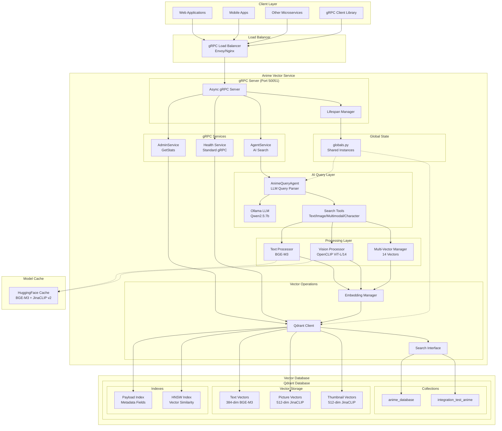
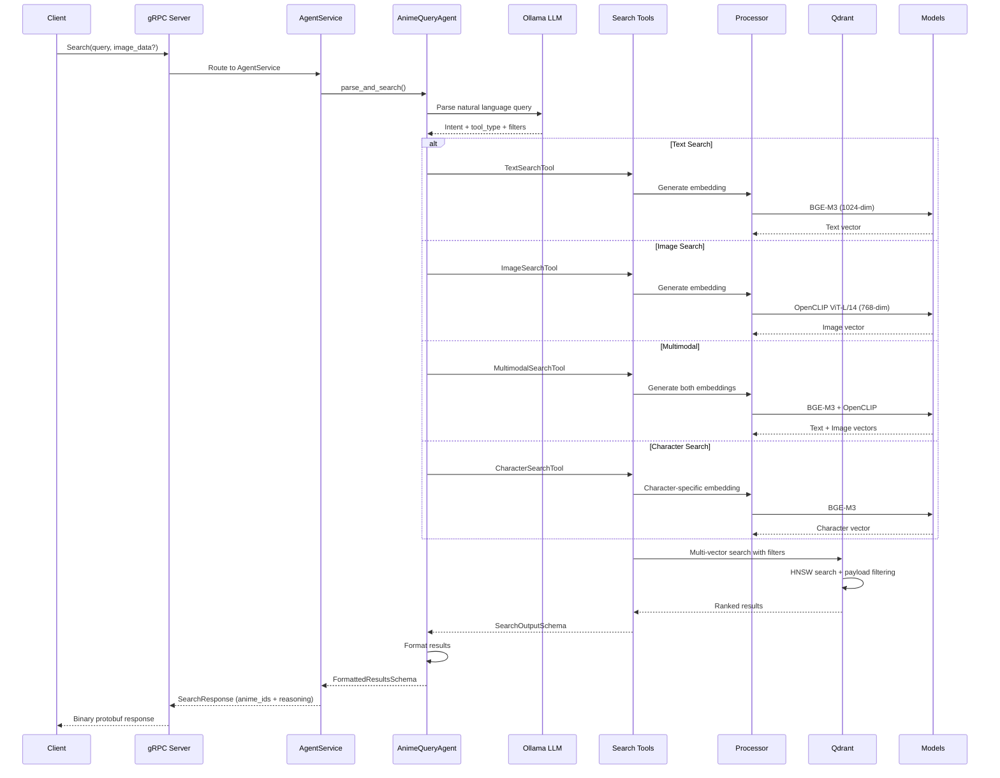
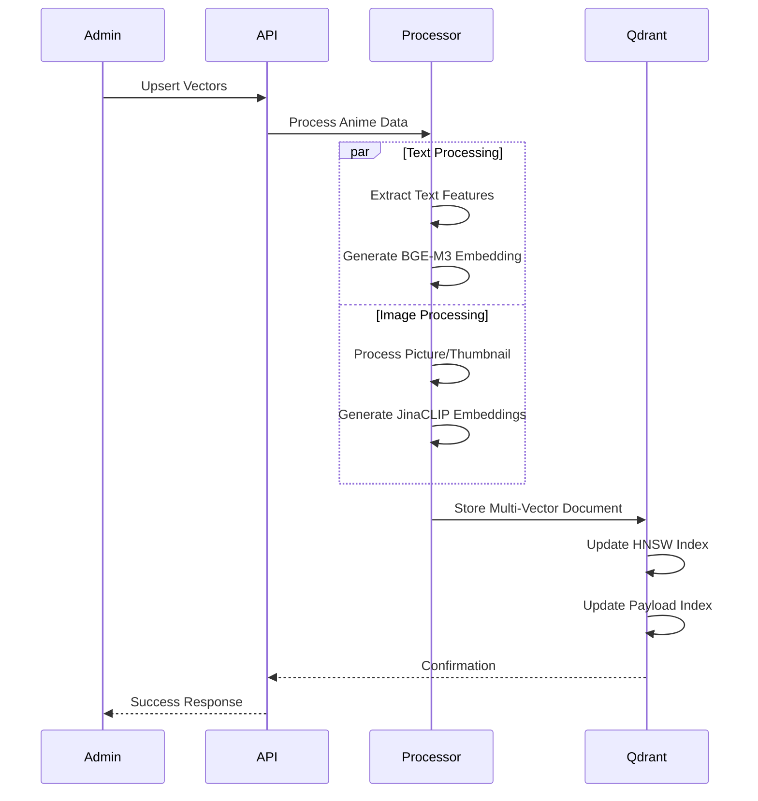

# System Architecture

## Overview

The Anime Vector Service is a specialized gRPC microservice designed for high-performance AI-powered vector database operations. It provides natural language query understanding, semantic search, visual similarity detection, and multimodal content discovery capabilities for anime databases through a high-performance binary protocol.

## Architecture Diagram



## Component Relationships

### Core Components

#### 1. gRPC Server (`src/main.py`, `src/server.py`)

- **Purpose**: Main application entry point with async gRPC server
- **Protocol**: gRPC with Protocol Buffers (binary serialization)
- **Port**: 50051 (default)
- **Services**: Health, AdminService, AgentService
- **Lifecycle**: Manages startup/shutdown, initializes global state
- **Key Features**:
  - Async server with `grpc.aio`
  - Global state management via `src/globals.py`
  - Lifespan context manager for resource initialization

#### 2. Global State Management (`src/globals.py`)

- **Purpose**: Centralized shared state for service instances
- **Pattern**: Module-level singleton pattern
- **State**: Qdrant client, AnimeQueryAgent instances
- **Rationale**: Avoids `__main__` vs `src.main` module conflicts
- **Access**: Imported by service implementations for shared resources

#### 3. gRPC Service Implementations

**Health Service** (Standard gRPC):
- Protocol: `grpc.health.v1.Health`
- Methods: `Check()`, `Watch()`
- Purpose: Standard health checking for load balancers

**AdminService** (`src/admin_service.py`):
- Protocol: `admin.AdminService`
- Methods: `GetStats()`
- Purpose: Database statistics and management
- Returns: Collection info, document count, vector config

**AgentService** (`src/agent_service.py`):
- Protocol: `agent.AgentService`
- Methods: `Search(query, image_data?)`
- Purpose: AI-powered natural language search
- Features: LLM query parsing, intent detection, tool selection

#### 4. AI Query Layer (`src/poc/atomic_agents_poc.py`)

- **AnimeQueryAgent**: Main query parsing agent
- **LLM Backend**: Ollama with Qwen2.5:7b model
- **Query Understanding**: Natural language intent detection
- **Tool Selection**: Automatic routing to search tools
- **Search Tools**:
  - Text Search: Semantic anime search
  - Image Search: Visual similarity
  - Multimodal Search: Combined text + image
  - Character Search: Character-focused queries

#### 5. Configuration System (`src/config/settings.py`)

- **Purpose**: Centralized configuration with validation
- **Features**: Environment variable support, type safety, field validation
- **Dependencies**: Pydantic, environment files
- **Scope**: gRPC server, Qdrant, embedding models, Ollama settings

#### 6. Vector Processing Layer (`src/vector/`)

- **Text Processor**: BGE-M3 embeddings (1024-dim) for semantic understanding
- **Vision Processor**: OpenCLIP ViT-L/14 embeddings (768-dim) for image understanding
- **Multi-Vector Manager**: Coordinates 14 named vectors (12 text + 2 image)
- **Dataset Manager**: Handles anime data structures

#### 7. Qdrant Integration (`src/vector/qdrant_client.py`)

- **Purpose**: Vector database client and operations
- **Features**: Multi-vector storage, HNSW indexing, payload filtering
- **Performance**: Quantization, caching, connection pooling

## Data Flow Architecture

### AI-Powered Search Request Flow



### Vector Storage Flow



## Technology Stack

### Core Runtime

- **Python**: 3.12+ for modern language features and type hints
- **gRPC**: High-performance RPC framework with Protocol Buffers
- **grpcio**: Python gRPC implementation with async support
- **Protocol Buffers**: Binary serialization for efficient data transfer

### AI/Agent Framework

- **Atomic Agents**: AI agent framework for query parsing and tool orchestration
- **Ollama**: Local LLM inference server
- **Qwen2.5:7b**: LLM model for natural language query understanding
- **Instructor**: Structured output extraction from LLMs

### Vector Database

- **Qdrant**: 1.14+ for vector storage and similarity search
- **HNSW**: Hierarchical Navigable Small World algorithm
- **Quantization**: Binary/scalar quantization for memory efficiency
- **Multi-Vector**: 14 named vectors (12 text + 2 image) per document

### Embedding Models

- **BGE-M3**: BAAI/bge-m3 for multilingual text embeddings (1024-dim)
- **OpenCLIP ViT-L/14**: Vision transformer for image embeddings (768-dim)
- **PyTorch**: 2.0+ as ML framework backend
- **Sentence Transformers**: 5.0+ for embedding pipeline
- **HuggingFace Transformers**: Model loading and caching

### Infrastructure

- **Docker**: Containerization with multi-stage builds
- **Docker Compose**: Local development orchestration
- **Nginx**: Load balancing and reverse proxy (production)

## Current Workflow

### Development Workflow

1. **Local Setup**: Docker Compose with Qdrant + Ollama + gRPC Service
2. **Model Loading**: Automatic HuggingFace model download and caching
3. **gRPC Testing**: grpcurl or Python client for service testing
4. **Health Monitoring**: Standard gRPC health checks for service status
5. **LLM Integration**: Ollama server for AI-powered query parsing

### Production Workflow

1. **Container Build**: Multi-stage Docker build with dependency optimization
2. **Service Deployment**: Kubernetes/Docker Swarm orchestration with gRPC services
3. **Load Balancing**: Envoy/Nginx with gRPC support for load distribution
4. **Monitoring**: gRPC health endpoints, metrics collection, logging
5. **LLM Deployment**: Ollama server deployment for production query parsing

### Data Processing Workflow

1. **Ingestion**: Anime data from external sources (MCP server integration)
2. **Enrichment**: Multi-source data synthesis and AI enhancement
3. **Vectorization**: BGE-M3 text (1024-dim) + OpenCLIP image (768-dim) embedding generation
4. **Storage**: Multi-vector document storage in Qdrant (14 named vectors)
5. **Indexing**: HNSW and payload index maintenance

### AI Query Processing Workflow

1. **Query Reception**: Client sends natural language query via gRPC
2. **LLM Parsing**: Ollama (Qwen2.5:7b) understands intent and extracts filters
3. **Tool Selection**: Agent automatically selects appropriate search tool (text/image/multimodal/character)
4. **Vector Search**: Selected tool executes multi-vector search with filters
5. **Result Formatting**: Agent formats and returns ranked results with reasoning

## Performance Characteristics

### Response Time Targets

- **AI Query Parsing**: < 500ms (LLM inference)
- **Text Search**: < 100ms (95th percentile, after parsing)
- **Image Search**: < 300ms (95th percentile, after parsing)
- **Multimodal Search**: < 400ms (95th percentile, after parsing)
- **AdminService.GetStats**: < 50ms (95th percentile)

### Scalability Metrics

- **Concurrent Requests**: 100+ simultaneous
- **Peak Load**: 1000 RPS
- **Data Scale**: 100,000+ anime entries
- **Vector Storage**: 500M+ vectors total

### Optimization Features

- **Model Caching**: HuggingFace local cache for embedding models
- **Vector Quantization**: Scalar/binary quantization for memory efficiency
- **Payload Indexing**: Fast metadata filtering on genres, year, type, etc.
- **Connection Pooling**: Efficient Qdrant client management
- **HNSW Tuning**: Optimized parameters for search accuracy vs speed

## Security Architecture

### API Security

- **Protocol Buffers**: Strong typing and schema validation
- **Input Validation**: Protobuf schema enforcement
- **TLS/mTLS**: Secure gRPC communication (production)
- **Rate Limiting**: Configurable per-client limits (future)
- **Authentication**: Token-based auth for gRPC services (future)

### Data Security

- **TLS**: Required for production deployments
- **No PII**: Anime metadata only, no user data
- **Audit Logging**: Request/response logging for compliance

## Deployment Architecture

### Development

```
localhost:50051 → gRPC Server → Qdrant (Docker)
                      ↓
                  Ollama LLM
```

### Production (Recommended)

```
gRPC Load Balancer → [gRPC Service Instances] → Qdrant Cluster
     |                      |                          |
   Envoy              Kubernetes                Persistent Storage
                            ↓
                      Ollama Cluster
```

## Future Architecture Considerations

### Phase 2 Enhancements

- **Distributed Qdrant**: Multi-node clustering for high availability
- **Redis Caching**: Query result caching layer
- **Message Queue**: Async processing with Celery/RQ
- **Prometheus Metrics**: Detailed performance monitoring

### Phase 3 Scalability

- **Edge Deployment**: CDN integration for global performance
- **Auto-scaling**: Kubernetes HPA based on CPU/memory/queue depth
- **Model Serving**: Dedicated model inference services
- **Data Pipeline**: Stream processing for real-time updates

