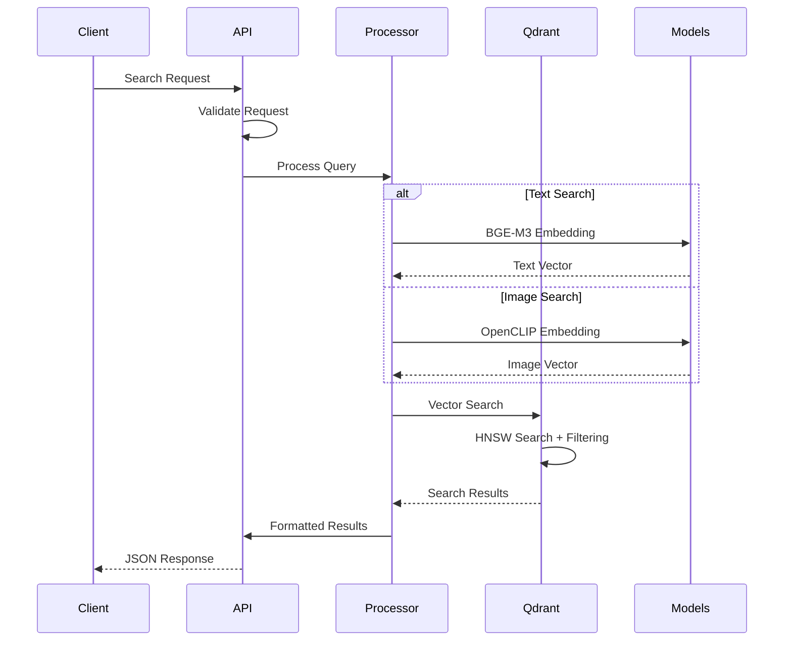
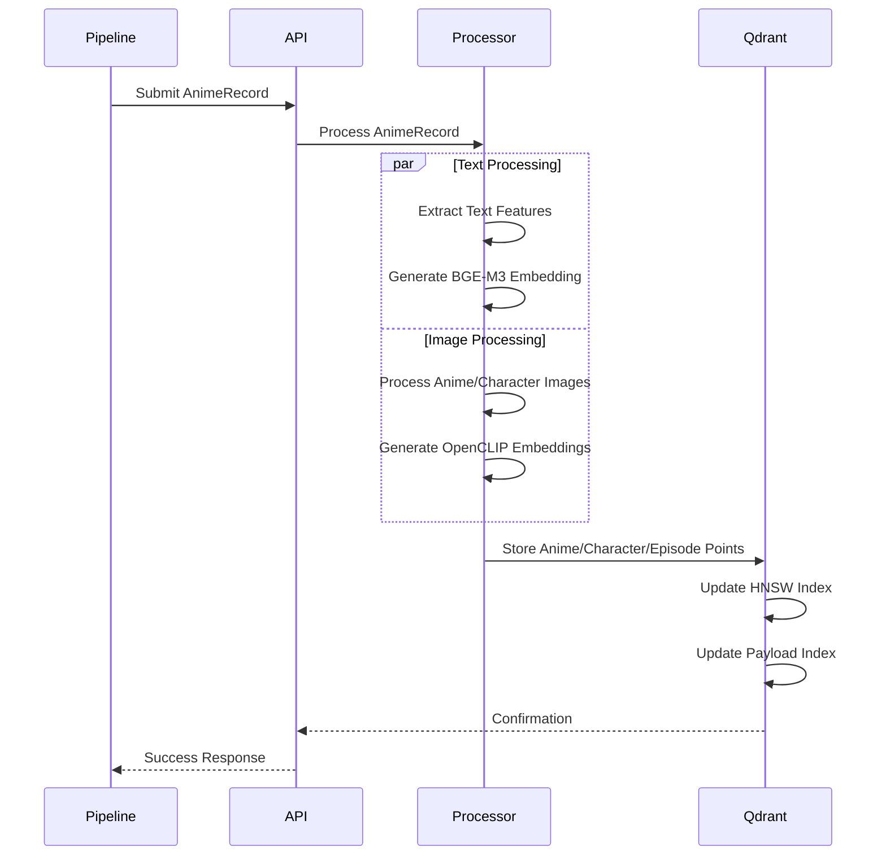

# System Architecture

## Overview

The Anime Vector Service is a specialized microservice designed for high-performance vector database operations, extracted from the main anime-mcp-server repository. It provides semantic search and image-based discovery capabilities for anime databases.

## Architecture Diagram

```mermaid
graph TB
    subgraph "Client Layer"
        C1[Web Applications]
        C2[Mobile Apps]
        C3[Other Microservices]
        C4[Client Library]
    end

    subgraph "Load Balancer"
        LB[Nginx/ALB/Envoy]
    end

    subgraph "Anime Vector Service"
        subgraph "FastAPI Application"
            API[FastAPI Router]
            MW[CORS Middleware]
            LS[Lifespan Manager]
        end

        subgraph "API Endpoints"
            SEARCH[Search API]
            ADMIN[Admin APIs]
            HEALTH[Health Check]
        end

        subgraph "Processing Layer"
            TP[Text Processor<br/>BGE-M3]
            VP[Vision Processor<br/>OpenCLIP]
            MVM[Multi-Vector Manager]
        end

        subgraph "Vector Operations"
            QC[Qdrant Client]
            EM[Embedding Manager]
            SI[Search Interface]
        end
    end

    subgraph "Vector Database"
        subgraph "Qdrant Database"
            subgraph "Collections"
                AC[anime_database]
                TC[integration_test_anime]
            end

            subgraph "Vector Storage"
                TV[Text Vectors<br/>1024-dim BGE-M3]
                IV[Image Vectors<br/>768-dim OpenCLIP<br/>(Multivector)]
            end

            subgraph "Indexes"
                PI[Payload Index<br/>Metadata Fields]
                HI[HNSW Index<br/>Vector Similarity]
            end
        end
    end

    subgraph "Model Cache"
        MC[HuggingFace Cache<br/>BGE-M3 + OpenCLIP]
    end

    C1 --> LB
    C2 --> LB
    C3 --> LB
    C4 --> LB

    LB --> API
    API --> MW
    MW --> LS

    API --> SEARCH
    API --> ADMIN
    API --> HEALTH

    SEARCH --> TP
    SEARCH --> VP
    SEARCH --> MVM

    ADMIN --> QC
    HEALTH --> QC

    TP --> EM
    VP --> EM
    MVM --> EM

    EM --> QC
    QC --> SI
    SI --> AC
    SI --> TC

    QC --> TV
    QC --> IV
    QC --> PI
    QC --> HI

    TP -.-> MC
    VP -.-> MC
```

## Component Relationships

### Core Components

#### 1. FastAPI Application (`apps/service/src/service/main.py`)

- **Purpose**: Main application entry point and service orchestration
- **Dependencies**: Configuration, Logging, CORS, Routers
- **Interfaces**: HTTP REST API, Health endpoints
- **Lifecycle**: Manages startup/shutdown, initializes Qdrant client

#### 2. Configuration System (`libs/common/src/common/config/settings.py`)

- **Purpose**: Centralized configuration with validation
- **Features**: Environment variable support, type safety, field validation
- **Dependencies**: Pydantic, environment files
- **Scope**: Vector service, Qdrant, embedding models, API settings

#### 3. Vector Processing Layer (`libs/vector_processing/src/vector_processing/`)

- **Text Processor**: BGE-M3 embeddings for semantic understanding
- **Vision Processor**: OpenCLIP for image understanding
- **Multi-Vector Manager**: Coordinates multiple embedding types

#### 4. API Layer (`apps/service/src/service/routes/`)

- **Search Router**: Text + image search endpoint (planned)
- **Admin Router**: Database management and statistics
- **Health**: Service health endpoint

#### 5. Qdrant Integration (`libs/qdrant_db/src/qdrant_db/client.py`)

- **Purpose**: Vector database client and operations
- **Features**: Multi-vector storage, HNSW indexing, payload filtering
- **Performance**: Quantization, caching, connection pooling

## Data Flow Architecture

### Search Request Flow



### Vector Storage Flow



## Technology Stack

### Core Runtime

- **Python**: 3.12+ for modern language features
- **FastAPI**: 0.115+ for high-performance async API
- **Uvicorn**: ASGI server for production deployment

### Vector Database

- **Qdrant**: 1.14+ for vector storage and similarity search
- **HNSW**: Hierarchical Navigable Small World algorithm
- **Quantization**: Binary/scalar quantization for memory efficiency

### AI/ML Stack

- **BGE-M3**: BAAI/bge-m3 for multilingual text embeddings (1024-dim)
- **OpenCLIP ViT-L/14**: Vision embeddings (768-dim)
- **PyTorch**: 2.0+ as ML framework backend
- **Sentence Transformers**: 5.0+ for embedding pipeline
- **HuggingFace Transformers**: Model loading and caching

### Infrastructure

- **Docker**: Containerization with multi-stage builds
- **Docker Compose**: Local development orchestration
- **Nginx**: Load balancing and reverse proxy (production)

## Current Workflow

### Development Workflow

1. **Local Setup**: Docker Compose with Qdrant + Vector Service
2. **Model Loading**: Automatic HuggingFace model download and caching
3. **API Testing**: OpenAPI/Swagger documentation at `/docs`
4. **Health Monitoring**: Continuous health checks for Qdrant connectivity

### Production Workflow

1. **Container Build**: Multi-stage Docker build with dependency optimization
2. **Service Deployment**: Kubernetes/Docker Swarm orchestration
3. **Load Balancing**: Nginx upstream configuration
4. **Monitoring**: Health endpoints, metrics collection, logging

### Data Processing Workflow

1. **Ingestion**: Anime data from external sources (MCP server integration)
2. **Enrichment**: Multi-source data synthesis and AI enhancement
3. **Vectorization**: BGE-M3 text + OpenCLIP image embedding generation
4. **Storage**: Anime/character/episode point storage in Qdrant
5. **Indexing**: HNSW and payload index maintenance

## Performance Characteristics

### Response Time Targets

- **Text Search**: < 100ms (95th percentile)
- **Image Search**: < 300ms (95th percentile)

### Scalability Metrics

- **Concurrent Requests**: 100+ simultaneous
- **Peak Load**: 1000 RPS
- **Data Scale**: 100,000+ anime entries
- **Vector Storage**: 500M+ vectors total

### Optimization Features

- **Model Caching**: HuggingFace local cache for embedding models
- **Vector Quantization**: Scalar/binary quantization for memory efficiency
- **Payload Indexing**: Fast metadata filtering on genres, year, type, etc.
- **Connection Pooling**: Efficient Qdrant client management
- **HNSW Tuning**: Optimized parameters for search accuracy vs speed

## Security Architecture

### API Security

- **CORS**: Configurable origin restrictions
- **Input Validation**: Pydantic model validation
- **Rate Limiting**: Configurable per-client limits (future)
- **API Keys**: Optional authentication for admin endpoints (future)

### Data Security

- **TLS**: Required for production deployments
- **No PII**: Anime metadata only, no user data
- **Audit Logging**: Request/response logging for compliance

## Deployment Architecture

### Development

```
localhost:8002 ’ FastAPI ’ Qdrant (Docker)
```

### Production (Recommended)

```
Load Balancer ’ [Vector Service Instances] ’ Qdrant Cluster
     |                      |                      |
   Nginx              Kubernetes              Persistent Storage
```

## Future Architecture Considerations

### Phase 2 Enhancements

- **Distributed Qdrant**: Multi-node clustering for high availability
- **Redis Caching**: Query result caching layer
- **Message Queue**: Async processing with Celery/RQ
- **Prometheus Metrics**: Detailed performance monitoring

### Phase 3 Scalability

- **Edge Deployment**: CDN integration for global performance
- **Auto-scaling**: Kubernetes HPA based on CPU/memory/queue depth
- **Model Serving**: Dedicated model inference services
- **Data Pipeline**: Stream processing for real-time updates

