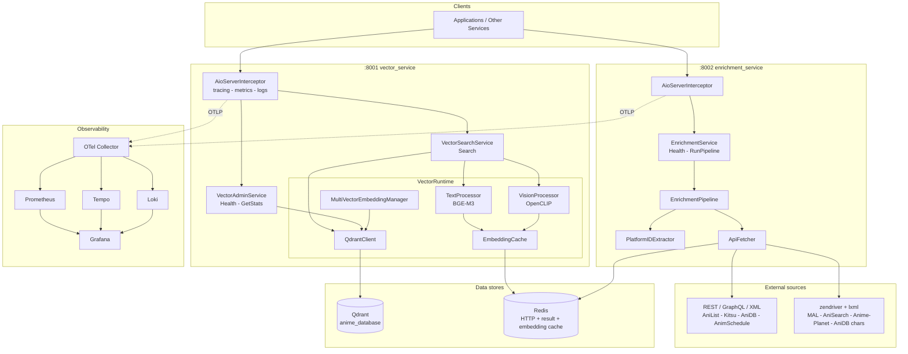
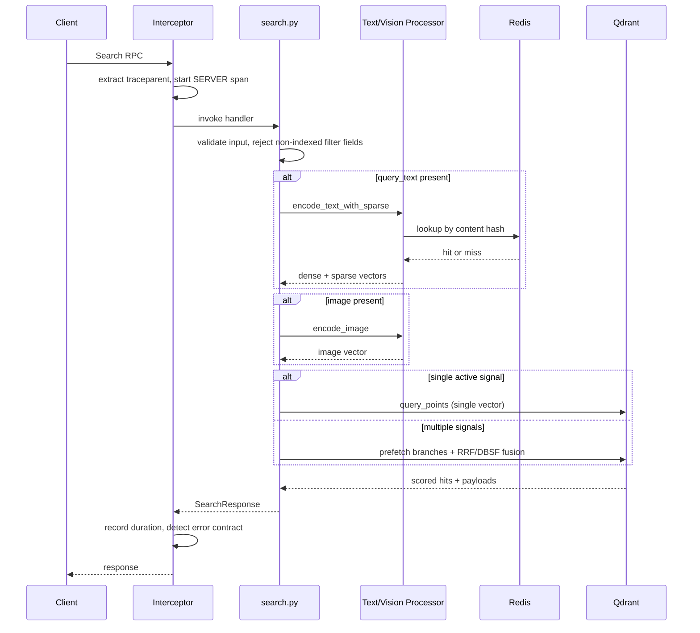
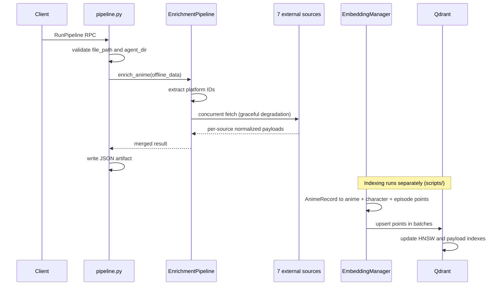

# System Architecture

## Overview

Echora is a Pants monorepo housing an anime data and search platform. It is composed of
two gRPC services backed by a set of shared libraries:

- **`vector_service`** (gRPC, `:8001`) — semantic, visual, and hybrid search over Qdrant.
- **`enrichment_service`** (gRPC, `:8002`) — orchestrates the multi-source enrichment
  pipeline that produces the records the vector service indexes.

Both services share the same configuration, data models, observability bootstrap, and
Qdrant/embedding libraries under `libs/`.

> A third service, `agent_service` (natural-language query parsing), is under active
> development on a feature branch and is not part of the layout described here yet.

## Architecture Diagram


```mermaid
graph TB
    subgraph Clients
        C1[Applications / Other Services]
    end

    subgraph vector_service[":8001 vector_service"]
        VI[AioServerInterceptor<br/>tracing - metrics - logs]
        VA[VectorAdminService<br/>Health - GetStats]
        VS[VectorSearchService<br/>Search]
        subgraph VR["VectorRuntime"]
            TP[TextProcessor<br/>BGE-M3]
            VP[VisionProcessor<br/>OpenCLIP]
            EM[MultiVectorEmbeddingManager]
            QC[QdrantClient]
            EC[EmbeddingCache]
        end
    end

    subgraph enrichment_service[":8002 enrichment_service"]
        EI[AioServerInterceptor]
        ES[EnrichmentService<br/>Health - RunPipeline]
        EP[EnrichmentPipeline]
        IDX[PlatformIDExtractor]
        AF[ApiFetcher]
    end

    subgraph Sources["External sources"]
        API_S[REST / GraphQL / XML<br/>AniList - Kitsu - AniDB - AnimSchedule]
        CRAWL[zendriver + lxml<br/>MAL - AniSearch - Anime-Planet - AniDB chars]
    end

    subgraph Data["Data stores"]
        QD[(Qdrant<br/>anime_database)]
        RD[(Redis<br/>HTTP + result + embedding cache)]
    end

    subgraph Obs["Observability"]
        OC[OTel Collector]
        PROM[Prometheus]
        TEMPO[Tempo]
        LOKI[Loki]
        GRAF[Grafana]
    end

    C1 --> VI --> VA
    VI --> VS
    VS --> TP
    VS --> VP
    VS --> QC
    VA --> QC
    TP --> EC
    VP --> EC
    EM --> QC
    EC --> RD
    QC --> QD

    C1 --> EI --> ES --> EP
    EP --> IDX
    EP --> AF
    AF --> API_S
    AF --> CRAWL
    AF --> RD

    VI -.OTLP.-> OC
    EI -.OTLP.-> OC
    OC --> PROM
    OC --> TEMPO
    OC --> LOKI
    PROM --> GRAF
    TEMPO --> GRAF
    LOKI --> GRAF
```

## Component Relationships

### Core Components

#### 1. Service entry points (`apps/*/src/*/main.py`)

- **Purpose**: Process bootstrap — telemetry, runtime construction, servicer
  registration, health reporting, and the serve loop.
- **Order matters**: `setup_telemetry()` runs **first**; gRPC server auto-instrumentation
  must be installed before `grpc.aio.server()` is constructed.
- **Health**: Both services register the standard `grpc_health.v1` servicer.
  `vector_service` starts `NOT_SERVING` and flips to `SERVING` only after a successful
  Qdrant health check.

#### 2. Route adapters (`apps/*/src/*/routes/`)

- `adapter.py` implements the generated servicer interface (PascalCase RPC names) and
  delegates immediately to plain async functions in sibling modules.
- Keeps proto-shaped code isolated from business logic and keeps handlers unit-testable
  without a gRPC server.

#### 3. Runtime containers (`apps/*/src/*/runtime.py`)

- A `@dataclass(slots=True)` holding fully constructed dependencies, built once at
  startup by `build_runtime()`.
- `vector_service` validates that model output dimensions match the configured
  `vector_names` **before** any Qdrant I/O, so model/config drift fails fast.

#### 4. Configuration (`libs/common/src/common/config/`)

- `Settings(BaseSettings)` composes five `BaseModel` sub-configs: `qdrant`, `embedding`,
  `service`, `observability`, `redis`.
- A `mode="before"` validator routes flat environment variables (`QDRANT_URL`, …) into
  the correct nested sub-config, JSON-parsing list/dict-typed fields.
- Import-time assertions guarantee no field name collides across sub-configs.
- `ENVIRONMENT` is **required** — there is no default, to prevent shipping dev settings.
  `production` enforces `debug=False`, `log_level=WARNING`, WAL on, and model warm-up on.

#### 5. Vector processing (`libs/vector_processing/src/vector_processing/`)

- **TextProcessor**: BGE-M3 dense embeddings, plus sparse when the model supports it.
- **VisionProcessor**: OpenCLIP image embeddings.
- **MultiVectorEmbeddingManager**: turns one `AnimeRecord` into anime, character, and
  episode points.
- **AnimeFieldMapper**: decides *what* text represents each entity; the processors decide
  *how* to encode it.
- **EmbeddingCache**: Redis-backed, keyed by model name + SHA-256 of input. Fail-open.

#### 6. Qdrant integration (`libs/qdrant_db/src/qdrant_db/`)

- `client.py` — orchestration, retries, telemetry.
- `collection/schema_builder.py` — pure config → Qdrant model translation, no I/O.
- `collection/manager.py` — collection lifecycle, race-safe creation, schema
  compatibility validation.
- `query_builder.py` / `normalizer.py` — pure filter/prefetch construction and vector
  payload validation.
- Implements the provider-agnostic ABCs in `libs/vector_db_interface/`.

#### 7. Enrichment (`libs/enrichment/src/enrichment/`)

- `PlatformIDExtractor` turns offline-database source URLs into a platform-ID dict.
- `ApiFetcher` fans out to seven source helpers concurrently, with graceful degradation —
  one failing source never aborts the rest.
- Crawler-based sources use a template-method `BaseCrawler`: normalize → fetch →
  post-process → build source model → map to canonical → persist.

#### 8. Observability (`libs/observability/src/observability/`)

- One `setup_telemetry()` entry point configuring structlog + OTLP logs, traces, and
  metrics, plus optional auto-instrumentation.
- `AioServerInterceptor` handles all four RPC shapes, extracts upstream trace context,
  and performs contract-aware failure detection.
- `registry` exposes pre-created metric instruments that are silent no-ops when telemetry
  is disabled, so they are safe to call from any code path.

## Data Flow Architecture

### Search Request Flow


```mermaid
sequenceDiagram
    participant Client
    participant Interceptor
    participant Route as search.py
    participant Proc as Text/Vision Processor
    participant Cache as Redis
    participant Qdrant

    Client->>Interceptor: Search RPC
    Interceptor->>Interceptor: extract traceparent, start SERVER span
    Interceptor->>Route: invoke handler
    Route->>Route: validate input, reject non-indexed filter fields

    alt query_text present
        Route->>Proc: encode_text_with_sparse
        Proc->>Cache: lookup by content hash
        Cache-->>Proc: hit or miss
        Proc-->>Route: dense + sparse vectors
    end
    alt image present
        Route->>Proc: encode_image
        Proc-->>Route: image vector
    end

    alt single active signal
        Route->>Qdrant: query_points (single vector)
    else multiple signals
        Route->>Qdrant: prefetch branches + RRF/DBSF fusion
    end

    Qdrant-->>Route: scored hits + payloads
    Route-->>Interceptor: SearchResponse
    Interceptor->>Interceptor: record duration, detect error contract
    Interceptor-->>Client: response
```

### Enrichment and Ingestion Flow


```mermaid
sequenceDiagram
    participant Client
    participant Route as pipeline.py
    participant Pipe as EnrichmentPipeline
    participant Sources as 7 external sources
    participant Embed as EmbeddingManager
    participant Qdrant

    Client->>Route: RunPipeline RPC
    Route->>Route: validate file_path and agent_dir
    Route->>Pipe: enrich_anime(offline_data)
    Pipe->>Pipe: extract platform IDs
    Pipe->>Sources: concurrent fetch (graceful degradation)
    Sources-->>Pipe: per-source normalized payloads
    Pipe-->>Route: merged result
    Route->>Route: write JSON artifact

    Note over Embed,Qdrant: Indexing runs separately (scripts/)
    Embed->>Embed: AnimeRecord to anime + character + episode points
    Embed->>Qdrant: upsert points in batches
    Qdrant->>Qdrant: update HNSW and payload indexes
```

## Technology Stack

### Core Runtime

- **Python**: 3.13 (pinned in `.python-version`; Pants, ty, and ruff all target 3.13)
- **gRPC**: `grpc.aio` async server with custom telemetry interceptors
- **Protobuf**: schemas in `protos/`, stubs generated via `scripts/generate-proto.py`
- **Pants**: 2.29.1 build system
- **UV**: dependency management

### Vector Database

- **Qdrant**: `qdrant-client` 1.16.x
- **Named vectors**: `text_vector` (1024-dim dense), `image_vector` (768-dim dense,
  multivector/MAX_SIM), `text_sparse_vector` (sparse, IDF modifier)
- **HNSW**: tuned per vector priority; **disabled** (`m=0`) on the multivector image
  vector because MAX_SIM is asymmetric
- **Fusion**: server-side RRF (default) or DBSF via the Query API
- **Quantization**: binary/scalar/product, configurable per priority class

### AI/ML Stack

- **BGE-M3**: multilingual text embeddings (1024-dim), dense + sparse in one pass
- **OpenCLIP ViT-L/14**: vision embeddings (768-dim)
- **Cross-encoder reranking**: `BAAI/bge-reranker-v2-m3` (opt-in)
- **PyTorch**, **Sentence Transformers**, **FlagEmbedding**, **HuggingFace Transformers**

### Enrichment

- **zendriver**: CDP-driven Chrome for crawler-based sources
- **lxml**: XPath extraction from raw HTML
- **aiohttp**: REST/GraphQL/XML source transport
- **Hishel + Redis**: RFC 9111 HTTP caching for API sources
- **Result cache**: source-hash-keyed Redis caching for crawlers

### Observability

- **OpenTelemetry**: logs, traces, and metrics over OTLP/gRPC
- **structlog**: JSON structured logging with trace correlation and PII redaction
- **Collector → Prometheus / Tempo / Loki → Grafana**, with Alertmanager

### Infrastructure

- **Docker / Docker Compose**: dev, production, and observability stacks under `docker/`

## Current Workflow

### Development Workflow

1. **Local Setup**: `docker compose -f docker/docker-compose.dev.yml up -d`
2. **Model Loading**: HuggingFace models downloaded into a persistent cache volume
   (~2.2 GB on first run, which is why the healthcheck grace period is long)
3. **API Testing**: gRPC reflection/health via `grpc_health_probe`, or a gRPC client
4. **Health Monitoring**: `grpc_health.v1` checks wired into container healthchecks

### Production Workflow

1. **Container Build**: multi-stage Docker builds per service
2. **Service Deployment**: container orchestration (see `docs/k8s_deployment_plan.md`)
3. **Monitoring**: OTLP export to the collector, Grafana dashboards under
   `docker/observability/grafana/dashboards/`

### Data Processing Workflow

1. **Ingestion**: offline anime database as the seed input
2. **Enrichment**: concurrent multi-source fetch, normalization, and consolidation
3. **Character matching**: ensemble fuzzy matching (semantic, phonetic, edit-distance,
   token, and CCIP visual similarity)
4. **Vectorization**: BGE-M3 text + OpenCLIP image embedding generation
5. **Storage**: anime/character/episode points upserted into Qdrant
6. **Indexing**: HNSW and payload index maintenance

## Performance Characteristics

### Response Time Targets

These are design targets, not measured benchmarks.

- **Text Search**: < 100 ms (95th percentile)
- **Image Search**: < 300 ms (95th percentile)

### Scalability Targets

- **Concurrent Requests**: 100+ simultaneous
- **Peak Load**: 1000 RPS
- **Data Scale**: 100,000+ anime entries

### Optimization Features

- **Embedding cache**: Redis-backed, skips inference for repeated content
- **Vector Quantization**: scalar/binary quantization for memory efficiency
- **Payload Indexing**: fast metadata filtering; non-indexed filter fields are rejected
  at the RPC boundary rather than silently triggering a full scan
- **HNSW Tuning**: per-priority parameters balancing accuracy against speed
- **Batching**: batch embedding and batched Qdrant upserts with per-batch retry

## Security Architecture

### Transport and API

- **Input Validation**: Pydantic contract models on every request path
- **Filter allow-list**: search filters are restricted to indexed payload fields
- **Path validation**: `RunPipeline` confines `file_path` to an allowed directory and
  restricts `agent_dir` to a single safe path component
- **Transport security**: gRPC currently binds insecure ports; TLS termination is
  expected at the ingress/mesh layer
- **Authentication**: none at the service boundary today

> `allowed_origins` / `allowed_methods` / `allowed_headers` remain in `ServiceConfig` but
> are **not consumed** by any code — leftovers from the pre-gRPC HTTP service.

### Data Security

- **No PII**: anime metadata only; no user data is stored
- **Log redaction**: structlog processor strips API keys, tokens, passwords, and emails
- **Secrets**: supplied via environment variables only, never committed

## Deployment Architecture

### Development

```
localhost:8001 -> vector_service     -> Qdrant (Docker)
localhost:8002 -> enrichment_service -> Redis  (Docker)
```

### Production (Recommended)

```
Ingress / LB -> [vector_service instances]     -> Qdrant cluster
             -> [enrichment_service instances] -> Redis
                          |
                   OTel Collector -> Prometheus / Tempo / Loki -> Grafana
```

## Future Architecture Considerations

### Near Term

- **`agent_service`**: natural-language query parsing, in development on a feature branch
- **Query result caching**: search responses are not cached yet (embedding results are)
- **Distributed Qdrant**: multi-node clustering for high availability

### Longer Term

- **Message Queue**: async enrichment scheduling
- **Auto-scaling**: horizontal scaling driven by CPU/memory/queue depth
- **Model Serving**: dedicated inference services to decouple model memory from services
- **Data Pipeline**: stream processing for real-time updates
