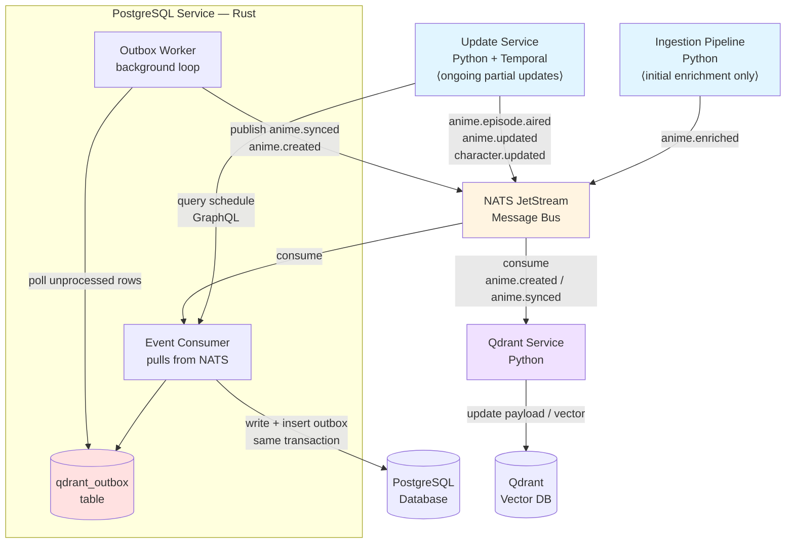

# Event-Driven Architecture

## Overview

The Echora backend uses event-driven architecture to decouple services and eliminate schema duplication. Two event publishers exist with distinct responsibilities:

- **Ingestion Pipeline**: one-time full enrichment only — publishes `anime.enriched` after all 5 stages complete
- **Update Service**: ongoing partial updates — publishes `anime.episode.aired`, `anime.updated`, and `character.updated` on schedule (Temporal-based)

> [!important] Key Benefit
> **Zero schema duplication** - Only PostgreSQL Service owns SQL models. Both pipeline and worker work purely with Protobuf events.

## Architecture Diagram



## Event Bus Selection: NATS with JetStream

### Why NATS?

| Feature | Benefit |
|---------|---------|
| **Lightweight** | ~20MB memory footprint (vs 1GB+ for Kafka) |
| **Simple Setup** | Single Docker container, no Zookeeper |
| **Production Ready** | Used by Netflix, Ericsson, Siemens |
| **At-Least-Once** | JetStream provides durable message persistence |
| **Excellent Clients** | Official Rust (`async-nats`) and Python (`nats-py`) |
| **Low Latency** | Sub-millisecond message delivery |
| **Local Testing** | Easy to run locally for development |

### Event Bus Comparison

| Feature | NATS | Redis Streams | Kafka | RabbitMQ |
|---------|------|---------------|-------|----------|
| **Setup** | ⭐⭐⭐ Simple | ⭐⭐⭐ Simple | ⭐ Complex | ⭐⭐ Medium |
| **Memory** | ~20MB | ~50MB | ~1GB+ | ~100MB |
| **Throughput** | High | Medium | Very High | Medium |
| **Persistence** | ✅ JetStream | ✅ Streams | ✅ Topics | ✅ Durable |
| **Rust Support** | ✅ Official | ⭐ Community | ⭐ Community | ⭐ Community |
| **Python Support** | ✅ Official | ✅ Official | ✅ Official | ✅ Official |
| **Ops Complexity** | Low | Low | High | Medium |
| **Best For** | Microservices | Simple queues | Big data | Task queues |

> [!tip] Alternative: Redis Streams
> If you're already using Redis for caching, Redis Streams is a simpler option for smaller message volumes. However, NATS is more specialized for messaging and offers better performance at scale.

## Docker Compose Setup

```yaml
version: '3.8'

services:
  nats:
    image: nats:latest
    container_name: echora-nats
    ports:
      - "4222:4222"   # Client connections
      - "8222:8222"   # HTTP monitoring
    command:
      - "-js"         # Enable JetStream
      - "-m"          # Enable monitoring
      - "8222"        # Monitoring port
    volumes:
      - nats-data:/data
    networks:
      - echora-network

  # NATS monitoring UI (optional)
  nats-box:
    image: natsio/nats-box:latest
    container_name: echora-nats-box
    networks:
      - echora-network
    depends_on:
      - nats
    command:
      - "tail"
      - "-f"
      - "/dev/null"

volumes:
  nats-data:
    driver: local

networks:
  echora-network:
    driver: bridge
```

### Starting NATS Locally

```bash
# Start NATS
docker compose up -d nats

# Check NATS health
curl http://localhost:8222/healthz

# View NATS streams (using nats-box)
docker exec -it echora-nats-box nats stream ls

# Monitor NATS
open http://localhost:8222
```

## Event Flow

### 1. Ingestion → NATS

```python
# Ingestion Pipeline (Python)
import nats
from nats.js import JetStreamContext

async def publish_enriched_anime(anime_record: AnimeRecord):
    """Publish enriched anime data to NATS."""
    nc = await nats.connect("nats://localhost:4222")
    js = nc.jetstream()

    # Create stream if not exists
    await js.add_stream(name="ANIME_EVENTS", subjects=["anime.>"])

    # Build protobuf event
    event = AnimeEnrichedEvent(
        event_id=str(uuid4()),
        timestamp=Timestamp.now(),
        anime_id=anime_record.anime.id,
        anime=to_protobuf(anime_record.anime),
        characters=[to_protobuf(c) for c in anime_record.characters],
        episodes=[to_protobuf(e) for e in anime_record.episodes],
        enrichment_metadata=build_metadata()
    )

    # Publish event
    await js.publish(
        subject="anime.enriched",
        payload=event.SerializeToString(),
        headers={"Content-Type": "application/protobuf"}
    )

    print(f"Published AnimeEnrichedEvent for {anime_record.anime.title}")
```

### 2. NATS → PostgreSQL Service

```rust
// PostgreSQL Service (Rust)
use async_nats::jetstream;

async fn consume_anime_events() -> Result<()> {
    let client = async_nats::connect("nats://localhost:4222").await?;
    let jetstream = jetstream::new(client);

    // Create consumer
    let stream = jetstream.get_stream("ANIME_EVENTS").await?;
    let consumer = stream
        .create_consumer(jetstream::consumer::pull::Config {
            durable_name: Some("postgres-consumer".to_string()),
            filter_subject: "anime.enriched".to_string(),
            ..Default::default()
        })
        .await?;

    // Consume messages
    let mut messages = consumer.messages().await?;
    while let Some(msg) = messages.next().await {
        let msg = msg?;

        // Deserialize protobuf
        let event = AnimeEnrichedEvent::decode(msg.payload)?;

        // Persist to PostgreSQL
        match ingest_anime(&event).await {
            Ok(_) => {
                msg.ack().await?;
                publish_anime_created(&event.anime_id).await?;
            }
            Err(e) => {
                eprintln!("Failed to ingest anime: {}", e);
                msg.nak().await?;
            }
        }
    }

    Ok(())
}
```

### 3. PostgreSQL Service → NATS → Qdrant Service

```rust
// PostgreSQL Service publishes after successful write
async fn publish_anime_created(anime_id: &str) -> Result<()> {
    let event = AnimeCreatedEvent {
        event_id: Uuid::new_v4().to_string(),
        timestamp: Some(prost_types::Timestamp::now()),
        anime_id: anime_id.to_string(),
    };

    jetstream
        .publish(
            "anime.created",
            event.encode_to_vec().into()
        )
        .await?
        .await?;

    Ok(())
}
```

```python
# Qdrant Service (Python)
async def consume_anime_created_events():
    """Update vectors when anime is created/updated."""
    nc = await nats.connect("nats://localhost:4222")
    js = nc.jetstream()

    # Subscribe to events published by PostgreSQL Service (via outbox)
    # anime.created = initial ingest, anime.synced = ongoing updates
    sub = await js.subscribe("anime.*", durable="qdrant-consumer")

    async for msg in sub.messages:
        event = AnimeCreatedEvent.FromString(msg.data)

        try:
            # Fetch full anime data from PostgreSQL Service
            anime_data = await fetch_anime_via_graphql(event.anime_id)

            # Generate embeddings and update Qdrant
            await update_vectors(anime_data)

            await msg.ack()
        except Exception as e:
            print(f"Failed to update vectors: {e}")
            await msg.nak()
```

## Event Subjects Hierarchy

```
# Published by Ingestion Pipeline / Update Service → consumed by PostgreSQL Service
anime.enriched          # Initial full enrichment (ingestion pipeline)
anime.updated           # Score/status change request (update service)
anime.episode.aired     # New episode verified (update service)
character.updated       # Character data change (update service)

# Published by PostgreSQL Service → consumed by Qdrant Service
anime.created           # After initial ingest committed to DB
anime.synced            # After any update committed to DB (via outbox)
anime.deleted           # After soft delete committed to DB

character.created       # Character-specific events
character.updated
episode.created         # Episode-specific events
episode.updated
```

## Consumer Configuration

### Pull Consumers (Decided)

All consumers use **pull** (not push). Pull means the service actively fetches messages when ready, giving full backpressure control.

**How pull works:**
```
while true:
  messages = js.fetch(batch=10, expires=5s)
  # ↑ blocks up to 5s if stream empty — effectively real-time
  # ↑ returns immediately when messages are available
  for msg in messages:
    process(msg)
    msg.ack()
  # immediately fetch again
```

**Pull vs Push:**

| | Pull | Push |
|--|------|------|
| **Rate control** | Service controls pace | NATS pushes as fast as possible |
| **Backpressure** | ✅ Built-in | ❌ Service can be overwhelmed |
| **Bulk ingestion** | ✅ Process 10 at a time | ❌ 1000 events flood the service |
| **Restart safety** | ✅ NATS remembers position | ✅ NATS remembers position |

### Confirmed Settings

| Setting | Value |
|---------|-------|
| **Consumer type** | Pull |
| **Batch size** | 10 messages per fetch |
| **Ack timeout** | 30s (redelivered if not acked) |
| **Max retries** | 5 attempts |
| **DLQ alerting** | Immediate on first DLQ message |

### Stream & Consumer Setup

```
Stream: ANIME_EVENTS
  Subjects:  anime.>
  Storage:   File (survives NATS restarts)
  Retention: 7 days

Consumer: postgres-consumer
  Filter:       anime.enriched
  Type:         Pull, Durable
  Ack wait:     30s
  Max deliver:  5
  Batch size:   10
  DLQ subject:  anime.dlq.enriched

Consumer: postgres-episode-consumer
  Filter:       anime.episode.aired
  Type:         Pull, Durable
  Ack wait:     60s   (longer: episode insert + FK + anime_count update)
  Max deliver:  5
  Batch size:   10
  DLQ subject:  anime.dlq.episode.aired

Consumer: postgres-update-consumer
  Filter:       anime.updated
  Type:         Pull, Durable
  Ack wait:     30s
  Max deliver:  5
  Batch size:   10
  DLQ subject:  anime.dlq.updated
  # Writes to DB + qdrant_outbox in same transaction (SAGA)

Consumer: qdrant-consumer
  Filter:       anime.created, anime.synced, anime.deleted
  Type:         Pull, Durable
  Ack wait:     30s
  Max deliver:  5
  Batch size:   10
  DLQ subject:  anime.dlq.sync
  # Only consumes events published by PostgreSQL Service (via outbox)
  # Never consumes Update Service events directly
```

## Error Handling

### Retry Policy

```rust
use async_nats::jetstream::consumer::pull::Config;

Config {
    durable_name: Some("postgres-consumer".to_string()),
    filter_subject: "anime.enriched".to_string(),
    max_deliver: 5,                    // retry up to 5 times
    ack_wait: Duration::from_secs(30), // 30s before redelivery
    ..Default::default()
}
```

### Dead Letter Queue

After 5 failed attempts, message is moved to DLQ and an alert is triggered **immediately**.

```rust
// After max_deliver attempts, move to DLQ
if msg.info().await?.num_delivered >= 5 {
    // Publish to dead letter queue
    jetstream
        .publish("anime.dlq.enriched", msg.payload.clone())
        .await?;

    // Alert immediately (Slack, PagerDuty, etc.)
    send_alert(&format!(
        "DLQ message: anime_id={}, delivered={} times",
        extract_anime_id(&msg), msg.info().await?.num_delivered
    )).await?;

    // Ack original to prevent further redelivery
    msg.ack().await?;
}
```

> [!warning] DLQ Alerting
> Alert fires **immediately** on the first DLQ message. If this becomes too noisy, we can batch alerts or add a threshold. Start strict, relax if needed.

## Monitoring

### NATS Monitoring Endpoints

```bash
# Server info
curl http://localhost:8222/varz

# JetStream info
curl http://localhost:8222/jsz

# Stream details
docker exec echora-nats-box nats stream info ANIME_EVENTS

# Consumer lag
docker exec echora-nats-box nats consumer report ANIME_EVENTS
```

### Key Metrics

| Metric | Description | Alert Threshold |
|--------|-------------|-----------------|
| **Consumer Lag** | Unprocessed messages | > 1000 messages |
| **Delivery Attempts** | Messages requiring retry | > 3 attempts |
| **DLQ Size** | Failed messages | > 10 messages |
| **Processing Time** | Time to ack message | > 5 seconds |
| **Memory Usage** | NATS server memory | > 100MB |

## Local Development

### Quick Start

```bash
# 1. Start NATS
docker compose up -d nats

# 2. Create streams
docker exec echora-nats-box nats stream add ANIME_EVENTS \
  --subjects "anime.>" \
  --storage file \
  --retention limits \
  --max-age 7d

# 3. Test publishing
docker exec echora-nats-box nats pub anime.enriched "test message"

# 4. Test consuming
docker exec echora-nats-box nats sub anime.enriched
```

### Testing Event Flow

```python
# Test script: test_event_flow.py
import asyncio
import nats

async def test_event_flow():
    nc = await nats.connect("nats://localhost:4222")
    js = nc.jetstream()

    # Subscribe
    async def message_handler(msg):
        print(f"Received: {msg.data.decode()}")
        await msg.ack()

    await js.subscribe("anime.>", cb=message_handler, durable="test-consumer")

    # Publish test event
    await js.publish("anime.enriched", b"Test anime event")

    # Wait for messages
    await asyncio.sleep(2)
    await nc.close()

if __name__ == "__main__":
    asyncio.run(test_event_flow())
```

## Production Considerations

> [!warning] Production Checklist
> - [ ] Enable TLS for NATS connections
> - [ ] Set up NATS cluster (3+ nodes) for high availability
> - [ ] Configure retention policies per stream
> - [ ] Set up monitoring and alerting
> - [ ] Implement circuit breakers in consumers
> - [ ] Add structured logging with correlation IDs
> - [ ] Configure resource limits (CPU, memory)

### NATS Cluster Setup

```yaml
# For production, run NATS in cluster mode
services:
  nats-1:
    image: nats:latest
    command:
      - "-js"
      - "-cluster"
      - "nats://0.0.0.0:6222"
      - "-routes"
      - "nats://nats-2:6222,nats://nats-3:6222"

  nats-2:
    image: nats:latest
    command:
      - "-js"
      - "-cluster"
      - "nats://0.0.0.0:6222"
      - "-routes"
      - "nats://nats-1:6222,nats://nats-3:6222"

  nats-3:
    image: nats:latest
    command:
      - "-js"
      - "-cluster"
      - "nats://0.0.0.0:6222"
      - "-routes"
      - "nats://nats-1:6222,nats://nats-2:6222"
```

## Qdrant Sync Pattern

### Outbox Pattern for Durable Sync

PostgreSQL Service uses the **outbox pattern** to ensure Qdrant stays synchronized with database changes.

```sql
-- Outbox table (see Database Schema.md)
CREATE TABLE qdrant_outbox (
  id bigserial PRIMARY KEY,
  entity_type text NOT NULL,        -- 'anime', 'character', 'episode'
  entity_id uuid NOT NULL,
  op text NOT NULL,                 -- 'upsert', 'delete'
  version bigint NOT NULL,
  queued_at timestamptz NOT NULL DEFAULT now(),
  processed_at timestamptz
);
```

**Flow**:
1. PostgreSQL Service writes to database
2. In same transaction, inserts row into `qdrant_outbox`
3. Background worker polls outbox
4. Worker fetches entity data, generates embeddings, updates Qdrant
5. Marks outbox row as processed

**Benefits**:
- ✅ At-least-once delivery (survives service restarts)
- ✅ Transactional consistency (outbox + data in same transaction)
- ✅ Retry logic built-in
- ✅ Audit trail of sync operations

### Outbox Worker Implementation

```rust
// PostgreSQL Service - Qdrant Sync Worker
async fn process_qdrant_outbox() -> Result<()> {
    loop {
        // Fetch pending outbox entries
        let entries = sqlx::query!(
            "SELECT * FROM qdrant_outbox
             WHERE processed_at IS NULL
             ORDER BY queued_at
             LIMIT 100"
        )
        .fetch_all(&pool)
        .await?;

        for entry in entries {
            match entry.op.as_str() {
                "upsert" => {
                    // Fetch full entity from database
                    let entity = fetch_entity(&entry.entity_type, &entry.entity_id).await?;

                    // Publish AnimeCreatedEvent to NATS
                    publish_anime_created_event(&entry.entity_id).await?;

                    // Mark processed
                    mark_processed(entry.id).await?;
                }
                "delete" => {
                    // Publish deletion event
                    publish_anime_deleted_event(&entry.entity_id).await?;
                    mark_processed(entry.id).await?;
                }
                _ => {}
            }
        }

        tokio::time::sleep(Duration::from_secs(5)).await;
    }
}
```

---

## Ingestion State Tracking

### Dual State Storage

Ingestion state is stored in **two places**:

1. **PostgreSQL (Authoritative)**: `ingestion_runs`, `anime_ingestion_state`
2. **Sidecar File (Backup)**: `assets/seed_data/anime_database.ingestion_state.json`

**Why both?**
- PostgreSQL: Query ingestion history, idempotency checks
- Sidecar: Portable backup, operational visibility, disaster recovery

### Schema

```sql
CREATE TABLE ingestion_runs (
  id bigserial PRIMARY KEY,
  artifact_uri text NOT NULL,
  artifact_sha256 text NOT NULL,
  started_at timestamptz NOT NULL DEFAULT now(),
  finished_at timestamptz,
  status text NOT NULL DEFAULT 'running',
  error text
);

CREATE TABLE anime_ingestion_state (
  anime_id uuid PRIMARY KEY REFERENCES anime(id) ON DELETE CASCADE,
  last_run_id bigint REFERENCES ingestion_runs(id),
  last_enriched_at timestamptz,
  last_ingested_at timestamptz,
  last_payload_sha256 text,          -- For idempotency
  ingestion_status text NOT NULL DEFAULT 'pending'
);
```

### Idempotent Ingestion

```python
# Ingestion Pipeline
async def ingest_anime(anime_record: AnimeRecord):
    """Idempotent anime ingestion."""
    # Compute payload hash
    payload_hash = hashlib.sha256(
        json.dumps(anime_record.dict(), sort_keys=True).encode()
    ).hexdigest()

    # Check if already ingested
    existing_state = await get_ingestion_state(anime_record.anime.id)
    if existing_state and existing_state.last_payload_sha256 == payload_hash:
        logger.info(f"Anime {anime_record.anime.id} unchanged, skipping")
        return

    # Publish event to NATS
    event = AnimeEnrichedEvent(
        anime_id=anime_record.anime.id,
        anime=to_protobuf(anime_record.anime),
        characters=[to_protobuf(c) for c in anime_record.characters],
        episodes=[to_protobuf(e) for e in anime_record.episodes],
    )
    await publish_to_nats("anime.enriched", event)

    # Update state (via PostgreSQL Service after processing)
    # PostgreSQL Service will update anime_ingestion_state when it consumes the event
```

---

## Incremental Update Policy

### Auto-Apply (Safe Changes)

These changes are applied automatically without review:

- ✅ **Status transitions**: `ONGOING` → `FINISHED`, `NOT_YET_AIRED` → `AIRING`
- ✅ **Episode count increases**: New episodes added
- ✅ **New episodes**: Appended with unique `(anime_id, episode_number)`
- ✅ **Metadata additions**: New genres, tags, themes added to JSONB

### Flag for Review (Potential Regressions)

These changes require manual review before applying:

- ⚠️ **Title changes**: May indicate data error or merge needed
- ⚠️ **Type changes**: `TV` → `MOVIE` unusual
- ⚠️ **Episode count decreases**: Likely data error
- ⚠️ **Large field removals**: Synopsis/background deletion
- ⚠️ **Source material changes**: Rare, needs verification

### Implementation

```rust
// PostgreSQL Service - Update validation
fn validate_anime_update(
    existing: &Anime,
    incoming: &AnimeData,
) -> UpdateDecision {
    let mut warnings = vec![];

    // Check for regressions
    if incoming.title != existing.title {
        warnings.push("Title changed");
    }

    if incoming.episode_count < existing.episode_count {
        warnings.push("Episode count decreased");
    }

    if incoming.type_ != existing.type_ {
        warnings.push("Type changed");
    }

    if warnings.is_empty() {
        UpdateDecision::AutoApply
    } else {
        UpdateDecision::FlagForReview(warnings)
    }
}
```

---

## Update Service

The [[update_service|Update Service]] (Temporal-based) handles all ongoing partial updates — new episodes, score changes, status transitions, character data, and more. The ingestion pipeline handles initial full enrichment only.

**Publishes**: `anime.episode.aired`, `anime.updated`, `character.updated`
**Queries**: PostgreSQL Service (GraphQL) for broadcast schedules and entity state

---

## Related Documentation

- [[update_service|Update Service]] - All partial update workflows (Temporal-based)
- [[Database Schema|Database Schema]] - Complete DDL and outbox table
- [[event_schema_specification|Event Schema Specification]] - Complete protobuf definitions
- [[postgres_integration_architecture_decision|PostgreSQL Architecture]] - Service design and rationale
- [NATS JetStream Documentation](https://docs.nats.io/nats-concepts/jetstream)
- [async-nats Rust Client](https://docs.rs/async-nats/)
- [nats.py Python Client](https://github.com/nats-io/nats.py)

---

**Status**: Active | **Last Updated**: 2026-02-17 | **Owner**: Backend Team
