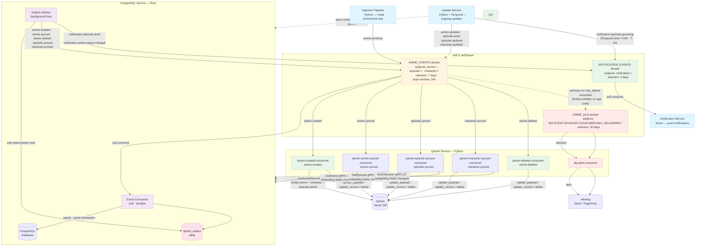

# Event-Driven Architecture

## Overview

The Echora backend uses event-driven architecture to decouple services and eliminate schema duplication. Two event publishers exist with distinct responsibilities:

- **Ingestion Pipeline**: one-time full enrichment only — publishes `anime.enriched` after all 5 stages complete
- **Update Service**: ongoing partial updates — publishes `episode.aired`, `anime.updated`, `episode.updated`, and `character.updated` on schedule (Temporal-based)

> [!important] Key Benefit
> **Zero schema duplication** - Only PostgreSQL Service owns SQL models. Both pipeline and worker work purely with Protobuf events.

## Architecture Diagram


```mermaid
graph TB
    Ingestion["Ingestion Pipeline
    Python — initial enrichment only"]
    UpdateService["Update Service
    Python + Temporal — ongoing updates"]
    NotificationService["Notification Service
    future — push notifications"]

    subgraph NATS_BOX [NATS JetStream]
        ANIME_EVENTS["ANIME_EVENTS stream
        subjects: anime.> · episode.> · character.>
        retention: 7 days · dupe-window: 24h"]
        ANIME_DLQ["ANIME_DLQ stream
        subjects: $JS.EVENT.ADVISORY.CONSUMER.MAX_DELIVERIES.*
        retention: 30 days"]
        NOTIF_EVENTS["NOTIFICATION_EVENTS stream
        subjects: notification.>
        retention: 3 days"]
    end

    subgraph PGService [PostgreSQL Service — Rust]
        Consumer["Event Consumer
        pull · durable"]
        PG[("PostgreSQL
        Database")]
        Outbox[("qdrant_outbox
        table")]
        OutboxWorker["Outbox Worker
        background loop"]
    end

    subgraph QdrantService [Qdrant Service — Python]
        QC["qdrant-created-consumer
        anime.created"]
        QAS["qdrant-anime-synced-consumer
        anime.synced"]
        QES["qdrant-episode-synced-consumer
        episode.synced"]
        QCS["qdrant-character-synced-consumer
        character.synced"]
        QD_C["qdrant-deleted-consumer
        anime.deleted"]
        AlertConsumer["dlq-alert-consumer"]
    end

    QD[("Qdrant
    Vector DB")]
    Alerting["Alerting
    Slack / PagerDuty"]

    %% Publishers → ANIME_EVENTS
    Ingestion -->|"anime.enriched"| ANIME_EVENTS
    UpdateService -->|"anime.updated · episode.aired
    episode.updated · character.updated"| ANIME_EVENTS

    %% ANIME_EVENTS → PostgreSQL Consumer
    ANIME_EVENTS -->|"pull consume"| Consumer

    %% PostgreSQL Consumer → DB + outbox (same transaction)
    Consumer -->|"upsert · same transaction"| PG
    Consumer --> Outbox

    %% Outbox Worker → ANIME_EVENTS + NOTIFICATION_EVENTS
    OutboxWorker -->|"poll unprocessed rows"| Outbox
    OutboxWorker -->|"anime.created · anime.synced · anime.deleted
    episode.synced · character.synced"| ANIME_EVENTS
    OutboxWorker -->|"notification.episode.aired
    notification.anime.status.changed"| NOTIF_EVENTS

    %% ANIME_EVENTS → Qdrant consumers (one per subject)
    ANIME_EVENTS -->|"anime.created"| QC
    ANIME_EVENTS -->|"anime.synced"| QAS
    ANIME_EVENTS -->|"episode.synced"| QES
    ANIME_EVENTS -->|"character.synced"| QCS
    ANIME_EVENTS -->|"anime.deleted"| QD_C

    %% anime.created → fetch full AnimeRecord (anime + characters + episodes)
    QC -->|"GetAnimeRecord gRPC"| PGService
    QC -->|"create anime + character + episode points"| QD

    %% synced consumers → targeted gRPC fetch (embedding fields only) or direct update_payload
    QAS -->|"GetAnime gRPC (if embedding fields changed)"| PGService
    QES -->|"GetEpisode gRPC (if embedding fields changed)"| PGService
    QCS -->|"GetCharacter gRPC (if embedding fields changed)"| PGService
    QAS & QES & QCS & QD_C -->|"update_payload / update_vectors / delete"| QD

    %% DLQ alerting
    ANIME_DLQ -->|"advisory"| AlertConsumer
    AlertConsumer -->|"alert"| Alerting

    %% Update Service → NOTIFICATION_EVENTS (Temporal timers)
    UpdateService -->|"notification.episode.upcoming
    (Temporal timer T-24h · T-1h)"| NOTIF_EVENTS

    %% NOTIFICATION_EVENTS → Notification Service
    NOTIF_EVENTS -->|"pull consume"| NotificationService

    %% DLQ advisory flow (broker-managed)
    ANIME_EVENTS -.->|"advisory on max_deliver exceeded
    (broker-emitted, no app code)"| ANIME_DLQ
    ANIME_DLQ --> AlertConsumer
    AlertConsumer --> Alerting

    UpdateService -.->|"query broadcast schedule
    gRPC"| PGService

    style Ingestion fill:#e1f5ff,stroke:#90caf9
    style UpdateService fill:#e1f5ff,stroke:#90caf9
    style NotificationService fill:#e1f5ff,stroke:#90caf9
    style ANIME_EVENTS fill:#fff4e1,stroke:#ffb74d
    style ANIME_DLQ fill:#ffeaea,stroke:#ef9a9a
    style NOTIF_EVENTS fill:#e8f5e9,stroke:#a5d6a7
    style Consumer fill:#f3e5f5,stroke:#ce93d8
    style OutboxWorker fill:#f3e5f5,stroke:#ce93d8
    style Outbox fill:#fce4ec,stroke:#f48fb1
    style QC fill:#e8f5e9,stroke:#a5d6a7
    style QS fill:#e8f5e9,stroke:#a5d6a7
    style QD_C fill:#e8f5e9,stroke:#a5d6a7
    style AlertConsumer fill:#ffeaea,stroke:#ef9a9a
```

## Event Bus Selection: NATS with JetStream

### Why NATS?

| Feature | Benefit |
|---------|---------|
| **Lightweight** | ~20MB memory footprint (vs 1GB+ for Kafka) |
| **Simple Setup** | Single Docker container, no Zookeeper |
| **Production Ready** | Used by Netflix, Ericsson, Siemens |
| **At-Least-Once** | JetStream provides durable message persistence |
| **Excellent Clients** | Official Rust (`async-nats`) and Python (`nats-py`) |
| **Low Latency** | Sub-millisecond message delivery |
| **Local Testing** | Easy to run locally for development |

### Event Bus Comparison

| Feature | NATS | Redis Streams | Kafka | RabbitMQ |
|---------|------|---------------|-------|----------|
| **Setup** | ⭐⭐⭐ Simple | ⭐⭐⭐ Simple | ⭐ Complex | ⭐⭐ Medium |
| **Memory** | ~20MB | ~50MB | ~1GB+ | ~100MB |
| **Throughput** | High | Medium | Very High | Medium |
| **Persistence** | ✅ JetStream | ✅ Streams | ✅ Topics | ✅ Durable |
| **Rust Support** | ✅ Official | ⭐ Community | ⭐ Community | ⭐ Community |
| **Python Support** | ✅ Official | ✅ Official | ✅ Official | ✅ Official |
| **Ops Complexity** | Low | Low | High | Medium |
| **Best For** | Microservices | Simple queues | Big data | Task queues |

> [!tip] Alternative: Redis Streams
> If you're already using Redis for caching, Redis Streams is a simpler option for smaller message volumes. However, NATS is more specialized for messaging and offers better performance at scale.

## Docker Compose Setup

```yaml
version: '3.8'

services:
  nats:
    image: nats:latest
    container_name: echora-nats
    ports:
      - "4222:4222"   # Client connections
      - "8222:8222"   # HTTP monitoring
    command:
      - "-js"         # Enable JetStream
      - "-m"          # Enable monitoring
      - "8222"        # Monitoring port
    volumes:
      - nats-data:/data
    networks:
      - echora-network

  # NATS monitoring UI (optional)
  nats-box:
    image: natsio/nats-box:latest
    container_name: echora-nats-box
    networks:
      - echora-network
    depends_on:
      - nats
    command:
      - "tail"
      - "-f"
      - "/dev/null"

volumes:
  nats-data:
    driver: local

networks:
  echora-network:
    driver: bridge
```

### Starting NATS Locally

```bash
# Start NATS
docker compose up -d nats

# Check NATS health
curl http://localhost:8222/healthz

# View NATS streams (using nats-box)
docker exec -it echora-nats-box nats stream ls

# Monitor NATS
open http://localhost:8222
```

## Event Flow

### 1. Ingestion → NATS

> [!tip] Connection & Stream as Singletons
> Create the NATS connection and call `add_stream` **once at service startup**, not inside the per-message publish function. `add_stream` is idempotent but adds a round-trip on every call. Store `nc` and `js` as application-level singletons (e.g. FastAPI lifespan, dependency injection, or module-level globals).

> [!important] Message Deduplication via `Nats-Msg-Id`
> Every publish must include a `Nats-Msg-Id` header. NATS JetStream uses this header for server-side deduplication: if the same ID is published twice within the stream's `dupe-window`, the second message is silently dropped. This protects against double-publish on network retries.
>
> - **Key format**: `{anime_id}-{payload_sha256[:8]}` — unique per anime per content version
> - **dupe-window**: Set to `24h` on `ANIME_EVENTS` (default 2 min is too short for batch ingestion runs that may retry overnight)
> - This is **broker-level** dedup. The PostgreSQL consumer must **also** be idempotent at the DB level — see the upsert note below.

```python
# Ingestion Pipeline (Python)
import hashlib, os
from uuid import uuid4
import nats
from google.protobuf.timestamp_pb2 import Timestamp

# --- Startup (call once, e.g. in FastAPI lifespan) ---

async def init_nats() -> tuple[nats.NATS, nats.js.JetStreamContext]:
    """Initialise NATS connection and ensure stream exists.

    Call once at application startup. Reuse the returned (nc, js) pair
    for all subsequent publish calls — do not reconnect per message.
    """
    nc = await nats.connect(os.environ.get("NATS_URL", "nats://localhost:4222"))
    js = nc.jetstream()
    await js.add_stream(
        name="ANIME_EVENTS",
        subjects=["anime.>", "episode.>", "character.>"],
        duplicate_window=86400,  # 24h dedup window (default is 2min — too short)
    )
    return nc, js

# --- Per-message publish (reuses the singleton js context) ---

async def publish_enriched_anime(
    js: nats.js.JetStreamContext,
    anime_record: AnimeRecord,
) -> None:
    """Publish enriched anime data to NATS after all 5 enrichment stages complete."""
    payload = AnimeEnrichedEvent(
        event_id=str(uuid4()),
        timestamp=Timestamp.GetCurrentTime(),
        anime_id=anime_record.anime.id,
        anime=to_protobuf(anime_record.anime),
        characters=[to_protobuf(c) for c in anime_record.characters],
        episodes=[to_protobuf(e) for e in anime_record.episodes],
        enrichment_metadata=build_metadata(),
    ).SerializeToString()

    # Dedup key: anime_id + first 8 hex chars of payload SHA-256
    # Same anime re-enriched with identical data → same Nats-Msg-Id → broker drops duplicate
    payload_sha256 = hashlib.sha256(payload).hexdigest()
    msg_id = f"{anime_record.anime.id}-{payload_sha256[:8]}"

    await js.publish(
        subject="anime.enriched",
        payload=payload,
        headers={
            "Content-Type": "application/protobuf",
            "Nats-Msg-Id": msg_id,
            # Nats-Expected-Stream: publish errors loudly if this subject is not bound
            # to ANIME_EVENTS — catches wrong NATS URL, stream renamed, or subject mismatch
            # before silent data loss can occur.
            "Nats-Expected-Stream": "ANIME_EVENTS",
        },
    )
```

### 2. NATS → PostgreSQL Service

```rust
// PostgreSQL Service (Rust)
use async_nats::jetstream;

async fn consume_anime_events() -> Result<()> {
    let client = async_nats::connect("nats://localhost:4222").await?;
    let jetstream = jetstream::new(client);

    // Create consumer
    let stream = jetstream.get_stream("ANIME_EVENTS").await?;
    // get_or_create_consumer is idempotent — safe to call at every service startup/restart.
    // create_consumer would error if the durable consumer already exists on the server.
    let consumer = stream
        .get_or_create_consumer("postgres-enriched-consumer", jetstream::consumer::pull::Config {
            durable_name: Some("postgres-enriched-consumer".to_string()),
            filter_subject: "anime.enriched".to_string(),
            ..Default::default()
        })
        .await?;

    // Consume messages
    let mut messages = consumer.messages().await?;
    while let Some(msg) = messages.next().await {
        let msg = msg?;

        // Deserialize protobuf
        let event = AnimeEnrichedEvent::decode(msg.payload)?;

        // Persist to PostgreSQL
        match ingest_anime(&event).await {
            Ok(_) => {
                msg.ack().await?;
                publish_anime_created(&event.anime_id).await?;
            }
            Err(e) => {
                eprintln!("Failed to ingest anime: {}", e);
                msg.nak().await?;
            }
        }
    }

    Ok(())
}
```

> [!important] PostgreSQL Consumer Idempotency
> `anime.enriched` events **will** be redelivered — on ack timeout, consumer restart, or NATS cluster failover. Every DB write must be an **upsert**, never a bare `INSERT`. A redelivered `anime.enriched` on an already-existing `anime_id` must silently succeed.
>
> Two-layer idempotency strategy:
> 1. **Broker layer**: `Nats-Msg-Id` header on publish + 24h `dupe-window` on `ANIME_EVENTS` (see publisher above). Catches duplicates within the dedup window at zero cost.
> 2. **DB layer**: `ON CONFLICT` upserts. Catches duplicates outside the window and after consumer restarts.

```rust
// ── Anime upsert ─────────────────────────────────────────────────────────
// WHERE clause prevents overwriting newer data with a stale redelivery.
sqlx::query!(
    r#"
    INSERT INTO anime (id, title, synopsis, status, updated_at, ...)
    VALUES ($1, $2, $3, $4, $5, ...)
    ON CONFLICT (id) DO UPDATE SET
        title      = EXCLUDED.title,
        synopsis   = EXCLUDED.synopsis,
        status     = EXCLUDED.status,
        updated_at = EXCLUDED.updated_at,
        ...
    WHERE anime.updated_at < EXCLUDED.updated_at
    "#,
    event.anime_id, ...
)
.execute(&pool)
.await?;

// ── Outbox insert ────────────────────────────────────────────────────────
// ON CONFLICT DO NOTHING: if outbox row already exists (redelivered event
// before outbox worker ran), do not create a duplicate sync trigger.
sqlx::query!(
    r#"
    INSERT INTO qdrant_outbox (entity_type, entity_id, op, version, queued_at)
    VALUES ('anime', $1, 'upsert', $2, now())
    ON CONFLICT (entity_id, op) DO NOTHING
    "#,
    event.anime_id, version
)
.execute(&pool)
.await?;
```

> [!note] Episode events and idempotency
> `episode.aired` has a 60s ack window. If the Rust consumer persists the episode but crashes before sending the ack, the event is redelivered. The episode insert must also be an upsert:
> `INSERT INTO episodes (anime_id, episode_number, ...) ... ON CONFLICT (anime_id, episode_number) DO UPDATE SET ...`

### 3. PostgreSQL Service → NATS → Qdrant Service

```rust
// PostgreSQL Service publishes after successful write
async fn publish_anime_created(anime_id: &str) -> Result<()> {
    let event = AnimeCreatedEvent {
        event_id: Uuid::new_v4().to_string(),
        timestamp: Some(prost_types::Timestamp::now()),
        anime_id: anime_id.to_string(),
    };

    jetstream
        .publish(
            "anime.created",
            event.encode_to_vec().into()
        )
        .await?
        .await?;

    Ok(())
}
```

> [!warning] Subject Wildcard Pitfall
> Do **not** use `anime.*` as the consumer subject filter. The single-level wildcard `*` matches `anime.enriched` and `anime.updated` in addition to `anime.created` / `anime.synced` / `anime.deleted`. Those first two subjects carry `AnimeEnrichedEvent` and `AnimeUpdatedEvent` payloads — deserialising them as `AnimeCreatedEvent` silently corrupts data. Use **per-subject pull consumers** as shown below.

```python
# Qdrant Service (Python)
import asyncio, os, logging
import nats, nats.errors

logger = logging.getLogger(__name__)

async def run_qdrant_consumer():
    """Consume PostgreSQL Service sync events and update Qdrant vectors.

    Only subscribes to events published by the PostgreSQL Service outbox worker
    (anime.created, anime.synced, anime.deleted). Never consumes pipeline events
    directly — PostgreSQL is always the source of truth.
    """
    nc = await nats.connect(os.environ.get("NATS_URL", "nats://localhost:4222"))
    js = nc.jetstream()

    # Map subject → (durable consumer name, proto class)
    # Each subject has a distinct proto type — use separate pull consumers,
    # not a shared "anime.*" subscription.
    consumers: dict[str, tuple[str, type]] = {
        "anime.created":     ("qdrant-created-consumer",           AnimeCreatedEvent),
        "anime.synced":      ("qdrant-anime-synced-consumer",      AnimeSyncedEvent),
        "episode.synced":    ("qdrant-episode-synced-consumer",    EpisodeSyncedEvent),
        "character.synced":  ("qdrant-character-synced-consumer",  CharacterSyncedEvent),
        "anime.deleted":     ("qdrant-deleted-consumer",           AnimeDeletedEvent),
    }

    async def consume(subject: str, durable: str, proto_cls: type) -> None:
        sub = await js.pull_subscribe(subject, durable=durable)
        while True:
            try:
                msgs = await sub.fetch(batch=10, timeout=5)
            except nats.errors.TimeoutError:
                continue  # stream empty, poll again
            for msg in msgs:
                try:
                    event = proto_cls.FromString(msg.data)
                    # Fetch entity data from PostgreSQL Service via gRPC (embedding fields only)
                    anime_data = await fetch_via_grpc(event.anime_id)
                    await update_vectors(anime_data, event)
                    await msg.ack()
                except Exception as e:
                    logger.error("[%s] Failed to process message: %s", subject, e)
                    # nak() causes IMMEDIATE redelivery — burns through max_deliver rapidly.
                    # For transient failures, let ack_wait expire instead (natural backoff delay).
                    await msg.nak()

    await asyncio.gather(*[
        consume(subj, dur, cls)
        for subj, (dur, cls) in consumers.items()
    ])
```

## Event Subjects Hierarchy

```
# ── ANIME_EVENTS stream (anime.> + episode.> + character.>) ────────────

# Published by Ingestion Pipeline → consumed by PostgreSQL Service
anime.enriched          # Initial full enrichment — anime + all characters + all episodes (once per anime)

# Published by Update Service → consumed by PostgreSQL Service
anime.updated           # Any anime field change — sparse payload, changed_fields is authoritative
episode.aired     # New episode confirmed aired — carries EpisodeData + optional AnimeStatus
episode.updated         # Metadata change on existing episode (title, synopsis, images, etc.)
character.updated       # Character detail change (description, images, traits, etc.)

# Published by PostgreSQL Service outbox worker → consumed by Qdrant Service
anime.created           # After initial ingest committed to DB — triggers Qdrant initial index (anime + characters + episodes)
anime.synced            # After any anime update committed — Qdrant syncs anime point
anime.deleted           # After soft delete committed
episode.created         # After episode first written to DB
episode.synced          # After episode update committed — Qdrant syncs episode point
character.created       # After character first written to DB
character.synced        # After character update committed — Qdrant syncs character point

# ── NOTIFICATION_EVENTS stream (notification.>) ─────────────────────────

# Published by Update Service (Temporal timer) → consumed by Notification Service (future)
notification.episode.upcoming   # T-24h and T-1h before expected air — Temporal workflow per episode

# Published by PostgreSQL Service outbox worker → consumed by Notification Service (future)
notification.episode.aired      # After episode committed to DB
notification.anime.status.changed     # After anime status change committed to DB
```

## Consumer Configuration

### Pull Consumers (Decided)

All consumers use **pull** (not push). Pull means the service actively fetches messages when ready, giving full backpressure control.

**How pull works:**
```
while true:
  messages = js.fetch(batch=10, expires=5s)
  # ↑ blocks up to 5s if stream empty — effectively real-time
  # ↑ returns immediately when messages are available
  for msg in messages:
    process(msg)
    msg.ack()
  # immediately fetch again
```

**Pull vs Push:**

| | Pull | Push |
|--|------|------|
| **Rate control** | Service controls pace | NATS pushes as fast as possible |
| **Backpressure** | ✅ Built-in | ❌ Service can be overwhelmed |
| **Bulk ingestion** | ✅ Process 10 at a time | ❌ 1000 events flood the service |
| **Restart safety** | ✅ NATS remembers position | ✅ NATS remembers position |

### Confirmed Settings

| Setting | Value |
|---------|-------|
| **Consumer type** | Pull |
| **Batch size** | 10 messages per fetch |
| **Ack timeout** | 30s (redelivered if not acked) |
| **Max retries** | 5 attempts |
| **DLQ alerting** | Immediate on first DLQ message |

### Stream & Consumer Setup

```
Stream: ANIME_EVENTS
  Subjects:      ["anime.>", "episode.>", "character.>"]
  Storage:       File (survives NATS restarts)
  Retention:     7 days
  Dupe window:   24h   ← set explicitly; default 2min is too short for batch ingestion
  # max_msgs_per_subject — useful when subjects include entity IDs
  # (e.g. anime.created.{anime_id} instead of flat anime.created).
  # With per-entity subjects, max_msgs_per_subject: 1 collapses rapid
  # consecutive creates/syncs for the same entity into one pending message.
  # Requires widening consumer filters: anime.created.* instead of anime.created.
  # Not set here — flat subjects are simpler for the current message volume.

# Backoff note: each consumer below carries Backoff: [1s, 5s, 30s, 2m].
# This is 4 inter-delivery delays for 5 total deliveries (max_deliver: 5).
# Without it, all retries fire at the flat ack_wait interval — all 5 exhausted in ~2.5 min.

# ── PostgreSQL Service consumers ──────────────────────────────────
Consumer: postgres-enriched-consumer
  Filter:        anime.enriched
  Type:          Pull, Durable
  Ack policy:    Explicit
  Ack wait:      30s
  Max deliver:   5     ← after 5 attempts, NATS emits advisory → ANIME_DLQ captures it
  Backoff:       [1s, 5s, 30s, 2m]
  Batch size:    10

Consumer: postgres-episode-aired-consumer
  Filter:        episode.aired
  Type:          Pull, Durable
  Ack policy:    Explicit
  Ack wait:      60s   (longer: episode insert + FK lookup + anime.episode_count update)
  Max deliver:   5
  Backoff:       [1s, 5s, 30s, 2m]
  Batch size:    10

Consumer: postgres-anime-updated-consumer
  Filter:        anime.updated
  Type:          Pull, Durable
  Ack policy:    Explicit
  Ack wait:      30s
  Max deliver:   5
  Backoff:       [1s, 5s, 30s, 2m]
  Batch size:    10
  # Writes to DB + qdrant_outbox in same transaction (SAGA)

Consumer: postgres-episode-updated-consumer
  Filter:        episode.updated
  Type:          Pull, Durable
  Ack policy:    Explicit
  Ack wait:      30s
  Max deliver:   5
  Backoff:       [1s, 5s, 30s, 2m]
  Batch size:    10

Consumer: postgres-character-updated-consumer
  Filter:        character.updated
  Type:          Pull, Durable
  Ack policy:    Explicit
  Ack wait:      30s
  Max deliver:   5
  Backoff:       [1s, 5s, 30s, 2m]
  Batch size:    10

# ── Qdrant Service consumers — one per distinct proto type ────────
# Do NOT use wildcards (e.g. anime.* matches anime.enriched/anime.updated incorrectly).
Consumer: qdrant-created-consumer
  Filter:        anime.created
  Type:          Pull, Durable
  Ack policy:    Explicit
  Ack wait:      30s
  Max deliver:   5
  Backoff:       [1s, 5s, 30s, 2m]
  Batch size:    10

Consumer: qdrant-anime-synced-consumer
  Filter:        anime.synced
  Type:          Pull, Durable
  Ack policy:    Explicit
  Ack wait:      30s
  Max deliver:   5
  Backoff:       [1s, 5s, 30s, 2m]
  Batch size:    10

Consumer: qdrant-episode-synced-consumer
  Filter:        episode.synced
  Type:          Pull, Durable
  Ack policy:    Explicit
  Ack wait:      30s
  Max deliver:   5
  Backoff:       [1s, 5s, 30s, 2m]
  Batch size:    10

Consumer: qdrant-character-synced-consumer
  Filter:        character.synced
  Type:          Pull, Durable
  Ack policy:    Explicit
  Ack wait:      30s
  Max deliver:   5
  Backoff:       [1s, 5s, 30s, 2m]
  Batch size:    10

Consumer: qdrant-deleted-consumer
  Filter:        anime.deleted
  Type:          Pull, Durable
  Ack policy:    Explicit
  Ack wait:      30s
  Max deliver:   5
  Backoff:       [1s, 5s, 30s, 2m]
  Batch size:    10

# ──────────────────────────────────────────────────────────────────
# Dead-letter stream — populated automatically by NATS server.
# No application code publishes to this stream directly.
# ──────────────────────────────────────────────────────────────────
Stream: ANIME_DLQ
  Subjects:      $JS.EVENT.ADVISORY.CONSUMER.MAX_DELIVERIES.ANIME_EVENTS.*
  Storage:       File
  Retention:     30 days   ← longer than ANIME_EVENTS for post-mortem debugging
  # NATS server publishes an advisory here whenever a consumer hits max_deliver.
  # Advisory payload contains stream_seq (to retrieve the original message)
  # and consumer_name (to identify which pipeline stage failed).
  # An alert consumer watches this stream and fires PagerDuty/Slack on new messages.

# ──────────────────────────────────────────────────────────────────
# Notification stream — fan-out triggers, separate from data pipeline.
# Data is always committed to PostgreSQL before any notification fires.
# ──────────────────────────────────────────────────────────────────
Stream: NOTIFICATION_EVENTS
  Subjects:         notification.>
  Storage:          File
  Retention:        3 days   ← notifications are time-sensitive; stale ones are useless
  Dupe window:      1h
  Allow msg TTL:    true     ← NATS 2.11+: enables per-message Nats-TTL header
  # Publishers set Nats-TTL on each notification so the broker auto-expires stale messages.
  # Example: notification.episode.upcoming published at T-24h with Nats-TTL: 23h
  # — if the Notification Service is down for 24h, the T-24h warning is silently
  # dropped rather than delivered as a stale "airing soon" for an episode already aired.

# Two publisher types:
#   - Update Service (Temporal timer): notification.episode.upcoming
#   - PostgreSQL outbox worker: notification.episode.aired, notification.anime.status.changed

Consumer: notification-consumer   (future — Notification Service)
  Filter:        notification.>
  Type:          Pull, Durable
  Ack policy:    Explicit
  Ack wait:      10s
  Max deliver:   3   ← stale notifications must not retry indefinitely
  Backoff:       [5s, 30s]   ← 2 inter-delivery delays for 3 max deliveries
  Batch size:    10
```

## Error Handling

### Retry Policy

```rust
use async_nats::jetstream::consumer::pull::Config;

Config {
    durable_name: Some("postgres-enriched-consumer".to_string()),
    filter_subject: "anime.enriched".to_string(),
    max_deliver: 5,                    // retry up to 5 times
    ack_wait: Duration::from_secs(30), // 30s before first delivery times out
    // Server-side geometric backoff — each element is the wait before that retry index.
    // Without this, all 5 retries fire with 30s gaps: exhausted in ~2.5 minutes total.
    // With this, a transient DB restart or network blip has time to resolve naturally.
    // 4 elements → 4 inter-delivery delays for 5 total deliveries (matches max_deliver: 5).
    backoff: vec![
        Duration::from_secs(1),
        Duration::from_secs(5),
        Duration::from_secs(30),
        Duration::from_secs(120),
    ],
    ..Default::default()
}
```

### Dead Letter Queue

After `max_deliver` (5) attempts without a successful ack, NATS JetStream automatically publishes an advisory to:

```
$JS.EVENT.ADVISORY.CONSUMER.MAX_DELIVERIES.ANIME_EVENTS.<consumer-name>
```

The `ANIME_DLQ` stream subscribes to `$JS.EVENT.ADVISORY.CONSUMER.MAX_DELIVERIES.ANIME_EVENTS.*` and captures all of these advisories automatically. **No application code re-publishes the message to a DLQ subject** — the broker handles this entirely.

> [!important] Why a separate stream, not `anime.dlq.*` on `ANIME_EVENTS`
> - `ANIME_EVENTS` has 7-day retention. DLQ messages need 30 days for post-mortem debugging.
> - If DLQ messages lived in `ANIME_EVENTS` under `anime.dlq.*`, a replay attempt re-publishing to `anime.enriched` could accidentally route back through the same failing consumer.
> - With advisory subjects, the original message stays in `ANIME_EVENTS` at its original sequence number — it is never re-published. Replay is explicit: retrieve via `stream_seq`, fix the root cause, then re-publish intentionally.
> - The NATS server tracks delivery counts internally — no `if num_delivered >= 5` check in application code.

**Advisory payload fields** (relevant subset):
```json
{
  "stream":       "ANIME_EVENTS",
  "consumer":     "postgres-enriched-consumer",
  "stream_seq":   12345,          // sequence number of the failed message in ANIME_EVENTS
  "deliveries":   5,              // delivery attempts made
  "domain":       ""
}
```

To retrieve the original message for inspection:
```bash
# Via nats CLI — fetch by stream sequence number
docker exec echora-nats-box nats stream get ANIME_EVENTS 12345
```

**Alert consumer** (watches `ANIME_DLQ`, fires on every new message):
```python
async def run_dlq_alert_consumer(js: nats.js.JetStreamContext) -> None:
    """Watch ANIME_DLQ advisory stream and alert immediately on any new message."""
    sub = await js.pull_subscribe(
        "$JS.EVENT.ADVISORY.CONSUMER.MAX_DELIVERIES.ANIME_EVENTS.*",
        durable="dlq-alert-consumer",
        stream="ANIME_DLQ",
    )
    while True:
        try:
            msgs = await sub.fetch(batch=10, timeout=5)
        except nats.errors.TimeoutError:
            continue
        for msg in msgs:
            advisory = json.loads(msg.data)
            await send_alert(
                f"DLQ: consumer={advisory['consumer']} "
                f"stream_seq={advisory['stream_seq']} "
                f"deliveries={advisory['deliveries']}"
            )
            await msg.ack()
```

> [!warning] DLQ Alerting
> Alert fires **immediately** on the first DLQ advisory. Start strict (alert on every message), relax to batched/throttled alerts only if alert volume becomes operational noise.

## Monitoring

### NATS Monitoring Endpoints

```bash
# Server info
curl http://localhost:8222/varz

# JetStream info
curl http://localhost:8222/jsz

# Stream details
docker exec echora-nats-box nats stream info ANIME_EVENTS

# Consumer lag
docker exec echora-nats-box nats consumer report ANIME_EVENTS
```

### Key Metrics

| Metric | Description | Alert Threshold |
|--------|-------------|-----------------|
| **Consumer Lag** | Unprocessed messages | > 1000 messages |
| **Delivery Attempts** | Messages requiring retry | > 3 attempts |
| **DLQ Size** | Failed messages | > 10 messages |
| **Processing Time** | Time to ack message | > 5 seconds |
| **Memory Usage** | NATS server memory | > 100MB |

## Local Development

### Quick Start

```bash
# 1. Start NATS
docker compose up -d nats

# 2. Create streams
docker exec echora-nats-box nats stream add ANIME_EVENTS \
  --subjects "anime.>" \
  --subjects "episode.>" \
  --subjects "character.>" \
  --storage file \
  --retention limits \
  --max-age 7d

# 3. Test publishing
docker exec echora-nats-box nats pub anime.enriched "test message"

# 4. Test consuming
docker exec echora-nats-box nats sub anime.enriched
```

### Testing Event Flow

```python
# Test script: test_event_flow.py
import asyncio
import nats

async def test_event_flow():
    nc = await nats.connect("nats://localhost:4222")
    js = nc.jetstream()

    # Publish test event
    await js.publish("anime.enriched", b"Test anime event")

    # Pull consume — consistent with production pull consumers
    sub = await js.pull_subscribe("anime.enriched", durable="test-consumer")
    msgs = await sub.fetch(batch=1, timeout=5)
    for msg in msgs:
        print(f"Received: {msg.data.decode()}")
        await msg.ack()

    await nc.close()

if __name__ == "__main__":
    asyncio.run(test_event_flow())
```

## Production Considerations

> [!warning] Production Checklist
> - [ ] Enable TLS for NATS connections
> - [ ] Set up NATS cluster (3+ nodes) for high availability
> - [ ] Configure retention policies per stream
> - [ ] Set ANIME_EVENTS `dupe-window` to `24h` (default 2min is too short for batch ingestion)
> - [ ] Verify `ANIME_DLQ` stream exists with `$JS.EVENT.ADVISORY.CONSUMER.MAX_DELIVERIES.ANIME_EVENTS.*` subjects and 30-day retention
> - [ ] Verify DLQ alert consumer (`dlq-alert-consumer`) is running and connected to alerting
> - [ ] All PostgreSQL consumer writes use `ON CONFLICT` upserts (not bare INSERTs)
> - [ ] All publish calls include `Nats-Expected-Stream` header matching the target stream name (`ANIME_EVENTS` or `NOTIFICATION_EVENTS`)
> - [ ] `NOTIFICATION_EVENTS` stream has `allow_msg_ttl: true`; all notification publishers set `Nats-TTL` header
> - [ ] Set up monitoring and alerting
> - [ ] Implement circuit breakers in consumers
> - [ ] Add structured logging with correlation IDs
> - [ ] Configure resource limits (CPU, memory)

### NATS Cluster Setup

```yaml
# For production, run NATS in cluster mode
services:
  nats-1:
    image: nats:latest
    command:
      - "-js"
      - "-cluster"
      - "nats://0.0.0.0:6222"
      - "-routes"
      - "nats://nats-2:6222,nats://nats-3:6222"

  nats-2:
    image: nats:latest
    command:
      - "-js"
      - "-cluster"
      - "nats://0.0.0.0:6222"
      - "-routes"
      - "nats://nats-1:6222,nats://nats-3:6222"

  nats-3:
    image: nats:latest
    command:
      - "-js"
      - "-cluster"
      - "nats://0.0.0.0:6222"
      - "-routes"
      - "nats://nats-1:6222,nats://nats-2:6222"
```

## Qdrant Sync Pattern

### Outbox Pattern for Durable Sync

PostgreSQL Service uses the **outbox pattern** to ensure Qdrant stays synchronized with database changes.

```sql
-- Outbox table (see Database Schema.md)
CREATE TABLE qdrant_outbox (
  id bigserial PRIMARY KEY,
  entity_type text NOT NULL,        -- 'anime', 'character', 'episode'
  entity_id uuid NOT NULL,
  op text NOT NULL,                 -- 'upsert', 'delete'
  version bigint NOT NULL,
  queued_at timestamptz NOT NULL DEFAULT now(),
  processed_at timestamptz
);
```

**Flow**:
1. PostgreSQL Service writes to database
2. In same transaction, inserts row into `qdrant_outbox`
3. Background worker polls outbox
4. Worker fetches entity data, generates embeddings, updates Qdrant
5. Marks outbox row as processed

**Benefits**:
- ✅ At-least-once delivery (survives service restarts)
- ✅ Transactional consistency (outbox + data in same transaction)
- ✅ Retry logic built-in
- ✅ Audit trail of sync operations

### Outbox Worker Implementation

```rust
// PostgreSQL Service - Qdrant Sync Worker
async fn process_qdrant_outbox() -> Result<()> {
    loop {
        // Fetch pending outbox entries
        let entries = sqlx::query!(
            "SELECT * FROM qdrant_outbox
             WHERE processed_at IS NULL
             ORDER BY queued_at
             LIMIT 100"
        )
        .fetch_all(&pool)
        .await?;

        for entry in entries {
            match entry.op.as_str() {
                "upsert" => {
                    // Fetch full entity from database
                    let entity = fetch_entity(&entry.entity_type, &entry.entity_id).await?;

                    // Publish AnimeCreatedEvent to NATS
                    publish_anime_created_event(&entry.entity_id).await?;

                    // Mark processed
                    mark_processed(entry.id).await?;
                }
                "delete" => {
                    // Publish deletion event
                    publish_anime_deleted_event(&entry.entity_id).await?;
                    mark_processed(entry.id).await?;
                }
                _ => {}
            }
        }

        tokio::time::sleep(Duration::from_secs(5)).await;
    }
}
```

---

## Ingestion State Tracking

### Dual State Storage

Ingestion state is stored in **two places**:

1. **PostgreSQL (Authoritative)**: `ingestion_runs`, `anime_ingestion_state`
2. **Sidecar File (Backup)**: `assets/seed_data/anime_database.ingestion_state.json`

**Why both?**
- PostgreSQL: Query ingestion history, idempotency checks
- Sidecar: Portable backup, operational visibility, disaster recovery

### Schema

```sql
CREATE TABLE ingestion_runs (
  id bigserial PRIMARY KEY,
  artifact_uri text NOT NULL,
  artifact_sha256 text NOT NULL,
  started_at timestamptz NOT NULL DEFAULT now(),
  finished_at timestamptz,
  status text NOT NULL DEFAULT 'running',
  error text
);

CREATE TABLE anime_ingestion_state (
  anime_id uuid PRIMARY KEY REFERENCES anime(id) ON DELETE CASCADE,
  last_run_id bigint REFERENCES ingestion_runs(id),
  last_enriched_at timestamptz,
  last_ingested_at timestamptz,
  last_payload_sha256 text,          -- For idempotency
  ingestion_status text NOT NULL DEFAULT 'pending'
);
```

### Idempotent Ingestion

```python
# Ingestion Pipeline
async def ingest_anime(anime_record: AnimeRecord):
    """Idempotent anime ingestion."""
    # Compute payload hash
    payload_hash = hashlib.sha256(
        json.dumps(anime_record.dict(), sort_keys=True).encode()
    ).hexdigest()

    # Check if already ingested
    existing_state = await get_ingestion_state(anime_record.anime.id)
    if existing_state and existing_state.last_payload_sha256 == payload_hash:
        logger.info(f"Anime {anime_record.anime.id} unchanged, skipping")
        return

    # Publish event to NATS
    event = AnimeEnrichedEvent(
        anime_id=anime_record.anime.id,
        anime=to_protobuf(anime_record.anime),
        characters=[to_protobuf(c) for c in anime_record.characters],
        episodes=[to_protobuf(e) for e in anime_record.episodes],
    )
    await publish_to_nats("anime.enriched", event)

    # Update state (via PostgreSQL Service after processing)
    # PostgreSQL Service will update anime_ingestion_state when it consumes the event
```

---

## Incremental Update Policy

### Auto-Apply (Safe Changes)

These changes are applied automatically without review:

- ✅ **Status transitions**: `ONGOING` → `FINISHED`, `NOT_YET_AIRED` → `AIRING`
- ✅ **Episode count increases**: New episodes added
- ✅ **New episodes**: Appended with unique `(anime_id, episode_number)`
- ✅ **Metadata additions**: New genres, tags, themes added to JSONB

### Flag for Review (Potential Regressions)

These changes require manual review before applying:

- ⚠️ **Title changes**: May indicate data error or merge needed
- ⚠️ **Type changes**: `TV` → `MOVIE` unusual
- ⚠️ **Episode count decreases**: Likely data error
- ⚠️ **Large field removals**: Synopsis/background deletion
- ⚠️ **Source material changes**: Rare, needs verification

### Implementation

```rust
// PostgreSQL Service - Update validation
fn validate_anime_update(
    existing: &Anime,
    incoming: &AnimeData,
) -> UpdateDecision {
    let mut warnings = vec![];

    // Check for regressions
    if incoming.title != existing.title {
        warnings.push("Title changed");
    }

    if incoming.episode_count < existing.episode_count {
        warnings.push("Episode count decreased");
    }

    if incoming.type_ != existing.type_ {
        warnings.push("Type changed");
    }

    if warnings.is_empty() {
        UpdateDecision::AutoApply
    } else {
        UpdateDecision::FlagForReview(warnings)
    }
}
```

---

## NATS Key/Value: Broadcast Schedule Cache

Update Service needs each airing anime's broadcast schedule (day-of-week + time) to decide when to poll for new episodes. The current design queries PostgreSQL Service via gRPC on every schedule check. NATS KV replaces this with a server-side watch — one connection at startup, then the broker pushes changes as they happen.

> [!info] NATS KV is JetStream
> NATS KV is built directly on JetStream streams internally. No separate infrastructure is required — it is available whenever JetStream is enabled.

### KV Bucket

```
Bucket: broadcast_schedules
  Storage:   File
  TTL:       7 days     ← entries for finished / cancelled anime auto-expire
  History:   1          ← only the current schedule matters; no history needed
```

### Write (PostgreSQL Service outbox worker)

After committing any broadcast change to the database, the outbox worker writes to KV in the same pass as the NATS publish:

```python
kv = await js.key_value("broadcast_schedules")
await kv.put(
    anime_id,                                 # key: anime UUID string
    broadcast_schedule.SerializeToString(),   # value: BroadcastSchedule protobuf bytes
)
```

### Watch (Update Service)

```python
# Establish watch once at startup.
# Receives the full current state immediately, then receives each future change
# as a push — no polling loop, no per-check gRPC round-trip.
kv = await js.key_value("broadcast_schedules")
watcher = await kv.watch_all()

async for entry in watcher:
    if entry.operation == "PUT":
        schedule = BroadcastSchedule.FromString(entry.value)
        reschedule_temporal_workflow(entry.key, schedule)  # key = anime_id
    elif entry.operation == "DEL":
        cancel_temporal_workflow(entry.key)  # anime finished or cancelled
```

> [!note] gRPC vs KV
> The gRPC `query broadcast schedule` edge (UpdateService → PGService) becomes a push subscription. Update Service subscribes once and receives all future schedule changes immediately on commit. The gRPC interface remains available as a fallback for initial state hydration at startup if the KV bucket has not been populated yet.

---

## Update Service

The [[update_service|Update Service]] (Temporal-based) handles all ongoing partial updates — new episodes, score changes, status transitions, character data, and more. The ingestion pipeline handles initial full enrichment only.

**Publishes**: `episode.aired`, `anime.updated`, `episode.updated`, `character.updated`

Two distinct Temporal workflow types drive the episode lifecycle:

---

### Broadcast Schedule Monitor

A recurring Temporal schedule that runs **once per day** over all currently-airing anime.

**What it does:**
1. Polls source APIs (Jikan/MAL, AniList, [[syoboi_integration|Syoboi Calendar]]) for each airing anime's current broadcast schedule
2. Compares against the schedule stored in PG
3. If a change is detected (delay, hiatus, reschedule):
   - Publishes `AnimeUpdatedEvent` with `changed_fields: ["broadcast"]`
   - PG commits the new schedule → outbox worker writes it to the `broadcast_schedules` NATS KV bucket
   - The KV watch running in Update Service fires → cancels the existing `episode-checkin-{anime_id}-{episode_number}` workflow → creates a new one scheduled against the new air date

**Why daily is sufficient for the primary case:** delays are typically announced days in advance (network hiatuses, production delays). The daily sweep catches them with ample lead time before T-24h fires.

---

### Episode Check-in Workflow

A per-episode Temporal workflow that drives the notification and confirmation lifecycle.

**Workflow ID**: `episode-checkin-{anime_id}-{episode_number}` — deterministic, so it can be cancelled and recreated when the Broadcast Schedule Monitor detects a date change.

```
T-24h timer fires
  ├── Query source API for current expected air date    ← direct API call, not KV
  ├── Date CHANGED (same-day delay announced)
  │     → publish AnimeUpdatedEvent (broadcast field)
  │     → PG commits → KV updated
  │     → reschedule this workflow to new date
  │     → do NOT send EpisodeUpcomingNotification
  └── Date UNCHANGED
        → publish EpisodeUpcomingNotification(window="T-24h", Nats-TTL: 23h)
        → schedule T-1h timer

T-1h timer fires
  ├── Query source API for current expected air date    ← last safety net for same-day delays
  ├── Date CHANGED
  │     → publish AnimeUpdatedEvent
  │     → reschedule workflow → skip notification
  └── Date UNCHANGED
        → publish EpisodeUpcomingNotification(window="T-1h", Nats-TTL: 55min)
        → schedule T=0 timer

T=0 timer fires
  ├── Poll source API to confirm episode aired
  ├── Episode found
  │     → publish EpisodeAiredEvent (with optional AnimeStatus if final episode)
  │     → workflow completes
  ├── Episode NOT found — retry every 15–30 min, up to 2h total
  │     → covers broadcast overruns and streaming-platform confirmation lag
  └── After 2h retries exhausted
        → workflow exits cleanly
        → next daily Broadcast Schedule Monitor run detects the new air date
        → creates a fresh episode-checkin workflow with new T-24h/T-1h timers
```

> [!important] T-24h and T-1h query the source API directly — not KV
> The `broadcast_schedules` KV bucket is only as fresh as the last daily sweep. A delay announced at noon for an episode airing that evening would not be reflected in KV until the next midnight sweep. The direct source API call at T-24h and T-1h is what catches same-day announcements before the notification fires.

> [!note] No double notifications on reschedule
> If the T-24h workflow detects a changed date and reschedules, the new workflow fires its own T-24h notification for the new air date. The user always receives exactly one T-24h and one T-1h notification per airing, regardless of how many times the schedule shifts.

> [!note] Nats-TTL on notification events
> `EpisodeUpcomingNotification` is published to `NOTIFICATION_EVENTS` with `Nats-TTL: 23h` (T-24h window) or `Nats-TTL: 55min` (T-1h window). If the Notification Service is down or the message is not consumed before the original air time, the broker auto-expires it — a stale "airing soon" is never delivered for an episode that has already aired or been rescheduled.

---

## Related Documentation

- [[update_service|Update Service]] - All partial update workflows (Temporal-based)
- [[syoboi_integration|Syoboi Calendar Integration]] - Broadcast schedule source: API reference, ID mapping, adapter details
- [[Database Schema|Database Schema]] - Complete DDL and outbox table
- [[event_schema_specification|Event Schema Specification]] - Complete protobuf definitions
- [[postgres_integration_architecture_decision|PostgreSQL Architecture]] - Service design and rationale
- [NATS JetStream Documentation](https://docs.nats.io/nats-concepts/jetstream)
- [async-nats Rust Client](https://docs.rs/async-nats/)
- [nats.py Python Client](https://github.com/nats-io/nats.py)

---

**Status**: Active | **Last Updated**: 2026-02-24 | **Owner**: Backend Team
