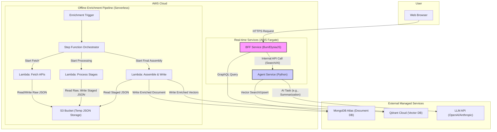

# Implementation Plan

This document breaks down the work required to implement the automated architecture proposed in `system_design_proposal.md`.

## Phase 1: Foundational Setup & Core Workflow

### Task 1.0: Initial System Bootstrap

- **Status:** `To-Do`
- **Goal:** Perform the one-time setup to upload the initial data and populate the vector database.

- **Steps:**
  1.  **Create S3 Bucket:** Provision the S3 bucket (e.g., `anime-vector-service-data`) that will serve as the primary data store.
  2.  **Image Ingestion, Deduplication, and Error Handling (Critical):** Develop and run a one-time script to:
      - Provision a new DynamoDB table, `image-deduplication-map`, with `source_url_hash` (SHA256 of the source image URL) as its primary key and a TTL enabled for `last_attempt` timestamps.
      - Provision an SQS Dead-Letter Queue (DLQ) for persistent image ingestion failures.
      - Provision a CloudFront distribution (managed via Pulumi IaC) with the S3 image bucket as its origin, configured for HTTPS-only access.
      - Iterate through the `enriched_anime_database.json`.
      - For each anime, identify all image CDN URLs (covers, posters, banners, character images).
      - For each URL:
        1.  Calculate `source_url_hash` (SHA256 of the source URL).
        2.  Check `image-deduplication-map` using `source_url_hash` to see if the image has already been processed or failed previously.
        3.  **If `source_url_hash` exists and maps to an S3 path:** Reuse the existing S3 path.
        4.  **If `source_url_hash` exists and indicates `DOWNLOAD_FAILED`:** Skip (or re-attempt if `TTL` has expired and `last_attempt` indicates it\'s time).
        5.  **If `source_url_hash` not found or ready for retry:**
            a. Attempt to download the image with a retry mechanism (e.g., `tenacity` with 3-5 retries, exponential backoff, and a total timeout of 30-60 seconds).
            b. **On successful download:**
            _ Calculate `content_hash` (SHA256 of the image binary content).
            _ Define S3 object key as `images/<content_hash>.<extension>` (extension derived from content type).
            - Upload the image to S3 _only if an object with that content hash doesn\'t already exist_. Ensure AWS SDK\'s retry logic is configured appropriately.
            - Store `source_url_hash -> our_s3_bucket_path` (using `content_hash`) in `image-deduplication-map`.
              _ Store original `source_url` and `content_type` as S3 object metadata.
              c. **On persistent download/upload failure (after all retries):**
              _ Send a structured message to the SQS DLQ containing `anime_id`, `image_url`, `error_message`, `timestamp`, `retry_count`, and `context`. \* Store `source_url_hash -> "DOWNLOAD_FAILED"` in `image-deduplication-map` along with a `last_attempt` timestamp and `TTL`.
      - For `AnimeEntry` objects with partially failed images, store the **new CloudFront URL** (e.g., `https://<cloudfront-domain>/images/<content_hash>.<extension>`) for successful images. For failed images, include the `image_url` and `error_message` within the `AnimeEntry` in MongoDB Atlas as a placeholder.
      - This ensures we own and control all image assets from the start, with robust deduplication, retry logic, and comprehensive error handling. The CloudFront URLs stored in `AnimeEntry` will always be HTTPS-only.
  3.  **Data Source Clarity (`anime-offline-database.json` vs `enriched_anime_database.json`):**
      - **`anime-offline-database.json`:** This external file is the **raw, external source of truth** for basic anime metadata. It is never directly ingested into our production DynamoDB or Qdrant.
      - **`enriched_anime_database.json` (Initial Local Version):** This is a **derived artifact** created locally during initial data preparation. It contains `AnimeEntry` objects after programmatic enrichment and image re-hosting (with CloudFront URLs). This local file is manually uploaded to S3 during initial system bootstrap.
      - **`enriched_anime_database.json` (S3 Version):** Once uploaded to S3 (`s3://<bucket-name>/processed/enriched_anime_database.json`), this becomes the **initial snapshot of our system\'s enriched data**. It serves as the baseline for our weekly sync process and as a full, portable backup.
      - **MongoDB Atlas (`animes` collection):** This collection is the **live, operational source of truth** for our enriched `AnimeEntry` objects after the initial bootstrap and subsequent weekly updates.
  4.  **Upload Enriched Database:** Manually upload the locally-generated `enriched_anime_database.json` (now with our S3 image URLs) to `s3://<bucket-name>/processed/enriched_anime_database.json`.
  5.  **Attach Metadata (Critical):** During the upload, attach a custom metadata tag `x-amz-meta-source-commit-sha` containing the commit hash of the `anime-offline-database` version that was used to generate the file. This provides the initial state for the system.
  6.  **Run Bulk Indexing Job:** Trigger a one-time, manual process to populate the Qdrant database. This will be a "scatter-gather" Lambda pattern to process ~40,000 entries in parallel without hitting timeouts.
      - **Performance Optimization:** To mitigate the significant performance impact of Lambda cold starts (especially when loading large embedding models), **Provisioned Concurrency** will be used for this job. Concurrency will be enabled for the indexing Lambda before the job begins and disabled immediately after its completion to ensure a fast bootstrap while controlling costs.

### Task 1.0.1: Establish Infrastructure as Code (IaC) Framework

- **Status:** `To-Do`
- **Goal:** Define and implement a robust Infrastructure as Code (IaC) framework for provisioning and managing all cloud resources.
- **Rationale:** IaC ensures that our cloud infrastructure is provisioned, configured, and managed in a repeatable, auditable, and version-controlled manner. This minimizes manual errors, facilitates environment consistency, and supports efficient disaster recovery.
- **Decision:** We will use **Pulumi with Python** as our Infrastructure as Code (IaC) framework.
- **Rationale:** This choice aligns with our team's existing Python expertise, allowing us to use a single language for both application and infrastructure code. It enables powerful abstractions, simplifies testing, and reduces context-switching.

- **Repository Structure:**
  - The Pulumi code for our infrastructure will live in its own dedicated Git repository (e.g., `anime-infra`). This separates infrastructure concerns from application code.

- **Initial Setup Requirements:**
  1.  **Git Repository:** A new, dedicated repository for all Pulumi code.
  2.  **Pulumi Account & CLI:** A Pulumi account for state management and the Pulumi CLI installed in local and CI/CD environments.
  3.  **Cloud Credentials:** Securely configured API keys for AWS, MongoDB Atlas, and Qdrant Cloud, managed via environment variables or CI/CD secrets.

- **Pulumi Providers:**
  - **AWS:** The official `pulumi_aws` provider will be used for all AWS resources.
  - **MongoDB Atlas:** The official `pulumi_mongodbatlas` provider will be used. ([Link](https://www.pulumi.com/registry/packages/mongodbatlas/))
  - **Qdrant Cloud:** The official `pulumi_qdrant_cloud` provider will be used. ([Link](https://www.pulumi.com/registry/packages/qdrant-cloud/))

- **Comprehensive List of Resources to Provision (Repository Structure):**

  To ensure maximum modularity, readability, and separation of concerns, the `anime-infra` repository will be structured as follows. Each file will be responsible for a specific set of resources.

  ```
  anime-infra/
  ├── .github/
  │   └── workflows/
  │       └── cicd.yml         # GitHub Actions workflow for infrastructure
  ├── __main__.py              # Main entry point for the Pulumi program
  ├── Pulumi.yaml              # Project definition file
  ├── Pulumi.dev.yaml          # Configuration for the 'dev' environment/stack
  ├── Pulumi.prod.yaml         # Configuration for the 'production' environment/stack
  ├── requirements.txt         # Python dependencies (pulumi, pulumi_aws, etc.)
  └── components/
      ├── __init__.py
      ├── aws/                     # AWS-specific components
      │   ├── __init__.py
      │   ├── networking.py        # VPC, subnets, security groups, NAT/IGW
      │   ├── s3_buckets.py        # S3 buckets (e.g., for images, pipeline data)
      │   ├── dynamodb_tables.py   # DynamoDB tables (e.g., image deduplication)
      │   ├── ecs_cluster.py       # ECS Cluster definition
      │   ├── ecs_services.py      # Fargate Task Definitions and Services (BFF, Agent)
      │   ├── lambda_functions.py  # All Lambda functions for the enrichment pipeline
      │   ├── step_functions.py    # Step Function state machine definition
      │   ├── secrets_manager.py   # Secrets Manager setup
      │   ├── elasticache.py       # ElastiCache for Redis cluster
      │   └── cloudfront.py        # CloudFront distribution for images
      ├── qdrant/                  # Qdrant Cloud-specific components
      │   ├── __init__.py
      │   └── cluster.py           # Qdrant Cloud cluster and API keys
      ├── mongo/                   # MongoDB Atlas-specific components
      │   ├── __init__.py
      │   ├── cluster.py           # MongoDB Atlas cluster
      │   ├── users.py             # Database users for BFF and Agent
      │   ├── network_access.py    # IP Access List / VPC Peering for Atlas
      │   └── collections_indexes.py # MongoDB collections and their indexes
      └── application/             # Application-level wiring of components
          ├── __init__.py
          ├── bff.py               # Wires up AWS ECS service for BFF, connects to Mongo
          └── agent.py             # Wires up AWS ECS service for Agent, connects to Qdrant/Mongo
  ```

  - **How it Works:**
    - **`components/aws/`, `components/qdrant/`, `components/mongo/`:** Each of these subdirectories groups all resources related to a specific cloud provider. Within these, individual files define specific resource types (e.g., `s3_buckets.py` for all S3 buckets).
    - **`components/application/`:** This directory acts as an abstraction layer. For example, `bff.py` will define the _entire BFF application stack_ by importing and configuring the necessary AWS ECS services from `aws/ecs_services.py` and connecting them to the MongoDB cluster defined in `mongo/cluster.py`.
    - **`__main__.py`:** This top-level file remains simple. It will primarily import and instantiate the high-level application components from `components/application/`.

- **CI/CD Integration:**
  - Integrate IaC deployments into a CI/CD pipeline using **GitHub Actions** in the new infrastructure repository.
  - **CI Workflow (on Pull Requests):**
    - Runs `pulumi preview` to show planned infrastructure changes. This output can be posted as a comment on the PR for peer review.
  - **CD Workflow (on Merge to `main`):**
    - Executes `pulumi up` to apply infrastructure changes.
    - This job will target protected GitHub Environments (e.g., `staging`, `production`) that require manual approval before deployment.
  - **Authentication:**
    - **AWS:** Utilize OpenID Connect (OIDC) for secure, credential-less authentication from GitHub Actions to AWS IAM.
    - **MongoDB Atlas & Qdrant Cloud:** API keys will be stored as GitHub Secrets and accessed by the Pulumi workflow.
  - **Pulumi State:** The Pulumi Service backend will be used for secure and collaborative state management. While an alternative exists to store state in an S3 bucket with DynamoDB for locking (keeping state entirely within AWS), the Pulumi Service is chosen for its managed nature, built-in collaboration features (team management, RBAC), web UI for operational visibility, integrated Policy as Code, and audit logging capabilities, which collectively reduce operational overhead and enhance team productivity.

### Task 1.1: Automated Weekly Database Sync

- **Status:** `To-Do`
- **Component:** `Weekly-Sync-Starter-Lambda`
- **Trigger:** AWS EventBridge, scheduled for every Saturday at 01:00 UTC.

- **Logic (Intelligent Sync):**
  1.  Uses the commit SHA in the S3 object metadata to check if the `anime-offline-database` has been updated.
  2.  If so, it downloads the new offline DB.
  3.  It iterates through each anime in the new offline DB and checks for its existence in the main `animes` collection in MongoDB Atlas.
  4.  **For New Anime (not found in the main collection):**
      - **Acquire Lock:** It attempts to acquire a lock by inserting an item into the `anime-processing-locks` collection in MongoDB Atlas using a unique index and write concern to ensure atomicity.
      - **On Success:** If the lock is acquired successfully, it triggers the full `Enrichment-Step-Function` to add the new anime. The Step Function will be responsible for deleting the lock upon completion.
      - **On Failure:** If the lock acquisition fails (meaning another process has already claimed this anime), it does nothing and moves to the next anime.
  5.  **For Existing Anime (found in MongoDB Atlas):**
      - If the entry is currently marked with `system_status == "ORPHANED"`, it will be "resurrected" by setting its status back to `ACTIVE` and clearing the `orphaned_at` timestamp.
      - Performs a selective "diff-and-merge" against the record fetched from MongoDB Atlas to avoid data regression. A set of critical, non-enriched fields from the offline database are compared against our record.
      - **Watched Fields:** `title`, `type`, `status`, `source`.
      - **Logic:** If a discrepancy is found in **any** of the watched fields, the anime will be flagged for human review. This ensures significant upstream changes are not silently ignored.
      - **Special Episode Count Logic:** The `episodes` count is handled separately.
        - If `offline_count > our_count`, flag the anime for human review, as we may be missing episodes.
        - If `offline_count <= our_count`, **do nothing**, as our live data is considered more accurate.
      - All other fields from the offline DB for existing entries are ignored to protect our enriched data. A human reviewer makes the final decision on how to merge flagged changes.
  6.  **For Removed Anime (Orphaning):**
      - After processing the source file, the sync process will identify all anime present in our `animes` collection that were not present in the source file.
      - In line with our goal of creating a comprehensive database, these entries will **never be deleted**.
      - Instead, they will be marked as "orphaned" by updating the entry to include a `system_status: "ORPHANED"` field and an `orphaned_at` timestamp.
      - The API layer will be responsible for filtering these orphaned records from default user-facing queries, but they can be made accessible via a specific query parameter (e.g., `?include_orphaned=true`).

### Task 1.2: Provision Qdrant Vector Database (Qdrant Cloud)

- **Status:** `To-Do`
- **Goal:** To provision and configure a managed, production-ready vector database using Qdrant Cloud.
- **Rationale:** Using a managed service like Qdrant Cloud eliminates the operational burden of self-hosting, including setup, scaling, high availability, and maintenance. This allows the team to focus on application development.

- **Steps:**
  1.  **Create Qdrant Cloud Account & Provision Cluster:** Sign up for a Qdrant Cloud account and provision clusters according to the sizing details below.
  2.  **Obtain Credentials:** From the cluster dashboard, generate role-specific API Keys.
  3.  **Configure Application & Security:** Store credentials securely in AWS Secrets Manager and configure network access (VPC Peering/IP Whitelisting).

#### Configuration Details

- **Vector Parameters:**
  - **Character Vector:** `384` dimensions (e.g., for `all-MiniLM-L6-v2`).
  - **Synopsis Vector:** `768` dimensions (e.g., for `all-mpnet-base-v2`).
  - **Image Vector:** `512` dimensions (e.g., for `CLIP-ViT-B/32`).
  - **Distance Metric:** `Cosine` similarity for all vectors.
- **Indexing and Storage:**
  - **Storage:** `memmap` storage will be enabled for all vector collections to reduce RAM usage.
  - **Precision:** `int8` quantization will be used to reduce memory and storage footprint by 4x.
  - **Payload:** All payloads will be stored on-disk.

#### Sizing and Tiers

- **Development/Staging Environment:**
  - **Cluster Tier:** `DEV-0` (Free Tier) with 1 vCPU and 1.5 GiB RAM.
  - **Replication:** Disabled.
- **Production Environment:**
  - **Initial Cluster Tier:** `PRD-S-1` (Small Production) with 1 vCPU and 6 GiB RAM per node.
  - **Replication Factor:** `2`, for high availability across multiple AZs.
  - **Sharding:** Start with `1` shard.

#### Security and Access Control

To ensure our Qdrant Cloud cluster is robustly secured, we will implement a multi-layered approach:

1.  **Network Security (Priority Order):**
    - **VPC Peering (Production):** For our production environment, we will establish a VPC Peering connection between our AWS VPC and the Qdrant Cloud VPC. This is the most secure method as it ensures traffic between our application services (EKS, Lambdas) and the database never traverses the public internet. This will be configured via our IaC (Pulumi).
    - **IP Whitelisting (Dev/Staging/Fallback):** For non-production environments and as a necessary tool for local development and CI/CD, we will use IP Whitelisting. We will maintain a list of allowed IP addresses in the Qdrant Cloud console for our office/VPN and any static IPs used by our build agents.

2.  **Authentication & Authorization:**
    - **API Key Management:** All API keys will be stored and managed exclusively in **AWS Secrets Manager**. Application code will not contain any hardcoded keys.
    - **Least-Privilege Keys:** We will create separate, role-specific API keys for different purposes:
      - `agent-service-key` (Read/Write): For the main agent service that needs to upsert and search vectors.
      - `bff-service-key` (Read-Only): If the BFF ever needs to query Qdrant directly (unlikely in the current architecture, but good practice), it would use a read-only key.
      - `dev-key` (Read/Write): A separate key for developers to use against the dev cluster.
    - **Key Rotation:** We will establish a policy to rotate these API keys annually.

3.  **AWS IAM Integration (Indirect Control):**
    - While Qdrant Cloud does not use AWS IAM directly for its control plane, we will leverage IAM to enforce strict access control _to the API keys_.
    - The IAM Role associated with each AWS service (e.g., the EKS pod for the Agent Service, a Lambda function) will be granted a narrow policy that allows it to read **only the specific secret** it needs from AWS Secrets Manager.
    - For example, the Agent Service's IAM role will have permission to `secretsmanager:GetSecretValue` on the ARN for the `agent-service-key` secret, and nothing else. This prevents a compromised service from accessing credentials for other parts of our infrastructure.

#### Monitoring and Alerting (Production)

- The following alerts will be configured in Qdrant Cloud to signal when scaling is required:
  - CPU Utilization > 80%
  - RAM Usage > 85%
  - Query Latency (p95) > 500ms

#### Backup and Restore Strategy

A robust backup and restore strategy is essential for disaster recovery, combining Qdrant's native features with our own application-level backups.

1.  **Leveraging Qdrant Cloud's Native Backups:**
    - **Automated Snapshots:** Qdrant Cloud's production tiers (`PRD-*`) include automated daily snapshots of the cluster data. We will rely on this as our primary mechanism for point-in-time recovery of the entire cluster state.
    - **Retention Policy:** These automated snapshots are typically retained for a set period (e.g., 7 days). This is sufficient for recovering from recent operational errors.
    - **Restore Process:** Restoration from a native snapshot is a manual process initiated through the Qdrant Cloud UI or API. In a disaster scenario, we would provision a new cluster and restore the latest snapshot to it. This process should be documented and tested quarterly.

#### 2. Application-Level Backup (Re-indexing from Source of Truth)

While native snapshots are great for full cluster recovery, they don't protect us from data corruption that is replicated in the snapshot or allow for migrating to a different vector DB provider easily.

- **The "Golden Source":** Our primary, application-level "backup" is the data stored in **MongoDB Atlas**. The vector embeddings in Qdrant are a derivative of this data.
- **Restore Strategy:** In a scenario where Qdrant data is unrecoverable or corrupted, or if we need to migrate, our DR strategy will be to **re-index from the source of truth**.
- **Process:** We will develop a script (or leverage the `bulk_indexer_lambda` from Task 1.0) that can be triggered manually. This script will:
  1.  Read all `AnimeEntry` documents from the MongoDB Atlas `animes` collection.
  2.  For each entry, regenerate the vector embeddings using the same models.
  3.  Upsert the new vectors into a new, clean Qdrant collection or cluster.

#### Summary of Strategy

- **For Rapid Recovery (Operational Errors):** Use Qdrant Cloud's native daily snapshots. RTO (Recovery Time Objective) is low (hours), RPO (Recovery Point Objective) is up to 24 hours.
- **For Major Disasters or Migrations:** Use our application-level re-indexing process from MongoDB. RTO is higher (could be a day, depending on dataset size), but RPO is very low (minutes, as MongoDB is our live DB).

#### Backup and Restore Strategy

A robust backup and restore strategy is essential for disaster recovery, combining Qdrant's native features with our own application-level backups.

1.  **Leveraging Qdrant Cloud's Native Backups:**
    - **Automated Snapshots:** Qdrant Cloud's production tiers (`PRD-*`) include automated daily snapshots of the cluster data. This will be our primary mechanism for point-in-time recovery of the entire cluster state.
    - **Retention Policy:** Rely on Qdrant Cloud's default retention policy (e.g., 7 days) for operational recovery.
    - **Restore Process:** Restoration from a native snapshot is a manual process initiated through the Qdrant Cloud UI or API. This process should be documented and tested quarterly.

2.  **Application-Level Backup (Re-indexing from Source of Truth):**
    - **The "Golden Source":** Our primary, application-level "backup" is the data stored in **MongoDB Atlas**. The vector embeddings in Qdrant are a derivative of this data.
    - **Restore Strategy:** In a scenario where Qdrant data is unrecoverable or corrupted, or if we need to migrate, our DR strategy will be to **re-index from the source of truth**.
    - **Process:** We will develop a script (or leverage the `bulk_indexer_lambda` from Task 1.0) that can be triggered manually. This script will:
      1.  Read all `AnimeEntry` documents from the MongoDB Atlas `animes` collection.
      2.  For each entry, regenerate the vector embeddings using the same models.
      3.  Upsert the new vectors into a new, clean Qdrant collection or cluster.

3.  **Summary of Strategy:**
    - **For Rapid Recovery (Operational Errors):** Use Qdrant Cloud's native daily snapshots. RTO (Recovery Time Objective) is low (hours), RPO (Recovery Point Objective) is up to 24 hours.
    - **For Major Disasters or Migrations:** Use our application-level re-indexing process from MongoDB. RTO is higher (could be a day, depending on dataset size), but RPO is very low (minutes, as MongoDB is our live DB).

- **Note on Modularity and Future Alternatives:** The application's vector database client will be implemented via a dedicated adapter module. While Qdrant Cloud is the initial choice, this modular design allows for switching to other managed vector databases in the future with minimal changes to the core application logic. Alternatives like Zilliz Cloud (for Milvus) should be periodically re-evaluated to ensure the chosen provider continues to meet the project's cost and performance needs.

### Task 1.2.1: Provision Enriched Data Store (MongoDB Atlas)

- **Status:** `To-Do`
- **Goal:** To deploy a managed NoSQL document database (MongoDB Atlas) to store enriched `AnimeEntry` objects for fast retrieval and serving user-facing applications. This database will complement the vector database by providing full payload details for anime IDs returned by vector searches.
- **Rationale:** The existing JSON file approach for enriched data lacks the scalability, query flexibility, and operational features required for a production-grade, user-facing data store. MongoDB Atlas offers a flexible document model, rich querying capabilities, and seamless integration with various cloud ecosystems, making it ideal for our complex `AnimeEntry` objects.
- **Steps:**
  1.  **Create MongoDB Atlas Account & Project:** Sign up for a MongoDB Atlas account and create a new project.
  2.  **Provision Cluster:** Create a new MongoDB Atlas cluster (e.g., an M0 Free Tier for initial development, scaling up to M10+ for production). Choose the appropriate cloud provider (AWS) and region.
  3.  **Configure Network Access:** Set up IP Access List entries or VPC Peering to allow connections from your application's environment (e.g., AWS Fargate, Lambda functions).
  4.  **Create Database and Collections:** Within the cluster, create a database (e.g., `anime_service`) and collections for `animes`, `episodes`, and `characters`.
      - **Primary Key:** The `_id` field in MongoDB will store our ULID-based identifiers (`ani_ULID`, `ep_ULID`, `char_ULID`).
      - **Indexing:** Create appropriate indexes on fields like `anime_id` (for episodes/characters), `system_status`, and other frequently queried fields to ensure efficient retrieval.
  5.  **Define Data Model:** The `AnimeEntry`, `EpisodeDetailEntry`, and `CharacterEntry` Pydantic models (`src/models/anime.py`) will serve as the direct schema for documents stored in these collections. We will use a Python ODM (e.g., Beanie) to map Pydantic models to MongoDB documents.
  6.  **Configure IAM Roles/Policies:** Ensure that the FastAPI service (running on Fargate), Lambda functions (for ingestion/consolidation), and any other relevant services have appropriate network access and credentials to connect to MongoDB Atlas. Store connection strings securely (e.g., using AWS Secrets Manager).
  7.  **Initial Data Load Script:** Develop a one-time script to read the existing `enriched_anime_database.json` from S3 and batch-write all `AnimeEntry` objects (and extract/write `EpisodeDetailEntry` and `CharacterEntry` into their respective collections) into the new MongoDB Atlas collections. This will be part of the initial system bootstrap.

### Task 1.2.2: Provision Idempotency Lock Table

- **Status:** `To-Do`
- **Goal:** To create a dedicated MongoDB Atlas collection to act as a distributed lock, ensuring that enrichment workflows are only triggered once per new anime.
- **Rationale:** This prevents race conditions and duplicate workflow executions caused by Lambda retries, without polluting the primary `animes` collection with placeholder records.
- **Steps:**
  1.  **Create MongoDB Collection:** Create a new, simple MongoDB collection (e.g., `anime-processing-locks`) within your MongoDB Atlas database.
      - **Primary Key:** The `_id` field will store the `anime_id` (string) as the unique identifier for the lock.
      - **TTL (Time-to-Live) Index:** Create a TTL index on a `ttl` attribute (timestamp) to automatically clean up stale locks from failed workflows after a set period (e.g., 24 hours).
  2.  **Configure Access:** Ensure that the Lambda functions (for the weekly sync) have appropriate access to read, write, and delete items in this new collection.

#### Lock Granularity and TTL Justification

- **Lock Granularity:** For the current scope of full anime enrichment workflows, using `anime_id` as the sole lock key is sufficient. This prevents duplicate full enrichment processes for the same anime. Finer-grained locking (e.g., `anime_id:episode_update`) can be introduced if future requirements for partial, concurrent updates emerge.
- **TTL Value Justification:** A **24-hour TTL** will be applied to the `anime-processing-locks` collection. This duration provides a generous buffer for the maximum possible workflow duration (including retries and human-in-the-loop delays), minimizes the risk of premature lock expiry, and allows for human intervention in case of stuck workflows. The impact of a stale lock for a few extra hours is considered less critical than duplicate processing or a workflow failing due to premature lock expiry. This value can be adjusted based on operational experience.

### Task 1.3: Design the Enrichment Step Function

- **Status:** `To-Do`
- **Goal:** Define the state machine in AWS Step Functions that orchestrates the enrichment process.
- **Key Feature:** The workflow will include a single callback task that pauses the entire workflow for a final human validation before committing any data.
- **Flow:**
  1.  **Automated Processing:** A series of parallel states will run the programmatic enrichment and all staging scripts (1-5). **This will include a dedicated step for image ingestion:**
      - For each newly fetched or updated `AnimeEntry`, identify all external image CDN URLs.
      - Download these images.
      - Upload them to our S3 bucket (e.g., `s3://<bucket-name>/images/anime/<anime-id>/<image-hash>.jpg`).
      - Update the `AnimeEntry` object to replace external CDN URLs with our internal S3 URLs.
  2.  **Assemble Entry:** A state (implemented as a Lambda function, e.g., `AssembleEntryLambda`) that combines the outputs of all previous steps into a single, final `AnimeEntry` object. **Crucially, this step performs a strict schema validation by parsing the assembled data against the `AnimeEntry` Pydantic model. If validation fails, the workflow will halt, preventing malformed data from proceeding to human review or database commit.**
  3.  **Pause for Validation:** A single **pause state** that sends the complete `AnimeEntry` object to the validation queue and waits for a human to approve, edit, or reject it.
  4.  **Commit Data:** Upon approval, this state runs. It executes the critical dual write to Qdrant and MongoDB Atlas, governed by a multi-layered reliability strategy to ensure data consistency.
      - It **writes the approved `AnimeEntry` object to the MongoDB Atlas collection**, making it live in the system.
      - It saves a copy of the single, approved `AnimeEntry` object to a dedicated S3 prefix (e.g., `processed/updated-entries/<anime-id>.json`) as a permanent audit log.

      - **Commit Strategy: Ensuring Atomicity with an Explicit Saga Pattern**
        To guarantee that the dual write to Qdrant and MongoDB is an "all or nothing" operation, the Step Function will implement an explicit Saga pattern. This makes the orchestration logic visible and debuggable directly in the AWS console.

        **Implementation: The Commit Workflow States**

        The commit process will be orchestrated across several distinct Step Function states, each triggering a small, single-purpose Lambda function.

        1.  **State 1: Write to Qdrant (`WriteToQdrantLambda`)**
            - A `Task` state that invokes a Lambda responsible only for upserting the vector embeddings into the Qdrant collection.
            - This state will have its own `Retry` policy for transient network errors.
            - On success, it proceeds to the next state. On permanent failure, the entire workflow fails.

        2.  **State 2: Write to MongoDB (`WriteToMongoLambda`)**
            - A `Task` state that invokes a Lambda responsible only for writing the full `AnimeEntry` document to the MongoDB Atlas `animes` collection.
            - This state also has its own `Retry` policy.
            - **Crucially, this state has a `Catch` block.** If it fails permanently after all retries, the `Catch` block will redirect the workflow to the compensating action state.

        3.  **State 3: Rollback Qdrant (`RollbackQdrantLambda`) - Compensating Action**
            - A `Task` state that is only triggered by the `Catch` block of the "Write to MongoDB" state.
            - It invokes a Lambda whose sole responsibility is to delete the vector data that was successfully written in State 1, using the `anime_id` from the input.
            - This ensures no "orphaned" vectors exist in the search index if the primary data write fails.

        **Resilience Layers:**

        1.  **Layer 1: Native Retries:** Each `Task` state (`WriteToQdrant`, `WriteToMongo`) will use Step Functions' native `Retry` mechanism with exponential backoff to handle transient errors for its specific operation.

        2.  **Layer 2: Explicit Saga Orchestration:** The state machine itself orchestrates the transaction, providing clear visibility into the workflow's progress and state. The flow is:
            - **Try:** `WriteToQdrant` -> `WriteToMongo`.
            - **Catch:** If `WriteToMongo` fails, transition to `RollbackQdrant`.

        3.  **Layer 3: Dead-Letter Queue (DLQ) for Human Intervention:** In the exceptional case that the Saga itself fails (e.g., the `RollbackQdrant` compensating action fails), the entire Step Function execution, along with its payload, is sent to an SQS Dead-Letter Queue. A CloudWatch Alarm on the DLQ will notify the engineering team for manual investigation and cleanup.

  5.  **Cleanup:** A final state to clean up any temporary resources from EFS.

#### Detailed State Machine Definition

The Enrichment Step Function will orchestrate the following sequence of operations, using a conditional `Choice` state at the beginning to select the appropriate execution path.

1.  **Initialize & Choose Path (Choice State):**
    - **Purpose:** Inspects the input payload for a `mode` field (`FULL_ENRICHMENT` or `EPISODE_UPDATE`) and directs the workflow to the appropriate path.
    - **State Type:** `Choice`

2.  **Path A: Full Enrichment**
    - This path is followed for new anime or for manual re-processing requests.
    - **A.1. Fetch External Data (All):** Fetches all data for the anime from multiple sources.
    - **A.2. Process All Staging Scripts:** Executes the full series of staging scripts (1-5).
    - **A.3. Image Ingestion & Re-hosting:** Processes all images for the anime.
    - **A.4. Assemble & Validate Full Entry:** Combines all data into a final `AnimeEntry` and validates the schema.

3.  **Path B: Episode Update**
    - This streamlined path is followed for daily single-episode updates, receiving the pre-fetched episode data from the triggering Lambda.
    - **B.1. Process Episode Staging Scripts:** Takes the episode data from the input payload and executes only the scripts relevant to episode processing (e.g., `process_stage2_episodes.py`).
    - **B.2. Assemble & Validate Episode Data:** Assembles the data for the new episode and validates it against an `EpisodeDetailEntry` schema.

4.  **Human Review (A2I Integration):**
    - **Purpose:** Both paths converge here. The workflow pauses and sends the assembled data (`AnimeEntry` from Path A, or the smaller `EpisodeDetailEntry` from Path B) to Amazon A2I for human validation.
    - **State Type:** `Task` (A2I `StartHumanLoop` integration)

5.  **Commit Data (Dual Write & State Management):**
    - **Purpose:** Persists validated data, manages the anime's lifecycle status, and perpetuates the scheduling loop for ongoing series.
    - **State Type:** `Task` (Lambda function: `CommitDataLambda`)
    - **Logic:**
        - **For Full Enrichment:** Performs a full upsert of the `AnimeEntry` to MongoDB and all associated vectors to Qdrant.
        - **For Episode Update (e.g., Episode N):**
            1.  **Enrich Episode N:** Updates the placeholder for Episode N in MongoDB with the full, human-approved data.
            2.  **Index Episode N:** Generates and upserts the `episode_vector` for the now-complete Episode N into Qdrant.
            3.  **Handle Lifecycle Status:**
                - Determines the new status. If the parent anime's status was `UPCOMING`, it's now `ONGOING`. If `episode_number == total_episodes`, it's now `FINISHED`.
                - Updates the `status` field in the parent `AnimeEntry` document in **MongoDB**.
                - Updates the `status` field in the vector's payload in **Qdrant** to ensure search filters are accurate.
            4.  **Handle Next Placeholder:** If the new status is `ONGOING`, it creates the barebone placeholder for the next episode (N+1) in MongoDB. If the status changed to `FINISHED`, this step is skipped, thus terminating the loop.
    - **Error Handling:** Implements the Saga pattern for atomicity.

6.  **Cleanup:**
    - **Purpose:** Remove any temporary resources.
    - **State Type:** `Task` (Lambda function: `CleanupLambda`)

#### Visual Diagram (Conceptual):

```mermaid
graph TD
    A[Start] --> B{Initialize & Choose Path};
    B -- mode: FULL_ENRICHMENT --> C[Path A: Full Fetch & Process];
    B -- mode: EPISODE_UPDATE --> D[Path B: Streamlined Episode Fetch & Process];
    C --> E{Human Review (A2I)};
    D --> E;
    E -- Approved --> F{Commit Data (Dual Write)};
    E -- Rejected --> G[Fail: Human Rejection];
    F --> H{Cleanup};
    H --> I[End];
```

#### Comprehensive Error Handling

To ensure the robustness and resilience of the Enrichment Step Function, a comprehensive error handling strategy will be implemented, building upon the high-level state machine definition.

**General Principles:**

1.  **Idempotency:** All Lambda functions within the Step Function will be designed to be idempotent, meaning they can be safely re-executed multiple times without causing unintended side effects. This is fundamental for effective retry mechanisms.
2.  **Granular Error Handling:** Error handling will be implemented at multiple levels:
    - **Within Lambda Functions:** Use `try-except` blocks to catch and handle expected errors, logging details to CloudWatch. For unrecoverable errors, re-raise exceptions to allow Step Functions to handle them.
    - **Step Functions State Level:** Configure `Retry` and `Catch` rules for each `Task` state to handle transient and permanent failures.

**Proposed Error Handling Mechanisms per State:**

1.  **Initialize Enrichment (`InitializeEnrichmentLambda`):**
    - **Expected Errors:** Invalid input format, missing required parameters.
    - **Handling:**
      - **Catch:** On `States.DataMismatch` or custom application errors, transition to a `Fail` state or a dedicated error notification path (e.g., send to an SQS DLQ for manual review).
      - **Retry:** Not typically needed for initialization unless external dependencies are involved (which should be minimal here).

2.  **Fetch External Data (`FetchExternalDataLambda`):**
    - **Expected Errors:** Network issues, API rate limits, external API downtime, invalid API responses, HTTP 4xx/5xx errors.
    - **Handling:**
      - **Retry:** Implement aggressive retry policies with exponential backoff for transient errors (e.g., `States.Timeout`, `States.TaskFailed`, HTTP 5xx). Use `Jitter` to prevent thundering herd.
      - **Catch:** On persistent failures (after retries are exhausted) or specific non-retryable errors (e.g., HTTP 404 for a non-existent anime), transition to a `HumanReviewForFetchErrors` state (A2I) or send to a `FetchErrorDLQ` for investigation.

3.  **Process Staging Scripts (`ProcessStagingScriptsLambda`):**
    - **Expected Errors:** Data parsing errors, schema mismatches, unexpected data formats from external APIs.
    - **Handling:**
      - **Retry:** Limited retries for transient issues (e.g., resource contention).
      - **Catch:** On data processing errors, transition to a `HumanReviewForProcessingErrors` state (A2I) to allow manual correction of the raw data or the script logic, or send to a `ProcessingErrorDLQ`.

4.  **Image Ingestion & Re-hosting (`ImageIngestionLambda`):**
    - **Expected Errors:** Image download failures, S3 upload failures, invalid image formats.
    - **Handling:**
      - **Retry:** Implement retries for network issues and S3 transient errors.
      - **Catch:** On persistent failures (after retries), mark the specific image as failed within the `AnimeEntry` object (as already planned in Task 1.0) and continue the workflow. Send details of the failed image to an `ImageIngestionDLQ` for asynchronous re-processing or manual intervention. The overall workflow should not fail due to a single image failure.

5.  **Assemble & Validate Entry (`AssembleValidateEntryLambda`):**
    - **Expected Errors:** Pydantic validation failures, logical inconsistencies in assembled data.
    - **Handling:**
      - **Catch:** On validation failure, transition to a `HumanReviewForValidationErrors` state (A2I) to allow a human to correct the `AnimeEntry` data, or send to a `ValidationFailureDLQ`. The workflow should not proceed with invalid data.

6.  **Human Review (A2I Integration):**
    - **Expected Errors:** Human review timeout, human rejection, A2I service errors.
    - **Handling:**
      - **Catch:**
        - On `States.Timeout` (human doesn't respond in time), transition to a `HumanReviewTimeoutDLQ` for re-submission or manual handling.
        - On human rejection, transition to a `Fail` state or a `HumanRejectionDLQ` for analysis.
        - On A2I service errors, implement retries for the A2I task itself.

7.  **Commit Data (`CommitDataLambda`):**
    - **Expected Errors:** Database connection issues, Qdrant/MongoDB write failures, network partitions.
    - **Handling:**
      - **Retry:** Implement robust retries with exponential backoff for both Qdrant and MongoDB write operations within the Lambda.
      - **Catch (Saga Pattern):** As previously defined, implement a Saga pattern with compensating actions (rollback Qdrant write if MongoDB fails).
      - **DLQ:** If the Saga itself fails (e.g., compensating action fails), send the entire Step Function execution details and `AnimeEntry` payload to a `CommitFailureDLQ` for immediate human intervention. This is a critical failure point.

8.  **Cleanup (`CleanupLambda`):**
    - **Expected Errors:** Resource deletion failures.
    - **Handling:**
      - **Retry:** Implement retries for transient resource deletion errors.
      - **Catch:** On persistent failures, log the error and potentially send to a `CleanupErrorDLQ` for manual cleanup, but allow the overall workflow to succeed if the core data commit was successful.

**Centralized Monitoring and Alerting:**

- All DLQs will be monitored by CloudWatch Alarms, triggering notifications (e.g., SNS to Slack/PagerDuty) for critical failures requiring immediate attention.
- CloudWatch Logs will capture detailed execution logs for all Lambda functions, aiding in debugging.

### Data Governance Responsibilities

- **Primary Data Owner:** As the sole owner of this project, you are the primary owner of the enriched `AnimeEntry` data stored in MongoDB Atlas and Qdrant. This includes ultimate responsibility for its accuracy, integrity, and adherence to defined policies.
- **Data Quality:** The Engineering Team is responsible for defining and enforcing data quality standards. Mechanisms like the A2I human review workflow and strict schema validation (`Assemble Entry` step) are key technical controls for maintaining quality.
- **Data Lifecycle:** The Engineering Team is responsible for implementing data lifecycle policies, including the "orphaning" strategy for removed anime and the future "hard delete" process for compliance.
- **Access Controls:** The Engineering Team is responsible for implementing and managing technical access controls (IAM, MongoDB roles) to the data.

### Task 1.4: Implement Portability & Backup Job

- **Status:** `To-Do`
- **Component:** `create-database-snapshot-lambda`
- **Trigger:** EventBridge (scheduled, e.g., weekly on Sunday).
- **Goal:** To create a periodic, full, cloud-agnostic snapshot of the entire enriched database. This file serves as a crucial artifact for disaster recovery and simplifies potential future migrations to other cloud providers.
- **Logic:**
  1.  The Lambda is triggered by a weekly schedule.
  2.  It connects to MongoDB Atlas and performs an export of all records from the `animes`, `episodes`, and `characters` collections.
  3.  It assembles all the records into a single `enriched_anime_database.json` file (or a set of files, one per collection).
  4.  It writes the complete file(s) to S3, overwriting the previous week's snapshot. This file now represents a complete, portable backup of the database state.

### Task 1.5: Provision Observability Platform (SigNoz)

- **Status:** `To-Do`
- **Goal:** Deploy a dedicated, self-hosted SigNoz instance in AWS to collect and visualize logs, metrics, and traces from all application components.
- **Rationale:** To provide a robust, open-source, and self-hosted observability stack, giving us deep insights into application performance and behavior without vendor lock-in. This is a foundational component for maintaining a production-grade system.
- **Architecture:**
  - **Compute:** A dedicated EC2 instance (e.g., `t3.large` or `t4g.large`) will be provisioned in a private VPC subnet. It will have a persistent EBS volume (e.g., 100 GB `gp3`) for storing telemetry data.
  - **Networking:** A dedicated Security Group will allow inbound traffic from application services (on OTel ports `4317`/`4318`) and from trusted IPs for accessing the web UI (on port `3301`).
  - **DNS:** A private Route 53 DNS record (e.g., `signoz.internal.anime-vector-service`) will be created for stable service discovery.
- **Implementation Steps:**
  1.  **IaC Integration:** Define all AWS resources (EC2, EBS, Security Group, Route 53) within the chosen IaC framework (Pulumi/Terraspace).
  2.  **Automated Deployment:** Use a `cloud-init` script to install Docker/Docker-Compose and launch the SigNoz services on the instance.
  3.  **Application Instrumentation:**
      - Add the OpenTelemetry SDK to the Python application dependencies.
      - Instrument the FastAPI service, Lambda functions, and key scripts.
      - Configure the services via environment variables (`OTEL_EXPORTER_OTLP_ENDPOINT`) to send telemetry data to the SigNoz instance.

#### Detailed Implementation Example

This section provides a more concrete, low-level example of how Task 1.5 would be implemented.

**1. Infrastructure as Code (IaC) Pseudo-code:**

The following demonstrates how the resources could be defined in a framework like Pulumi.

```python
# 1. Define the Security Group for SigNoz
signoz_sg = aws.ec2.SecurityGroup('signoz-sg',
    description='Allow SigNoz traffic',
    vpc_id=vpc.id,
    ingress=[
        # Allow OTLP data from our app's security group (e.g., sg-app-fargate)
        {'protocol': 'tcp', 'from_port': 4317, 'to_port': 4317, 'security_groups': [app_sg.id]},
        # Allow access to the web UI from a trusted IP
        {'protocol': 'tcp', 'from_port': 3301, 'to_port': 3301, 'cidr_blocks': ['YOUR_VPN_OR_OFFICE_IP/32']},
    ]
)

# 2. Define the EC2 instance with a startup script
signoz_instance = aws.ec2.Instance('signoz-instance',
    instance_type='t3.large',
    ami='<latest-amazon-linux-2-ami>',
    vpc_security_group_ids=[signoz_sg.id],
    user_data="""
        #!/bin/bash
        yum update -y
        yum install -y docker git
        systemctl start docker
        pip3 install docker-compose
        git clone https://github.com/SigNoz/signoz.git /opt/signoz
        cd /opt/signoz/deploy/docker/clickhouse-setup
        docker-compose up -d
    """
)

# 3. Create a private DNS record
dns_record = aws.route53.Record('signoz-dns',
    zone_id=private_dns_zone.id,
    name='signoz.internal.anime-vector-service',
    type='A',
    records=[signoz_instance.private_ip]
)
```

**2. Application Instrumentation (FastAPI Example):**

In `src/main.py`, the application would be configured to export telemetry.

- **Dependencies (`pyproject.toml`):**

  ```toml
  opentelemetry-api
  opentelemetry-sdk
  opentelemetry-exporter-otlp
  opentelemetry-instrumentation-fastapi
  opentelemetry-instrumentation-requests
  ```

- **Code (`src/main.py`):**

  ```python
  from fastapi import FastAPI
  from opentelemetry import trace
  from opentelemetry.sdk.resources import Resource
  from opentelemetry.sdk.trace import TracerProvider
  from opentelemetry.sdk.trace.export import BatchSpanProcessor
  from opentelemetry.exporter.otlp.proto.grpc.trace_exporter import OTLPSpanExporter
  from opentelemetry.instrumentation.fastapi import FastAPIInstrumentor
  import os

  # Configure the OTel SDK
  resource = Resource.create({"service.name": os.getenv("OTEL_SERVICE_NAME", "default-service")})
  tracer_provider = TracerProvider(resource=resource)
  trace.set_tracer_provider(tracer_provider)
  otlp_exporter = OTLPSpanExporter() # Endpoint configured by env var
  tracer_provider.add_span_processor(BatchSpanProcessor(otlp_exporter))

  # Instrument the app
  app = FastAPI()
  FastAPIInstrumentor.instrument_app(app)
  ```

- **Environment Variables (in Fargate Task Definition):**
  - `OTEL_SERVICE_NAME`: `anime-fastapi-service`
  - `OTEL_EXPORTER_OTLP_ENDPOINT`: `http://signoz.internal.anime-vector-service:4317`

### Task 1.6: Implement Cost Management & Governance

- **Status:** `To-Do`
- **Goal:** To establish a comprehensive strategy for monitoring, controlling, and optimizing AWS costs from the beginning of the project.
- **Rationale:** The number and scale of AWS services used can lead to unexpected costs if not proactively managed. This task ensures visibility and governance are built-in.
- **Implementation Steps:**
  1.  **AWS Budgets & Alerts:**
      - Create AWS Budgets for the overall project and for key services (e.g., Fargate, DynamoDB, A2I).
      - Configure tiered budget alerts at 50% and 90% of the monthly budget.
      - Route alerts via SNS to a dedicated Slack channel (e.g., `#cost-alerts`) for immediate visibility.
  2.  **Programmatic Tag Enforcement:**
      - Define a strict resource tagging policy requiring `project`, `environment`, and `service` tags for all resources.
      - Implement this policy using Pulumi's Policy as Code framework to programmatically prevent the creation of non-compliant resources.
  3.  **Cost Anomaly Detection:**
      - Enable AWS Cost Anomaly Detection to automatically identify unusual spending patterns.
      - Establish a bi-weekly review of detected anomalies to understand spending and refine the detector.
  4.  **Proactive Optimization:**
      - Establish a recurring monthly "Cost Optimization & Right-Sizing Review" task in the project backlog.
      - Use data from the SigNoz observability platform to analyze resource utilization (CPU, memory, etc.) and inform right-sizing decisions for EC2 instances and Fargate tasks.
      - Periodically evaluate DynamoDB capacity modes, moving from On-Demand to Provisioned with auto-scaling as traffic patterns become clear.

### Task 1.7: Establish Local Development Environment

- **Status:** `To-Do`
- **Goal:** To provide a comprehensive, easy-to-use local development environment that closely mimics the cloud infrastructure, enabling high developer productivity.
- **Rationale:** A poor or inconsistent local development experience can significantly slow down the team and introduce bugs. This task aims to create a "one-command setup."
- **Implementation Steps:**
  1.  **Docker Compose Orchestration:**
      - Create a `docker-compose.local.yml` file to define and orchestrate local versions of all key dependencies:
        - `vector-service`: The FastAPI application.
        - `qdrant`: The official Qdrant image.
        - `mongodb`: The official `mongo` Docker image. **This provides a local, API-compatible instance of MongoDB, ensuring consistency with our production MongoDB Atlas data store.**
        - `mongo-express`: (Optional) A web-based administration interface for MongoDB.
        - `minio`: To act as an S3-compatible object store.
        - `signoz`: The full SigNoz observability stack.
  2.  **Configuration Management:**
      - Create a `.env.local.example` file containing all necessary environment variables for the `vector-service` to connect to the other local containers (e.g., `MONGO_URI=mongodb://mongodb:27017/anime_service`).
      - This file will be git-ignored and developers can copy it to `.env.local` for their specific setup.
  3.  **Data Seeding:**
      - Create a `scripts/seed_local_env.py` script.
      - This script will populate the local Qdrant and MongoDB instances with a small, consistent set of sample data, derived from a **curated subset of the `enriched_anime_database.json` file**. This ensures a consistent and representative local development experience. The `AnimeEntry`, `EpisodeDetailEntry`, and `CharacterEntry` Pydantic models (`src/models/anime.py`) will serve as the schema for data stored in the local MongoDB.
  4.  **Documentation:**
      - Create a detailed `README.local.md` explaining how to:
        - Install prerequisites (Docker).
        - Run one command to launch the environment (`docker-compose -f docker-compose.local.yml up`).
        - Run the data seeding script.
        - Set up dummy AWS credentials (e.g., `AWS_ACCESS_KEY_ID=dummy`) required by the AWS SDK.
  5.  **Deferred Tasks:**
      - Local emulation of the `Enrichment-Step-Function` is explicitly deferred for V1. Developers will rely on a shared `dev` AWS environment for end-to-end workflow testing.

## Phase 2: Human-in-the-Loop Validation with Amazon A2I

### Task 2.1: Implement A2I Human Review Workflow

- **Status:** `To-Do`
- **Component:** Amazon Augmented AI (A2I)
- **Goal:** To integrate a managed, secure human review step directly into the `Enrichment-Step-Function`.
- **Logic:**
  1.  **Create a Private Workforce:** Set up a private workforce in Amazon A2I, inviting your team members as reviewers.
  2.  **Define a Human Review Workflow (Flow Definition):** Configure a flow definition that specifies the workforce, the worker template (from Task 2.2), and integrates with AWS Step Functions.
  3.  **Integrate with Step Functions:** Replace the `Pause for Validation` state in the Step Function (Task 1.3) with a native A2I `StartHumanLoop` task. This task will automatically route the `AnimeEntry` object to the A2I workforce and pause the execution until the review is complete.

### Task 2.2: Design and Implement Custom A2I Worker Template (Detailed Plan)

- **Status:** `To-Do`
- **Goal:** To create a rich, user-friendly, and editable web interface within A2I for validators to efficiently review, edit, and approve/reject anime data, as this is a critical, high-throughput part of the workflow.

#### Sub-Task 2.2.1: UI/UX Mockup & Component Design
- **Action:** Before writing code, create high-fidelity mockups of the tabbed A2I interface. Define the specific UI components needed (e.g., text inputs, dynamic list editors for characters/episodes, image previews).
- **Outcome:** A clear visual blueprint that resolves UX challenges before development begins.

#### Sub-Task 2.2.2: Develop Core Template Structure & Data Binding
- **Action:** Implement the basic HTML and Liquid template structure. Focus on correctly receiving the `AnimeEntry` JSON and binding the data to a **read-only** view of the form fields to ensure the data flow is working.
- **Outcome:** A functional template that correctly displays all incoming data.

#### Sub-Task 2.2.3: Implement In-Place Editing for Simple Fields
- **Action:** Enable editing for simple key-value pairs (e.g., text inputs for `title`, dropdowns for `status`). Implement the JavaScript logic to collect the edited values.
- **Outcome:** Basic editing functionality is live, allowing for simple corrections.

#### Sub-Task 2.2.4: Implement Advanced List & Object Editing
- **Action:** Tackle the most complex part of the UI: creating the JavaScript-heavy components for editing lists of objects (e.g., adding/removing characters, editing episode details within a list).
- **Outcome:** The template supports the full range of required data manipulations.

#### Sub-Task 2.2.5: Implement Final Consolidation & Output Logic
- **Action:** Write and test the final JavaScript function that runs on "Approve." This function will gather all data from the simple and advanced form fields and assemble it back into a single, valid `AnimeEntry` JSON object to be returned to the Step Function.
- **Outcome:** The A2I task correctly outputs a clean, human-validated JSON object.

#### Sub-Task 2.2.6: Rigorous Testing & Validator Training
- **Action:** Test the template with various edge cases (large entries, missing fields, etc.). Create clear documentation and provide training for the human validators who will use the tool.
- **Outcome:** A robust, well-documented, and usable validation tool.

## Phase 3: Live Episode Update Workflow

### Task 3.1: Implement Daily Dynamic Scheduler

- **Status:** `To-Do`
- **Component:** `daily-scheduler-lambda`
- **Trigger:** EventBridge (runs daily at 00:05 UTC).
- **Goal:** To find all upcoming and ongoing anime and create precise, idempotent, one-time triggers for their next episode's enrichment.
- **Logic:**
  1.  **Handle `UPCOMING` Shows:** The Lambda queries for anime with `status == "UPCOMING"` and a premiere date in the next 24 hours. For each, it creates a one-time EventBridge schedule for the Episode 1 premiere.
      - **Idempotency:** A deterministic name (e.g., `animeId-{anime_id}-episode-1`) is used for the EventBridge schedule to prevent duplicate triggers on retry.
  2.  **Handle `ONGOING` Shows:** The Lambda queries for anime with `status == "ONGOING"`. For each, it scans the `episodes` array for a barebone "placeholder" object with an `airing_at` timestamp in the next 24 hours.
      - **Idempotency:** For each placeholder found, it creates a one-time EventBridge schedule using a deterministic name (e.g., `animeId-{anime_id}-episode-{episode_number}`) to ensure each episode is scheduled exactly once.

### Task 3.2: Implement Single Episode Update Trigger

- **Status:** `To-Do`
- **Component:** `run-single-episode-update-lambda`
- **Trigger:** Amazon EventBridge Scheduler (dynamically, per episode).
- **Goal:** To confirm that a scheduled episode has aired by fetching its data, and then to trigger the streamlined enrichment workflow.
- **Logic (Confirmation via Fetching):**
  1.  When triggered by the EventBridge schedule for a specific episode, this Lambda's primary job is to **confirm and fetch**.
  2.  It executes a dedicated function to fetch data for that *specific episode* from all 6 external API sources.
  3.  **Confirmation is implicit:** If the function successfully gathers sufficient rich data from a majority of the sources, the episode is considered "aired" and confirmed.
  4.  If not enough data is available across the APIs, the Lambda will fail, and its configured retry policy (e.g., 3 retries with an interval) will cause it to try again later, effectively polling for the data to appear.
  5.  On success, it triggers the `Enrichment-Step-Function`, passing the **already-fetched episode data** directly in the input payload, allowing the Step Function to skip its own fetch step.

### Task 3.3: Adapt Staging Scripts for Timezone Correction

- **Status:** `To-Do`
- **Component:** Staging scripts (e.g., `process_stage2_episodes.py`)
- **Goal:** To implement the critical timezone conversions identified in `docs/timezone_analysis.md`.
- **Logic:** The scripts will be updated to ensure that any date/time information from external APIs (especially JST) is correctly converted to UTC before being included in the final `AnimeEntry` object.

## Phase 4: Caching & Performance Optimization (GraphQL Focused)

This phase is updated to reflect the shift to a GraphQL API, which moves the primary caching burden from the edge (API Gateway) to the application layer (the BFF Service).

### Task 4.1: Provision Caching Infrastructure

- **Status:** `To-Do`
- **Component:** Amazon ElastiCache for Redis
- **Goal:** To deploy a managed Redis cluster within the VPC to serve as a high-speed cache for the BFF and other backend services.
- **Configuration:** A cache instance (e.g., `cache.t3.small`) will be provisioned in a private subnet, with a security group that only allows access from the Fargate services (BFF and Agent Service) and relevant Lambda functions.

### Task 4.2: Integrate Caching for External API Calls

- **Status:** `To-Do`
- **Component:** Python data processing scripts and Lambdas.
- **Goal:** To reduce redundant API calls, avoid rate-limiting, and speed up the backend enrichment process.
- **Logic:**
  1.  The core data fetching method in each helper will be modified.
  2.  Before making a live HTTP request, it will first check the Redis cache for the requested data using a standardized key (e.g., `jikan:anime:123`).
  3.  **On a cache hit,** it will return the cached data immediately.
  4.  **On a cache miss,** it will perform the real API request, save the result to the Redis cache with an appropriate TTL (Time-To-Live), and then return the data.

### Task 4.2.1: Integrate Caching for Enriched Data (MongoDB Atlas)

- **Status:** `To-Do`
- **Component:** **BFF Service (Bun/ElysiaJS)**
- **Goal:** To significantly reduce latency and MongoDB Atlas read costs for retrieving `AnimeEntry` objects.
- **Logic:**
  1.  **Caching Mechanism:** Utilize Amazon ElastiCache for Redis as a distributed, in-memory cache.
  2.  **Caching Strategy (Cache-Aside):**
      - **Read Path:** When the BFF service needs to retrieve an `AnimeEntry` from MongoDB Atlas, it will first check the Redis cache using a standardized key (`anime:<anime_id>`).
      - **Cache Hit:** If the `AnimeEntry` is found in Redis, it will be deserialized and returned immediately.
      - **Cache Miss:** If not found, the `AnimeEntry` will be fetched from MongoDB Atlas, stored in Redis with a TTL, and then returned.
  3.  **Cache Invalidation:**
      - When an `AnimeEntry` is **created or updated** by the `Enrichment Step Function`, the corresponding cache entry in Redis will be explicitly **deleted**. This ensures data consistency.
  4.  **Data Loader Pattern:** To prevent the N+1 problem in GraphQL resolvers, the BFF will use a **Data Loader**. This pattern batches multiple requests for individual anime (e.g., when resolving a list) into a single, efficient `find({ _id: { $in: [...] } })` query to both the Redis cache and MongoDB.

### Task 4.3: Re-evaluate API Gateway Caching

- **Status:** `To-Do`
- **Component:** Amazon API Gateway
- **Goal:** To acknowledge the reduced effectiveness of edge caching with GraphQL.
- **Logic:**
  1.  Due to GraphQL sending most requests to a single `/graphql` endpoint, caching based on URL paths is no longer effective for dynamic queries.
  2.  API Gateway caching will be **disabled** for the `/graphql` endpoint.
  3.  It may still be considered for other static assets or potential future REST endpoints served by the BFF, but it is no longer a primary component of the main API caching strategy.

### Task 4.4: Implement Application-Layer Caching for Curated Lists

- **Status:** `To-Do`
- **Component:** BFF Service & a new scheduled Lambda function.
- **Goal:** To provide fast responses for frequently accessed, non-personalized lists like "Top Rated Anime" or "Trending This Season".
- **Logic:**
  1.  A new, scheduled **AWS Lambda function** will run periodically (e.g., every hour).
  2.  This Lambda will perform the expensive aggregation query on MongoDB Atlas to determine the list of "top" or "trending" anime.
  3.  It will write the resulting ordered list of anime IDs to a specific key in **Redis** (e.g., `curated_list:top_rated`).
  4.  When the BFF receives a GraphQL query for this list, it will fetch the list of IDs directly from Redis, and then use the Data Loader (from Task 4.2.1) to efficiently retrieve the full `AnimeEntry` objects. This makes the API response extremely fast.

## Phase 5: API Strategy (BFF & Agent Service Model)

This phase outlines the modern, two-service architecture for the user-facing API. It consists of a public-facing GraphQL BFF (Backend-for-Frontend) and an internal, AI-powered Agent Service. This polyglot (TypeScript + Python) model uses the best technology for each specific job.

### Component 1: The BFF Service (Bun/ElysiaJS + GraphQL)

- **Technology:** Bun/ElysiaJS (TypeScript) and GraphQL.
- **Deployment:** A serverless AWS Fargate container, exposed publicly via Amazon API Gateway.
- **Responsibilities:**
  - Acts as the single gateway for the frontend application.
  - Exposes a comprehensive GraphQL schema for all frontend data requirements.
  - Receives natural language search queries and passes them to the internal Agent Service.
  - Receives search results (anime IDs) from the Agent Service.
  - Fetches full `AnimeEntry` documents from MongoDB Atlas using the IDs.
  - Implements the application-layer caching strategy (see Phase 4) to ensure performance.
  - Handles all data shaping and serves the final GraphQL response to the frontend.

### Component 2: The Agent Service (Python)

- **Technology:** Python, using frameworks like `atomic-agents` to orchestrate LLM interactions.
- **Deployment:** A serverless AWS Fargate container. This service is **internal-only** and is not exposed to the public internet. It will be placed behind an internal Application Load Balancer, allowing the BFF to communicate with it securely and with low latency.
- **Responsibilities:**
  - Exposes a simple, internal REST or gRPC endpoint to receive natural language queries from the BFF.
  - Uses an LLM (e.g., from Amazon Bedrock) to parse the natural language query into a structured search request. This includes generating the appropriate `embedding_text` and structured `filters`.
  - Uses the `QdrantClient` to execute a complex, multi-vector search against the Qdrant database using the parameters provided by the LLM.
  - Returns a ranked list of anime IDs to the BFF.

### High-Level Request Flow (Natural Language Search)

1.  **Frontend -> BFF:** Sends a GraphQL query containing the user's search string.
2.  **BFF -> Agent Service:** Makes an internal API call, passing the raw search string.
3.  **Agent Service -> LLM (Bedrock):** Asks the LLM to convert the string into structured search parameters.
4.  **Agent Service -> Qdrant:** Executes the search and gets a list of anime IDs.
5.  **Agent Service -> BFF:** Returns the list of IDs.
6.  **BFF -> MongoDB:** Fetches the full anime documents for the given IDs.
7.  **BFF -> Frontend:** Returns the final data in the requested GraphQL format.

### Architectural Clarification: Application Services vs. Managed Services

It's important to distinguish between the **application services we build and deploy** and the **managed/third-party services we consume**.

In this architecture, we are building **two** primary application services:

1.  **BFF (Backend-for-Frontend) Service:** Written in TypeScript (Bun/ElysiaJS). Its job is to serve the frontend client, manage user data, and act as a simple gateway. It talks to a **MongoDB Atlas** database.
2.  **Agent Service:** Written in Python. This is the "brains" of the operation. It handles the complex vector search, AI-powered enrichment, and data processing pipelines. It talks to **Qdrant Cloud** for vector storage and an external **LLM API** for AI tasks.

Therefore, while we interact with three major data/AI components (MongoDB, Qdrant, LLM), these are consumed by our two distinct application services. This model provides a clean separation of concerns and leverages the strengths of each technology.

### Detailed Infrastructure Diagram (Top-Down View)

```
                                         +--------------------------------------------------+
                                         |                   USER'S DEVICE                  |
                                         |                  (Web Browser)                   |
                                         +-------------------------+------------------------+
                                                                   |
                                                                   | (HTTPS Requests)
                                                                   |
+------------------------------------------------------------------V---------------------------------------------------------------------+
|                                                                                                                                       |
|                                                      AWS CLOUD ENVIRONMENT                                                              |
|                                                                                                                                       |
|  +-----------------------------------------------------------------------------------------------------------------------------------+  |
|  |                                                                                                                                   |  |
|  |  +---------------------------------+      (Internal API Call)      +----------------------------------+       (API Call)       +------------------+
|  |  |      BFF SERVICE (Fargate)      +-----------------------------> |    AGENT SERVICE (Fargate)       +----------------------> |  LLM API         |
|  |  | (Bun/ElysiaJS - GraphQL API)    |                               | (Python - Internal REST/gRPC API)|                        | (OpenAI/Anthropic) |
|  |  +-----------------+---------------+                               +----------------+-----------------+                        +------------------+
|  |                    |                                                                |
|  | (DB Query)         |                                                                | (Vector Search/Upsert)
|  |                    |                                                                |
|  |  +-----------------V---------------+                               +----------------V-----------------+
|  |  |      MongoDB Atlas              |                               |        Qdrant Cloud              |
|  |  | (Managed Document Database)     |                               | (Managed Vector Database)        |
|  |  +---------------------------------+                               +----------------------------------+
|  |                                                                                      ^
|  |                                                                                      | (Write Enriched Data)
|  |                                                                                      |
|  |  +----------------------------------------------------------------------------------+--------------------------------------------+
|  |  |                                    OFFLINE DATA ENRICHMENT PIPELINE (Serverless)                                             |
|  |  |                                                                                                                               |
|  |  |  +------------------------+      +------------------+      +---------------------+      +---------------------+      +--------------------+
|  |  |  | Enrichment Trigger     |----->| Step Function    |----->|  Lambda: Fetch APIs |----->|  Lambda: Process    |----->| Lambda: Assemble   |
|  |  |  | (e.g., Cron, Manual)   |      | (Orchestrator)   |      | (api_fetcher.py)    |      | (process_stage*.py) |      | & Write to DBs     |
|  |  |  +------------------------+      +--------+---------+      +----------+----------+      +----------+----------+      +----------+---------+
|  |  |                                           |                           |                           |                           |
|  |  |                                           +---------------------------+---------------------------+---------------------------+
|  |  |                                                                       |
|  |  |                                                                       | (Read/Write Intermediate Files)
|  |  |                                                                       |
|  |  |                                                         +-------------V-------------+
|  |  |                                                         |      S3 Bucket              |
|  |  |                                                         | (Temp Storage for JSONs)    |
|  |  |                                                         +-----------------------------+
|  |  |                                                                                                                               |
|  |  +-------------------------------------------------------------------------------------------------------------------------------+
|  |                                                                                                                                   |
|  +-----------------------------------------------------------------------------------------------------------------------------------+
|                                                                                                                                       |
+---------------------------------------------------------------------------------------------------------------------------------------+
```

### Mermaid Diagram



## Phase 6: Future Architecture - User Personalization & Recommendations

This phase outlines the architectural evolution required to support user accounts, watch history, and personalized recommendations. It builds upon the foundational BFF/Agent model established in Phase 5.

### Task 6.0: Implement Third-Party Authentication and User Management

- **Status:** `Future`
- **Goal:** To implement a secure and robust authentication system allowing users to log in via third-party services (e.g., MyAnimeList, AniList), create and manage a stable internal user identity, and handle all subsequent authenticated API calls on the user's behalf.
- **Component & Code Location:** This entire system will be implemented exclusively within the **BFF Service (Bun/ElysiaJS)**. This service's code will live in its own dedicated repository (e.g., `anime-bff-service`), separate from the Python-based `anime-vector-service` repository.

#### Core Architectural Principles

1.  **Internal User Identity:** We will create and manage our own user records in the MongoDB `users` collection. A third-party login is used for **authentication** (proving who a user is), but our internal `userId` serves as the canonical, stable **identity** for that user within our system.
2.  **BFF as the Gateway:** The BFF is the sole gatekeeper for user identity. It handles all user session management and is the only service that makes API calls to third-party services on a user's behalf.

#### Authentication & Account Linking Flow

This flow describes how we handle new sign-ups and link multiple providers to a single internal account, preventing duplicates.

1.  **Step 1: Frontend Initiates Login**
    -   A user clicks "Login with MyAnimeList" on the website. The frontend redirects them to the MAL OAuth 2.0 authorization URL with our `client_id` and a `redirect_uri` pointing to our BFF's callback endpoint (e.g., `/auth/mal/callback`).

2.  **Step 2: BFF Handles Callback & Fetches Profile**
    -   After the user authorizes on MAL, they are redirected back to the BFF.
    -   The BFF exchanges the received `authorization_code` for an `access_token` and `refresh_token` from MAL.
    -   Using the `access_token`, the BFF fetches the user's MAL profile, including their unique MAL User ID and their **verified email address**.

3.  **Step 3: User Provisioning & Just-in-Time Account Linking**
    -   The BFF performs a lookup in our MongoDB `users` collection to determine if this is a new or existing user:
        -   **A) Find by Provider ID:** First, it checks if any user has this specific MAL account linked: `find_one({"linked_accounts.provider_user_id": "mal-user-id-123"})`. If yes, the user is identified.
        -   **B) Find by Verified Email:** If not found, it performs a second lookup using the verified email from the MAL profile: `find_one({"email": "verified-email@example.com"})`. If a user is found, it means they registered previously with another service. The BFF then **links** the new MAL account by adding it to this existing user's `linked_accounts` array.
        -   **C) Create New User:** Only if both lookups fail does the BFF create a **new user record** in our database.

4.  **Step 4: Secure Token Storage & Session Issuance (JWT)**
    -   The BFF stores the sensitive `access_token` and `refresh_token` from MAL in **AWS Secrets Manager**, saving only the ARN of the secret in the user's database record.
    -   With a definitive internal `userId` now established, the BFF generates our platform's own **JWT** and sends it to the user's browser in a **secure, httpOnly cookie** to manage their session.

#### Authenticated API Calls to Third-Party Services

Once a user is logged in, the BFF will use their stored tokens to fetch data from third-party APIs for the frontend, following two main patterns:

-   **Pattern A: Simple Pass-Through:** For data we don't store (e.g., a user's MAL friends list), the BFF will receive a GraphQL query, use the user's stored token to fetch the data directly from the MAL API, transform it, and pass it back to the frontend.
-   **Pattern B: Data Aggregation:** For richer views, the BFF will fetch data from our own MongoDB (e.g., a user's watchlist) and then "hydrate" it with real-time supplementary data from third-party APIs (e.g., community scores from AniList) before returning a single, unified response to the frontend.

#### Token Refresh and Retry Flow

Access tokens are short-lived and will expire. The system must handle this gracefully without requiring the user to log in again. This is the purpose of the `refresh_token` and will be handled by the client classes in the `libs/third_party_api_clients` library.

1.  **Attempt API Call:** A service (e.g., `Sync-Out-Service`) uses a stored `access_token` to make an API call to a third-party provider.
2.  **Detect Expiration Error:** The API call fails with a `401 Unauthorized` error. The client library is built to catch this specific error.
3.  **Use the Refresh Token:** Upon catching the `401` error, the client automatically fetches the `refresh_token` from the same secret in AWS Secrets Manager and sends it to the provider's token endpoint.
4.  **Receive and Store New Tokens:** The provider validates the `refresh_token` and returns a **brand new `access_token`** and a **new `refresh_token`**. The client immediately calls AWS Secrets Manager to update the secret with these new tokens.
5.  **Retry the Original Request:** With the new tokens secured, the client automatically retries the original, failed API call, which should now succeed. This entire process is transparent to the calling service.

- **Failure Handling:** If the refresh token is also expired or revoked, the provider will return an error. The client will catch this and raise a permanent `ReAuthenticationRequiredError`. The service will then update the user's record in MongoDB to set a flag (e.g., `linkedAccounts.mal.needsReauth = true`). The next time the user visits our site, the BFF will see this flag and prompt them to log in again to reconnect that specific account.

### Task 6.0.1: Implement Asynchronous Initial History Sync

- **Status:** `Future`
- **Goal:** To provide immediate value after a user's first login by performing a full, asynchronous import of their watch history from the third-party service they used to sign up.
- **Rationale:** A user's watch list can contain thousands of items. A synchronous import would block the user on a loading screen for minutes, creating a poor first impression. An asynchronous, event-driven workflow provides a fast, responsive login experience while the heavy lifting happens in the background.

#### Initial History Sync Workflow

1.  **Step 1: Publish a `USER_CREATED` Event**
    -   In the authentication flow (`Task 6.0`), at the moment the BFF creates a new user record in MongoDB for the very first time, it will also publish a new, specific event to a Kafka topic (e.g., `user-lifecycle-events`).
    -   **Event Payload:**
        ```json
        {
          "event_type": "USER_CREATED",
          "internal_user_id": "our-user-uuid-123",
          "initial_provider": "mal",
          "token_secret_arn": "arn:aws:secretsmanager:..." 
        }
        ```

2.  **Step 2: A New Consumer Service for Initial Sync**
    -   A new, dedicated consumer service, the **`Initial-Sync-Service`**, will be created.
    -   **Deployment:** It will be deployed as an **AWS Fargate service**, with its business logic living in the `anime-vector-service` monorepo under `apps/initial_sync`.
    -   **Trigger:** It subscribes to the `user-lifecycle-events` Kafka topic and listens specifically for `USER_CREATED` events.

3.  **Step 3: Perform the Bulk Import**
    -   When the `Initial-Sync-Service` receives a `USER_CREATED` event, it uses the `token_secret_arn` to fetch the user's third-party API token from AWS Secrets Manager.
    -   It then makes paginated API calls to the third-party service (e.g., MAL's `/users/@me/animelist`) to fetch the user's *entire* anime list, including statuses like `watching`, `completed`, `planned`, `on_hold`, and `dropped`.

4.  **Step 4: Translate and Re-Publish to a Dedicated Bulk Topic**
    -   For each item on the user's list, the `Initial-Sync-Service` **re-publishes a new event** to a new, dedicated Kafka topic: **`bulk-user-actions`**. This isolates the high-volume import from real-time activities.
    -   **Example Event (to `bulk-user-actions` topic):**
        ```json
        {
          "source_provider": "mal-initial-import",
          "internal_user_id": "our-user-uuid-123",
          "action": "set-status", // A new action type for bulk imports
          "anime_id": "our-internal-one-piece-id", // After mapping MAL ID to our ID
          "status": "watching"
        }
        ```

5.  **Step 5: System Processes Events from Both Topics**
    -   The existing downstream consumers (`History-Writer-Service`, `Recommendation-Updater-Service`) will be configured to subscribe to **both** the real-time `user-actions` topic and the new `bulk-user-actions` topic.
    -   Because the event schema is identical, this is a configuration change that requires no modification to the consumers' business logic, allowing the system to process both real-time and bulk events seamlessly.

#### Frontend User Experience

-   The user's initial login is instantaneous.
-   The frontend shows a message like, "Welcome! We're importing your library from MyAnimeList. This may take a few moments."
-   The frontend can then periodically poll a status endpoint or listen for a WebSocket message from the BFF to know when the import is complete and the UI can be refreshed.

### Task 6.1: User Data Storage Strategy
- **Status:** `Future`
- **Goal:** Establish a scalable and efficient storage solution for user-generated data.
- **Decision:** We will extend our use of **MongoDB Atlas** to store all user-related data. While a relational database like PostgreSQL is the classic choice for user accounts due to its strong transactional integrity, using MongoDB offers a significant advantage by maintaining a single, unified database technology stack. This simplifies development, operations, and data access patterns for the BFF.
- **New Data Collections:**
  - **MongoDB `users` collection:** Will store user profile documents, including account information, credentials, and user settings.
  - **MongoDB `watch_history` collection:** Will store a granular log of user viewing activity. Each document will represent a single user's interaction with a single episode.
  - **Qdrant `users` collection:** A new vector collection will be created. Each point will represent a user, and its vector will be a mathematical summary of that user's tastes, derived from their watch history.
- **Scalability:** The `watch_history` collection is expected to grow to billions of entries. This scale will be managed efficiently through:
  - **Indexing:** A compound index on `(userId, updatedAt)` will ensure that queries for a specific user's history are instantaneous.
  - **Sharding:** As the collection grows, it will be sharded by `userId`, distributing the load across multiple servers and ensuring high performance.

### Task 6.1.1: User Account and Watch History Schemas

- **Status:** `Future`
- **Goal:** Define the detailed data models for the `users` and `watch_history` collections in MongoDB Atlas.

#### 1. `users` Collection Schema

This collection stores the canonical internal representation of a user, linking their various third-party accounts.

```json
{
  "_id": "our_internal_user_id_ULID", // Our unique ULID for this user (primary key)
  "email": "verified-email@example.com", // Verified email address from the OAuth provider
  "username": "user_display_name",       // A display name, potentially from the primary linked account
  "createdAt": "ISO_DATE_TIME",          // Timestamp when the user account was created
  "updatedAt": "ISO_DATE_TIME",          // Last update timestamp for this user document
  "linkedAccounts": [                    // Array to store details of all linked third-party accounts
    {
      "provider": "mal",                 // e.g., "mal", "anilist"
      "providerUserId": "mal_user_id_from_oauth", // Unique ID from the third-party provider
      "providerUsername": "mal_username", // Username on the third-party platform
      "tokenSecretArn": "arn:aws:secretsmanager:region:account-id:secret:mal-user-token-xyz", // ARN for the stored tokens in AWS Secrets Manager
      "linkedAt": "ISO_DATE_TIME"        // Timestamp when this specific account was linked
    },
    {
      "provider": "anilist",
      "providerUserId": "anilist_user_id",
      "providerUsername": "anilist_username",
      "tokenSecretArn": "arn:aws:secretsmanager:region:account-id:secret:anilist-user-token-abc",
      "linkedAt": "ISO_DATE_TIME"
    }
  ],
  "preferences": {                       // Optional: User-specific settings
    "theme": "dark",
    "notifications": {
      "email": true,
      "inApp": true
    }
  }
}
```

#### 2. `watch_history` Collection Schema

This collection stores granular user viewing activity, updated by the `History-Writer-Service`.

```json
{
  "_id": "unique_watch_event_id",      // Unique ID for this watch event (e.g., ULID)
  "userId": "user_abc_uuid",           // Reference to the internal user ID
  "animeId": "one_piece_anime_uuid",   // Reference to the internal anime ID
  "episodeId": "one_piece_ep1_uuid",   // Specific episode being watched (if applicable)
  "progress": 100,                     // Progress in percentage or time (e.g., 0-100)
  "status": "watched",                 // e.g., "watching", "completed", "planned", "dropped", "on_hold"
  "watchedAt": "2025-11-10T10:00:00Z", // Timestamp of the watch event
  "updatedAt": "2025-11-10T10:00:00Z", // Last update timestamp for this record
  "lastSource": "mal-initial-import"   // Where this update originated (e.g., "our-platform", "mal-initial-import")
}
```

### Task 6.2: Expanded Role of the BFF Service

- **Status:** `Future`
- **Goal:** Evolve the BFF from a data hydration layer into a full-fledged backend service that manages the lifecycle of user content.
- **New Responsibilities:**
  - **Authentication & Authorization:** The BFF will be responsible for handling user login and validating session tokens (e.g., JWTs) on all user-specific requests.
  - **CRUD Operations:** The BFF will expose new GraphQL mutations to handle Create, Read, Update, and Delete (CRUD) operations for user data. This will be the primary mechanism for the frontend to report user activity.
- **Example Write Workflow (Updating Watch History):**
  1. Frontend sends a GraphQL mutation: `updateWatchProgress(episodeId: "...", progress: 95)`.
  2. The BFF authenticates the user from the request.
  3. The mutation's resolver in the BFF directly calls the MongoDB client to `updateOne` document in the `watch_history` collection where the `userId` matches the authenticated user.

### Task 6.3: Recommendation Engine Architecture

- **Status:** `Future`
- **Goal:** Implement a personalized recommendation system by applying our existing vector search architecture to the user domain.
- **Core Concept: The "User Taste Vector"**
  - A new offline process will be created to generate a "taste vector" for each active user.
  - This process will read a user's `watch_history` from MongoDB, fetch the corresponding anime vectors from the `animes` collection in Qdrant, and compute a single, averaged vector representing the user's preferences.
  - This taste vector will be stored in the new `users` collection in Qdrant.
- **Recommendation Query Flow:**
  1. The BFF requests recommendations for an authenticated user.
  2. The BFF/Agent Service retrieves the user's "taste vector" from the **Qdrant `users` collection**.
  3. The Agent Service uses this vector to perform a similarity search against the **Qdrant `animes` collection**.
  4. The Agent Service returns a ranked list of `anime_id`s to the BFF.
  5. The BFF hydrates these IDs from the **MongoDB `animes` collection** and serves the results.

### Task 6.4: Data Model - User Watch History

- **Status:** `Future`
- **Goal:** Define the granular data model for storing user viewing events.
- **Data Linking:** The explicit reference linking a user to an anime is stored in this MongoDB collection. There is no direct pointer between the user and anime collections in Qdrant; that link is made dynamically at query time via semantic similarity.
```

### Task 6.5: User Data & Compliance: "Right to Erasure" Workflow

The V1 implementation of this service only processes public, non-personal anime metadata. This section outlines the technical requirements that must be addressed if future features introduce Personally Identifiable Information (PII). The "Right to Erasure" is notoriously complex in distributed, event-driven systems, and a robust, auditable workflow is required.

- **The Challenge:** A user's data is not stored in a single database. It is fragmented across multiple systems: the primary document store (MongoDB), vector databases (Qdrant), caches (Redis), and immutable event logs (Kafka). A simple deletion command is insufficient and will lead to orphaned data and compliance failures.

- **Proposed Solution: An Orchestrated Erasure Workflow**
  To handle this complexity, a dedicated **AWS Step Function** will act as an "Erasure Coordinator," ensuring that a user's data is systematically and verifiably purged from all systems.

  **Erasure Workflow Steps:**

  1.  **Initiation:** A deletion request (e.g., from the BFF or a support tool) publishes a `USER_DELETION_REQUESTED` event to a dedicated compliance topic in Kafka.

  2.  **Stage 1: Soft Deletion & Lockdown.** The Erasure Coordinator (Step Function) is triggered. Its first action is to update the user's document in the primary MongoDB `users` collection to a `status: "PENDING_DELETION"`. This immediately locks the user out of the application and logically deletes their data from all user-facing queries.

  3.  **Stage 2: Parallel Purge (Fan-Out).** The Step Function executes a parallel set of tasks to purge the user's data from all satellite systems:
      -   **Qdrant Purge:** A task to delete the user's "taste vector" from the `users` collection in Qdrant.
      -   **MongoDB Purge:** A task to delete all of the user's documents from the `watch_history` collection.
      -   **Cache Purge:** A task to scrub all user-related keys from the Redis cache.

  4.  **Stage 3: Kafka Log Compaction.** For any Kafka topics that use `userId` as a key and are configured for log compaction, the workflow publishes a **"tombstone" message** (a `null` payload for that user's key). This signals to Kafka to permanently delete that user's messages from the topic. For immutable event logs (like `user-actions`), PII will age out according to the topic's retention policy (e.g., 7 days), which is a standard and compliant practice.

  5.  **Stage 4: Final Hard Deletion & Audit.** Only after all preceding tasks have successfully completed does the workflow execute the final two steps:
      -   It performs the **hard delete** of the primary user document from the MongoDB `users` collection.
      -   It writes a permanent, immutable **audit record** to a secure location (e.g., a dedicated DynamoDB table or S3 bucket), confirming that the erasure for the given `userId` was completed successfully and at what time.

- **Error Handling:** If any purge task fails after all retries, the Step Function halts and sends the failure context to a Dead-Letter Queue (DLQ), triggering an immediate alert for manual engineering intervention. The user's account remains in the `PENDING_DELETION` state, ensuring their data is not active in the system while the failure is investigated.

## Phase 7: Operational Enhancements

### Task 7.1: Integrate n8n for Enhanced Workflow Automation

- **Status:** `To-Do` (Future Consideration)
- **Goal:** To leverage n8n, an open-source workflow automation tool, for enhancing operational workflows, particularly around incident response and notifications, without replacing core data processing components.
- **Rationale:** While AWS Step Functions are ideal for orchestrating the core data enrichment pipeline due to deep AWS integration and robust state management, n8n can provide a flexible, low-code solution for automating ancillary tasks, improving incident response, and streamlining operational alerts.

- **Proposed Integration Point: Enhanced DLQ Failure Notifications**
  - **Current State (Task 1.3, Layer 3):** The `Enrichment-Step-Function` sends failed executions to an SQS Dead-Letter Queue (DLQ), with a CloudWatch Alarm notifying the engineering team.
  - **n8n Enhancement:**
    1.  **AWS Setup:** Configure the SQS DLQ to trigger an AWS SNS topic.
    2.  **n8n Trigger:** An n8n workflow is triggered by a webhook, which is subscribed to the SNS topic.
    3.  **n8n Logic:**
        *   **Parse Error:** Extracts key information (e.g., `anime_id`, error message, AWS console link) from the DLQ message.
        *   **Enrich (Optional):** Can use an AI node to summarize the technical error into a human-readable format.
        *   **Create Ticket:** Automatically creates a detailed issue in a project management tool (e.g., Linear, Jira) with all relevant error details, including the `AnimeEntry` payload and a link to the AWS console.
        *   **Notify Team:** Sends a structured notification to a designated Slack channel with a summary and a link to the newly created ticket.

  ```mermaid
  graph TD
      subgraph "AWS"
          StepFunction["Enrichment Step Function"]
          DLQ["SQS Dead-Letter Queue"]
          SNS["SNS Topic"]
      end

      subgraph "n8n Instance"
          Webhook["Webhook Trigger"]
          Parse["Parse Error Data"]
          AI["AI Summarizer (Optional)"]
          CreateTicket["Create Linear/Jira Ticket"]
          Notify["Send Slack Notification"]
      end
      
      subgraph "Team Tools"
          Ticket["Linear/Jira Issue"]
          Slack["Slack Channel"]
      end

      StepFunction -- On Permanent Failure --> DLQ;
      DLQ --> SNS;
      SNS -- Forwards Message --> Webhook;
      
      Webhook --> Parse;
      Parse --> AI;
      AI --> CreateTicket;
      CreateTicket --> Notify;
      
      CreateTicket -- Creates --> Ticket;
      Notify -- Links to --> Ticket;
      Notify -- Posts in --> Slack;
  ```
  - **Benefits:** This transforms basic alerts into actionable, pre-triaged incidents, automating manual ticket creation and accelerating incident response.

  ### Comprehensive Use Cases for n8n
    
  Beyond the initial DLQ handler, n8n can be integrated across the project to automate key tasks in DevOps, data quality, and user engagement.
    
  #### 1. DevOps & Infrastructure Management
    
  ##### a. Gated IaC Deployment & Control Panel
  - **Goal:** To create a safe, auditable way to trigger infrastructure deployments without giving every developer direct `pulumi up` access.
  - **Trigger:** A manual webhook call from a secured internal dashboard or a specific Slack command.
  - **Workflow Logic:**
      1. Receives a request to deploy a specific environment (e.g., `staging`).
      2. Executes `pulumi preview` for that environment using a Shell Command node.
      3. Posts the preview output to a Slack channel (e.g., `#infra-deploys`) and tags the engineering lead for approval.
      4. Waits for an approval reaction (e.g., a ✅ emoji) on the Slack message.
      5. Upon approval, it proceeds to execute `pulumi up --yes`. If rejected, it aborts.
  - **Benefit:** Creates a chat-based, approval-gated deployment process, providing a clear audit trail and preventing accidental production changes.
    
  ##### b. Proactive Database & Service Health Checks
  - **Goal:** To automate the routine task of checking the health of core data stores and external dependencies.
  - **Trigger:** A scheduled workflow that runs every morning.
  - **Workflow Logic:**
      1. Makes an API call to the **Qdrant Cloud** API to check cluster status and vector counts.
      2. Connects to **MongoDB Atlas** to run a `db.serverStatus()` command and check for slow queries.
      3. Makes a test call to a critical external API (like Jikan) to ensure it's responsive.
      4. Compiles these results into a single "Daily System Health" message posted to Slack.
  - **Benefit:** Proactively informs you of potential degradation (e.g., "Qdrant cluster CPU is at 85%") before it becomes a critical issue.
    
  #### 2. Data Quality & AI-Powered Enrichment
    
  ##### a. AI-Assisted Tagging for Human Review
  - **Goal:** To speed up the manual validation process in Amazon A2I (`Task 2.2`) by providing validators with AI-generated suggestions.
  - **Trigger:** The `Enrichment-Step-Function` calls an n8n webhook right before creating the A2I Human Loop.
  - **Workflow Logic:**
      1. Receives the anime `synopsis` from the Step Function.
      2. Sends this text to an LLM with a prompt to suggest relevant genre tags.
      3. Returns the suggested tags to the Step Function to be included in the A2I payload.
  - **Benefit:** Accelerates the human review process and improves tagging consistency.
    
  ##### b. "Orphaned" Anime Investigation Agent
  - **Goal:** To automate the initial research for anime marked as `ORPHANED` (`Task 1.1`).
  - **Trigger:** A scheduled workflow that runs weekly.
  - **Workflow Logic:**
      1. Queries MongoDB for recently orphaned anime.
      2. For each anime, uses an HTTP Request node to search for the title on external sites (e.g., Wikipedia, TVDB).
      3. Compiles the findings into a report (e.g., in a Google Sheet) for a human to make the final determination.
  - **Benefit:** Automates hours of tedious manual research for data cleanup.
    
  #### 3. Future User Engagement Workflows (Extending Phase 6)
    
  ##### a. New User Onboarding & Engagement
  - **Goal:** To improve user retention by engaging new users at the right time.
  - **Trigger:** The BFF service calls an n8n webhook when a new user is created (`Task 6.1`).
  - **Workflow Logic:**
      1. On receiving a new user, the workflow waits for 24 hours.
      2. After the delay, it checks if the user has any activity in the `watch_history` collection.
      3. If not, it sends the user a personalized "welcome" email with trending shows to encourage engagement.
  - **Benefit:** A simple, automated way to guide new users towards content and increase activation rates.

- **Hosting Options for n8n:**
  1.  **Self-Host on AWS (Chosen Option: AWS Fargate):**
      *   **AWS Fargate:** We will deploy the official n8n Docker container as a Fargate service. This aligns with the project's existing Fargate deployments for BFF and Agent services, offering consistency, scalability, and management via Pulumi IaC.
      *   **Rationale:** Keeping all infrastructure within our AWS environment, providing full data control, and allowing management via our existing Pulumi IaC framework.
  2.  **n8n Cloud (Alternative):**
      *   A fully managed SaaS offering from n8n.
      *   **Pros:** Zero maintenance, fast setup.
      *   **Cons:** External to your IaC, less control over data governance, potential higher cost depending on usage.

- **Conclusion:** n8n is best suited for enhancing operational workflows like incident management and notifications, rather than replacing core data processing pipelines. Self-hosting on AWS Fargate is the preferred deployment method to maintain architectural consistency and control.

## Phase 8: Future Architecture - Real-time Event Streaming with Kafka

This phase outlines a strategic architectural evolution to handle high-volume, real-time user events (e.g., watch history) by introducing a distributed event streaming platform. This becomes relevant once the user base and activity levels grow significantly.

### Task 8.1: Evolve to an Event-Driven Architecture with Kafka

- **Status:** `Future Consideration`
- **Goal:** To decouple the user-facing BFF from backend data stores, improve API response times, and create a highly extensible system by migrating from synchronous database writes to an asynchronous, event-driven model.

- **Limitations of the Synchronous Model (Phase 6):**
  - The initial approach of the BFF writing directly to MongoDB is simple and effective for launch.
  - **At scale**, this model can lead to high API latency (as requests are blocked by database writes) and tight coupling between the BFF and the database schemas. Adding new services that need to react to watch events would require inefficient database polling or complex modifications to the BFF.

- **Proposed Kafka-based Architecture:**
  1.  **Event Production:** The BFF receives a user activity event (e.g., `updateWatchProgress`). Instead of writing to the database, it publishes a lightweight JSON message to a Kafka topic (e.g., `watch-history-events`) and immediately returns a success response to the user.
  2.  **Event Streaming Platform (Amazon MSK):** We will use **Amazon MSK (Managed Streaming for Kafka)** to provide a highly available, scalable, and managed Kafka cluster within our VPC. This MSK cluster will be provisioned and managed via our **Pulumi IaC framework** within the `anime-infra` repository, ensuring consistency with our existing infrastructure.
  3.  **Asynchronous Consumers (AWS Fargate Services):** Multiple independent microservices (e.g., `History Writer`, `Recommendation Updater`), deployed on **AWS Fargate**, will subscribe to the Kafka topic and perform specific actions in parallel. These Fargate services, including their task definitions and IAM roles, will also be provisioned and managed via **Pulumi IaC**.

- **Example Consumer Services:**
  - **`History Writer Service`:** Its sole responsibility is to consume from the `watch-history-events` topic and write the data to the MongoDB `watch_history` collection.
  - **`Recommendation Updater Service`:** Consumes the same events to perform near real-time updates to user "taste vectors" in the Qdrant database.
  - **`Real-time Trending Service`:** Consumes the events to update trending anime lists in the Redis cache.
  - **`Cache Invalidation Service`:** A simple but critical service that consumes events and deletes relevant keys from the Redis cache to prevent stale data.

- **Architectural Diagram:**
  ```mermaid
  graph TD
      subgraph "User-Facing"
          BFF["BFF Service (Fargate)"];
      end

      subgraph "AWS Managed Services"
          MSK["Amazon MSK (Kafka Topic)"];
          Mongo["MongoDB Atlas"];
          Qdrant["Qdrant Cloud"];
          Redis["ElastiCache for Redis"];
      end

      subgraph "Backend Consumers (Fargate)"
          direction LR
          ConsumerMongo["History Writer Service"];
          ConsumerQdrant["Recommendation Updater Service"];
          ConsumerRedis["Real-time Trending Service"];
          ConsumerCache["Cache Invalidation Service"];
      end

      BFF -- 1. Publishes Event --> MSK;
      MSK -- 2. Distributes Event --> ConsumerMongo;
      MSK -- 2. Distributes Event --> ConsumerQdrant;
      MSK -- 2. Distributes Event --> ConsumerRedis;
      MSK -- 2. Distributes Event --> ConsumerCache;

      ConsumerMongo -- "3a. Writes History" --> Mongo;
      ConsumerQdrant -- "3b. Updates Taste Vector" --> Qdrant;
      ConsumerRedis -- "3c. Increments Trend Score" --> Redis;
      ConsumerCache -- "3d. Deletes Stale Keys" --> Redis;
  ```

- **Key Benefits of this Evolution:**
  - **Decoupling & Performance:** The user-facing API becomes extremely fast and is no longer impacted by the performance of backend databases.
  - **Durability & Resilience:** User events are safely persisted in Kafka's distributed log, protecting against data loss if a downstream service is temporarily unavailable.
  - **Evolvability & Extensibility:** This is the primary advantage. New features (e.g., achievement unlocks, social notifications) can be added simply by deploying new consumer services that listen to the existing event stream, without ever modifying the core BFF or other services.

### Task 8.1.1: Define Consumer Service Logic

- **Status:** `Future`
- **Goal:** To define the specific business logic for the primary Kafka consumer services, clarifying their single responsibilities.
- **Rationale:** This task details the internal workings of the consumer microservices, which are the core of the event-driven system.

#### 1. `History-Writer-Service` Logic

- **Responsibility:** To be the sole "source of truth" writer for our internal user history database. It is intentionally simple. Its only job is to persist user actions to MongoDB.
- **Core Logic (Step-by-Step):**
  1.  **Receive Event:** Consumes an event from the `user-actions` Kafka topic (e.g., an event with `action: "set-status"`).
  2.  **Connect to Database:** Connects to the **MongoDB Atlas** cluster.
  3.  **Execute Database Command:** Translates the event into a database command using an **`upsert`** operation (update or insert). This single command handles both creating a new history record and updating an existing one.
      ```javascript
      // Pseudo-code for the upsert operation
      db.watch_history.updateOne(
        // Filter to find the right document
        { "userId": event.internal_user_id, "animeId": event.anime_id },
        // The update to apply
        { "$set": { "status": event.status, "updatedAt": new Date() } },
        // Use upsert: true to create or update
        { "upsert": true }
      )
      ```
  4.  **Acknowledge and Finish:** Once the database command is successful, the service tells Kafka the message has been processed successfully. If the write fails after retries, the event is sent to a Dead-Letter Queue (DLQ).

#### 2. `Recommendation-Updater-Service` Logic

- **Responsibility:** To maintain a near real-time "taste vector" for each user in Qdrant. This service knows nothing about MongoDB.
- **Core Logic (A "Read-Modify-Write" Pattern):**
  1.  **Receive Event:** Consumes the same event from the `user-actions` Kafka topic.
  2.  **Connect to Vector Database:** Connects to **Qdrant Cloud**.
  3.  **Read Existing Vectors:**
      - Fetches the user's current "taste vector" from the `users` collection in Qdrant.
      - Fetches the vector for the anime involved in the event from the `animes` collection in Qdrant.
  4.  **Modify (Calculate New Taste Vector):**
      - It applies a mathematical formula based on the user's action. For a positive action (`watching`, `completed`), it moves the user's vector slightly closer to the anime's vector using a weighted average.
        ```python
        # The weight determines how much one action influences the overall profile
        weight = 0.05 
        new_user_vector = (1 - weight) * user_vector + weight * anime_vector
        ```
  5.  **Write (Update the Vector):**
      - Executes an `upsert` command to Qdrant, updating the `users` collection with the `new_user_vector` for that user.

#### 3. `Cache-Invalidation-Service` Logic

- **Responsibility:** To ensure eventual consistency between the database and the Redis cache by removing stale data.
- **Core Logic (Step-by-Step):**
  1.  **Receive Event:** Consumes the same event from the `user-actions` Kafka topic.
  2.  **Connect to Cache:** Connects to the **Amazon ElastiCache for Redis** cluster.
  3.  **Execute Invalidation Command:** The service's only job is to identify and delete cache keys that are now out-of-date because of the event. For an event indicating a user updated their watchlist, it would delete keys such as:
      - `user:<user_id>:watchlist`
      - `anime:<anime_id>:details` (if that data might have changed)
  4.  **Acknowledge and Finish:** Once the `DEL` command is sent to Redis, the service's job is done. The next time the BFF requests that data, it will be a cache miss, forcing a fresh read from MongoDB.

- **Decoupling & Resilience:** Each consumer service is completely independent. If the `Recommendation-Updater-Service` is down, user history is still saved correctly by the `History-Writer-Service`. Once the recommendation service comes back online, it will process the backlog of events from Kafka and the user's recommendation profile will become up-to-date again.

### Task 8.2: Kafka Configuration Details

- **Status:** `Future`
- **Goal:** To define the specific configuration for Amazon MSK and the Kafka clients used by our services.
- **Rationale:** Proper Kafka configuration is crucial for performance, durability, and security of our event-driven architecture.

#### 1. Infrastructure Provisioning (via Pulumi IaC)

All MSK cluster provisioning will be managed as code in our `anime-infra` repository using Pulumi.

-   **MSK Cluster Resource:** We will use the `pulumi_aws.msk.Cluster` resource. Separate clusters will be created for `dev/staging` and `production` environments, managed through distinct Pulumi stacks.
-   **Networking:** The MSK cluster will be deployed into the **private subnets** of our VPC, ensuring it is not publicly accessible.
-   **Security Groups:** A dedicated security group for the MSK cluster will be configured to allow inbound traffic on Kafka ports (9094 for TLS) only from the security groups associated with our application services (BFF, Fargate consumers).

#### 2. Cluster Configuration

Key settings for the Amazon MSK cluster.

-   **Broker Type:**
    -   **Production:** `kafka.m5.large` (or similar, based on performance testing).
    -   **Dev/Staging:** `kafka.t3.small` for cost efficiency.
-   **Number of Brokers:**
    -   **Production:** `3` brokers, spread across three Availability Zones for high availability.
    -   **Dev/Staging:** `2` brokers (the minimum for MSK).
-   **Storage per Broker:** Start with **100 GiB** per broker, with auto-scaling enabled for storage.
-   **Encryption:**
    -   **Encryption in Transit (TLS):** Enabled for all communication.
    -   **Encryption at Rest:** Enabled using AWS KMS for data on broker storage.

#### 3. Topic Strategy & Configuration

Defines how our Kafka topics will be structured and behave.

-   **Naming Convention:** `<service-area>.<event-type>` (e.g., `user.lifecycle`, `user.actions`, `anime.updates`).
-   **Key Topics:**
    -   `user-lifecycle-events`: For events like `USER_CREATED`.
    -   `user-actions`: For all user-initiated actions (e.g., `set-status`, `mark-watched`).
-   **Partitions:**
    -   `user-actions`: Start with **6-12 partitions** to allow for sufficient consumer parallelism.
    -   Other topics: Start with `1-3` partitions, scaling as needed.
-   **Replication Factor:**
    -   **Production:** `3` (messages replicated to three brokers for high durability).
    -   **Dev/Staging:** `2`.
-   **Log Retention:** **7 days** (default). This provides a buffer for consumers to catch up after downtime without excessive storage costs.

#### 4. Security & Access Control

Ensuring secure access to the Kafka cluster.

-   **Authentication:** **IAM client authentication** will be used. Application services will use their assigned IAM roles to authenticate with the MSK cluster. This eliminates the need for managing Kafka-specific credentials within the application.
-   **Authorization (ACLs):** Kafka Access Control Lists (ACLs) will be configured to enforce the principle of least privilege:
    -   **BFF Service:** `WRITE` permissions on `user-actions` and `user-lifecycle-events` topics.
    -   **Consumer Services:** `READ` permissions on their respective subscribed topics.
    -   No service will have unnecessary `READ` or `WRITE` access to topics it doesn't interact with.

#### 5. Producer & Consumer Client Configuration (Application Level)

Settings for the Kafka client libraries within our application code.

-   **Client Library:** `confluent-kafka-python` for Python services, and a suitable TypeScript client for the BFF.
-   **Producer Configuration (BFF):**
    -   `bootstrap.servers`: Provided by MSK.
    -   `security.protocol`: `SASL_SSL`
    -   `sasl.mechanism`: `OAUTHBEARER` (for IAM authentication)
    -   `acks`: **`all`** (ensures message durability by waiting for all in-sync replicas to acknowledge).
-   **Consumer Configuration (Python Services):**
    -   `bootstrap.servers`: Provided by MSK.
    -   `security.protocol`: `SASL_SSL`
    -   `sasl.mechanism`: `OAUTHBEARER`
    -   `group.id`: A unique identifier for each consumer service (e.g., `history-writer-service-group`).
    -   `auto.offset.reset`: `earliest` (consumers start reading from the beginning of the topic if no offset is found).
    -   `enable.auto.commit`: **`False`** (manual offset commits will be used).
    -   **Manual Commits:** After successfully processing a batch of messages (e.g., writing to MongoDB), the consumer will explicitly commit its offset to Kafka. This guarantees at-least-once processing and prevents data loss if a consumer crashes.

#### Summary of Kafka Failure Scenarios and Mitigations

| Failure Scenario | Data Loss Risk | Mitigation Strategy |
| :--- | :--- | :--- |
| Single Broker Fails | **Effectively Zero** | Replication Factor = 3, Automatic Leader Election, Client Failover, MSK Auto-Healing. |
| Consumer Service Fails | **Zero** | Manual Offset Commits, Idempotent Consumer Logic (e.g., `upsert`), Fargate Auto-Restart. |
| Producer Service (BFF) Fails | **Low & Contained** | `acks=all` ensures no silent loss of acknowledged messages. Unacknowledged messages result in API errors, requiring user retry. |
| Catastrophic Cluster Failure (e.g., Full AZ Outage) | **Very Low** | Multi-AZ deployment, `acks=all`. Producer-side fallback to an SQS Dead-Letter Queue for unacknowledged messages. |
| "Poison Pill" Message (malformed event) | **Zero (for other messages)** | Consumer `try...except` blocks, retries, and sending problematic messages to a dedicated SQS Dead-Letter Queue for manual inspection. |

## Phase 9: Future Architecture - Advanced Multi-Way Sync with Kafka

This phase outlines a future iteration on the event-driven architecture established in Phase 8. It introduces a robust **multi-way ("fan-out") synchronization** system to keep a user's watch history consistent across our platform and all their linked third-party accounts.

### Task 9.1: Evolve to a Fan-Out Synchronization Model

- **Status:** `Future Consideration`
- **Goal:** To evolve the Phase 8 event stream to support multi-way synchronization. An update from any single source (our platform, MAL, etc.) should be propagated to all other connected platforms and our internal databases.
- **Prerequisite:** The initial Kafka-based architecture from Phase 8 is implemented and operational.

- **The Core Component: A Richer Event Payload**
  To handle the fan-out logic, the event payload on the `user-actions` Kafka topic will be enriched to be fully self-contained. The service that detects the change will be responsible for populating this context.
  ```json
  {
    "source_provider": "mal", // The origin of the event (e.g., "our-platform", "mal", "anilist")
    "internal_user_id": "our-user-123",
    "action": "mark-watched",
    "episode_id": "episode-xyz",
    "timestamp": "...",
    "linked_accounts": [
      { "provider": "anilist", "provider_user_id": "anilist-abc", "token_secret_arn": "arn:aws:secretsmanager:..." },
      { "provider": "anidb", "provider_user_id": "anidb-def", "token_secret_arn": "arn:aws:secretsmanager:..." }
    ]
  }
  ```

- **New & Updated Service Logic:**
  1.  **`Sync-In-Service` (New Service):** A scheduled Fargate task that polls external APIs (MAL, AniList, etc.) for changes. It maintains state to prevent re-processing.
      - **State Management:** To know what to sync, the service relies on a `lastSyncTimestamp` field stored within each user's `linkedAccounts` array in the MongoDB `users` collection.
      - **Workflow:**
          1. On its schedule, the service queries for users with linked accounts.
          2. For each account, it uses the `lastSyncTimestamp` to poll the external API for new activity since that time.
          3. When it detects a new event, it constructs the rich event payload below and publishes it to Kafka.
          4. After a successful sync for that user/provider, it updates the `lastSyncTimestamp` in the database to the current time.
  2.  **BFF Service (Updated Logic):** When a user takes an action on our platform, the BFF's logic is updated to publish the same rich event payload, setting the `source_provider` to `"our-platform"`.
  3.  **`Sync-Out-Service` (New Service - The Fan-Out Engine):** This new Fargate consumer is the core of the fan-out system. It consumes events from the `user-actions` topic and iterates through the `linked_accounts` array, making API calls to each external service while intelligently skipping the original source of the event to prevent infinite loops.

#### Code Location and Deployment Strategy

- **Python Monorepo:** The business logic for all Python-based consumer services (`History-Writer-Service`, `Recommendation-Updater-Service`, `Initial-Sync-Service`, `Sync-In-Service`, `Sync-Out-Service`, `Cache-Invalidation-Service`, `Metrics-Aggregator-Service`) will live inside the **`anime-vector-service`** repository. Following the monorepo plan, each service will have its own package under the `apps/` directory (e.g., `apps/history_writer`, `apps/metrics_aggregator`).
- **Shared Libraries:** These services will leverage shared code from the `libs/` directory, such as `libs/common` for data models, `libs/mongo_client`, and `libs/qdrant_client`. A new **`libs/third_party_api_clients`** library will be created to house the Python clients for making data-related calls to external APIs like MAL and AniList. These clients will be initialized with pre-existing tokens and will not handle the OAuth authentication flow themselves.
- **Deployment:** Each service will be containerized into its own Docker image and deployed as an independent **AWS Fargate service**, managed via the `anime-infra` Pulumi repository. This maintains a clean separation of concerns and allows each service to be scaled and managed independently.

- **Dependency Management and Build Strategy:**
  To manage the complexity of multiple services and shared libraries within the monorepo, an advanced build system will be adopted from the outset.
  1.  **Initial Adoption: Monorepo Build System (Pants or Bazel).**
      - Given the planned growth in services and shared libraries, a dedicated monorepo build system like **Pants** or **Bazel** will be integrated from the project's initial phases.
      - This approach ensures that the build system scales with the project, providing advanced caching, parallel execution, and fine-grained dependency analysis from the start. This avoids the limitations of simpler dependency managers in a monorepo context and prevents future CI/CD bottlenecks.
      - A single, root `pyproject.toml` (or equivalent for the chosen build system) will manage dependencies, with the monorepo tool orchestrating builds and tests across individual services under `apps/` and shared libraries under `libs/`.
  2.  **Example: Initial Pants Configuration**
      - To make this concrete, the initial setup for Pants would involve the following steps:
      - **A. Create `pants.toml` in the root:** This file configures the build system itself.
        ```toml
        [GLOBAL]
        pants_version = "2.21.0"
        backend_packages = [
          "pants.backend.python",
          "pants.backend.python.lint.ruff",
          "pants.backend.python.typecheck.mypy",
        ]

        [python]
        interpreter_constraints = [">=3.12"]
        enable_resolves = true

        [source]
        root_patterns = ["/"]
        ```
      - **B. Create a `BUILD` file for a library (e.g., `libs/common/BUILD`):** This file defines the library and its third-party dependencies.
        ```python
        # Defines the Python code in this directory as a library target
        python_sources(name="lib")

        # Defines the third-party requirements for this library
        python_requirements(
            name="reqs",
            requirements=[
                "pydantic",
                "pydantic-settings",
            ]
        )
        ```
      - **C. Create a `BUILD` file for an application (e.g., `apps/agent/BUILD`):** This file defines the application and declares its dependencies on both internal libraries and third-party packages.
        ```python
        python_sources(name="lib")

        python_requirements(
            name="reqs",
            requirements=[
                "fastapi",
                "uvicorn",
            ]
        )

        # Defines the runnable application, pulling in all necessary code
        pex_binary(
            name="agent",
            entry_point="agent/main.py",
            dependencies=[
                ":lib",  # This app's own source code
                ":reqs", # This app's third-party requirements
                "//libs/common:lib",  # The internal common library's code
                "//libs/common:reqs", # The common library's requirements
            ]
        )
        ```

- **Updated Architecture Diagram: Fan-Out Sync**
  ```mermaid
  graph TD
      subgraph "Event Origin"
          direction LR
          SyncIn["Sync-In Service (detects change on MAL)"]
          BFF["BFF (detects change on our platform)"]
      end

      subgraph "Event Bus"
          Kafka["Kafka Topic: user-actions"]
      end

      subgraph "Internal System Consumers"
          HistoryWriter["History Writer -> MongoDB"]
          RecoUpdater["Recommendation Updater -> Qdrant"]
      end
      
      subgraph "External Sync Consumer"
          SyncOut["Sync-Out Service (Fan-Out Engine)"]
      end

      subgraph "Third-Party Services"
          direction LR
          MAL["MAL API"]
          AniList["AniList API"]
          AniDB["AniDB API"]
      end

      SyncIn -- "1. Publishes Rich Event" --> Kafka
      BFF -- "1. Publishes Rich Event" --> Kafka

      Kafka -- "2. Distributes Event" --> HistoryWriter
      Kafka -- "2. Distributes Event" --> RecoUpdater
      Kafka -- "2. Distributes Event" --> SyncOut

      SyncOut -- "3. Syncs to AniList" --> AniList
      SyncOut -- "3. Syncs to AniDB" --> AniDB
      %% Note: It intelligently skips syncing back to MAL
  ```

- **Key Benefits of this Iteration:**
  - **True Synchronization:** Provides a seamless experience where a user's action on one platform is reflected across their entire ecosystem.
  - **Resilience:** The failure of one external API (e.g., AniDB is down) does not stop the synchronization to other platforms or our internal systems.
  - **Extensibility:** To support a new service like "Kitsu," you simply update the `Sync-Out-Service` with a new case and add the ability to link a Kitsu account. No other part of the system needs to change.

## Phase 10: Batch Data Aggregation

### Task 10.1: Implement View Count Aggregation

- **Status:** `Future`
- **Goal:** To add a `viewCount` to episodes and a `totalViewCount` to anime series by periodically aggregating watch history data. This ensures that even if a user watches an episode that is synced from five different services, it only counts as one unique view.
- **Rationale:** Calculating view counts in real-time can lead to performance bottlenecks and "hotspots" on popular anime documents in the database. A batch aggregation approach is more scalable, efficient, and avoids write contention.

#### New Data Fields

-   **`episodes` collection:** A new `viewCount` (Number) field will be added.
-   **`animes` collection:** A new `totalViewCount` (Number) field will be added.

#### New Service: `Metrics-Aggregator-Service`

-   **Purpose:** Its sole job is to periodically read recent watch history and update the view counts for episodes and anime.
-   **Code Location:** The logic will live in the `anime-vector-service` monorepo under `apps/metrics_aggregator`.
-   **Deployment:** It will be deployed as an **AWS Fargate service**.
-   **Trigger:** It will be triggered by a **scheduled AWS EventBridge rule** (e.g., once every hour), not by the real-time Kafka stream.

#### Aggregation Logic

1.  **Trigger:** The EventBridge schedule triggers the `Metrics-Aggregator-Service`.
2.  **Query Recent History:** The service queries the `watch_history` collection for all records created or updated since its last successful run.
3.  **Aggregate Unique Views:** It executes a MongoDB Aggregation Pipeline on the new records. The pipeline will group the records by `episodeId` and perform a **distinct count of `userId`s** for each group. This correctly deduplicates views across multiple platforms for a single user.
4.  **Update Counts:** The service receives the aggregated results (e.g., `[{ episodeId: "ep-1", new_views: 57 }]`) and uses a bulk write operation with the atomic **`$inc`** operator to update the `viewCount` and `totalViewCount` on the corresponding documents in the `episodes` and `animes` collections.
5.  **Checkpoint:** The service saves the timestamp of the current run to ensure the next run only processes newer data.
