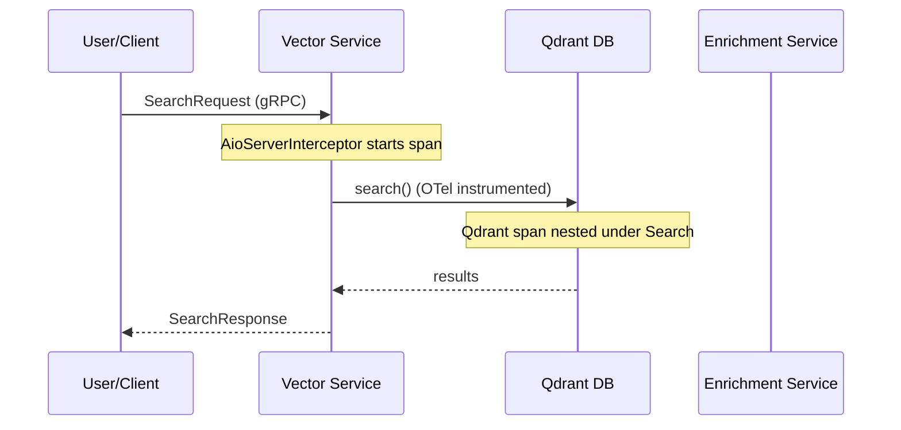

# Echora Observability Guide

This document provides a comprehensive overview of the observability stack, Service Level Objectives (SLOs), and telemetry specifications for the Echora platform.

---

## 1. Local Runbook

### Start Stack

```bash
# Start observability backend (Prometheus, Loki, Tempo, Grafana, OTel Collector)
docker compose -f docker/docker-compose.obs.yml up -d

# Start services with observability enabled
docker compose -f docker/docker-compose.dev.yml -f docker/docker-compose.obs.yml up -d
```

### Endpoints

- **Grafana**: `http://localhost:3000` (Default: `admin` / `admin`)
- **Prometheus**: `http://localhost:9090`
- **Alertmanager**: `http://localhost:9093`
- **Loki**: `http://localhost:3100`
- **Tempo**: `http://localhost:3200`
- **OTLP gRPC Ingest**: `http://localhost:4317`
- **OTLP HTTP Ingest**: `http://localhost:4318`

### Smoke Checks

```bash
# Collector metrics
curl -sf http://localhost:8889/metrics | head

# Prometheus targets
curl -sf http://localhost:9090/api/v1/targets | jq '.status'

# Backend readiness
curl -sf http://localhost:9093/-/ready  # Alertmanager
curl -sf http://localhost:3100/ready    # Loki
curl -sf http://localhost:3200/ready    # Tempo

# Emit a test trace and metric for end-to-end verification
uv run scripts/observability_smoke_check.py --endpoint http://localhost:4317
```

---

## 2. Platform Architecture

The observability stack follows a multi-tier architecture to ensure reliability and scalability:

1.  **Instrumented Services**: Use `libs/observability` to emit logs, traces, and metrics via OTLP gRPC.
2.  **OTel Collector (Agent)**: Runs alongside services (or as a local sidecar) to perform initial batching and resource detection.
3.  **OTel Collector (Gateway)**: A centralized tier that handles **Tail Sampling** (30s decision wait) and PII redaction before exporting to backends.
4.  **Backends**: Prometheus (Metrics), Tempo (Traces), Loki (Logs).
5.  **Visualization**: Grafana dashboards with deep cross-signal correlation.

---

## 3. Service Level Objectives (SLOs)

These objectives define the target performance and reliability for the Echora platform.

### Availability SLO
- **Objective**: 99.9% monthly availability.
- **Indicator**: Ratio of successful RPCs to total RPCs.
- **Metric**: `echora_rpc_requests_total` and `echora_rpc_errors_total`.
- **Target**: `(sum(rate(echora_rpc_errors_total[30d])) / sum(rate(echora_rpc_requests_total[30d]))) < 0.001`.

### Latency SLO
- **Objective**: P99 latency < 500ms for Search; P99 < 2s for all other RPCs.
- **Indicator**: Histogram quantile of RPC durations.
- **Metric**: `echora_rpc_duration_seconds_bucket`.
- **Target**: `histogram_quantile(0.99, rate(echora_rpc_duration_seconds_bucket[5m])) < 0.5`.

### Error SLO
- **Objective**: Overall gRPC error ratio < 1% over rolling 5-minute windows.
- **Indicator**: Non-OK response rate (including business-logic failures).
- **Metric**: `echora_rpc_errors_total`.

### Burn-Rate Policy
- **Fast Burn (Page)**: 14.4x burn over 1h window (exhausts budget in < 2 days).
- **Slow Burn (Ticket)**: 6x burn over 6h window (exhausts budget in < 5 days).

---

## 4. Telemetry Specification

### 4.1 Trace Architecture

Echora uses **W3C Trace Context** (traceparent headers) to propagate identity across service boundaries.



### 4.2 Metrics Registry

The following metrics are tracked across the platform:

| Metric Name | Type | Description |
|-------------|------|-------------|
| `echora_rpc_requests_total` | Counter | Total RPC requests handled by the service. |
| `echora_rpc_errors_total` | Counter | Total RPC requests that ended in transport or business error. |
| `echora_rpc_duration_seconds` | Histogram | RPC handler duration in seconds. |
| `echora_inflight_rpcs` | UpDownCounter | Number of RPC calls currently being processed. |
| `echora_db_query_duration_seconds` | Histogram | Qdrant database query duration in seconds. |
| `echora_db_errors_total` | Counter | Total database errors. |
| `echora_embedding_duration_seconds` | Histogram | Embedding model inference duration in seconds. |
| `echora_search_results_count` | Histogram | Number of results returned per search request. |
| `echora_search_empty_results_total` | Counter | Total search requests that returned zero results. |
| `echora_pipeline_runs_total` | Counter | Total enrichment pipeline executions. |
| `echora_pipeline_duration_seconds` | Histogram | Enrichment pipeline execution duration. |
| `echora_image_download_duration_seconds` | Histogram | Image download and cache duration. |
| `echora_image_download_failures_total` | Counter | Total image download failures. |
| `echora_cache_operation_duration_seconds` | Histogram | Redis cache operation duration. |

### 4.3 Distributed Tracing

Echora uses **W3C Trace Context** for propagation.

#### Sampling Policy
- **Errors**: 100% of traces with an `ERROR` status are kept.
- **Slow Requests**: 100% of traces > 2s are kept.
- **Service Specific**: `echora-enrichment-service` is kept at 100% due to long-running jobs.
- **Baseline**: 10% probabilistic sampling for everything else.

#### Long-Running Jobs (Span Links)
For tasks exceeding 3 minutes (e.g., full re-indexing), we use **Span Links** instead of deep nesting to avoid massive trace trees.
```python
with create_linked_span("EnrichAnime", link_context=batch_context) as span:
    # New trace linked to parent, rather than child of parent
    ...
```

#### Trace-ID Exemplars (Metrics → Traces)
Histogram buckets in `libs/observability/metrics.py` (like `echora_rpc_duration_seconds`) are configured with a **TraceBasedExemplarFilter**. This captures a specific `trace_id` exemplar for observations. In Grafana, these appear as dots on the histogram—clicking one jumps you directly to the Tempo trace responsible for that specific latency sample.

### 4.4 Structured Logging

Every log line is emitted in JSON format and includes OTel context:
- `trace_id`: Correlates logs with Tempo traces.
- `span_id`: Identifies the specific span in the trace.
- `rpc_method`: Bound automatically via gRPC interceptor.

**PII Redaction**: API keys, passwords, and authorization headers are automatically redacted at the log emission tier.

### 4.5 Instrumentation Checklist

When adding a new service or RPC:
1.  **Call `setup_telemetry`** in `main.py` (MUST BE FIRST).
2.  **Use `AioServerInterceptor`** when creating the `grpc.aio.server()`.
3.  **Return a structured response** following the platform contract. The `AioServerInterceptor` automatically detects business-logic failures by checking:
    -   `response.success` (Boolean): Used by `EnrichmentService`.
    -   `response.healthy` (Boolean): Used by `Health` RPCs.
    -   `response.error` (Presence of field): Used by `VectorService` to return `ErrorDetails`.
4.  **Use `observability.registry`** for custom sub-spans or manual metrics if auto-instrumentation is insufficient.

### 4.6 Configuration Toggles

Services can be tuned via environment variables (see `ObservabilityConfig`):

| Variable | Default | Description |
|----------|---------|-------------|
| `OTEL_ENABLED` | `true` | Global toggle for all telemetry signals. |
| `OTEL_EXPORTER_OTLP_ENDPOINT` | `http://localhost:4317` | Collector ingest address. |
| `OTEL_ENABLE_LOGGING` | `true` | Enable Structlog/OTel bridge. |
| `OTEL_ENABLE_TRACING` | `true` | Enable trace generation. |
| `OTEL_ENABLE_METRICS` | `true` | Enable metric aggregation. |
| `OTEL_ENABLE_GRPC_SERVER_INSTRUMENTATION` | `true` | Enable gRPC server spans. |
| `OTEL_ENABLE_GRPC_CLIENT_INSTRUMENTATION` | `true` | Enable gRPC client spans/headers. |
| `OTEL_ENABLE_AIOHTTP_CLIENT_INSTRUMENTATION` | `false` | Enable HTTP client spans/headers. |

---

## 5. Retention & Tiering

| Environment | Traces | Logs | Metrics |
|-------------|--------|------|---------|
| **Development** | 24h | 72h | 7d |
| **Staging** | 3d | 7d | 30d |
| **Production** | 7d (Sampled) | 30d (Indexed) | 90d (Downsampled) |

---

## 6. Future Integrations (Phase D)

The following integrations are pending implementation of NATS and Temporal:

- **NATS**: Context injection into headers for Publisher/Consumer patterns.
- **Temporal**: Workflow and Activity interceptors for end-to-end lineage.
- **Contract Tests**: Ensuring trace propagation across message brokers and task queues.

---

## 7. Troubleshooting Correlation

1. **Metrics → Traces**: In Grafana, click on a latency spike in a Prometheus graph to jump to the **Exemplar** trace in Tempo.
2. **Logs → Traces**: Click the `trace_id` field in any Loki log line to open the full trace journey.
3. **Traces → Logs**: Use the "Logs for this span" feature in Tempo to find all log events emitted during that specific operation.