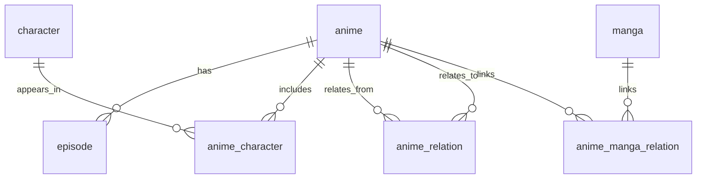

# PostgreSQL Data Model for Anime Graph + Qdrant (Hybrid Relational + JSONB)

Status: Draft (iterating)

Date: 2026-02-10

Owner: Data architecture

## Summary

We need PostgreSQL to be the system of record for:

- Canonical entity identities (v1: anime, episode, character, manga).
- All relationships (many-to-many and graph relations) with integrity constraints:
  - anime ↔ character (many-to-many)
  - anime ↔ anime (relationship graph)
  - anime ↔ manga (relationship graph)
- Deduplication and merge history (v1: characters; staff/person deferred).

We use Qdrant for semantic search only:

- Embeddings keyed by canonical Postgres UUIDs.
- Payload fields for filtering.
- No relational constraints or joins in Qdrant; Postgres remains authoritative for relationships.

Recommendation: **Hybrid schema**.

- Normalize core entities and relationship tables (anime/episode/character/manga + join tables).
- Use JSONB for evolving metadata and raw upstream payloads (per-source), including staff data (deferred from normalization for now).

## Postgres Integration in This Repo (Pants Library)

We will incorporate PostgreSQL support as a first-class Pants library, similar to `libs/qdrant_db`.

Decision: **Option A (SQLAlchemy 2.x async)**.

- Driver: `asyncpg`
- ORM / SQL toolkit: `sqlalchemy` (async engine + async sessions)
- Migrations: `alembic`

Recommended monorepo structure:

- `libs/postgres_db/src/postgres_db/`:
  - engine/session factory helpers (async engine, sessionmaker)
  - transaction helpers
  - (later) repository functions for anime graph queries
- `libs/postgres_db/BUILD`:
  - `python_distribution(...)` exporting an internal package (same pattern as `libs/qdrant_db/BUILD`)
- `libs/common/src/common/config/postgres_config.py`:
  - `PostgresConfig` (e.g., `database_url`, pool sizing/timeouts)
- `libs/common/src/common/config/settings.py`:
  - extend `Settings` to include `postgres: PostgresConfig`

Third-party dependencies:

- Add `sqlalchemy`, `asyncpg`, `alembic` to `pyproject.toml` `[project].dependencies`.
- Pants will expose them via the repo-root `python_requirements(source="pyproject.toml")` target.

App/service wiring pattern:

- Initialize the Postgres engine/pool in the FastAPI lifespan (or ingestion service startup),
  store it on `app.state`, and inject sessions via dependencies (mirrors existing Qdrant setup).

## Current Data Flow (As Implemented / In-Progress)

Artifacts and roles:

- Offline source DB (raw): `data/qdrant_storage/anime-offline-database.json` (40k+ entries, no UUID ids, has `sources` URLs).
- Enrichment pipeline (service-in-progress): consumes offline entries, enriches and produces a derived artifact where:
  - `anime.id` is present (UUID).
  - `character.id` is present and stable globally (same character has same ID across anime).
  - `episode.id` is present (deterministic UUIDv5 based on `anime_id + episode_number`).
- Enriched artifact (seed snapshot today): `assets/seed_data/anime_database.json` (sample subset; intended shape for ingestion).

Runtime query flow (target):

1. User natural language query hits backend.
2. Backend calls internal agent service.
3. Agent service queries Qdrant and returns reasoning + `id/ids`.
4. Backend hydrates full entities and relationships from PostgreSQL using those IDs.

Incremental ingestion model (target):

- After initial seeded load, the ingestion/enrichment service is triggered when new anime appear in the offline DB (or when watched fields change).
- Postgres remains the live source of truth; Qdrant is re-derived from Postgres.

## Current Qdrant Architecture (Single Collection, Hierarchical Points)

Current state:

- Single collection: `anime_database` (see `libs/common/src/common/config/qdrant_config.py`).
- Each enriched anime produces multiple points (entity_type-driven):
  - 1 anime point
  - N character points
  - M episode points
- Points include `payload["entity_type"] in {"anime","character","episode"}`.

Note:

- Some relationship fields are embedded in Qdrant payload today for filtering (e.g., `character.anime_ids`, `episode.anime_id`).
- PostgreSQL should be treated as the authoritative relationship store; Qdrant payload relationship fields should be considered optional caches.

## How Sources Are Stored in Postgres (Canonical Row + Xrefs)

Each anime/manga entity is stored **once** as a canonical row:

- `anime`: 1 row per anime (canonical UUID)
- `manga`: 1 row per manga (canonical UUID)

External platform identifiers and URLs are stored separately as cross-references:

- `anime_xref`: 0..N rows per anime (typically 1 per platform like AniList/MAL/Kitsu/AniDB)
- `manga_xref`: 0..N rows per manga

Example:

- "One Piece" has 1 row in `anime`, and (if available) multiple rows in `anime_xref`
  such as `('anilist','...')`, `('mal','...')`, `('kitsu','...')`.

This is how we keep the anime canonical identity unique while retaining all source links.

## Relationship Type + Format Type Normalization (Planned)

We have an explicit mapping and target output shape documented in:

- `docs/anime_relationship_and_format_type_mappings.md`

This document defines:

- A proposed normalized enum for relationship types (`AnimeRelationType`, 22 values).
- Extensions needed for `AnimeType` (e.g., `TV_SPECIAL`, `TV_SHORT`, `CM`, `MUSIC_VIDEO`).
- A future target JSON structure for related anime:
  - group by normalized relationship type
  - de-duplicate the same target across sources
  - consolidate target URLs into a list

Postgres ingestion should be compatible with both:

- Current enriched payload shape (list-of-dicts with `title`, `relation_type`, `url`).
- Future enriched payload shape (grouped + URL-consolidated).

## Related Anime/Manga Ingestion When Targets Are Missing (Unresolved Edges)

Problem:

- When ingesting Anime A, its related Anime B (or related Manga M) may not exist in Postgres yet.

Solution:

- Insert the relationship edge immediately, but allow the target FK to be NULL.
- Store enough target references (derived from URLs) so we can resolve the FK later.

Mechanics:

1. Ingest Anime A into `anime`.
2. For each related anime entry:
   - Normalize `relation_type` (per `docs/anime_relationship_and_format_type_mappings.md`).
   - Store all URLs on the edge (`to_urls` / `manga_urls`) to support the future consolidated structure.
   - Parse one "primary" external ref from the URLs and store it in `to_ref_source/to_ref_external_id`
     (or `manga_ref_source/manga_ref_external_id`). Recommended primary-ref selection:
     - Prefer the highest-priority source (MAL > AniList > AniDB > ...).
     - If none parse cleanly, fall back to `to_ref_source='url'` and store a canonicalized URL as the ref value.
   - Insert into `anime_relation` / `anime_manga_relation` with the FK NULL.
3. Later, when Anime B (or Manga M) is ingested, write its `anime_xref` / `manga_xref` rows.
4. A resolver job backfills:
   - `anime_relation.to_anime_id` by joining `(to_ref_source,to_ref_external_id)` against `anime_xref(source,external_id)`
   - `anime_manga_relation.manga_id` similarly via `manga_xref`

During the unresolved period:

- Graph traversal queries can use only resolved edges (`to_anime_id IS NOT NULL` / `manga_id IS NOT NULL`).
- UI can still display "stub" related items using `to_title` + `to_urls` even before resolution.

## Grounding in Current Code (Pydantic Models)

Reference: `libs/common/src/common/models/anime.py`

Notable current shapes:

- `Anime` includes relationship-like arrays such as `related_anime`, `relations`, and nested `staff_data`.
- `Episode` has `anime_id` (already FK-like) and a deterministic `id` (hash of `anime_id + episode_number`).
- `Character` includes `anime_ids: list[str]` (relationship embedded as an array today).
- Staff/person data is nested under `Anime.staff_data`, with dynamic roles (`ProductionStaff` accepts arbitrary role fields), studios/producers/licensors, and voice actors.

Target direction:

- Treat relationship-like arrays (`anime_ids`, related links) as ingestion-time inputs and/or caches, not as the relational source of truth.
- Persist relationships in join tables, then derive arrays for read models if needed.

## Requirements

- Avoid duplicates (especially `character` and `person`) across:
  - Multiple anime.
  - Multiple upstream sources/APIs.
  - Partial data sources that omit stable IDs.
- Support high-performance relationship queries:
  - "All characters in this anime"
  - "All anime that share a character"
  - "All staff credits for an anime" (v2)
  - "Traverse related anime graph (prequel/sequel/etc.)"
- Support flexible ingestion for fast-changing upstream schemas without constant migrations.
- Keep Qdrant consistent when entities are updated or merged.
- Support incremental ingestion:
  - Enriched artifact is ingested into Postgres as an upsert (idempotent).
  - Updates are applied with a safe, watched-fields policy (avoid regressions).

## Modeling Options Considered

### Option A: Mostly Relational (normalized)

Pros:

- Best integrity: foreign keys, unique constraints, and explicit join tables.
- Best for relationship-heavy queries with predictable plans and indexes.
- Deduplication is enforceable with unique xrefs and merge history tables.

Cons:

- High up-front modeling cost if we try to fully normalize deeply nested, dynamic fields (notably staff roles).
- More migrations when upstream sources evolve.

When it's best:

- When relationships and correctness are primary (this project).

### Option B: Mostly JSONB (document-style)

Pros:

- Very flexible ingestion.
- Easy to keep raw payloads and evolve without migrations.

Cons (project-critical):

- Weak integrity for relationships stored in JSON arrays (no FK enforcement).
- Many-to-many queries become harder and more expensive over time.
- Dedup becomes application-only and more error-prone.

When it's best:

- When entities are mostly independent documents and relationship queries are rare (not this project).

### Option C: Hybrid (relational core + JSONB for long-tail)

Pros:

- Integrity and performance for core relationships.
- Flexibility for evolving metadata via JSONB.
- Allows incremental normalization of staff/person credits (start with a general credit table, refine later).

Cons:

- Requires discipline so JSONB does not become the source of truth for relationships.

Decision:

- Use **Hybrid**: normalize entities and relationship tables; use JSONB for raw payloads and evolving metadata.

## Best-Practice Notes (Sources)

- Postgres JSON/JSONB is well-supported; `jsonb` is the preferred type for indexing and efficient operations.
  - https://www.postgresql.org/docs/current/datatype-json.html
- GIN indexes are commonly used for JSONB containment and key/element queries, but they are a complement to normalization, not a substitute for relational integrity.
  - https://www.postgresql.org/docs/current/gin.html
- For flexible JSON document patterns in Postgres, guidance generally recommends hybrid: keep frequently queried/critical fields relational, store the rest in JSONB.
  - https://aws.amazon.com/blogs/database/postgresql-as-a-json-database-advanced-patterns-and-best-practices/
- Qdrant points support UUID identifiers; use Postgres UUIDs as Qdrant point IDs for a clean, stable mapping.
  - https://qdrant.tech/documentation/concepts/points/
- Qdrant payload indexing is explicit; only index payload fields we actually filter on (to manage memory/perf).
  - https://qdrant.tech/documentation/concepts/indexing/

## Recommended Postgres Data Model

### High-Level ER Diagram (V1 Scope)



### Core Design Choices

- Entities use UUID primary keys (canonical IDs).
- Many-to-many relationships are modeled as join tables with explicit indexes.
- Evolving metadata is stored in `meta jsonb` (including staff data until staff/person is normalized).
- Raw upstream payloads may be stored per-entity in `raw_by_source jsonb` keyed by source (optional v1).
- Cross-source dedup can be enforced with `*_xref` tables (`UNIQUE (source, external_id)`) (recommended, may be v2).
- Canonical merges/redirects are possible but likely not needed for characters if IDs are already stable globally (keep design ready).

### V1 Scope (What We Model Now)

V1 tables focus on the models currently in active use:

- `anime`, `episode`, `character`, `manga`
- join table `anime_character`
- relationship graph tables:
  - `anime_relation` (anime ↔ anime)
  - `anime_manga_relation` (anime ↔ manga)
- (recommended now) external-id/URL crosswalk tables for relation resolution:
  - `anime_xref`
  - `manga_xref`
- ingestion/sync tables:
  - `ingestion_runs`, `anime_ingestion_state`
  - `qdrant_outbox`

Deferred to later iterations:

- Full staff/person normalization (`person`, `anime_person_credit`, `person_xref`, etc.)
- Additional dedup/merge tooling beyond current canonical IDs (redirect tables, fuzzy matching workflows)

### Concrete DDL (Starting Point)

```sql
-- ============================================================================
-- V1: Core Entities
-- ============================================================================

CREATE TABLE anime (
  id uuid PRIMARY KEY,
  title text NOT NULL,
  title_english text,
  title_japanese text,
  type text NOT NULL,
  status text NOT NULL,
  rating text,
  season text,
  year int,
  episode_count int NOT NULL DEFAULT 0,
  duration_seconds int,
  nsfw boolean,
  synopsis text,
  background text,
  meta jsonb NOT NULL DEFAULT '{}'::jsonb,
  raw_by_source jsonb NOT NULL DEFAULT '{}'::jsonb,
  created_at timestamptz NOT NULL DEFAULT now(),
  updated_at timestamptz NOT NULL DEFAULT now()
);

CREATE TABLE manga (
  id uuid PRIMARY KEY,
  title text NOT NULL,
  title_english text,
  title_japanese text,
  meta jsonb NOT NULL DEFAULT '{}'::jsonb,
  raw_by_source jsonb NOT NULL DEFAULT '{}'::jsonb,
  created_at timestamptz NOT NULL DEFAULT now(),
  updated_at timestamptz NOT NULL DEFAULT now()
);

CREATE TABLE episode (
  id uuid PRIMARY KEY,
  anime_id uuid NOT NULL REFERENCES anime(id) ON DELETE CASCADE,
  episode_number int NOT NULL,
  season_number int,
  title text NOT NULL,
  title_japanese text,
  title_romaji text,
  synopsis text,
  aired_at timestamptz,
  duration_seconds int,
  filler boolean NOT NULL DEFAULT false,
  recap boolean NOT NULL DEFAULT false,
  score numeric,
  meta jsonb NOT NULL DEFAULT '{}'::jsonb,
  raw_by_source jsonb NOT NULL DEFAULT '{}'::jsonb,
  created_at timestamptz NOT NULL DEFAULT now(),
  updated_at timestamptz NOT NULL DEFAULT now(),
  UNIQUE (anime_id, episode_number)
);

CREATE TABLE character (
  id uuid PRIMARY KEY,
  name text NOT NULL,
  name_native text,
  description text,
  gender text,
  age text,
  favorites int,
  meta jsonb NOT NULL DEFAULT '{}'::jsonb,
  raw_by_source jsonb NOT NULL DEFAULT '{}'::jsonb,
  created_at timestamptz NOT NULL DEFAULT now(),
  updated_at timestamptz NOT NULL DEFAULT now()
);

CREATE TABLE character_alias (
  character_id uuid NOT NULL REFERENCES character(id) ON DELETE CASCADE,
  alias text NOT NULL,
  PRIMARY KEY (character_id, alias)
);

CREATE TABLE anime_character (
  anime_id uuid NOT NULL REFERENCES anime(id) ON DELETE CASCADE,
  character_id uuid NOT NULL REFERENCES character(id) ON DELETE RESTRICT,
  role text,
  billing_order int,
  meta jsonb NOT NULL DEFAULT '{}'::jsonb,
  PRIMARY KEY (anime_id, character_id)
);

-- ============================================================================
-- V1: Graph Relations (anime ↔ anime, anime ↔ manga)
-- ============================================================================

-- Note on unresolved edges:
-- Related targets may not exist in Postgres at ingestion time. We store a resolvable
-- external key derived from URLs (e.g. anilist:141902) and optionally fill `to_anime_id`
-- later when the target is ingested.
CREATE TABLE anime_relation (
  id bigserial PRIMARY KEY,
  from_anime_id uuid NOT NULL REFERENCES anime(id) ON DELETE CASCADE,
  relation_type text NOT NULL,

  -- Resolved FK (nullable until target exists)
  to_anime_id uuid REFERENCES anime(id) ON DELETE CASCADE,

  -- Unresolved reference (derived from URL parsing)
  to_ref_source text,         -- e.g. 'anilist', 'mal', 'kitsu', 'anidb', 'url'
  to_ref_external_id text,    -- e.g. '141902'

  -- Compatibility with current + future enriched relation shapes
  to_title text,
  to_urls text[],             -- consolidated URL list (future model uses url: list[str])
  to_anime_type text,         -- optional, derived via mapping doc (e.g. 'MOVIE', 'TV_SPECIAL')
  source_relation_type text,  -- original raw relationship type before normalization

  meta jsonb NOT NULL DEFAULT '{}'::jsonb,
  CHECK (from_anime_id <> to_anime_id)
);

-- Ensure we don't duplicate the same relation edge when resolved.
CREATE UNIQUE INDEX anime_relation_resolved_uniq
  ON anime_relation(from_anime_id, relation_type, to_anime_id)
  WHERE to_anime_id IS NOT NULL;

-- Ensure we don't duplicate the same relation edge when unresolved.
CREATE UNIQUE INDEX anime_relation_unresolved_uniq
  ON anime_relation(from_anime_id, relation_type, to_ref_source, to_ref_external_id)
  WHERE to_anime_id IS NULL AND to_ref_source IS NOT NULL AND to_ref_external_id IS NOT NULL;

CREATE INDEX anime_relation_from_idx ON anime_relation(from_anime_id);
CREATE INDEX anime_relation_to_idx ON anime_relation(to_anime_id);

CREATE TABLE anime_manga_relation (
  id bigserial PRIMARY KEY,
  anime_id uuid NOT NULL REFERENCES anime(id) ON DELETE CASCADE,
  relation_type text NOT NULL,

  -- Resolved FK (nullable until target exists)
  manga_id uuid REFERENCES manga(id) ON DELETE CASCADE,

  -- Unresolved reference (derived from URL parsing)
  manga_ref_source text,
  manga_ref_external_id text,

  manga_title text,
  manga_urls text[],
  source_relation_type text,

  meta jsonb NOT NULL DEFAULT '{}'::jsonb
);

CREATE UNIQUE INDEX anime_manga_relation_resolved_uniq
  ON anime_manga_relation(anime_id, relation_type, manga_id)
  WHERE manga_id IS NOT NULL;

CREATE UNIQUE INDEX anime_manga_relation_unresolved_uniq
  ON anime_manga_relation(anime_id, relation_type, manga_ref_source, manga_ref_external_id)
  WHERE manga_id IS NULL AND manga_ref_source IS NOT NULL AND manga_ref_external_id IS NOT NULL;

CREATE INDEX anime_manga_relation_anime_idx ON anime_manga_relation(anime_id);
CREATE INDEX anime_manga_relation_manga_idx ON anime_manga_relation(manga_id);

-- ============================================================================
-- V1: External ID / URL Crosswalk (for relationship resolution)
-- ============================================================================

-- Even if the enrichment pipeline assigns canonical UUIDs, xrefs help:
-- - resolve relations from URLs before the target is ingested
-- - support future incremental ingestion from offline DB
CREATE TABLE anime_xref (
  anime_id uuid NOT NULL REFERENCES anime(id) ON DELETE CASCADE,
  source text NOT NULL,         -- e.g. 'anilist', 'mal', 'kitsu', 'anidb'
  external_id text NOT NULL,    -- e.g. '141902'
  url text,
  meta jsonb NOT NULL DEFAULT '{}'::jsonb,
  PRIMARY KEY (source, external_id),
  UNIQUE (anime_id, source)
);

CREATE TABLE manga_xref (
  manga_id uuid NOT NULL REFERENCES manga(id) ON DELETE CASCADE,
  source text NOT NULL,
  external_id text NOT NULL,
  url text,
  meta jsonb NOT NULL DEFAULT '{}'::jsonb,
  PRIMARY KEY (source, external_id),
  UNIQUE (manga_id, source)
);

-- ============================================================================
-- V1: Ingestion State (Postgres-authoritative)
-- ============================================================================

CREATE TABLE ingestion_runs (
  id bigserial PRIMARY KEY,
  artifact_uri text NOT NULL,
  artifact_sha256 text NOT NULL,
  source_commit_sha text,
  started_at timestamptz NOT NULL DEFAULT now(),
  finished_at timestamptz,
  status text NOT NULL DEFAULT 'running',
  error text
);

CREATE TABLE anime_ingestion_state (
  anime_id uuid PRIMARY KEY REFERENCES anime(id) ON DELETE CASCADE,
  last_run_id bigint REFERENCES ingestion_runs(id) ON DELETE SET NULL,
  last_enriched_at timestamptz,
  last_ingested_at timestamptz,
  last_payload_sha256 text,
  ingestion_status text NOT NULL DEFAULT 'pending'
);

-- ============================================================================
-- V1: Qdrant Sync (Outbox)
-- ============================================================================

CREATE TABLE qdrant_outbox (
  id bigserial PRIMARY KEY,
  entity_type text NOT NULL,
  entity_id uuid NOT NULL,
  op text NOT NULL,
  version bigint NOT NULL,
  queued_at timestamptz NOT NULL DEFAULT now(),
  processed_at timestamptz
);
```

### Ingestion State (Postgres + Sidecar Artifact)

We want ingestion state stored in both places:

- Postgres (authoritative): `ingestion_runs`, `anime_ingestion_state`
- Sidecar file (portable backup and operational visibility):
  - `assets/seed_data/anime_database.ingestion_state.json` (local dev)
  - In production, this could live next to the enriched artifact in object storage (S3).

Important rule:

- Avoid mutating the enriched artifact itself. Keep it as an immutable snapshot, and write ingestion state to the sidecar.

### Indexing (Baseline)

- Relationship joins:
  - `episode(anime_id)`
  - `anime_character(character_id)`
- Graph traversal:
  - `anime_relation(from_anime_id)`
  - `anime_relation(to_anime_id)`
  - `anime_manga_relation(anime_id)`
  - `anime_manga_relation(manga_id)`
- JSONB:
  - Add JSONB indexes only after identifying actual filter patterns (avoid indexing everything).

## Deduplication Strategy

### Exact Dedup (Guaranteed)

V1 assumption: enriched artifact already assigns stable, canonical UUIDs for `anime.id`, `character.id`, `episode.id`.

V1 note: we still create `anime_xref` / `manga_xref` to support relationship resolution and future incremental ingestion.

### Near-Duplicate Dedup (Assisted + Reviewable)

V1 scope: characters only.

Problem cases:

- Sources without stable IDs.
- Name-only matches.
- Partial records that later receive better identifiers.

Mechanisms:

- Use Qdrant similarity search to propose candidate duplicates.
- Confirm via heuristics and/or review (name variants, native names, shared anime overlap, roles/language).
- Record canonical merges with redirect tables (v1: `character_redirect`; v2: `person_redirect` when staff/person is modeled).

Operational rule:

- Application lookups must resolve `id -> canonical_id` by following redirects (repeat until fixed point).

## Postgres <-> Qdrant Interaction

Current constraint: single Qdrant collection with `entity_type` payload.

Contract:

- Use Postgres UUID as the Qdrant point ID for each entity (anime/character/episode).
- Qdrant search returns IDs; backend hydrates from Postgres.
- Relationship filtering should be treated as Postgres-owned. If we keep relationship keys in Qdrant payload (like `episode.anime_id`), consider them caches and keep them in sync via the outbox.

Sync pattern:

- Use `qdrant_outbox` for durable, at-least-once sync.
- On upsert: load canonical entity/payload from Postgres and upsert the corresponding point.
- On update: re-upsert the point.
- On merge (future): delete/tombstone old points and upsert canonical point.

## Update Policy (Incremental Ingestion)

Default policy for existing anime:

- Auto-apply safe changes:
  - status forward transitions (e.g., ONGOING -> FINISHED)
  - `episode_count` increases
  - new episodes appended (new `(anime_id, episode_number)` rows)
- Flag for review (do not blindly overwrite enriched fields):
  - title / type / source_material changes
  - `episode_count` decreases
  - suspected regressions (large missing fields vs prior snapshot)

## Open Questions (To Decide)

Ingestion state location:

- We want both:
  - Postgres-authoritative ingestion state (`ingestion_runs`, `anime_ingestion_state`)
  - A file-based state artifact (sidecar) kept in sync for portability/disaster recovery

Update policy for existing anime:

- "Watched-fields + safe upserts" is the working default:
  - Auto-apply: status forward transitions, episode_count increases, new episodes appended
  - Flag for review: title/type/source_material flips, episode_count decreases, suspected regressions

Known discrepancy to reconcile:

- Enrichment config defaults to `data/anime-offline-database.json`, but the repo currently uses `data/qdrant_storage/anime-offline-database.json` in scripts.

Relationship structure migration:

- Current enriched JSON has `related_anime` / `relations` as list-of-dicts (url/title/type).
- Planned enriched JSON will use a grouped + consolidated structure (see `docs/anime_relationship_and_format_type_mappings.md`).
- Postgres ingestion must support both shapes without schema changes (normalize at ingest time).

## Next Steps (Implementation Checklist)

1. Confirm v1 scope: anime/episode/character/manga + relationship graphs; staff remains JSONB on anime.
2. Decide which anime fields are first-class relational columns vs `meta`/`raw_by_source`.
3. Add Postgres under Pants (Option A):
   - create `libs/postgres_db` with a `python_distribution` target
   - add `sqlalchemy`, `asyncpg`, `alembic` to `pyproject.toml`
   - add `PostgresConfig` to `libs/common` settings
3. Implement schema migrations for v1 tables:
   - entities: `anime`, `episode`, `character`, `manga`
   - joins/graphs: `anime_character`, `anime_relation`, `anime_manga_relation`
   - xrefs: `anime_xref`, `manga_xref`
   - ingestion/sync: `ingestion_runs`, `anime_ingestion_state`, `qdrant_outbox`
4. Implement ingestion idempotency:
   - compute entry hash
   - update `anime_ingestion_state`
   - write sidecar state file
5. Implement Qdrant sync worker from `qdrant_outbox` (single-collection, entity_type payload).
