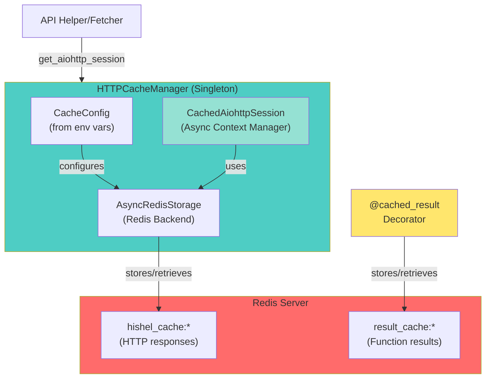

# HTTP & Result Caching Library

## Overview

A Redis-backed caching library providing HTTP-level and result-level caching for Python applications. Designed for async workflows with intelligent cache management and multi-process support.

**Two caching strategies:**

1. **HTTP-Level Caching**: RFC 9111 compliant HTTP response caching using Hishel
2. **Result-Level Caching**: Function result caching using custom decorator

**Primary use case:** Anime enrichment pipeline (see [enrichment/README.md](../enrichment/README.md))

## Benefits

- **Eliminates redundant network calls** - Same data never fetched twice within TTL
- **Reduces API rate limit issues** - Cached hits don't count toward rate limits
- **Multi-process support** - Share cache across concurrent processes via Redis
- **Bandwidth reduction** - 95%+ reduction for cached responses
- **Offline development** - Work with cached data without network access
- **Flexible TTL configuration** - Per-service cache expiration control

## Architecture



**Key Components**:

- **HTTPCacheManager**: Singleton that manages cached aiohttp sessions
- **CachedAiohttpSession**: Async context manager wrapping aiohttp.ClientSession with caching
- **AsyncRedisStorage**: Hishel storage backend for Redis (production)
- **@cached_result**: Decorator for caching function results (used by crawlers)

**Storage Strategy**:

- HTTP-level caching: `hishel_cache:*` keys (managed by Hishel via AsyncRedisStorage)
- Result-level caching: `result_cache:*` keys (managed by @cached_result decorator)
- Both use the same Redis server with different key prefixes for isolation

## Configuration

### Environment Variables

The library uses Pydantic BaseSettings for configuration, supporting both environment variables and `.env` files.

**Core Configuration:**

```bash
# Enable/disable caching (default: true)
CACHE_ENABLE=true

# Redis connection URL (default: redis://localhost:6379/0)
REDIS_URL=redis://localhost:6379/0

# Override RFC 9111 cache headers (default: true)
# When true, forces caching even if API returns no-cache headers
FORCE_CACHE=true

# Always revalidate cached responses (default: false)
ALWAYS_REVALIDATE=false

# Max cache key length before hashing (default: 200)
MAX_CACHE_KEY_LENGTH=200
```

**Redis Connection Pool Configuration:**

```bash
# Maximum Redis connections (default: 100)
# Tuned for multi-agent concurrency (20 agents × 10 concurrent ops)
REDIS_MAX_CONNECTIONS=100

# Enable TCP keepalive (default: true)
REDIS_SOCKET_KEEPALIVE=true

# Connection timeout in seconds (default: 5)
REDIS_SOCKET_CONNECT_TIMEOUT=5

# Socket read/write timeout in seconds (default: 10)
REDIS_SOCKET_TIMEOUT=10

# Retry operations on timeout (default: true)
REDIS_RETRY_ON_TIMEOUT=true

# Health check interval in seconds (default: 30, 0=disabled)
REDIS_HEALTH_CHECK_INTERVAL=30
```

**Service-Specific TTLs (all default to 86400 seconds / 24 hours):**

```bash
TTL_JIKAN=86400
TTL_ANILIST=86400
TTL_ANIDB=86400
TTL_KITSU=86400
TTL_ANIME_PLANET=86400
TTL_ANISEARCH=86400
TTL_ANIMESCHEDULE=86400
```

### .env File Support

Create a `.env` file in your working directory for local development:

```bash
# .env
CACHE_ENABLE=false
REDIS_URL=redis://prod-redis:6379/2
FORCE_CACHE=false
TTL_JIKAN=3600
TTL_ANILIST=7200
```

### Programmatic Configuration (Optional)

```python
from http_cache.config import CacheConfig

config = CacheConfig(
    cache_enable=False,
    redis_url="redis://custom:6379/1",
    ttl_jikan=3600,
    force_cache=False,
)
```

### Configuration Precedence

**Priority order (highest to lowest):**
1. Environment variables
2. `.env` file values
3. Programmatic `CacheConfig()` arguments
4. Field defaults

For service-specific configurations in the enrichment pipeline, see [enrichment/README.md](../enrichment/README.md).

## Context Manager Protocol

All caching classes implement async context manager protocol for automatic resource cleanup.

### CachedAiohttpSession (Context Manager)

The `CachedAiohttpSession` returned by `http_cache_manager.get_aiohttp_session()` is an async context manager:

```python
from http_cache.instance import http_cache_manager

# Recommended: Use as context manager (automatic cleanup)
async with http_cache_manager.get_aiohttp_session("jikan") as session:
    async with session.get("https://api.example.com/data") as response:
        data = await response.json()
# Session and storage automatically closed

# Alternative: Manual cleanup (if context manager not feasible)
session = http_cache_manager.get_aiohttp_session("jikan")
try:
    async with session.get("https://api.example.com/data") as response:
        data = await response.json()
finally:
    await session.close()  # Must call close() manually
```

**Important**: The `CachedAiohttpSession.__aexit__` method:

- Closes the underlying `aiohttp.ClientSession`
- Closes the `AsyncRedisStorage` (if owned by the session)
- Ensures no resource leaks

### Usage Patterns

For detailed usage patterns in the enrichment pipeline (session ownership, event loop management, etc.), see [enrichment/README.md - Helper Implementation Patterns](../enrichment/README.md#helper-implementation-patterns).

**Basic usage example:**

```python
from http_cache.instance import http_cache_manager

# Context manager pattern (recommended)
async with http_cache_manager.get_aiohttp_session("my_service") as session:
    async with session.get("https://api.example.com/data") as response:
        data = await response.json()
```

### Cleanup Methods

**CachedAiohttpSession.close()**:

```python
await session.close()  # Closes session + storage
```

**HTTPCacheManager.close_async()**:

```python
from http_cache.instance import http_cache_manager
await http_cache_manager.close_async()  # Close async Redis client
```

**Result Cache Cleanup**:

```python
from http_cache.result_cache import close_result_cache_redis_client
await close_result_cache_redis_client()  # Close singleton Redis client
```

**Note**: Cleanup methods are rarely needed due to context manager patterns, but available for manual resource management.

## API Reference

### HTTPCacheManager

**Singleton instance:** `http_cache_manager` from `http_cache.instance`

**Methods:**
- `get_aiohttp_session(service_name: str, **kwargs) -> CachedAiohttpSession`
  - Returns cached aiohttp session for the specified service
  - Accepts standard aiohttp.ClientSession kwargs (timeout, headers, etc.)
- `close_async() -> None`
  - Closes async Redis connections (rarely needed due to context managers)

### @cached_result Decorator

**Location:** `http_cache.result_cache`

**Signature:**
```python
@cached_result(ttl: int = 86400, key_prefix: str = "result_cache")
async def my_function(arg1: str, arg2: int) -> Dict[str, Any]:
    # Function implementation
    pass
```

**Features:**
- Automatic cache key generation from function name + schema hash + arguments
- Schema versioning with automatic invalidation (function source code hashing)
- Graceful fallback on Redis failures (RedisError) and JSON serialization errors (TypeError)
- Multi-process safe via Redis atomic operations
- `None` return values are never cached (intentional design choice)
- Supports complex argument types via JSON serialization with repr() fallback

**Example:**
```python
from http_cache.result_cache import cached_result

@cached_result(ttl=3600, key_prefix="api_results")
async def fetch_external_data(item_id: str) -> dict:
    # Expensive operation (API call, web scraping, etc.)
    return {"id": item_id, "data": "..."}
```

## How It Works

### Two Caching Strategies

**1. HTTP-Level Caching**

- **Technology:** Hishel (RFC 9111 compliant) with custom Redis storage backend
- **Use case:** RESTful APIs, GraphQL endpoints, any HTTP-based data sources
- **Caches:** Raw HTTP responses at the network layer
- **Implementation:** `CachedAiohttpSession` wrapping `aiohttp.ClientSession`
- **Transparency:** Automatic caching with no code changes to request logic
- **Key format:** `hishel_cache:{hash(method+url+headers+body)}`

**2. Result-Level Caching**

- **Technology:** Custom `@cached_result` decorator
- **Use case:** Non-HTTP operations (web scraping, computations, file I/O)
- **Caches:** Serialized function return values (JSON)
- **Implementation:** Python decorator with Redis storage with automatic schema invalidation
- **Key format:** `result_cache:{function_name}:{schema_hash}:{hash(args)}`
  - Schema hash: 16-character hex from SHA-256 of function source code
  - Automatically changes when function implementation changes
  - Falls back to function name hash for built-ins/lambdas where source is unavailable
  - Keys exceeding 200 characters are SHA-256 hashed (configurable via `max_cache_key_length`)

### Cache Management Features

- **TTL enforcement:** Redis EXPIRE command (configurable per service for HTTP caching; fixed 24h default for result caching)
- **Schema versioning:** Automatic invalidation via function source code hashing (16-character SHA-256 prefix)
  - Schema hash recomputed on decorator application (not per-call)
  - Built-in functions and lambdas use name-based hash fallback
- **Graceful degradation:** Falls back to uncached execution on Redis failures (connection errors, timeouts)
- **Multi-process safe:** Redis atomic operations prevent race conditions
- **Event loop aware:** Per-event-loop Redis client management (automatic cleanup on loop changes)
- **Cache key optimization:** Keys > 200 chars are automatically hashed to 64-character SHA-256 hex

## Thread-Safety and Concurrency

### Concurrency Model

The cache manager is designed for **async concurrency** within Python's asyncio event loop, supporting multiple concurrent operations without race conditions.

**Supported Concurrent Operations:**

- **Multiple async tasks in same event loop** - Concurrent HTTP requests via `asyncio.gather()`
- **Multiple agents with shared Redis cache** - Multiple session instances safely share Redis storage
- **Multiple processes** - Redis atomic operations coordinate cache access across processes
- **Concurrent cache reads/writes** - Redis connection pooling (50 connections) handles concurrent operations

**Not Thread-Safe:**

- **Sharing sessions across OS threads** - Each thread needs its own session instance
- **Sharing sessions across event loops** - Create separate sessions per event loop

### Thread-Safety Guarantees

**CachedAiohttpSession:**
- Safe for concurrent async requests within single event loop
- Multiple instances can share same Redis storage backend
- Not safe for sharing across threads or event loops

**AsyncRedisStorage:**
- Connection pooling enables concurrent async operations
- Multiple agents can safely access shared cache
- Redis atomic operations prevent race conditions across processes

**@cached_result Decorator:**
- Safe for concurrent async function calls
- Redis atomic operations ensure process-safe caching
- Automatic per-event-loop client management

## Cache Management

### Clear Cache

```bash
# Clear all cached data (HTTP + result caches)
docker exec anime-vector-redis redis-cli FLUSHALL

# Alternative: Clear specific database (DB 0)
docker exec anime-vector-redis redis-cli FLUSHDB
```

### View Cache Statistics

```bash
# Connect to Redis CLI
docker exec -it anime-vector-redis redis-cli

# Check total cache size
> DBSIZE

# View HTTP cache keys (from Hishel)
> KEYS hishel_cache:*

# View result cache keys (from crawlers)
> KEYS result_cache:*

# Check TTL on any key
> TTL result_cache:anisearch_anime:18878

# Exit Redis CLI
> exit
```

## Testing

### Cache Manager Tests

**Unit Tests** (fast, no external dependencies):

```bash
# Test cache manager components (in tests/libs/http_cache/)
pytest tests/libs/http_cache/

# Run with coverage
pytest tests/libs/http_cache/ --cov=http_cache
```

**Integration Tests** (require Redis):

```bash
# Start Redis for testing
docker compose up -d redis

# Run integration tests
REDIS_URL=redis://localhost:6379/1 pytest tests/cache_manager/integration/

# Stop Redis
docker compose down redis
```

### Testing Best Practices

**Use separate Redis database for tests:**
```bash
REDIS_URL=redis://localhost:6379/1  # DB 1 for tests
REDIS_URL=redis://localhost:6379/0  # DB 0 for dev/production
```

**Disable caching in tests when needed:**
```bash
CACHE_ENABLE=false pytest tests/
```

For enrichment pipeline-specific tests, see [enrichment/README.md - Testing](../enrichment/README.md#testing).

## Important Edge Cases & Behaviors

### Result Caching (`@cached_result`)

**None Values Are Never Cached:**
```python
@cached_result(ttl=3600)
async def fetch_data(id: str) -> Optional[dict]:
    if not_found:
        return None  # This will NOT be cached
    return {"data": "value"}  # This WILL be cached
```

**Schema Hash Changes Invalidate Cache:**
```python
# Version 1 (schema_hash: abc123...)
@cached_result()
async def process(x: int) -> int:
    return x * 2

# Version 2 (schema_hash: def456... - DIFFERENT!)
@cached_result()
async def process(x: int) -> int:
    return x * 3  # Changed logic = new schema hash = old cache ignored
```

**Built-in/Lambda Functions Use Name-Based Hashing:**
```python
# Lambda functions can't retrieve source code
lambda_func = lambda x: x + 1  # Uses hash of "lambda" name
# Built-in functions
len_func = len  # Uses hash of "len" name
```

**Cache Key Length Optimization:**
```python
# Long keys are automatically hashed
@cached_result()
async def long_args(very_long_dict: dict, another_dict: dict) -> dict:
    # If key > 200 chars, becomes: result_cache:long_args:{schema}:{sha256_hash}
    pass
```

### HTTP Caching (Hishel + Redis)

**Per-Event-Loop Redis Client Management:**
```python
# Each asyncio event loop gets its own Redis client
# Automatic cleanup when event loop changes
# Prevents "Event loop is closed" errors
```

**Body-Based Caching for GraphQL/POST:**
```python
# X-Hishel-Body-Key header automatically added
# POST requests with different bodies = different cache entries
# Essential for GraphQL APIs (AniList, etc.)
```

**Graceful Degradation on Errors:**
```python
# Redis connection failures → falls back to uncached requests
# TypeError (non-JSON-serializable) → function called without caching
# No application crashes, only performance impact
```

## Troubleshooting

### Cache Not Working

**Symptom:** No performance improvement on repeated requests

**Diagnosis:**

```bash
# Check if cache enabled
echo $CACHE_ENABLE  # Should be "true"

# Check Redis connection
redis-cli -h localhost -p 6379 PING  # Should return "PONG"

# Check cache keys exist
docker exec -it anime-vector-redis redis-cli
> KEYS *
> DBSIZE
```

**Solutions:**

1. Verify `CACHE_ENABLE=true` in environment or `.env` file
2. Check Redis is running: `docker compose ps redis`
3. Validate `REDIS_URL=redis://localhost:6379/0` in environment
4. Check application logs for cache-related warnings

### Redis Connection Failed

**Symptom:** Warning logs about Redis connection failures

**Cause:** Redis not running or incorrect connection string

**Solution:**

```bash
# Start Redis
docker compose up -d redis

# Verify Redis is accessible
redis-cli -h localhost -p 6379 PING  # Should return "PONG"

# Check connection string format
echo $REDIS_URL  # Should be: redis://host:port/db
```

### Session Lifecycle Issues

**Symptom:** `RuntimeError: Event loop is closed` or session-related errors

**Cause:** Improper session management across event loops

**Solution:** Use context managers and ensure proper cleanup:

```python
# CORRECT: Context manager pattern
async with http_cache_manager.get_aiohttp_session("my_service") as session:
    async with session.get(url) as response:
        data = await response.json()

# CORRECT: Manual cleanup
session = http_cache_manager.get_aiohttp_session("my_service")
try:
    async with session.get(url) as response:
        data = await response.json()
finally:
    await session.close()  # MUST close manually
```

For multi-event-loop scenarios, see [enrichment/README.md - Pattern C](../enrichment/README.md#pattern-c-per-event-loop-session-anilist_helper).

## Key Files

- `libs/http_cache/src/http_cache/result_cache.py` - Result-level caching decorator for crawlers
  - Provides `@cached_result` decorator with automatic schema invalidation
  - Singleton Redis client with `close_result_cache_redis_client()` cleanup

- `libs/http_cache/src/http_cache/manager.py` - HTTP cache manager for API sources
  - Provides `get_aiohttp_session()` factory method
  - Has `close_async()` for closing async Redis connections
  - NOT a context manager itself (returns context managers)

- `libs/http_cache/src/http_cache/aiohttp_adapter.py` - Cached aiohttp session wrapper
  - **CachedAiohttpSession**: Async context manager implementing `__aenter__` and `__aexit__`
  - `close()` method for manual cleanup (closes session + storage)
  - Wraps `aiohttp.ClientSession` with Redis caching via Hishel

- `libs/http_cache/src/http_cache/async_redis_storage.py` - Async Redis storage backend
  - Implements Hishel's `AsyncBaseStorage` interface
  - Has `close()` method (closes Redis client if owned)
  - Manages ownership via `_owns_client` flag

- `libs/http_cache/src/http_cache/instance.py` - Singleton instance of the cache manager
  - Global `http_cache_manager` instance (fully type annotated)
  - Used by all API helpers for consistent caching

- `libs/http_cache/src/http_cache/config.py` - Cache configuration and environment variables
  - Pydantic BaseSettings with automatic env var loading
  - `.env` file support for local development
  - Service-specific TTLs and storage backend configuration
  - Singleton pattern with `@lru_cache` for efficient config reuse

## Summary

The cache manager library provides production-ready caching infrastructure:

- **HTTP-level caching** via Hishel (RFC 9111 compliant)
- **Result-level caching** via `@cached_result` decorator
- **Redis backend** for multi-process support
- **Async-first design** with proper resource management
- **Configurable TTLs** per service
- **Event loop aware** session management
- **Schema versioning** with automatic invalidation
- **Graceful degradation** on Redis failures

**For usage in the anime enrichment pipeline**, see [enrichment/README.md](../enrichment/README.md).
