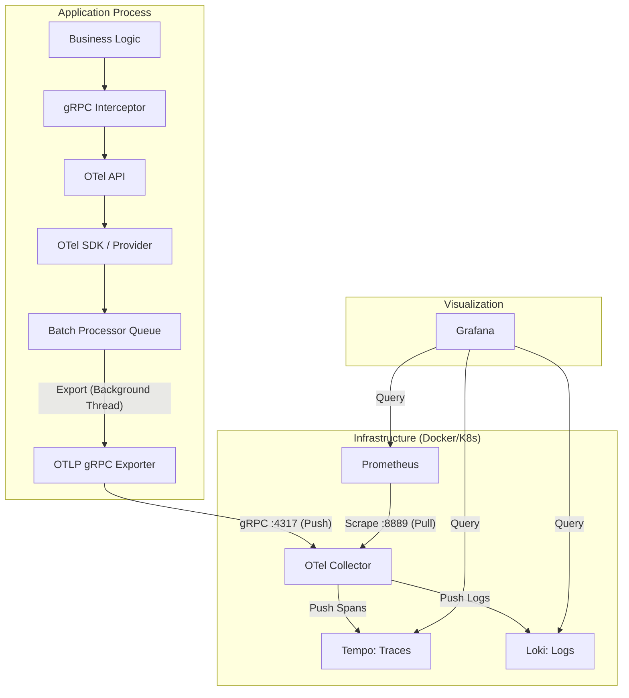

# Observability Library

Shared observability bootstrap for Echora gRPC services.
Initialises OpenTelemetry traces, metrics, and structured logs in one call and
exposes a central metric registry that all platform services write to.

---

## What This Library Does

| Capability | Details |
|---|---|
| **One-call bootstrap** | `setup_telemetry()` wires traces, metrics, and logs with a single call at service startup |
| **Head sampling** | `TraceIdRatioBased` sampler prevents SDK overload at high throughput — tune per environment |
| **Structured logs** | structlog JSON renderer with OTel trace/span ID injection, PII redaction, and probabilistic sampling |
| **Non-blocking logs** | `QueueHandler + QueueListener` for stdout; `otel_handler` fires synchronously on the root logger so trace IDs are always captured |
| **W3C context propagation** | `AioServerInterceptor` extracts `traceparent`/`tracestate` from incoming gRPC metadata, linking child spans to upstream callers |
| **RPC-level telemetry** | Interceptor counts requests/errors/in-flight RPCs, records duration histograms, creates SERVER-kind spans |
| **Exemplars** | `TraceBasedExemplarFilter` embeds trace IDs in histogram observations — Grafana can jump from a P99 spike to the causal trace |
| **Central metric registry** | `observability.registry` — 11 instruments covering RPC, DB, embedding, search quality, pipeline, and image download |
| **DB telemetry injection** | `TelemetryRegistry` Protocol (`vector_db_interface`) allows Qdrant client to record DB metrics without importing this lib |
| **Context helpers** | Reusable W3C context inject/extract for NATS and Temporal message headers |
| **Idempotent init** | Safe to call `setup_telemetry()` multiple times — second call is a no-op unless config changed |

---

## Data Flow & Infrastructure

The following diagram illustrates how telemetry data flows from your application code to the final visualization in Grafana.



### The "Bottom-Up" Flow
1.  **Capture**: As a gRPC request arrives, the `Interceptor` starts a Span and generates a Trace ID.
2.  **Logic**: Your code executes, adding events or child spans via the `OTel API`.
3.  **Queue**: The `SDK` adds service-level metadata and drops the data into a **non-blocking memory queue**.
4.  **Ship**: A background thread flushes the queue and sends the data to the **OTel Collector** (Port 4317).
5.  **Route**: The Collector sorts the data and routes it to Tempo, Loki, or exposes it for Prometheus to scrape.
6.  **View**: Grafana queries the backends to build the dashboards.

---

## Signal Map

The platform produces three observability signals from three instrumentation layers.
Understanding which layer owns which signal prevents duplication and cardinality bugs.

```
gRPC call arrives
      │
      ▼
┌─────────────────────────────────────────────────────┐
│  Layer 1 — AioServerInterceptor (automatic)         │
│  Span:    rpc.server.<Method>  (SERVER kind)        │
│  Metrics: echora_rpc_requests_total                  │
│           echora_rpc_errors_total                    │
│           echora_rpc_duration_seconds                │
│           echora_inflight_rpcs                       │
│  Logs:    rpc_method bound to structlog context      │
└──────────────────────┬──────────────────────────────┘
                       │ calls handler
                       ▼
┌─────────────────────────────────────────────────────┐
│  Layer 2 — Route handler (manual span events)       │
│  Events:  validation.complete                        │
│           embedding.text.complete  {embedding_dim}  │
│           embedding.image.complete {embedding_dim}  │
│           search.complete          {result_count}   │
│  Metrics: echora_search_results_count               │
│           echora_search_empty_results_total          │
│           echora_pipeline_runs_total                 │
│           echora_pipeline_duration_seconds          │
└──────────────────────┬──────────────────────────────┘
                       │ calls processors / DB client
                       ▼
┌─────────────────────────────────────────────────────┐
│  Layer 3 — Library code (no observability import)   │
│  Child spans (via opentelemetry.get_tracer):        │
│    vector_processing.text.encode                    │
│    vector_processing.text.encode_batch              │
│    vector_processing.vision.encode                  │
│    vector_processing.vision.encode_batch            │
│  Metrics (via opentelemetry.get_meter):             │
│    echora_embedding_duration_seconds  {modality}   │
│    echora_image_download_duration_seconds           │
│    echora_image_download_failures_total             │
│    echora_db_query_duration_seconds                 │
│    echora_db_errors_total                           │
└─────────────────────────────────────────────────────┘
```

> **Key rule:** Library code (`libs/`) must **never** import from `libs/observability`.
> Use `opentelemetry.trace.get_tracer()` / `opentelemetry.metrics.get_meter()` directly.
> These return silent no-ops until a real SDK provider is installed, so libraries work
> outside of a fully-wired service (unit tests, scripts, etc.) without any mocking.

---

## Public API

### `setup_telemetry()`

The single entrypoint. Call once at service startup before creating any gRPC server.

```python
from observability import setup_telemetry

setup_telemetry(
    service_name="echora-my-service",    # required — sets service.name resource attr
    version="1.0.0",                     # required — sets service.version
    environment="production",            # required — sets deployment.environment
    endpoint="http://otel-collector:4317",  # required — OTLP gRPC collector endpoint
    log_level="INFO",                    # root logging level
    enable_logging=True,                 # structlog + OTel log bridge
    enable_tracing=True,                 # TracerProvider + OTLP trace exporter
    enable_metrics=True,                 # MeterProvider + OTLP metric exporter
    enable_grpc_server_instrumentation=False,   # auto-instrument ALL server calls
    enable_grpc_client_instrumentation=False,   # auto-instrument gRPC client stubs
    enable_aiohttp_client_instrumentation=False, # auto-instrument aiohttp sessions
    enable_qdrant_client_instrumentation=False,  # auto-instrument Qdrant SDK
    metric_export_interval_millis=15000, # push interval (15 s minimum for SLO alerting)
    trace_sample_ratio=1.0,             # 1.0 = keep all (dev); 0.05–0.10 for prod
    log_sample_rate=1.0,                # 1.0 = keep all (dev); 0.1 for high-throughput prod
)
```

**Sampling guidance:**

| Environment | `trace_sample_ratio` | `log_sample_rate` |
|---|---|---|
| local / dev | `1.0` | `1.0` |
| staging | `0.25` | `0.5` |
| production | `0.05`–`0.10` | `0.1` |

WARN/ERROR/CRITICAL log events are **never** sampled out regardless of `log_sample_rate`.

### Other exports

```python
from observability import (
    AioServerInterceptor,           # gRPC async server interceptor
    instrument_grpc_server,         # enable auto-instrumentation
    instrument_grpc_client,
    instrument_aiohttp_client,
    instrument_qdrant_client,
    registry,                       # metric instrument singleton
    setup_logging, stop_logging,    # standalone log setup / teardown
    setup_tracing,                  # standalone trace setup
    setup_metrics,                  # standalone metrics setup
    create_linked_span,             # create a span linked to an external trace context
    inject_trace_context,           # W3C context → dict (for outgoing headers)
    extract_trace_context,          # dict → OTel context (from incoming headers)
    inject_context_into_nats_headers,
    extract_context_from_nats_headers,
    inject_context_into_temporal_headers,
    extract_context_from_temporal_headers,
)
```

---

## Metric Registry

`observability.registry` is a module-level singleton. All instruments are created
once at import time against the global `MeterProvider`. Before `setup_telemetry()`
is called (or when OTel is disabled), all calls are no-ops — safe everywhere.

| Instrument | Type | Labels | Description |
|---|---|---|---|
| `echora_rpc_requests_total` | Counter | `rpc_method` | Total RPC requests handled |
| `echora_rpc_errors_total` | Counter | `rpc_method`, `error_code` | Total RPC requests that ended in error |
| `echora_rpc_duration_seconds` | Histogram | `rpc_method` | RPC handler wall-clock duration |
| `echora_inflight_rpcs` | UpDownCounter | `rpc_method` | Concurrent RPC calls in progress |
| `echora_db_query_duration_seconds` | Histogram | _(none)_ | Qdrant query duration |
| `echora_db_errors_total` | Counter | _(none)_ | Qdrant query errors |
| `echora_embedding_duration_seconds` | Histogram | `modality` (`text`\|`image`) | ML model inference time (excludes semaphore wait) |
| `echora_search_results_count` | Histogram | `entity_type` | Results returned per search request |
| `echora_search_empty_results_total` | Counter | `entity_type` | Searches returning zero results |
| `echora_pipeline_runs_total` | Counter | `status` (`success`\|`error`) | Enrichment pipeline executions |
| `echora_pipeline_duration_seconds` | Histogram | `status` | Enrichment pipeline end-to-end duration |
| `echora_image_download_duration_seconds` | Histogram | _(none)_ | Image CDN fetch + cache duration |
| `echora_image_download_failures_total` | Counter | _(none)_ | Image downloads failed after all retries |

**Cardinality rules:**
- Labels must use bounded value sets. Never use free-text user input (URL, title, ID) as a label.
- `entity_type` is guarded by `_KNOWN_ENTITY_TYPES = {"anime", "manga", "character", ""}` in `search.py` — anything else becomes `"unknown"`.
- `batch_size` is exposed as a **span attribute** only, never as a metric label.

---

## Adding Observability to a New Service

This is the established pattern used by `vector_service` and `enrichment_service`.

### Step 1 — Bootstrap in `main.py`

```python
# apps/my_service/src/my_service/main.py
from observability import setup_telemetry, AioServerInterceptor, stop_logging
from common.config import get_settings


def _setup_observability(settings) -> None:
    if not settings.observability.otel_enabled:
        return

    setup_telemetry(
        service_name="echora-my-service",
        version=settings.service.api_version,
        environment=settings.environment.value,
        endpoint=settings.observability.otel_exporter_otlp_endpoint,
        log_level=settings.service.log_level,
        enable_logging=settings.observability.otel_enable_logging,
        enable_tracing=settings.observability.otel_enable_tracing,
        enable_metrics=settings.observability.otel_enable_metrics,
        enable_grpc_server_instrumentation=(
            settings.observability.otel_enable_grpc_server_instrumentation
        ),
    )


async def serve() -> None:
    settings = get_settings()
    _setup_observability(settings)          # MUST be first

    interceptors = []
    if settings.observability.otel_enabled:
        interceptors.append(AioServerInterceptor())

    server = grpc.aio.server(interceptors=interceptors)
    # ... add servicers, start server ...

    try:
        await server.wait_for_termination()
    finally:
        await server.stop(grace=5)
        stop_logging()                      # flush log queue on shutdown
```

`setup_telemetry` must be called **before** any `grpc.aio.server()` creation if
`enable_grpc_server_instrumentation=True` (the auto-instrumentor patches the server
factory).

### Step 2 — Add service-specific metrics to the registry

Open `libs/observability/src/observability/registry.py` and add instruments:

```python
# In ObservabilityRegistry class body:
MY_PIPELINE_RUNS: Counter
MY_PIPELINE_DURATION: Histogram

# In __init__:
self.MY_PIPELINE_RUNS = _METER.create_counter(
    "echora_my_pipeline_runs_total",
    description="Total my-service pipeline executions",
)
self.MY_PIPELINE_DURATION = _METER.create_histogram(
    "echora_my_pipeline_duration_seconds",
    unit="s",
    description="My-service pipeline execution duration in seconds",
)
```

Then add a histogram `View` with explicit bucket boundaries in
`libs/observability/src/observability/metrics.py`:

```python
_MY_PIPELINE_BUCKETS = [0.1, 0.5, 1.0, 5.0, 10.0, 30.0, 60.0]

# Add to _HISTOGRAM_VIEWS:
View(
    instrument_name="echora_my_pipeline_duration_seconds",
    aggregation=ExplicitBucketHistogramAggregation(boundaries=_MY_PIPELINE_BUCKETS),
),
```

Without a `View`, OTel uses default linear buckets which produce unreadable histograms
in Grafana.

### Step 3 — Record metrics and span events in route handlers

Route handlers can import from `observability` freely. Use `registry` for metrics and
`trace.get_current_span()` for span events on the interceptor-created span:

```python
import time
from opentelemetry import trace
from observability import registry

async def my_rpc(runtime, request, context):
    current_span = trace.get_current_span()

    # ... validate input ...
    current_span.add_event("validation.complete")

    start = time.perf_counter()
    try:
        result = await runtime.do_work(request)
        elapsed = time.perf_counter() - start
        registry.MY_PIPELINE_RUNS.add(1, {"status": "success"})
        registry.MY_PIPELINE_DURATION.record(elapsed, {"status": "success"})
        current_span.add_event("work.complete", {"result_count": len(result)})
        return build_response(result)
    except Exception:
        elapsed = time.perf_counter() - start
        registry.MY_PIPELINE_RUNS.add(1, {"status": "error"})
        registry.MY_PIPELINE_DURATION.record(elapsed, {"status": "error"})
        raise
```

### Step 4 — Instrument library code (without importing observability)

Library code under `libs/` must not depend on `libs/observability`. Use the
OpenTelemetry API directly at module level — these are no-ops until a provider is
installed:

```python
# libs/my_lib/src/my_lib/my_processor.py
import time
from opentelemetry import metrics as otel_metrics
from opentelemetry import trace as otel_trace

_tracer = otel_trace.get_tracer("echora.my_lib")
_meter = otel_metrics.get_meter("echora.my_lib")
_op_duration = _meter.create_histogram(
    "echora_my_op_duration_seconds",
    unit="s",
    description="My operation duration in seconds",
)


class MyProcessor:
    async def process(self, data: str) -> list[float]:
        with _tracer.start_as_current_span(
            "my_lib.process",
            attributes={"input.length": len(data)},
        ):
            try:
                _start = time.perf_counter()
                result = await asyncio.to_thread(self._model.run, data)
                _op_duration.record(time.perf_counter() - _start, {"modality": "text"})
            except Exception:
                logger.exception("Processing failed")
                return []
            else:
                return result
```

> **`asyncio.to_thread` and span context:** Python 3.9+ copies `contextvars` into
> the worker thread, so the parent span IS visible inside the thread. However, spans
> created _inside_ the thread will appear as children in Tempo only if the thread
> completes before the parent span exits. For short CPU-bound inference calls this
> is fine; for long-running threads prefer `start_as_current_span` on the async side
> (wrapping the whole `to_thread` call) rather than inside it.

### Step 5 — Add instrument names to `BUILD` dependencies

If the new library targets use OTel directly, add to the relevant `BUILD` file:

```python
# libs/my_lib/src/my_lib/BUILD (Pants)
python_sources(
    dependencies=[
        "//:reqs0#opentelemetry-api",
    ],
)
```

---

## Trace Context Propagation

### gRPC (automatic via interceptor)

`AioServerInterceptor` extracts W3C `traceparent`/`tracestate` from incoming gRPC
metadata automatically. No handler code needed. Spans are parented to whatever trace
the upstream caller started.

### NATS / Temporal (manual)

```python
from observability import inject_context_into_nats_headers, extract_context_from_nats_headers

# Producer — before publishing a NATS message:
headers = {}
inject_context_into_nats_headers(headers)
await nc.publish("my.subject", payload, headers=headers)

# Consumer — inside the message handler:
ctx = extract_context_from_nats_headers(message.headers)
with tracer.start_as_current_span("my.consumer.process", context=ctx):
    ...
```

See `docs/observability_nats_temporal_integration.md` for acceptance criteria.

---

## Error Detection (AioServerInterceptor)

The interceptor uses a four-level contract-aware failure check so that all services
are covered regardless of their response shape:

| Check | When it fires |
|---|---|
| gRPC status code | `context.code()` is non-OK (transport-level failure) |
| `response.success == False` | Enrichment Service explicit success boolean |
| `response.healthy == False` | Health RPCs |
| `response.HasField("error")` | Vector Service `ErrorDetails` oneof field |

Failed RPCs increment `echora_rpc_errors_total` with `{rpc_method, error_code}` and
set `rpc.error=True` / `rpc.error_code=<CODE>` on the span.

---

## Logging Details

### Why `otel_handler` lives on the root logger (not QueueListener)

OTel span context is stored in `asyncio` `ContextVar`s. When a log record is passed
to a `QueueListener` (background thread), the span context is no longer in scope —
`trace_id` / `span_id` would never be captured.

**Solution:** `otel_handler` is attached directly to the root logger so it fires
synchronously in the calling task while the span is active.
`BatchLogRecordProcessor` queues internally, so there is no latency penalty.
`QueueListener` handles stdout output only.

### PII redaction

The `redact_pii` structlog processor scrubs the following patterns before any I/O:
- API keys / tokens / authorization headers
- Passwords
- Email addresses

### Log sampling

`log_sample_rate` drops INFO/DEBUG events probabilistically after the log level is
resolved but before any serialisation — dropped events incur zero cost.

---

## Local Stack

Start the observability stack (Grafana, Prometheus, Loki, Tempo, Alertmanager,
OTel Collector):

```bash
# Observability only (services run via Pants or shell):
docker compose -f docker/docker-compose.obs.yml up -d

# Full stack (services + observability):
docker compose -f docker/docker-compose.dev.yml -f docker/docker-compose.obs.yml up -d

# Stop:
docker compose -f docker/docker-compose.obs.yml down -v
```

### UI Endpoints

| Service | URL | Credentials |
|---|---|---|
| Grafana | http://localhost:3000 | `admin` / `admin` |
| Prometheus | http://localhost:9090 | — |
| Alertmanager | http://localhost:9093 | — |
| Loki (readiness) | http://localhost:3100/ready | — |
| Tempo (readiness) | http://localhost:3200/ready | — |
| OTel metrics | http://localhost:8889/metrics | — |

### Dashboards

- Echora folder: `http://localhost:3000/dashboards/f/ffe8d6w3ayk1sd/echora`
- Vector Service overview: `http://localhost:3000/d/echora-vector-service-overview`
- Enrichment Service overview: `http://localhost:3000/d/echora-enrichment-service-overview`
- Trace journey: `http://localhost:3000/d/echora-trace-journey/echora-trace-journey`

### Verification Scripts

```bash
# Generate RPC traffic and confirm metrics/traces/logs end-to-end:
PYTHONPATH=apps/vector_service/src:libs/common/src uv run python scripts/test_vector_observability.py

# Collect OTel collector health evidence (writes docs/observability_load_test_evidence.md):
uv run python scripts/collect_observability_load_evidence.py

# Check active Prometheus alert rules:
curl -s 'http://localhost:9090/api/v1/rules' | python3 -c \
  "import sys,json; [print(r['name']) for g in json.load(sys.stdin)['data']['groups'] for r in g['rules']]"

# Check Tempo for recent traces:
curl -s 'http://localhost:3200/api/search?limit=5' | python3 -m json.tool
```

---

## Alert Rules

Rules live in `docker/observability/prometheus-alert-rules.yaml`.
All rules use `echora_rpc_*` custom metrics (not `grpc_server_*` auto-instrumentation).

| Rule | Condition | Severity |
|---|---|---|
| `VectorSearchErrorBudgetFastBurn` | 14.4× burn rate over 1 h for 2 m | critical |
| `VectorSearchErrorBudgetSlowBurn` | 6× burn rate over 6 h for 15 m | warning |
| `VectorSearchP99LatencyHigh` | P99 > 500 ms for 5 m | warning |
| `EchoraRPCHighErrorRate` | > 5 % error rate for 5 m | warning |
| `EchoraDBErrors` | any DB errors for 2 m | warning |
| `EchoraEmbeddingErrors` | embedding failures for 2 m | warning |
| `EchoraHighEmptyResultRate` | > 10 % empty results over 10 m | warning |
| `OTelCollectorBackpressure` | failed span enqueues detected | warning |
| `EchoraServiceDown` | `up == 0` for 2 m | critical |

---

## Extension Rules

- **Transport-agnostic.** This library must not import gRPC, NATS, or Temporal directly — only OTel API.
- **No cardinality explosions.** New metric labels must be bounded. Use allowlists or enum-style attributes.
- **Opt-in toggles.** New instrumentation helpers are always disabled by default. Add a parameter to `setup_telemetry()`.
- **Idempotent.** `setup_telemetry()` must remain safe to call multiple times.
- **Library independence.** Code in `libs/` (other than this library) instruments itself via `opentelemetry.get_tracer/get_meter` directly — never by importing `observability`.
- **Histogram Views required.** Every new histogram instrument must have an explicit `View` with `ExplicitBucketHistogramAggregation` in `metrics.py`.
- **Tests.** Add or update unit tests in `tests/libs/observability/unit/` when changing behaviour.
