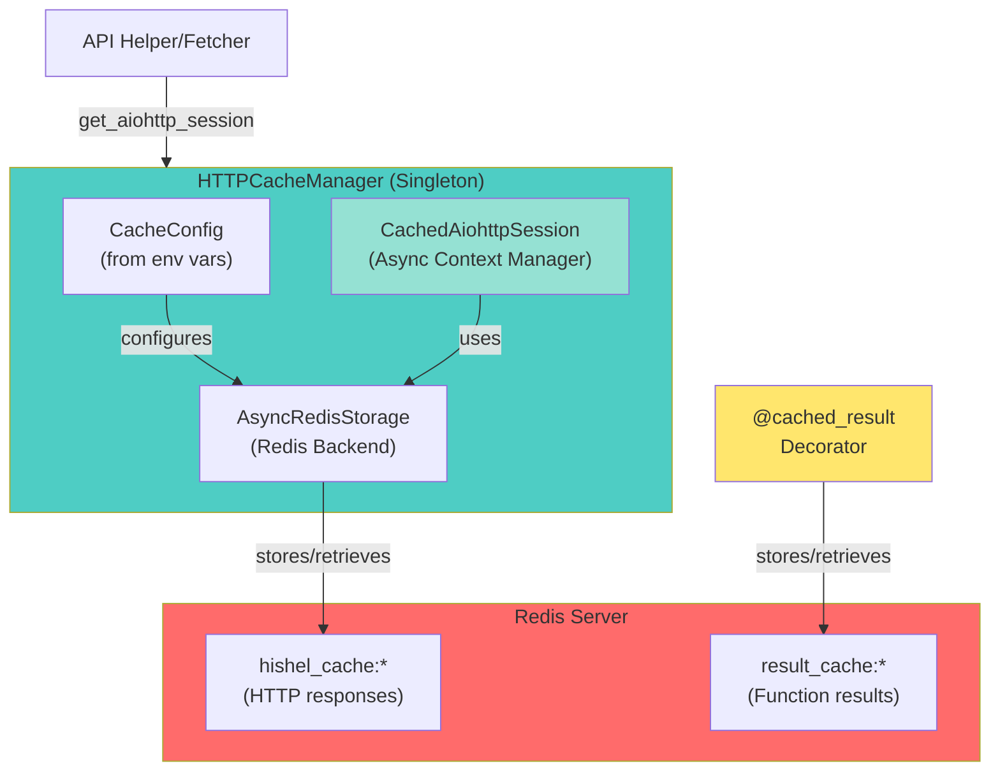

# HTTP & Result Caching Library

## Overview

A Redis-backed caching library providing HTTP-level and result-level caching for Python applications. Designed for async workflows with intelligent cache management and multi-process support.

**Two caching strategies:**

1. **HTTP-Level Caching**: RFC 9111 compliant HTTP response caching using Hishel
2. **Result-Level Caching**: Function result caching using custom decorator

**Primary use case:** Anime enrichment pipeline (see [enrichment/README.md](../enrichment/README.md))

## Benefits

- **Eliminates redundant network calls** - Same data never fetched twice within TTL
- **Reduces API rate limit issues** - Cached hits don't count toward rate limits
- **Multi-process support** - Share cache across concurrent processes via Redis
- **Bandwidth reduction** - 95%+ reduction for cached responses
- **Offline development** - Work with cached data without network access
- **Flexible TTL configuration** - Per-service cache expiration control

## Architecture



**Key Components**:

- **HTTPCacheManager**: Singleton that manages cached aiohttp sessions
- **CachedAiohttpSession**: Async context manager wrapping aiohttp.ClientSession with caching
- **AsyncRedisStorage**: Hishel storage backend for Redis (production)
- **@cached_result**: Decorator for caching function results (used by crawlers)

**Storage Strategy**:

- HTTP-level caching: `hishel_cache:*` keys (managed by Hishel via AsyncRedisStorage)
- Result-level caching: `result_cache:*` keys (managed by @cached_result decorator)
- Both use the same Redis server with different key prefixes for isolation

## Configuration

### Environment Variables

```bash
# Enable/disable caching (enabled by default)
ENABLE_HTTP_CACHE=true

# Redis connection (required for caching)
REDIS_CACHE_URL=redis://localhost:6379/0
```

### TTL Configuration

Configure cache expiration via `CacheConfig` in `src/cache_manager/config.py`:

```python
from src.cache_manager.config import CacheConfig

config = CacheConfig(
    service_ttls={
        "my_api": 3600,      # 1 hour
        "slow_api": 86400,   # 24 hours
        "fast_api": 300,     # 5 minutes
    }
)
```

**Default TTL**: 86400 seconds (24 hours)

For service-specific configurations in the enrichment pipeline, see [enrichment/README.md](../enrichment/README.md).

## Context Manager Protocol

All caching classes implement async context manager protocol for automatic resource cleanup.

### CachedAiohttpSession (Context Manager)

The `CachedAiohttpSession` returned by `http_cache_manager.get_aiohttp_session()` is an async context manager:

```python
from src.cache_manager.instance import http_cache_manager

# Recommended: Use as context manager (automatic cleanup)
async with http_cache_manager.get_aiohttp_session("jikan") as session:
    async with session.get("https://api.example.com/data") as response:
        data = await response.json()
# Session and storage automatically closed

# Alternative: Manual cleanup (if context manager not feasible)
session = http_cache_manager.get_aiohttp_session("jikan")
try:
    async with session.get("https://api.example.com/data") as response:
        data = await response.json()
finally:
    await session.close()  # Must call close() manually
```

**Important**: The `CachedAiohttpSession.__aexit__` method:

- Closes the underlying `aiohttp.ClientSession`
- Closes the `AsyncRedisStorage` (if owned by the session)
- Ensures no resource leaks

### Usage Patterns

For detailed usage patterns in the enrichment pipeline (session ownership, event loop management, etc.), see [enrichment/README.md - Helper Implementation Patterns](../enrichment/README.md#helper-implementation-patterns).

**Basic usage example:**

```python
from src.cache_manager.instance import http_cache_manager

# Context manager pattern (recommended)
async with http_cache_manager.get_aiohttp_session("my_service") as session:
    async with session.get("https://api.example.com/data") as response:
        data = await response.json()
```

### Cleanup Methods

**CachedAiohttpSession.close()**:

```python
await session.close()  # Closes session + storage
```

**HTTPCacheManager.close_async()**:

```python
from src.cache_manager.instance import http_cache_manager
await http_cache_manager.close_async()  # Close async Redis client
```

**Result Cache Cleanup**:

```python
from src.cache_manager.result_cache import close_result_cache_redis_client
await close_result_cache_redis_client()  # Close singleton Redis client
```

**Note**: Cleanup methods are rarely needed due to context manager patterns, but available for manual resource management.

## API Reference

### HTTPCacheManager

**Singleton instance:** `http_cache_manager` from `src.cache_manager.instance`

**Methods:**
- `get_aiohttp_session(service_name: str, **kwargs) -> CachedAiohttpSession`
  - Returns cached aiohttp session for the specified service
  - Accepts standard aiohttp.ClientSession kwargs (timeout, headers, etc.)
- `close_async() -> None`
  - Closes async Redis connections (rarely needed due to context managers)

### @cached_result Decorator

**Location:** `src.cache_manager.result_cache`

**Signature:**
```python
@cached_result(ttl: int = 86400, key_prefix: str = "result_cache")
async def my_function(arg1: str, arg2: int) -> Dict[str, Any]:
    # Function implementation
    pass
```

**Features:**
- Automatic cache key generation from function name + arguments
- Schema versioning with automatic invalidation
- Graceful fallback on Redis failures
- Multi-process safe via Redis atomic operations

**Example:**
```python
from src.cache_manager.result_cache import cached_result

@cached_result(ttl=3600, key_prefix="api_results")
async def fetch_external_data(item_id: str) -> dict:
    # Expensive operation (API call, web scraping, etc.)
    return {"id": item_id, "data": "..."}
```

## How It Works

### Two Caching Strategies

**1. HTTP-Level Caching**

- **Technology:** Hishel (RFC 9111 compliant) with custom Redis storage backend
- **Use case:** RESTful APIs, GraphQL endpoints, any HTTP-based data sources
- **Caches:** Raw HTTP responses at the network layer
- **Implementation:** `CachedAiohttpSession` wrapping `aiohttp.ClientSession`
- **Transparency:** Automatic caching with no code changes to request logic
- **Key format:** `hishel_cache:{hash(method+url+headers+body)}`

**2. Result-Level Caching**

- **Technology:** Custom `@cached_result` decorator
- **Use case:** Non-HTTP operations (web scraping, computations, file I/O)
- **Caches:** Serialized function return values (JSON)
- **Implementation:** Python decorator with Redis storage
- **Key format:** `result_cache:{function_name}:{hash(args)}`

### Cache Management Features

- **TTL enforcement:** Redis EXPIRE command (configurable per service)
- **Schema versioning:** Automatic invalidation on data structure changes
- **Graceful degradation:** Falls back to uncached execution on Redis failures
- **Multi-process safe:** Redis atomic operations prevent race conditions
- **Event loop aware:** Session management compatible with concurrent event loops

## Cache Management

### Clear Cache

```bash
# Clear all cached data (HTTP + result caches)
docker exec anime-vector-redis redis-cli FLUSHALL

# Alternative: Clear specific database (DB 0)
docker exec anime-vector-redis redis-cli FLUSHDB
```

### View Cache Statistics

```bash
# Connect to Redis CLI
docker exec -it anime-vector-redis redis-cli

# Check total cache size
> DBSIZE

# View HTTP cache keys (from Hishel)
> KEYS hishel_cache:*

# View result cache keys (from crawlers)
> KEYS result_cache:*

# Check TTL on any key
> TTL result_cache:anisearch_anime:18878

# Exit Redis CLI
> exit
```

## Testing

### Cache Manager Tests

**Unit Tests** (fast, no external dependencies):

```bash
# Test cache manager components
pytest tests/cache_manager/

# Run with coverage
pytest tests/cache_manager/ --cov=src/cache_manager
```

**Integration Tests** (require Redis):

```bash
# Start Redis for testing
docker compose up -d redis

# Run integration tests
REDIS_CACHE_URL=redis://localhost:6379/1 pytest tests/cache_manager/integration/

# Stop Redis
docker compose down redis
```

### Testing Best Practices

**Use separate Redis database for tests:**
```bash
REDIS_CACHE_URL=redis://localhost:6379/1  # DB 1 for tests
REDIS_CACHE_URL=redis://localhost:6379/0  # DB 0 for dev/production
```

**Disable caching in tests when needed:**
```bash
ENABLE_HTTP_CACHE=false pytest tests/
```

For enrichment pipeline-specific tests, see [enrichment/README.md - Testing](../enrichment/README.md#testing).

## Troubleshooting

### Cache Not Working

**Symptom:** No performance improvement on repeated requests

**Diagnosis:**

```bash
# Check if cache enabled
echo $ENABLE_HTTP_CACHE  # Should be "true"

# Check Redis connection
redis-cli -h localhost -p 6379 PING  # Should return "PONG"

# Check cache keys exist
docker exec -it anime-vector-redis redis-cli
> KEYS *
> DBSIZE
```

**Solutions:**

1. Verify `ENABLE_HTTP_CACHE=true` in environment
2. Check Redis is running: `docker compose ps redis`
3. Validate `REDIS_CACHE_URL=redis://localhost:6379/0`
4. Check application logs for cache-related warnings

### Redis Connection Failed

**Symptom:** Warning logs about Redis connection failures

**Cause:** Redis not running or incorrect connection string

**Solution:**

```bash
# Start Redis
docker compose up -d redis

# Verify Redis is accessible
redis-cli -h localhost -p 6379 PING  # Should return "PONG"

# Check connection string format
echo $REDIS_CACHE_URL  # Should be: redis://host:port/db
```

### Session Lifecycle Issues

**Symptom:** `RuntimeError: Event loop is closed` or session-related errors

**Cause:** Improper session management across event loops

**Solution:** Use context managers and ensure proper cleanup:

```python
# CORRECT: Context manager pattern
async with http_cache_manager.get_aiohttp_session("my_service") as session:
    async with session.get(url) as response:
        data = await response.json()

# CORRECT: Manual cleanup
session = http_cache_manager.get_aiohttp_session("my_service")
try:
    async with session.get(url) as response:
        data = await response.json()
finally:
    await session.close()  # MUST close manually
```

For multi-event-loop scenarios, see [enrichment/README.md - Pattern C](../enrichment/README.md#pattern-c-per-event-loop-session-anilist_helper).

## Key Files

- `src/cache_manager/result_cache.py` - Result-level caching decorator for crawlers
  - Provides `@cached_result` decorator with automatic schema invalidation
  - Singleton Redis client with `close_result_cache_redis_client()` cleanup

- `src/cache_manager/manager.py` - HTTP cache manager for API sources
  - Provides `get_aiohttp_session()` factory method
  - Has `close_async()` for closing async Redis connections
  - NOT a context manager itself (returns context managers)

- `src/cache_manager/aiohttp_adapter.py` - Cached aiohttp session wrapper
  - **CachedAiohttpSession**: Async context manager implementing `__aenter__` and `__aexit__`
  - `close()` method for manual cleanup (closes session + storage)
  - Wraps `aiohttp.ClientSession` with Redis caching via Hishel

- `src/cache_manager/async_redis_storage.py` - Async Redis storage backend
  - Implements Hishel's `AsyncBaseStorage` interface
  - Has `close()` method (closes Redis client if owned)
  - Manages ownership via `_owns_client` flag

- `src/cache_manager/instance.py` - Singleton instance of the cache manager
  - Global `http_cache_manager` instance (fully type annotated)
  - Used by all API helpers for consistent caching

- `src/cache_manager/config.py` - Cache configuration and environment variables
  - Pydantic-based config with env var support
  - Service-specific TTLs and storage backend configuration

## Summary

The cache manager library provides production-ready caching infrastructure:

- **HTTP-level caching** via Hishel (RFC 9111 compliant)
- **Result-level caching** via `@cached_result` decorator
- **Redis backend** for multi-process support
- **Async-first design** with proper resource management
- **Configurable TTLs** per service
- **Event loop aware** session management
- **Schema versioning** with automatic invalidation
- **Graceful degradation** on Redis failures

**For usage in the anime enrichment pipeline**, see [enrichment/README.md](../enrichment/README.md).
